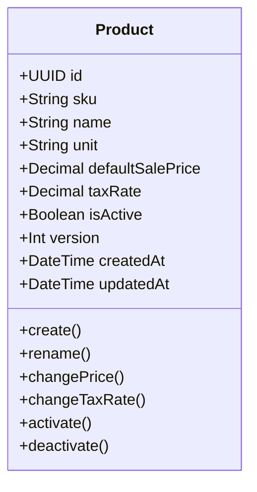

# Catalog Service — API Endpoints

> ✅ **Đã implement đầy đủ.** `catalog-service` với Product CRUD, activate/deactivate, SKU validation, taxRate per product (VN rates: 0/5/8/10%). Xem [Implementation Status](../IMPLEMENTATION-STATUS.md).

> Tài liệu tham chiếu cho tất cả endpoints của **Catalog Service** (`localhost:3005`).
> Service quản lý danh mục sản phẩm — tạo, cập nhật, tìm kiếm, kích hoạt/vô hiệu hóa. Khi tạo product mới, service publish event `product.created` để Inventory Service tự động tạo stock item tương ứng.

> Liên quan: [Auth Endpoints](./auth-endpoints.md) · [Inventory Endpoints](./inventory-endpoints.md) · [Purchasing Endpoints](./purchasing-endpoints.md)

---

## Tổng quan

Catalog Service quản lý **Product** — sản phẩm trong hệ thống ERP. Mỗi product có:
- **SKU** (Stock Keeping Unit): mã sản phẩm duy nhất, immutable sau khi tạo
- **taxRate**: thuế suất VAT theo quy định VN (0%, 5%, 8%, 10%)
- **isActive**: trạng thái hoạt động — product bị deactivate sẽ không thể đặt hàng

### Domain Model



### Phân quyền (RBAC)

| Hành động | `admin` | `manager` | `staff` |
|-----------|:-------:|:---------:|:-------:|
| Tạo product | ✅ | ✅ | ✅ |
| Xem danh sách | ✅ | ✅ | ✅ |
| Xem chi tiết | ✅ | ✅ | ✅ |
| Cập nhật | ✅ | ✅ | ❌ |
| Activate/Deactivate | ✅ | ✅ | ❌ |

---

## Endpoints

Tất cả endpoints truy cập qua API Gateway: `http://localhost:3010/api/catalog/products`

### 1. POST /catalog/products — Tạo product mới

Tạo một product mới trong catalog. SKU phải đúng format (uppercase, alphanumeric + hyphen).

**Request:**

```json
{
  "sku": "LAPTOP-001",
  "name": "Laptop Dell XPS 15",
  "unit": "PCS",
  "defaultSalePrice": 35000000,
  "taxRate": 0.10
}
```

| Field | Type | Required | Validation |
|-------|------|:--------:|------------|
| `sku` | string | ✅ | Uppercase, alphanumeric + hyphen, validated via SKU Value Object |
| `name` | string | ✅ | Không được rỗng |
| `unit` | string | ❌ | Default: `"PCS"` |
| `defaultSalePrice` | number | ✅ | >= 0 |
| `taxRate` | number | ❌ | Default: `0.10`. Phải là 1 trong: `0`, `0.05`, `0.08`, `0.10` |

**Response (201 Created):**

```json
{
  "id": "uuid",
  "sku": "LAPTOP-001",
  "name": "Laptop Dell XPS 15",
  "unit": "PCS",
  "defaultSalePrice": 35000000,
  "taxRate": 0.10,
  "isActive": true,
  "version": 0,
  "createdAt": "2026-06-26T10:00:00.000Z",
  "updatedAt": "2026-06-26T10:00:00.000Z"
}
```

**Errors:**

| Status | Nguyên nhân |
|--------|------------|
| 400 | SKU format không hợp lệ, name rỗng, price < 0, taxRate không hợp lệ |
| 409 | SKU đã tồn tại |

**Side Effect:** Publish event `product.created` qua Outbox → Inventory Service tự động tạo stock item.

---

### 2. GET /catalog/products — Tìm kiếm products

Tìm kiếm products với pagination và filter.

**Query Parameters:**

| Parameter | Type | Default | Mô tả |
|-----------|------|---------|-------|
| `q` | string | `""` | Tìm theo name hoặc SKU (partial match) |
| `page` | number | `1` | Trang hiện tại |
| `limit` | number | `20` | Số items per page |
| `isActive` | string | — | Filter: `"true"` hoặc `"false"` |

**Response (200 OK):**

```json
{
  "data": [
    {
      "id": "uuid",
      "sku": "LAPTOP-001",
      "name": "Laptop Dell XPS 15",
      "unit": "PCS",
      "defaultSalePrice": 35000000,
      "taxRate": 0.10,
      "isActive": true
    }
  ],
  "meta": {
    "total": 50,
    "page": 1,
    "limit": 20,
    "totalPages": 3
  }
}
```

---

### 3. GET /catalog/products/:id — Chi tiết product

Lấy chi tiết product theo ID hoặc SKU.

**Response (200 OK):** Full product object.

**Errors:**

| Status | Nguyên nhân |
|--------|------------|
| 404 | Product không tìm thấy |

---

### 4. PATCH /catalog/products/:id — Cập nhật product

Cập nhật thông tin product. Chỉ cần gửi fields muốn thay đổi.

**Request:**

```json
{
  "name": "Laptop Dell XPS 15 (2026)",
  "defaultSalePrice": 36000000,
  "taxRate": 0.08,
  "unit": "SET"
}
```

| Field | Mô tả |
|-------|-------|
| `name` | Đổi tên product (không được rỗng) |
| `defaultSalePrice` | Đổi giá mặc định (>= 0) |
| `taxRate` | Đổi thuế suất (0, 0.05, 0.08, 0.10) |
| `unit` | Đổi đơn vị tính |

> [!NOTE]
> **SKU không thể thay đổi** sau khi tạo — immutable by design.

**Response (200 OK):** Updated product object.

---

### 5. POST /catalog/products/:id/deactivate — Vô hiệu hóa product

Deactivate product — product sẽ không xuất hiện trong danh sách active products.

**Request:** No body required.

**Response (200 OK):** Updated product with `isActive: false`.

**Side Effect:** Raise domain event `product.deactivated`.

---

### 6. POST /catalog/products/:id/activate — Kích hoạt lại product

Activate lại product đã bị deactivate.

**Request:** No body required.

**Response (200 OK):** Updated product with `isActive: true`.

---

## Business Rules

| Rule | Mô tả |
|------|-------|
| **SKU immutable** | SKU không thể thay đổi sau khi tạo |
| **SKU format** | Validated via `SKU` Value Object từ `@erp/shared` — uppercase, alphanumeric + hyphen |
| **Tax rates** | Chỉ chấp nhận 4 mức thuế suất VN: 0%, 5%, 8%, 10% |
| **Price >= 0** | Giá bán mặc định phải >= 0 |
| **Product → Stock** | Khi tạo product mới, event `product.created` → Inventory Service tự động tạo stock item |

---

## Events

| Event | Trigger | Payload |
|-------|---------|---------|
| `product.created` | Tạo product mới | `{ id, sku, name, unit, defaultSalePrice, taxRate }` |
| `product.deactivated` | Deactivate product | `{ id, sku, name }` |

---

Liên quan: [Auth Endpoints](./auth-endpoints.md) · [Inventory Endpoints](./inventory-endpoints.md) · [Purchasing Endpoints](./purchasing-endpoints.md)
