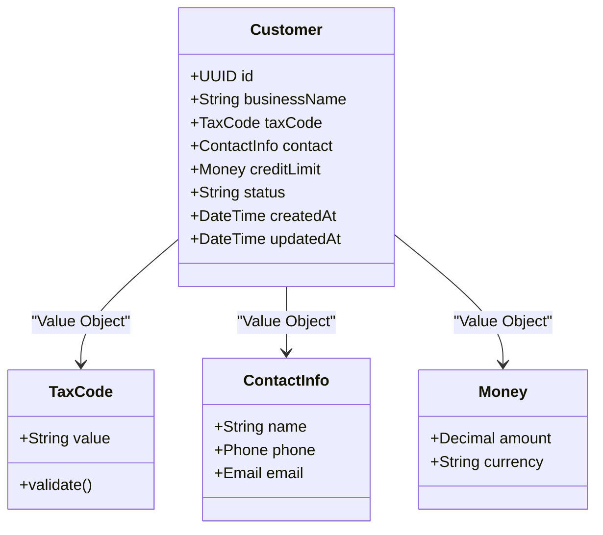
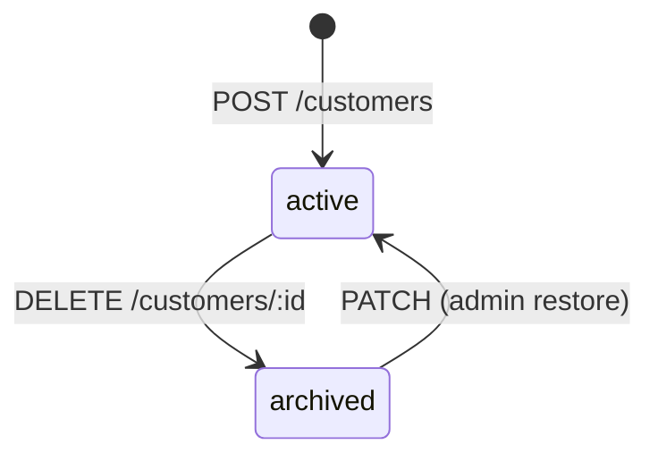
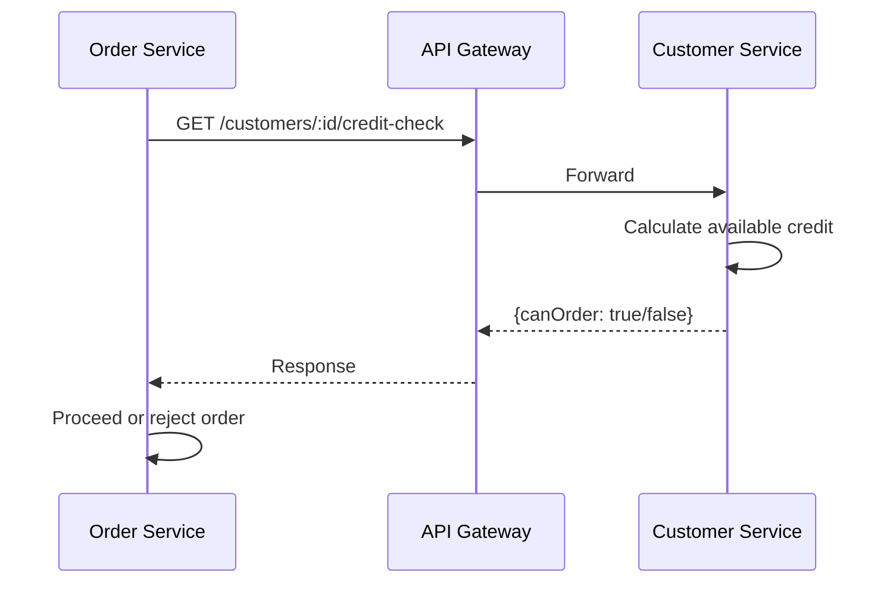

# Customer Service — API Endpoints

> Tài liệu tham chiếu cho tất cả endpoints của **Customer Service** (`localhost:3001`).
> Service quản lý thông tin khách hàng doanh nghiệp (B2B), bao gồm hạn mức tín dụng (credit limit) — một khái niệm quan trọng trong ERP.

> Liên quan: [Auth Endpoints](./auth-endpoints.md) · [Order Endpoints](./order-endpoints.md) · [Inventory Endpoints](./inventory-endpoints.md)

---

## Tổng quan

Customer Service là **Bounded Context** đầu tiên trong hệ thống, quản lý thông tin khách hàng B2B. Mỗi customer có một **credit limit** (hạn mức công nợ) — khi tạo đơn hàng, hệ thống sẽ kiểm tra xem khách hàng còn đủ hạn mức hay không.

### Phân quyền (RBAC)

| Hành động          | `admin` | `manager` | `staff` |
| ------------------ | :-----: | :-------: | :-----: |
| Tạo customer       | ✅      | ✅        | ✅      |
| Xem danh sách      | ✅      | ✅        | ✅      |
| Xem chi tiết       | ✅      | ✅        | ✅      |
| Cập nhật           | ✅      | ✅        | ❌      |
| Xóa (soft delete)  | ✅      | ✅        | ❌      |
| Kiểm tra tín dụng  | ✅      | ✅        | ✅      |

### Domain Model



> **Lưu ý DDD**: `TaxCode`, `ContactInfo`, `Money` là **Value Objects** — chúng không có identity riêng, chỉ có giá trị. Customer là **Aggregate Root**.

---

## Endpoints

### 1. `POST /customers` — Tạo customer mới

Tạo một khách hàng doanh nghiệp mới. Mã số thuế (`taxCode`) phải unique trong hệ thống.

| Thuộc tính       | Giá trị               |
| ---------------- | ---------------------- |
| **Method**       | `POST`                 |
| **Path**         | `/customers`           |
| **Auth**         | ✅ Required (Bearer)   |
| **Role**         | `admin`, `manager`, `staff` |
| **Content-Type** | `application/json`     |

#### Request Body

```json
{
  "businessName": "Công ty TNHH ABC",
  "taxCode": "0312345678",
  "contactName": "Trần Thị B",
  "contactPhone": "0901234567",
  "contactEmail": "contact@abc.com",
  "creditLimitAmount": 50000000
}
```

| Field               | Type     | Required | Validation                                |
| ------------------- | -------- | -------- | ----------------------------------------- |
| `businessName`      | `string` | ✅       | Tên doanh nghiệp, tối thiểu 2 ký tự      |
| `taxCode`           | `string` | ✅       | Mã số thuế, 10 hoặc 13 chữ số, unique     |
| `contactName`       | `string` | ✅       | Tên người liên hệ                         |
| `contactPhone`      | `string` | ✅       | Số điện thoại Việt Nam hợp lệ             |
| `contactEmail`      | `string` | ✅       | Email hợp lệ                              |
| `creditLimitAmount` | `number` | ✅       | Hạn mức tín dụng (VND), >= 0              |

#### Response — `201 Created`

```json
{
  "id": "uuid-cust-001",
  "businessName": "Công ty TNHH ABC",
  "taxCode": "0312345678",
  "contactName": "Trần Thị B",
  "contactPhone": "0901234567",
  "contactEmail": "contact@abc.com",
  "creditLimitAmount": 50000000,
  "status": "active",
  "createdAt": "2026-06-19T09:00:00.000Z",
  "updatedAt": "2026-06-19T09:00:00.000Z"
}
```

#### Error Responses

| Status | Code               | Mô tả                               |
| ------ | ------------------ | ------------------------------------ |
| `400`  | `VALIDATION_ERROR` | Body thiếu field hoặc không hợp lệ   |
| `401`  | `UNAUTHORIZED`     | Token không hợp lệ                   |
| `409`  | `TAX_CODE_EXISTS`  | Mã số thuế đã tồn tại trong hệ thống |

#### cURL Example

```bash
curl -X POST http://localhost:3010/customers \
  -H "Content-Type: application/json" \
  -H "Authorization: Bearer <access_token>" \
  -d '{
    "businessName": "Công ty TNHH ABC",
    "taxCode": "0312345678",
    "contactName": "Trần Thị B",
    "contactPhone": "0901234567",
    "contactEmail": "contact@abc.com",
    "creditLimitAmount": 50000000
  }'
```

---

### 2. `GET /customers` — Danh sách customer (phân trang)

Trả về danh sách khách hàng có phân trang. Hỗ trợ tìm kiếm theo `businessName` hoặc `taxCode`.

| Thuộc tính       | Giá trị               |
| ---------------- | ---------------------- |
| **Method**       | `GET`                  |
| **Path**         | `/customers`           |
| **Auth**         | ✅ Required (Bearer)   |
| **Role**         | `admin`, `manager`, `staff` |

#### Query Parameters

| Param    | Type     | Default | Mô tả                                     |
| -------- | -------- | ------- | ------------------------------------------ |
| `page`   | `number` | `1`     | Trang hiện tại (1-indexed)                  |
| `limit`  | `number` | `20`    | Số record mỗi trang (tối đa 100)           |
| `search` | `string` | —       | Tìm kiếm theo businessName hoặc taxCode    |

#### Response — `200 OK`

```json
{
  "data": [
    {
      "id": "uuid-cust-001",
      "businessName": "Công ty TNHH ABC",
      "taxCode": "0312345678",
      "contactName": "Trần Thị B",
      "contactPhone": "0901234567",
      "contactEmail": "contact@abc.com",
      "creditLimitAmount": 50000000,
      "status": "active",
      "createdAt": "2026-06-19T09:00:00.000Z",
      "updatedAt": "2026-06-19T09:00:00.000Z"
    }
  ],
  "meta": {
    "page": 1,
    "limit": 20,
    "total": 1,
    "totalPages": 1
  }
}
```

| Field              | Type     | Mô tả                    |
| ------------------ | -------- | ------------------------- |
| `data`             | `array`  | Mảng customer objects     |
| `meta.page`        | `number` | Trang hiện tại            |
| `meta.limit`       | `number` | Số record mỗi trang      |
| `meta.total`       | `number` | Tổng số record            |
| `meta.totalPages`  | `number` | Tổng số trang             |

#### Error Responses

| Status | Code           | Mô tả                   |
| ------ | -------------- | ------------------------ |
| `401`  | `UNAUTHORIZED` | Token không hợp lệ       |

#### cURL Example

```bash
curl -X GET "http://localhost:3010/customers?page=1&limit=10&search=ABC" \
  -H "Authorization: Bearer <access_token>"
```

---

### 3. `GET /customers/:id` — Chi tiết customer

Trả về thông tin chi tiết của một khách hàng theo UUID.

| Thuộc tính       | Giá trị               |
| ---------------- | ---------------------- |
| **Method**       | `GET`                  |
| **Path**         | `/customers/:id`       |
| **Auth**         | ✅ Required (Bearer)   |
| **Role**         | `admin`, `manager`, `staff` |

#### Path Parameters

| Param | Type     | Mô tả              |
| ----- | -------- | ------------------- |
| `id`  | `string` | UUID của customer   |

#### Response — `200 OK`

```json
{
  "id": "uuid-cust-001",
  "businessName": "Công ty TNHH ABC",
  "taxCode": "0312345678",
  "contactName": "Trần Thị B",
  "contactPhone": "0901234567",
  "contactEmail": "contact@abc.com",
  "creditLimitAmount": 50000000,
  "status": "active",
  "createdAt": "2026-06-19T09:00:00.000Z",
  "updatedAt": "2026-06-19T09:00:00.000Z"
}
```

#### Error Responses

| Status | Code               | Mô tả                     |
| ------ | ------------------ | -------------------------- |
| `401`  | `UNAUTHORIZED`     | Token không hợp lệ         |
| `404`  | `CUSTOMER_NOT_FOUND` | Không tìm thấy customer  |

#### cURL Example

```bash
curl -X GET http://localhost:3010/customers/uuid-cust-001 \
  -H "Authorization: Bearer <access_token>"
```

---

### 4. `PATCH /customers/:id` — Cập nhật customer

Cập nhật một phần (partial update) thông tin khách hàng. Chỉ gửi các field cần thay đổi.

| Thuộc tính       | Giá trị               |
| ---------------- | ---------------------- |
| **Method**       | `PATCH`                |
| **Path**         | `/customers/:id`       |
| **Auth**         | ✅ Required (Bearer)   |
| **Role**         | `admin`, `manager`     |
| **Content-Type** | `application/json`     |

#### Path Parameters

| Param | Type     | Mô tả              |
| ----- | -------- | ------------------- |
| `id`  | `string` | UUID của customer   |

#### Request Body (partial)

```json
{
  "contactPhone": "0987654321",
  "creditLimitAmount": 100000000
}
```

| Field               | Type     | Required | Validation                        |
| ------------------- | -------- | -------- | --------------------------------- |
| `businessName`      | `string` | ❌       | Tối thiểu 2 ký tự                |
| `contactName`       | `string` | ❌       | Tên người liên hệ mới            |
| `contactPhone`      | `string` | ❌       | Số điện thoại hợp lệ             |
| `contactEmail`      | `string` | ❌       | Email hợp lệ                     |
| `creditLimitAmount` | `number` | ❌       | >= 0                              |

> **Lưu ý**: `taxCode` **không được phép** cập nhật sau khi tạo — đây là thuộc tính định danh doanh nghiệp.

#### Response — `200 OK`

Trả về toàn bộ thông tin customer đã cập nhật (format giống GET detail).

#### Error Responses

| Status | Code                 | Mô tả                           |
| ------ | -------------------- | -------------------------------- |
| `400`  | `VALIDATION_ERROR`   | Giá trị không hợp lệ             |
| `401`  | `UNAUTHORIZED`       | Token không hợp lệ               |
| `403`  | `FORBIDDEN`          | Staff không có quyền cập nhật     |
| `404`  | `CUSTOMER_NOT_FOUND` | Không tìm thấy customer          |

#### cURL Example

```bash
curl -X PATCH http://localhost:3010/customers/uuid-cust-001 \
  -H "Content-Type: application/json" \
  -H "Authorization: Bearer <access_token>" \
  -d '{
    "contactPhone": "0987654321",
    "creditLimitAmount": 100000000
  }'
```

---

### 5. `DELETE /customers/:id` — Xóa customer (soft delete)

Không xóa vật lý (hard delete) khỏi database. Thay vào đó, chuyển `status` từ `active` sang `archived`. Customer đã archived sẽ không xuất hiện trong danh sách mặc định và không thể tạo đơn hàng mới.

| Thuộc tính       | Giá trị               |
| ---------------- | ---------------------- |
| **Method**       | `DELETE`               |
| **Path**         | `/customers/:id`       |
| **Auth**         | ✅ Required (Bearer)   |
| **Role**         | `admin`, `manager`     |

#### Path Parameters

| Param | Type     | Mô tả              |
| ----- | -------- | ------------------- |
| `id`  | `string` | UUID của customer   |

#### Response — `200 OK`

```json
{
  "id": "uuid-cust-001",
  "status": "archived"
}
```

#### Error Responses

| Status | Code                 | Mô tả                          |
| ------ | -------------------- | ------------------------------- |
| `401`  | `UNAUTHORIZED`       | Token không hợp lệ              |
| `403`  | `FORBIDDEN`          | Staff không có quyền xóa         |
| `404`  | `CUSTOMER_NOT_FOUND` | Không tìm thấy customer         |

#### cURL Example

```bash
curl -X DELETE http://localhost:3010/customers/uuid-cust-001 \
  -H "Authorization: Bearer <access_token>"
```

---

### 6. `GET /customers/:id/credit-check` — Kiểm tra tín dụng

Kiểm tra hạn mức tín dụng còn khả dụng của khách hàng. Endpoint này được **Order Service gọi nội bộ** (qua API Gateway) khi submit đơn hàng, và cũng có thể gọi thủ công từ frontend.

| Thuộc tính       | Giá trị                       |
| ---------------- | ------------------------------ |
| **Method**       | `GET`                          |
| **Path**         | `/customers/:id/credit-check`  |
| **Auth**         | ✅ Required (Bearer)           |
| **Role**         | `admin`, `manager`, `staff`    |

#### Path Parameters

| Param | Type     | Mô tả              |
| ----- | -------- | ------------------- |
| `id`  | `string` | UUID của customer   |

#### Response — `200 OK`

```json
{
  "customerId": "uuid-cust-001",
  "creditLimit": 50000000,
  "creditUsed": 15000000,
  "available": 35000000,
  "canOrder": true
}
```

| Field         | Type      | Mô tả                                              |
| ------------- | --------- | --------------------------------------------------- |
| `customerId`  | `string`  | UUID customer                                        |
| `creditLimit` | `number`  | Hạn mức tín dụng tổng (VND)                         |
| `creditUsed`  | `number`  | Số tiền đang sử dụng (tổng các order chưa thanh toán) |
| `available`   | `number`  | Hạn mức còn khả dụng = creditLimit - creditUsed      |
| `canOrder`    | `boolean` | `true` nếu available > 0                             |

#### Công thức tính

```
available = creditLimit - creditUsed
canOrder  = available > 0
```

#### Error Responses

| Status | Code                 | Mô tả                     |
| ------ | -------------------- | -------------------------- |
| `401`  | `UNAUTHORIZED`       | Token không hợp lệ         |
| `404`  | `CUSTOMER_NOT_FOUND` | Không tìm thấy customer    |

#### cURL Example

```bash
curl -X GET http://localhost:3010/customers/uuid-cust-001/credit-check \
  -H "Authorization: Bearer <access_token>"
```

---

## Tổng hợp Endpoints

| #  | Method | Path                          | Auth | Role               | Mô tả              |
| -- | ------ | ----------------------------- | ---- | ------------------ | ------------------- |
| 1  | POST   | `/customers`                  | ✅   | admin, manager, staff | Tạo customer       |
| 2  | GET    | `/customers`                  | ✅   | admin, manager, staff | Danh sách (phân trang) |
| 3  | GET    | `/customers/:id`              | ✅   | admin, manager, staff | Chi tiết           |
| 4  | PATCH  | `/customers/:id`              | ✅   | admin, manager     | Cập nhật            |
| 5  | DELETE | `/customers/:id`              | ✅   | admin, manager     | Soft delete         |
| 6  | GET    | `/customers/:id/credit-check` | ✅   | admin, manager, staff | Kiểm tra tín dụng |

---

## Ghi chú kỹ thuật

### Soft Delete Strategy

Hệ thống sử dụng **soft delete** thay vì hard delete vì:

1. **Audit trail** — giữ lịch sử dữ liệu cho báo cáo
2. **Referential integrity** — các order cũ vẫn tham chiếu được đến customer
3. **Recovery** — có thể khôi phục nếu xóa nhầm



### Credit Check trong Saga

Khi một đơn hàng được submit, **Order Saga** sẽ gọi credit-check endpoint để kiểm tra hạn mức trước khi xác nhận đơn. Nếu hạn mức không đủ, đơn hàng sẽ bị reject.



---

Liên quan: [Auth Endpoints](./auth-endpoints.md) · [Order Endpoints](./order-endpoints.md) · [Inventory Endpoints](./inventory-endpoints.md) · [Getting Started](../development/getting-started.md)
