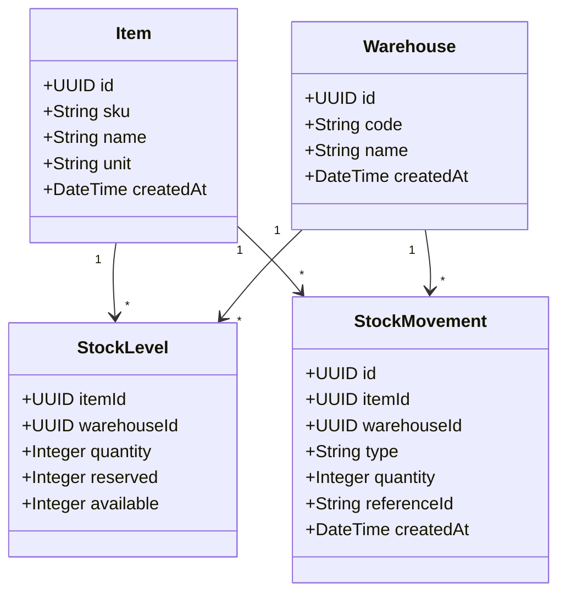
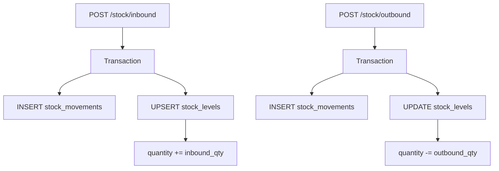

# Inventory Service — API Endpoints

> ✅ **Đã implement đầy đủ.** `inventory-service` với optimistic locking, reserve/release, receive, decimal quantities. Xem [Implementation Status](../IMPLEMENTATION-STATUS.md).

> Tài liệu tham chiếu cho tất cả endpoints của **Inventory Service** (`localhost:3003`).
> Service quản lý hàng hóa (items), kho hàng (warehouses), và tồn kho (stock) — bao gồm nhập kho, xuất kho, và truy vấn lịch sử movements.

> Liên quan: [Auth Endpoints](./auth-endpoints.md) · [Customer Endpoints](./customer-endpoints.md) · [Order Endpoints](./order-endpoints.md)

---

## Tổng quan

Inventory Service quản lý 3 khái niệm chính:

| Khái niệm      | Mô tả                                                 |
| --------------- | ------------------------------------------------------ |
| **Item**        | Mặt hàng — có SKU, tên, đơn vị tính                    |
| **Warehouse**   | Kho hàng — nơi lưu trữ vật lý                          |
| **Stock**       | Tồn kho — số lượng item trong warehouse cụ thể          |

### Domain Model



### Phân quyền (RBAC)

| Hành động          | `admin` | `manager` | `staff` |
| ------------------ | :-----: | :-------: | :-----: |
| Tạo item           | ✅      | ✅        | ✅      |
| Xem items          | ✅      | ✅        | ✅      |
| Tạo warehouse      | ✅      | ✅        | ❌      |
| Xem warehouses     | ✅      | ✅        | ✅      |
| Nhập kho (inbound) | ✅      | ✅        | ❌      |
| Xuất kho (outbound)| ✅      | ✅        | ❌      |
| Xem tồn kho        | ✅      | ✅        | ✅      |
| Xem lịch sử        | ✅      | ✅        | ✅      |

---

## Endpoints — Items

### 1. `POST /items` — Tạo item mới

Tạo một mặt hàng mới trong hệ thống. SKU (Stock Keeping Unit) phải unique.

| Thuộc tính       | Giá trị                        |
| ---------------- | ------------------------------ |
| **Method**       | `POST`                         |
| **Path**         | `/items`                       |
| **Auth**         | ✅ Required (Bearer)           |
| **Role**         | `admin`, `manager`, `staff`    |
| **Content-Type** | `application/json`             |

#### Request Body

```json
{
  "sku": "DESK-001",
  "name": "Bàn gỗ công nghiệp 120x60",
  "unit": "cái"
}
```

| Field  | Type     | Required | Validation                              |
| ------ | -------- | -------- | --------------------------------------- |
| `sku`  | `string` | ✅       | Mã SKU unique, uppercase, không khoảng trắng |
| `name` | `string` | ✅       | Tên mặt hàng, tối thiểu 2 ký tự         |
| `unit` | `string` | ✅       | Đơn vị tính (cái, hộp, kg, m, ...)      |

#### Response — `201 Created`

```json
{
  "id": "uuid-item-001",
  "sku": "DESK-001",
  "name": "Bàn gỗ công nghiệp 120x60",
  "unit": "cái",
  "createdAt": "2026-06-19T09:00:00.000Z"
}
```

#### Error Responses

| Status | Code               | Mô tả                              |
| ------ | ------------------ | ----------------------------------- |
| `400`  | `VALIDATION_ERROR` | Body không hợp lệ                   |
| `401`  | `UNAUTHORIZED`     | Token không hợp lệ                  |
| `409`  | `SKU_EXISTS`       | SKU đã tồn tại trong hệ thống       |

#### cURL Example

```bash
curl -X POST http://localhost:3010/items \
  -H "Content-Type: application/json" \
  -H "Authorization: Bearer <access_token>" \
  -d '{
    "sku": "DESK-001",
    "name": "Bàn gỗ công nghiệp 120x60",
    "unit": "cái"
  }'
```

---

### 2. `GET /items` — Danh sách items

Trả về danh sách tất cả mặt hàng trong hệ thống.

| Thuộc tính       | Giá trị                        |
| ---------------- | ------------------------------ |
| **Method**       | `GET`                          |
| **Path**         | `/items`                       |
| **Auth**         | ✅ Required (Bearer)           |
| **Role**         | `admin`, `manager`, `staff`    |

#### Response — `200 OK`

```json
{
  "data": [
    {
      "id": "uuid-item-001",
      "sku": "DESK-001",
      "name": "Bàn gỗ công nghiệp 120x60",
      "unit": "cái",
      "createdAt": "2026-06-19T09:00:00.000Z"
    }
  ]
}
```

#### Error Responses

| Status | Code           | Mô tả              |
| ------ | -------------- | ------------------- |
| `401`  | `UNAUTHORIZED` | Token không hợp lệ  |

#### cURL Example

```bash
curl -X GET http://localhost:3010/items \
  -H "Authorization: Bearer <access_token>"
```

---

## Endpoints — Warehouses

### 3. `POST /warehouses` — Tạo warehouse mới

Tạo kho hàng mới. Mã kho (`code`) phải unique.

| Thuộc tính       | Giá trị                |
| ---------------- | ---------------------- |
| **Method**       | `POST`                 |
| **Path**         | `/warehouses`          |
| **Auth**         | ✅ Required (Bearer)   |
| **Role**         | `admin`, `manager`     |
| **Content-Type** | `application/json`     |

#### Request Body

```json
{
  "code": "WH-HCM-01",
  "name": "Kho Hồ Chí Minh - Quận 7"
}
```

| Field  | Type     | Required | Validation                              |
| ------ | -------- | -------- | --------------------------------------- |
| `code` | `string` | ✅       | Mã kho unique, uppercase               |
| `name` | `string` | ✅       | Tên kho, tối thiểu 2 ký tự              |

#### Response — `201 Created`

```json
{
  "id": "uuid-wh-001",
  "code": "WH-HCM-01",
  "name": "Kho Hồ Chí Minh - Quận 7",
  "createdAt": "2026-06-19T09:00:00.000Z"
}
```

#### Error Responses

| Status | Code                   | Mô tả                          |
| ------ | ---------------------- | ------------------------------- |
| `400`  | `VALIDATION_ERROR`     | Body không hợp lệ               |
| `401`  | `UNAUTHORIZED`         | Token không hợp lệ              |
| `403`  | `FORBIDDEN`            | Staff không có quyền tạo kho    |
| `409`  | `WAREHOUSE_CODE_EXISTS`| Mã kho đã tồn tại               |

#### cURL Example

```bash
curl -X POST http://localhost:3010/warehouses \
  -H "Content-Type: application/json" \
  -H "Authorization: Bearer <access_token>" \
  -d '{
    "code": "WH-HCM-01",
    "name": "Kho Hồ Chí Minh - Quận 7"
  }'
```

---

### 4. `GET /warehouses` — Danh sách warehouses

Trả về danh sách tất cả kho hàng.

| Thuộc tính       | Giá trị                        |
| ---------------- | ------------------------------ |
| **Method**       | `GET`                          |
| **Path**         | `/warehouses`                  |
| **Auth**         | ✅ Required (Bearer)           |
| **Role**         | `admin`, `manager`, `staff`    |

#### Response — `200 OK`

```json
{
  "data": [
    {
      "id": "uuid-wh-001",
      "code": "WH-HCM-01",
      "name": "Kho Hồ Chí Minh - Quận 7",
      "createdAt": "2026-06-19T09:00:00.000Z"
    }
  ]
}
```

#### Error Responses

| Status | Code           | Mô tả              |
| ------ | -------------- | ------------------- |
| `401`  | `UNAUTHORIZED` | Token không hợp lệ  |

#### cURL Example

```bash
curl -X GET http://localhost:3010/warehouses \
  -H "Authorization: Bearer <access_token>"
```

---

## Endpoints — Stock Operations

### 5. `POST /stock/inbound` — Nhập kho

Nhập hàng vào kho. Tăng `quantity` của stock level tương ứng và tạo một **stock movement** record.

| Thuộc tính       | Giá trị                |
| ---------------- | ---------------------- |
| **Method**       | `POST`                 |
| **Path**         | `/stock/inbound`       |
| **Auth**         | ✅ Required (Bearer)   |
| **Role**         | `admin`, `manager`     |
| **Content-Type** | `application/json`     |

#### Request Body

```json
{
  "itemId": "uuid-item-001",
  "warehouseId": "uuid-wh-001",
  "quantity": 100,
  "referenceId": "PO-2026-001"
}
```

| Field         | Type     | Required | Validation                                    |
| ------------- | -------- | -------- | --------------------------------------------- |
| `itemId`      | `string` | ✅       | UUID item hợp lệ, phải tồn tại                |
| `warehouseId` | `string` | ✅       | UUID warehouse hợp lệ, phải tồn tại            |
| `quantity`    | `number` | ✅       | Số lượng nhập, > 0, số nguyên                  |
| `referenceId` | `string` | ❌       | Mã tham chiếu (purchase order, transfer, ...) |

#### Response — `201 Created`

```json
{
  "movement": {
    "id": "uuid-mov-001",
    "itemId": "uuid-item-001",
    "warehouseId": "uuid-wh-001",
    "type": "inbound",
    "quantity": 100,
    "referenceId": "PO-2026-001",
    "createdAt": "2026-06-19T09:00:00.000Z"
  },
  "stockLevel": {
    "itemId": "uuid-item-001",
    "warehouseId": "uuid-wh-001",
    "quantity": 100,
    "reserved": 0,
    "available": 100
  }
}
```

| Field                   | Type     | Mô tả                                |
| ----------------------- | -------- | ------------------------------------- |
| `movement`              | `object` | Chi tiết phiếu nhập kho              |
| `stockLevel`            | `object` | Tồn kho sau khi nhập                 |
| `stockLevel.quantity`   | `number` | Tổng số lượng trong kho              |
| `stockLevel.reserved`   | `number` | Số lượng đã giữ cho order            |
| `stockLevel.available`  | `number` | Khả dụng = quantity - reserved       |

#### Công thức tồn kho

```
available = quantity - reserved
```

> Khi **Order Saga** reserve stock → `reserved` tăng, `available` giảm.
> Khi **order cancel** → `reserved` giảm, `available` tăng lại (compensation).

#### Error Responses

| Status | Code                   | Mô tả                        |
| ------ | ---------------------- | ----------------------------- |
| `400`  | `VALIDATION_ERROR`     | Body không hợp lệ             |
| `401`  | `UNAUTHORIZED`         | Token không hợp lệ            |
| `403`  | `FORBIDDEN`            | Staff không có quyền nhập kho  |
| `404`  | `ITEM_NOT_FOUND`       | Item không tồn tại            |
| `404`  | `WAREHOUSE_NOT_FOUND`  | Warehouse không tồn tại       |

#### cURL Example

```bash
curl -X POST http://localhost:3010/stock/inbound \
  -H "Content-Type: application/json" \
  -H "Authorization: Bearer <access_token>" \
  -d '{
    "itemId": "uuid-item-001",
    "warehouseId": "uuid-wh-001",
    "quantity": 100,
    "referenceId": "PO-2026-001"
  }'
```

---

### 6. `POST /stock/outbound` — Xuất kho

Xuất hàng khỏi kho. Giảm `quantity` và tạo stock movement. Hệ thống kiểm tra `available` trước khi xuất — không cho phép xuất vượt quá tồn kho khả dụng.

| Thuộc tính       | Giá trị                |
| ---------------- | ---------------------- |
| **Method**       | `POST`                 |
| **Path**         | `/stock/outbound`      |
| **Auth**         | ✅ Required (Bearer)   |
| **Role**         | `admin`, `manager`     |
| **Content-Type** | `application/json`     |

#### Request Body

```json
{
  "itemId": "uuid-item-001",
  "warehouseId": "uuid-wh-001",
  "quantity": 10,
  "referenceId": "uuid-order-001"
}
```

| Field         | Type     | Required | Validation                                   |
| ------------- | -------- | -------- | -------------------------------------------- |
| `itemId`      | `string` | ✅       | UUID item hợp lệ                             |
| `warehouseId` | `string` | ✅       | UUID warehouse hợp lệ                        |
| `quantity`    | `number` | ✅       | Số lượng xuất, > 0, <= available             |
| `referenceId` | `string` | ❌       | Mã tham chiếu (order ID, transfer, ...)      |

#### Response — `201 Created`

```json
{
  "movement": {
    "id": "uuid-mov-002",
    "itemId": "uuid-item-001",
    "warehouseId": "uuid-wh-001",
    "type": "outbound",
    "quantity": 10,
    "referenceId": "uuid-order-001",
    "createdAt": "2026-06-19T10:00:00.000Z"
  },
  "stockLevel": {
    "itemId": "uuid-item-001",
    "warehouseId": "uuid-wh-001",
    "quantity": 90,
    "reserved": 0,
    "available": 90
  }
}
```

#### Error Responses

| Status | Code                    | Mô tả                                |
| ------ | ----------------------- | ------------------------------------- |
| `400`  | `VALIDATION_ERROR`      | Body không hợp lệ                     |
| `400`  | `INSUFFICIENT_STOCK`    | Tồn kho không đủ (quantity > available) |
| `401`  | `UNAUTHORIZED`          | Token không hợp lệ                    |
| `403`  | `FORBIDDEN`             | Staff không có quyền xuất kho          |
| `404`  | `ITEM_NOT_FOUND`        | Item không tồn tại                    |
| `404`  | `WAREHOUSE_NOT_FOUND`   | Warehouse không tồn tại               |

#### cURL Example

```bash
curl -X POST http://localhost:3010/stock/outbound \
  -H "Content-Type: application/json" \
  -H "Authorization: Bearer <access_token>" \
  -d '{
    "itemId": "uuid-item-001",
    "warehouseId": "uuid-wh-001",
    "quantity": 10,
    "referenceId": "uuid-order-001"
  }'
```

---

### 7. `GET /stock/levels` — Xem tồn kho

Trả về danh sách tồn kho. Hỗ trợ lọc theo item hoặc warehouse.

| Thuộc tính       | Giá trị                        |
| ---------------- | ------------------------------ |
| **Method**       | `GET`                          |
| **Path**         | `/stock/levels`                |
| **Auth**         | ✅ Required (Bearer)           |
| **Role**         | `admin`, `manager`, `staff`    |

#### Query Parameters

| Param         | Type     | Default | Mô tả                        |
| ------------- | -------- | ------- | ----------------------------- |
| `itemId`      | `string` | —       | Lọc theo item UUID            |
| `warehouseId` | `string` | —       | Lọc theo warehouse UUID       |

#### Response — `200 OK`

```json
{
  "data": [
    {
      "itemId": "uuid-item-001",
      "itemSku": "DESK-001",
      "itemName": "Bàn gỗ công nghiệp 120x60",
      "warehouseId": "uuid-wh-001",
      "warehouseCode": "WH-HCM-01",
      "warehouseName": "Kho Hồ Chí Minh - Quận 7",
      "quantity": 90,
      "reserved": 10,
      "available": 80
    }
  ]
}
```

| Field            | Type     | Mô tả                                |
| ---------------- | -------- | ------------------------------------- |
| `quantity`       | `number` | Tổng số lượng trong kho               |
| `reserved`       | `number` | Số lượng đã giữ cho order đang xử lý  |
| `available`      | `number` | Số lượng khả dụng (quantity - reserved)|

#### Error Responses

| Status | Code           | Mô tả              |
| ------ | -------------- | ------------------- |
| `401`  | `UNAUTHORIZED` | Token không hợp lệ  |

#### cURL Example

```bash
curl -X GET "http://localhost:3010/stock/levels?itemId=uuid-item-001" \
  -H "Authorization: Bearer <access_token>"
```

---

### 8. `GET /stock/movements` — Lịch sử nhập/xuất kho

Trả về danh sách tất cả movements (nhập/xuất) — phục vụ audit và theo dõi lịch sử.

| Thuộc tính       | Giá trị                        |
| ---------------- | ------------------------------ |
| **Method**       | `GET`                          |
| **Path**         | `/stock/movements`             |
| **Auth**         | ✅ Required (Bearer)           |
| **Role**         | `admin`, `manager`, `staff`    |

#### Query Parameters

| Param         | Type     | Default | Mô tả                        |
| ------------- | -------- | ------- | ----------------------------- |
| `itemId`      | `string` | —       | Lọc theo item UUID            |
| `warehouseId` | `string` | —       | Lọc theo warehouse UUID       |
| `type`        | `string` | —       | Lọc theo type: `inbound` hoặc `outbound` |

#### Response — `200 OK`

```json
{
  "data": [
    {
      "id": "uuid-mov-001",
      "itemId": "uuid-item-001",
      "itemSku": "DESK-001",
      "itemName": "Bàn gỗ công nghiệp 120x60",
      "warehouseId": "uuid-wh-001",
      "warehouseCode": "WH-HCM-01",
      "type": "inbound",
      "quantity": 100,
      "referenceId": "PO-2026-001",
      "createdAt": "2026-06-19T09:00:00.000Z"
    },
    {
      "id": "uuid-mov-002",
      "itemId": "uuid-item-001",
      "itemSku": "DESK-001",
      "itemName": "Bàn gỗ công nghiệp 120x60",
      "warehouseId": "uuid-wh-001",
      "warehouseCode": "WH-HCM-01",
      "type": "outbound",
      "quantity": 10,
      "referenceId": "uuid-order-001",
      "createdAt": "2026-06-19T10:00:00.000Z"
    }
  ]
}
```

| Field         | Type     | Mô tả                                        |
| ------------- | -------- | --------------------------------------------- |
| `type`        | `string` | `inbound` (nhập) hoặc `outbound` (xuất)      |
| `quantity`    | `number` | Số lượng nhập/xuất                             |
| `referenceId` | `string` | Mã tham chiếu (PO, order ID, ...)             |

#### Error Responses

| Status | Code           | Mô tả              |
| ------ | -------------- | ------------------- |
| `401`  | `UNAUTHORIZED` | Token không hợp lệ  |

#### cURL Example

```bash
curl -X GET "http://localhost:3010/stock/movements?type=inbound" \
  -H "Authorization: Bearer <access_token>"
```

---

## Tổng hợp Endpoints

| #  | Method | Path               | Auth | Role               | Mô tả               |
| -- | ------ | ------------------ | ---- | ------------------ | -------------------- |
| 1  | POST   | `/items`           | ✅   | admin, manager, staff | Tạo item           |
| 2  | GET    | `/items`           | ✅   | admin, manager, staff | Danh sách items    |
| 3  | POST   | `/warehouses`      | ✅   | admin, manager     | Tạo warehouse        |
| 4  | GET    | `/warehouses`      | ✅   | admin, manager, staff | Danh sách warehouses|
| 5  | POST   | `/stock/inbound`   | ✅   | admin, manager     | Nhập kho              |
| 6  | POST   | `/stock/outbound`  | ✅   | admin, manager     | Xuất kho              |
| 7  | GET    | `/stock/levels`    | ✅   | admin, manager, staff | Xem tồn kho        |
| 8  | GET    | `/stock/movements` | ✅   | admin, manager, staff | Lịch sử nhập/xuất  |

---

## Ghi chú kỹ thuật

### Stock Level vs Movement

Hệ thống duy trì **hai bảng riêng biệt** cho inventory:



| Bảng              | Vai trò                                    |
| ----------------- | ------------------------------------------ |
| `stock_levels`    | **Snapshot** — tồn kho hiện tại (read-optimized) |
| `stock_movements` | **Event log** — lịch sử mọi thay đổi (audit)    |

> **Tại sao giữ cả hai?** `stock_levels` cho phép query nhanh tồn kho hiện tại (O(1) lookup). `stock_movements` cho phép audit trail và có thể rebuild lại stock_levels nếu cần.

### Reserve / Release trong Saga

Khi Order Saga chạy, Inventory Service xử lý:

| Saga Step         | Hành động                     | Stock Level thay đổi      |
| ----------------- | ----------------------------- | ------------------------- |
| Reserve Stock     | Giữ hàng cho order            | `reserved += qty`         |
| Release Stock     | Compensation khi saga fail    | `reserved -= qty`         |
| Fulfill (Outbound)| Xuất kho thật sự             | `quantity -= qty`, `reserved -= qty` |

---

Liên quan: [Auth Endpoints](./auth-endpoints.md) · [Customer Endpoints](./customer-endpoints.md) · [Order Endpoints](./order-endpoints.md) · [Getting Started](../development/getting-started.md)
