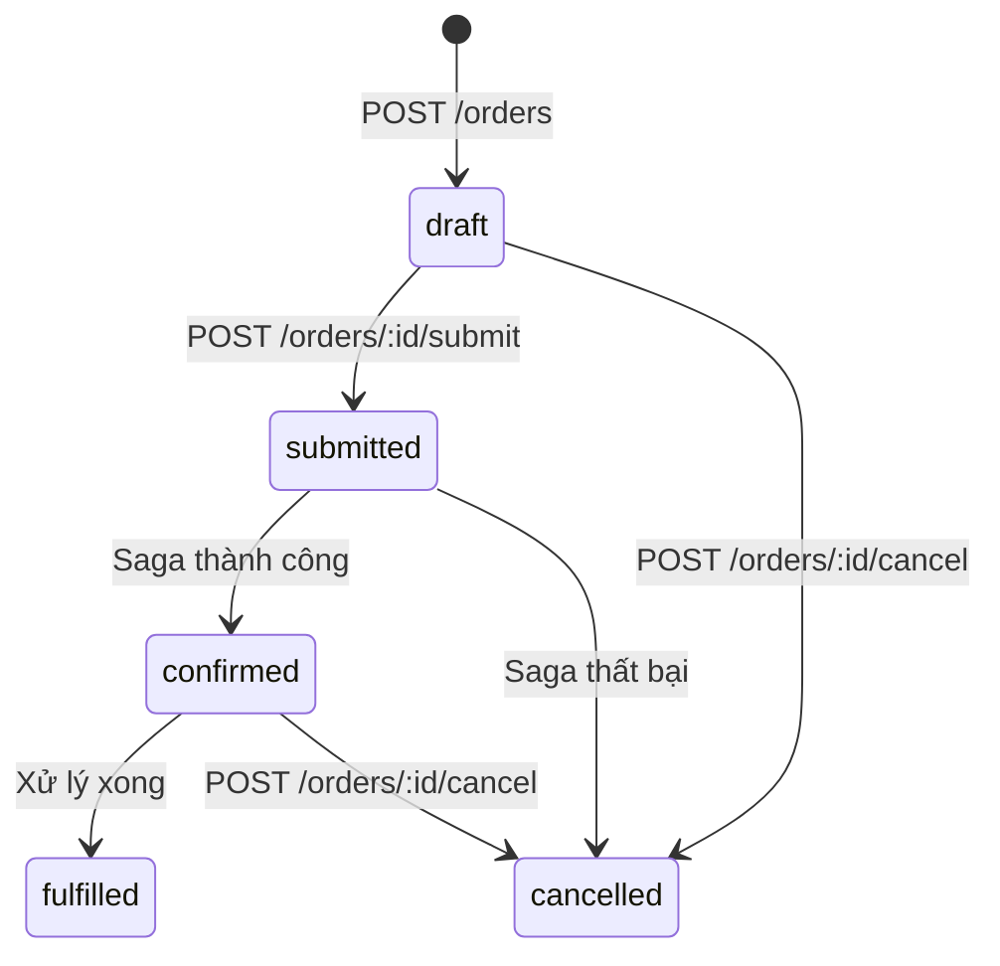
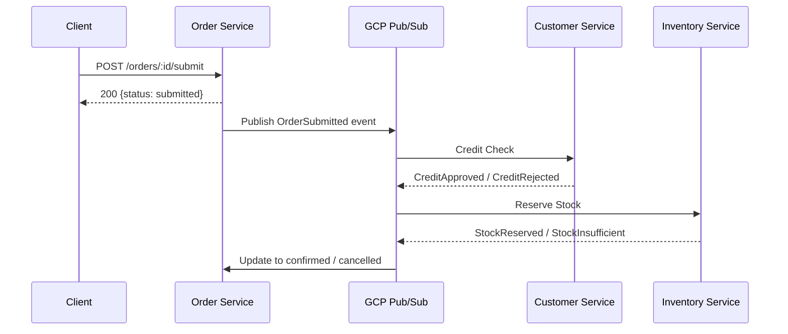
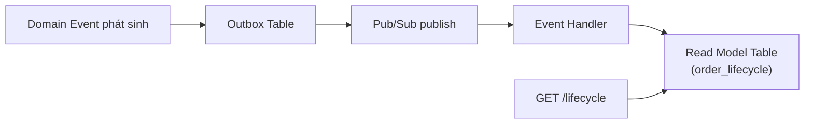
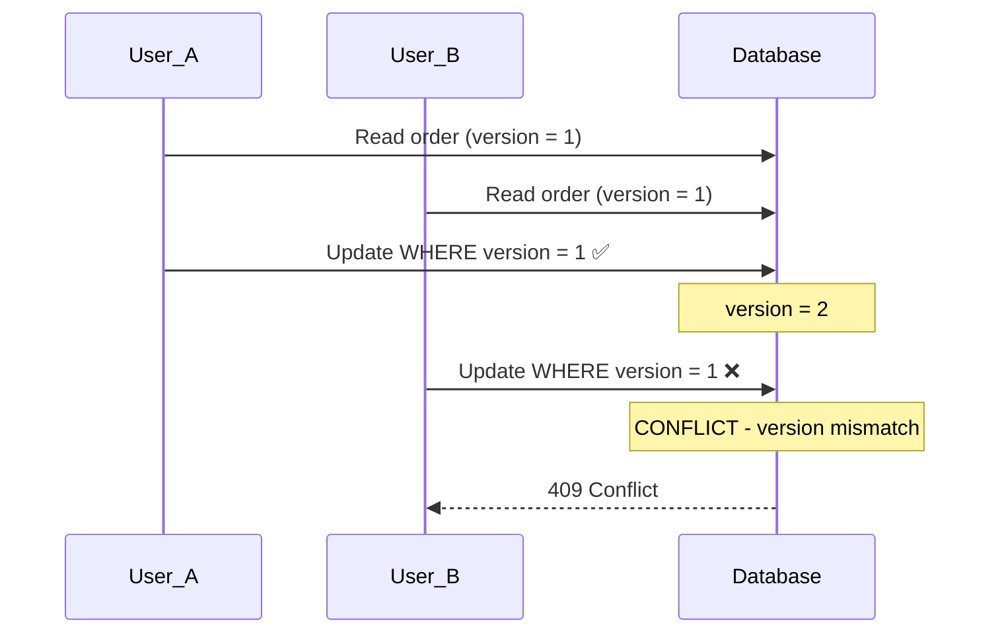

# Order Service — API Endpoints

> ✅ **Đã implement đầy đủ.** `sales-service` bao gồm: Order CRUD, Submit/Cancel saga, Delivery Order 6-state, Sales Return, lifecycle view. Xem [Implementation Status](../IMPLEMENTATION-STATUS.md).

> Tài liệu tham chiếu cho tất cả endpoints của **Order Service** (`localhost:3002`).
> Service quản lý đơn hàng — từ tạo draft, thêm dòng hàng, submit (kích hoạt saga), đến fulfill/cancel. Áp dụng **CQRS**, **Saga**, **Outbox Pattern**, và **Optimistic Locking**.

> Liên quan: [Auth Endpoints](./auth-endpoints.md) · [Customer Endpoints](./customer-endpoints.md) · [Inventory Endpoints](./inventory-endpoints.md)

---

## Tổng quan

Order Service là trung tâm nghiệp vụ của hệ thống ERP. Khi một đơn hàng được **submit**, nó kích hoạt một **Saga** phối hợp giữa Customer Service (kiểm tra tín dụng) và Inventory Service (giữ hàng tồn kho).

### Trạng thái đơn hàng (Order Status)



| Status      | Mô tả                                                     |
| ----------- | ---------------------------------------------------------- |
| `draft`     | Đơn hàng nháp — đang soạn, chưa submit                    |
| `submitted` | Đã submit — saga đang xử lý (check credit + reserve stock) |
| `confirmed` | Saga thành công — credit OK, stock reserved                 |
| `fulfilled` | Đã hoàn thành — hàng đã xuất kho                           |
| `cancelled` | Đã hủy — kèm lý do (reason)                               |

### Phân quyền (RBAC)

| Hành động         | `admin` | `manager` | `staff` |
| ----------------- | :-----: | :-------: | :-----: |
| Tạo order (draft) | ✅      | ✅        | ✅      |
| Thêm order line   | ✅      | ✅        | ✅      |
| Submit order      | ✅      | ✅        | ✅      |
| Cancel order      | ✅      | ✅        | ❌      |
| Xem danh sách     | ✅      | ✅        | ✅      |
| Xem chi tiết      | ✅      | ✅        | ✅      |
| Xem lifecycle     | ✅      | ✅        | ✅      |

---

## Endpoints

### 1. `POST /orders` — Tạo order (draft)

Tạo một đơn hàng mới ở trạng thái `draft`. Đơn hàng chỉ chứa header (thông tin khách hàng), chưa có dòng hàng (lines).

| Thuộc tính       | Giá trị                    |
| ---------------- | -------------------------- |
| **Method**       | `POST`                     |
| **Path**         | `/orders`                  |
| **Auth**         | ✅ Required (Bearer)       |
| **Role**         | `admin`, `manager`, `staff` |
| **Content-Type** | `application/json`         |

#### Request Body

```json
{
  "customerId": "uuid-cust-001"
}
```

| Field        | Type     | Required | Validation                              |
| ------------ | -------- | -------- | --------------------------------------- |
| `customerId` | `string` | ✅       | UUID hợp lệ, customer phải tồn tại và active |

#### Response — `201 Created`

```json
{
  "id": "uuid-order-001",
  "customerId": "uuid-cust-001",
  "status": "draft",
  "totalAmount": 0,
  "lines": [],
  "createdAt": "2026-06-19T09:00:00.000Z",
  "updatedAt": "2026-06-19T09:00:00.000Z"
}
```

#### Error Responses

| Status | Code                 | Mô tả                                  |
| ------ | -------------------- | --------------------------------------- |
| `400`  | `VALIDATION_ERROR`   | customerId thiếu hoặc không hợp lệ      |
| `401`  | `UNAUTHORIZED`       | Token không hợp lệ                      |
| `404`  | `CUSTOMER_NOT_FOUND` | Customer không tồn tại hoặc đã archived |

#### cURL Example

```bash
curl -X POST http://localhost:3010/orders \
  -H "Content-Type: application/json" \
  -H "Authorization: Bearer <access_token>" \
  -d '{ "customerId": "uuid-cust-001" }'
```

---

### 2. `POST /orders/:id/lines` — Thêm dòng hàng (order line)

Thêm một sản phẩm vào đơn hàng. Chỉ được thêm khi order đang ở trạng thái `draft`. `totalAmount` của order sẽ được tính lại tự động.

| Thuộc tính       | Giá trị                    |
| ---------------- | -------------------------- |
| **Method**       | `POST`                     |
| **Path**         | `/orders/:id/lines`        |
| **Auth**         | ✅ Required (Bearer)       |
| **Role**         | `admin`, `manager`, `staff` |
| **Content-Type** | `application/json`         |

#### Path Parameters

| Param | Type     | Mô tả            |
| ----- | -------- | ----------------- |
| `id`  | `string` | UUID của order    |

#### Request Body

```json
{
  "itemId": "uuid-item-001",
  "itemName": "Bàn gỗ công nghiệp 120x60",
  "quantity": 10,
  "unitPrice": 1500000
}
```

| Field       | Type     | Required | Validation                     |
| ----------- | -------- | -------- | ------------------------------ |
| `itemId`    | `string` | ✅       | UUID của item trong inventory  |
| `itemName`  | `string` | ✅       | Tên sản phẩm (snapshot tại thời điểm tạo) |
| `quantity`  | `number` | ✅       | Số lượng, > 0, số nguyên      |
| `unitPrice` | `number` | ✅       | Đơn giá (VND), > 0            |

> **Tại sao lưu `itemName`?** Đây là pattern **Snapshot** — lưu tên item tại thời điểm tạo order để tránh ảnh hưởng khi item bị đổi tên sau này.

#### Response — `201 Created`

```json
{
  "id": "uuid-line-001",
  "orderId": "uuid-order-001",
  "itemId": "uuid-item-001",
  "itemName": "Bàn gỗ công nghiệp 120x60",
  "quantity": 10,
  "unitPrice": 1500000,
  "lineTotal": 15000000
}
```

| Field       | Type     | Mô tả                                |
| ----------- | -------- | ------------------------------------- |
| `lineTotal` | `number` | = quantity × unitPrice (tính tự động) |

#### Error Responses

| Status | Code                  | Mô tả                                  |
| ------ | --------------------- | --------------------------------------- |
| `400`  | `VALIDATION_ERROR`    | Body không hợp lệ                       |
| `400`  | `ORDER_NOT_DRAFT`     | Order không ở trạng thái draft          |
| `401`  | `UNAUTHORIZED`        | Token không hợp lệ                      |
| `404`  | `ORDER_NOT_FOUND`     | Order không tồn tại                     |

#### cURL Example

```bash
curl -X POST http://localhost:3010/orders/uuid-order-001/lines \
  -H "Content-Type: application/json" \
  -H "Authorization: Bearer <access_token>" \
  -d '{
    "itemId": "uuid-item-001",
    "itemName": "Bàn gỗ công nghiệp 120x60",
    "quantity": 10,
    "unitPrice": 1500000
  }'
```

---

### 3. `POST /orders/:id/submit` — Submit order (kích hoạt Saga)

Chuyển đơn hàng từ `draft` → `submitted` và **kích hoạt Order Saga**. Saga sẽ thực hiện:

1. **Credit Check** — gọi Customer Service kiểm tra hạn mức
2. **Stock Reserve** — gọi Inventory Service giữ hàng tồn kho

Nếu cả hai bước thành công → `confirmed`. Nếu bất kỳ bước nào thất bại → `cancelled` (có compensation).

| Thuộc tính       | Giá trị                    |
| ---------------- | -------------------------- |
| **Method**       | `POST`                     |
| **Path**         | `/orders/:id/submit`       |
| **Auth**         | ✅ Required (Bearer)       |
| **Role**         | `admin`, `manager`, `staff` |

#### Path Parameters

| Param | Type     | Mô tả            |
| ----- | -------- | ----------------- |
| `id`  | `string` | UUID của order    |

#### Request Body

Không có request body.

#### Response — `200 OK`

```json
{
  "id": "uuid-order-001",
  "status": "submitted",
  "message": "Order submitted. Saga processing..."
}
```

> **Lưu ý quan trọng**: Response trả về **ngay lập tức** với status `submitted`. Saga xử lý **bất đồng bộ** qua Pub/Sub. Dùng `GET /orders/:id/lifecycle` để theo dõi tiến trình.

#### Saga Flow



#### Error Responses

| Status | Code                 | Mô tả                                  |
| ------ | -------------------- | --------------------------------------- |
| `400`  | `ORDER_NOT_DRAFT`    | Order không ở trạng thái draft          |
| `400`  | `ORDER_EMPTY`        | Order chưa có dòng hàng (lines = 0)    |
| `401`  | `UNAUTHORIZED`       | Token không hợp lệ                      |
| `404`  | `ORDER_NOT_FOUND`    | Order không tồn tại                     |

#### cURL Example

```bash
curl -X POST http://localhost:3010/orders/uuid-order-001/submit \
  -H "Authorization: Bearer <access_token>"
```

---

### 4. `POST /orders/:id/cancel` — Hủy order

Hủy đơn hàng với lý do. Có thể hủy khi đang ở trạng thái `draft` hoặc `confirmed`. Nếu đã `confirmed`, hệ thống sẽ thực hiện **compensation**:

- Hoàn lại credit cho customer
- Release stock đã reserved

| Thuộc tính       | Giá trị                |
| ---------------- | ---------------------- |
| **Method**       | `POST`                 |
| **Path**         | `/orders/:id/cancel`   |
| **Auth**         | ✅ Required (Bearer)   |
| **Role**         | `admin`, `manager`     |
| **Content-Type** | `application/json`     |

#### Path Parameters

| Param | Type     | Mô tả            |
| ----- | -------- | ----------------- |
| `id`  | `string` | UUID của order    |

#### Request Body

```json
{
  "reason": "Khách hàng yêu cầu hủy đơn"
}
```

| Field    | Type     | Required | Validation           |
| -------- | -------- | -------- | -------------------- |
| `reason` | `string` | ✅       | Lý do hủy, tối thiểu 5 ký tự |

#### Response — `200 OK`

```json
{
  "id": "uuid-order-001",
  "status": "cancelled",
  "cancelReason": "Khách hàng yêu cầu hủy đơn",
  "cancelledAt": "2026-06-19T10:00:00.000Z"
}
```

#### Error Responses

| Status | Code                     | Mô tả                                    |
| ------ | ------------------------ | ----------------------------------------- |
| `400`  | `VALIDATION_ERROR`       | Thiếu reason hoặc không hợp lệ            |
| `400`  | `ORDER_CANNOT_CANCEL`    | Order đang submitted (saga processing) hoặc đã fulfilled |
| `401`  | `UNAUTHORIZED`           | Token không hợp lệ                        |
| `403`  | `FORBIDDEN`              | Staff không có quyền hủy                   |
| `404`  | `ORDER_NOT_FOUND`        | Order không tồn tại                       |

#### cURL Example

```bash
curl -X POST http://localhost:3010/orders/uuid-order-001/cancel \
  -H "Content-Type: application/json" \
  -H "Authorization: Bearer <access_token>" \
  -d '{ "reason": "Khách hàng yêu cầu hủy đơn" }'
```

---

### 5. `GET /orders` — Danh sách order (phân trang + filter)

Trả về danh sách đơn hàng có phân trang. Hỗ trợ lọc theo trạng thái.

| Thuộc tính       | Giá trị                    |
| ---------------- | -------------------------- |
| **Method**       | `GET`                      |
| **Path**         | `/orders`                  |
| **Auth**         | ✅ Required (Bearer)       |
| **Role**         | `admin`, `manager`, `staff` |

#### Query Parameters

| Param    | Type     | Default | Mô tả                                          |
| -------- | -------- | ------- | ----------------------------------------------- |
| `page`   | `number` | `1`     | Trang hiện tại                                   |
| `limit`  | `number` | `20`    | Số record mỗi trang (tối đa 100)                |
| `status` | `string` | —       | Lọc theo status: `draft`, `submitted`, `confirmed`, `fulfilled`, `cancelled` |

#### Response — `200 OK`

```json
{
  "data": [
    {
      "id": "uuid-order-001",
      "customerId": "uuid-cust-001",
      "status": "confirmed",
      "totalAmount": 15000000,
      "lineCount": 1,
      "createdAt": "2026-06-19T09:00:00.000Z",
      "updatedAt": "2026-06-19T09:30:00.000Z"
    }
  ],
  "meta": {
    "page": 1,
    "limit": 20,
    "total": 1,
    "totalPages": 1
  }
}
```

#### Error Responses

| Status | Code           | Mô tả              |
| ------ | -------------- | ------------------- |
| `401`  | `UNAUTHORIZED` | Token không hợp lệ  |

#### cURL Example

```bash
curl -X GET "http://localhost:3010/orders?page=1&limit=10&status=confirmed" \
  -H "Authorization: Bearer <access_token>"
```

---

### 6. `GET /orders/:id` — Chi tiết order (header + lines)

Trả về thông tin đầy đủ của đơn hàng bao gồm header và tất cả dòng hàng (lines).

| Thuộc tính       | Giá trị                    |
| ---------------- | -------------------------- |
| **Method**       | `GET`                      |
| **Path**         | `/orders/:id`              |
| **Auth**         | ✅ Required (Bearer)       |
| **Role**         | `admin`, `manager`, `staff` |

#### Path Parameters

| Param | Type     | Mô tả            |
| ----- | -------- | ----------------- |
| `id`  | `string` | UUID của order    |

#### Response — `200 OK`

```json
{
  "id": "uuid-order-001",
  "customerId": "uuid-cust-001",
  "status": "confirmed",
  "totalAmount": 15000000,
  "cancelReason": null,
  "version": 3,
  "createdAt": "2026-06-19T09:00:00.000Z",
  "updatedAt": "2026-06-19T09:30:00.000Z",
  "lines": [
    {
      "id": "uuid-line-001",
      "itemId": "uuid-item-001",
      "itemName": "Bàn gỗ công nghiệp 120x60",
      "quantity": 10,
      "unitPrice": 1500000,
      "lineTotal": 15000000
    }
  ]
}
```

| Field          | Type     | Mô tả                                              |
| -------------- | -------- | --------------------------------------------------- |
| `totalAmount`  | `number` | Tổng giá trị = Σ(lineTotal)                         |
| `cancelReason` | `string` | Lý do hủy (null nếu chưa hủy)                      |
| `version`      | `number` | Phiên bản hiện tại — dùng cho **Optimistic Locking** |
| `lines`        | `array`  | Mảng các dòng hàng                                  |

> **Optimistic Locking**: Field `version` tăng mỗi khi order được cập nhật. Khi hai user cùng sửa một order, người cập nhật sau sẽ nhận lỗi `CONFLICT` nếu version không khớp.

#### Error Responses

| Status | Code              | Mô tả                  |
| ------ | ----------------- | ----------------------- |
| `401`  | `UNAUTHORIZED`    | Token không hợp lệ      |
| `404`  | `ORDER_NOT_FOUND` | Order không tồn tại     |

#### cURL Example

```bash
curl -X GET http://localhost:3010/orders/uuid-order-001 \
  -H "Authorization: Bearer <access_token>"
```

---

### 7. `GET /orders/:id/lifecycle` — Lịch sử trạng thái (CQRS Read Model)

Trả về **timeline** các sự kiện thay đổi trạng thái của đơn hàng. Đây là **read model** trong kiến trúc CQRS — dữ liệu được xây dựng từ domain events.

| Thuộc tính       | Giá trị                    |
| ---------------- | -------------------------- |
| **Method**       | `GET`                      |
| **Path**         | `/orders/:id/lifecycle`    |
| **Auth**         | ✅ Required (Bearer)       |
| **Role**         | `admin`, `manager`, `staff` |

#### Path Parameters

| Param | Type     | Mô tả            |
| ----- | -------- | ----------------- |
| `id`  | `string` | UUID của order    |

#### Response — `200 OK`

```json
{
  "orderId": "uuid-order-001",
  "currentStatus": "confirmed",
  "timeline": [
    {
      "status": "draft",
      "timestamp": "2026-06-19T09:00:00.000Z",
      "actor": "staff01@company.com",
      "note": "Order created"
    },
    {
      "status": "submitted",
      "timestamp": "2026-06-19T09:15:00.000Z",
      "actor": "staff01@company.com",
      "note": "Order submitted for processing"
    },
    {
      "status": "confirmed",
      "timestamp": "2026-06-19T09:15:05.000Z",
      "actor": "system",
      "note": "Saga completed: credit approved, stock reserved"
    }
  ]
}
```

| Field            | Type     | Mô tả                                    |
| ---------------- | -------- | ----------------------------------------- |
| `orderId`        | `string` | UUID order                                |
| `currentStatus`  | `string` | Trạng thái hiện tại                       |
| `timeline`       | `array`  | Mảng các sự kiện theo thứ tự thời gian    |
| `timeline[].status`    | `string` | Trạng thái tại thời điểm đó         |
| `timeline[].timestamp` | `string` | ISO 8601 timestamp                   |
| `timeline[].actor`     | `string` | Ai thực hiện (email hoặc "system")   |
| `timeline[].note`      | `string` | Ghi chú mô tả sự kiện               |

#### CQRS Explanation



> **Tại sao dùng CQRS?** Write model (Order aggregate) tối ưu cho ghi — chỉ chứa trạng thái hiện tại. Read model (lifecycle) tối ưu cho đọc — chứa toàn bộ lịch sử, query nhanh mà không cần join phức tạp.

#### Error Responses

| Status | Code              | Mô tả                  |
| ------ | ----------------- | ----------------------- |
| `401`  | `UNAUTHORIZED`    | Token không hợp lệ      |
| `404`  | `ORDER_NOT_FOUND` | Order không tồn tại     |

#### cURL Example

```bash
curl -X GET http://localhost:3010/orders/uuid-order-001/lifecycle \
  -H "Authorization: Bearer <access_token>"
```

---

## Tổng hợp Endpoints

| #  | Method | Path                       | Auth | Role               | Mô tả                     |
| -- | ------ | -------------------------- | ---- | ------------------ | -------------------------- |
| 1  | POST   | `/orders`                  | ✅   | admin, manager, staff | Tạo order (draft)         |
| 2  | POST   | `/orders/:id/lines`        | ✅   | admin, manager, staff | Thêm dòng hàng           |
| 3  | POST   | `/orders/:id/submit`       | ✅   | admin, manager, staff | Submit → kích hoạt saga   |
| 4  | POST   | `/orders/:id/cancel`       | ✅   | admin, manager     | Hủy order                  |
| 5  | GET    | `/orders`                  | ✅   | admin, manager, staff | Danh sách (phân trang)    |
| 6  | GET    | `/orders/:id`              | ✅   | admin, manager, staff | Chi tiết (header + lines) |
| 7  | GET    | `/orders/:id/lifecycle`    | ✅   | admin, manager, staff | CQRS read model (timeline)|

---

## Ghi chú kỹ thuật

### Optimistic Locking

Order sử dụng **Optimistic Locking** qua field `version` để xử lý concurrent updates:



### Outbox Pattern

Để đảm bảo **exactly-once** khi phát domain events, Order Service sử dụng **Outbox Pattern**: event được ghi vào `outbox` table trong cùng transaction với order update. Một background process poll outbox và publish lên Pub/Sub.

---

Liên quan: [Auth Endpoints](./auth-endpoints.md) · [Customer Endpoints](./customer-endpoints.md) · [Inventory Endpoints](./inventory-endpoints.md) · [Getting Started](../development/getting-started.md)
