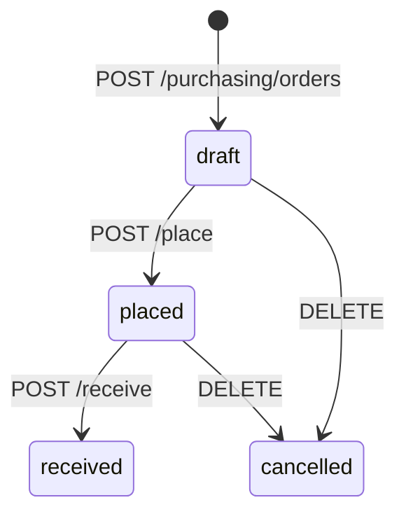

# Purchasing Service — API Endpoints

> ✅ **Đã implement đầy đủ.** `purchasing-service` với Purchase Order lifecycle (draft→placed→received), PO Line CRUD, Supplier CRUD, goods receipt → Inventory. Xem [Implementation Status](../IMPLEMENTATION-STATUS.md).

> Tài liệu tham chiếu cho tất cả endpoints của **Purchasing Service** (`localhost:3006`).
> Service quản lý quy trình mua hàng — từ tạo đơn đặt mua (PO), thêm dòng hàng, đặt hàng nhà cung cấp, đến nhận hàng nhập kho. Khi nhận hàng, service publish event `goods.received` để Inventory Service tự động tăng stock.

> Liên quan: [Auth Endpoints](./auth-endpoints.md) · [Catalog Endpoints](./catalog-endpoints.md) · [Inventory Endpoints](./inventory-endpoints.md)

---

## Tổng quan

Purchasing Service quản lý 2 aggregate chính:

1. **Purchase Order (PO)** — đơn đặt mua hàng từ nhà cung cấp
2. **Supplier** — nhà cung cấp (vendor)

### Trạng thái Purchase Order



| Status | Mô tả |
|--------|-------|
| `draft` | PO nháp — đang soạn, thêm/bớt lines |
| `placed` | Đã đặt hàng với nhà cung cấp |
| `received` | Đã nhận hàng — stock tự động tăng |
| `cancelled` | Đã hủy — kèm lý do |

### Domain Model

```mermaid
classDiagram
    class PurchaseOrder {
        +UUID id
        +String poNumber
        +UUID supplierId
        +String status
        +Decimal totalAmount
        +String cancelReason
        +DateTime createdAt
        +DateTime updatedAt
        +addLine()
        +removeLine()
        +place()
        +receiveGoods()
        +cancel()
    }

    class POLine {
        +UUID id
        +UUID poId
        +String itemId
        +String itemName
        +Decimal quantity
        +Decimal unitPrice
        +Decimal lineTotal
    }

    class Supplier {
        +UUID id
        +String name
        +String contactName
        +String contactPhone
        +String contactEmail
        +Boolean isActive
        +DateTime createdAt
        +DateTime updatedAt
    }

    PurchaseOrder ||--o{ POLine : "has lines"
    PurchaseOrder }o--|| Supplier : "from supplier"
```

### Phân quyền (RBAC)

| Hành động | `admin` | `manager` | `staff` |
|-----------|:-------:|:---------:|:-------:|
| Tạo PO | ✅ | ✅ | ✅ |
| Xem PO | ✅ | ✅ | ✅ |
| Thêm/xóa PO line | ✅ | ✅ | ✅ |
| Place PO | ✅ | ✅ | ❌ |
| Receive goods | ✅ | ✅ | ❌ |
| Cancel PO | ✅ | ✅ | ❌ |
| Supplier CRUD | ✅ | ✅ | ✅ (read), ❌ (write) |

---

## Purchase Order Endpoints

Tất cả endpoints truy cập qua API Gateway: `http://localhost:3010/api/purchasing/orders`

### 1. POST /purchasing/orders — Tạo PO mới

Tạo một Purchase Order mới ở trạng thái `draft`.

**Request:**

```json
{
  "supplierId": "uuid-of-supplier"
}
```

| Field | Type | Required | Mô tả |
|-------|------|:--------:|-------|
| `supplierId` | string (UUID) | ✅ | ID của nhà cung cấp |

**Response (201 Created):**

```json
{
  "id": "uuid",
  "poNumber": "PO-20260626-001",
  "supplierId": "uuid-of-supplier",
  "status": "draft",
  "totalAmount": 0,
  "lines": [],
  "createdAt": "2026-06-26T10:00:00.000Z",
  "updatedAt": "2026-06-26T10:00:00.000Z"
}
```

---

### 2. GET /purchasing/orders — Tìm kiếm PO

Tìm kiếm Purchase Orders với pagination và filter.

**Query Parameters:**

| Parameter | Type | Default | Mô tả |
|-----------|------|---------|-------|
| `status` | string | — | Filter: `"draft"`, `"placed"`, `"received"`, `"cancelled"` |
| `page` | number | `1` | Trang hiện tại |
| `limit` | number | `20` | Số items per page |

**Response (200 OK):**

```json
{
  "data": [
    {
      "id": "uuid",
      "poNumber": "PO-20260626-001",
      "supplierId": "uuid",
      "status": "draft",
      "totalAmount": 5000000
    }
  ],
  "meta": { "total": 10, "page": 1, "limit": 20, "totalPages": 1 }
}
```

---

### 3. GET /purchasing/orders/:id — Chi tiết PO

Lấy chi tiết PO bao gồm lines.

**Response (200 OK):** Full PO object with `lines[]`.

**Errors:**

| Status | Nguyên nhân |
|--------|------------|
| 404 | PO không tìm thấy |

---

### 4. POST /purchasing/orders/:id/lines — Thêm line vào PO

Thêm một dòng hàng vào PO. Chỉ thêm được khi PO ở trạng thái `draft`.

**Request:**

```json
{
  "itemId": "uuid-of-product",
  "itemName": "Laptop Dell XPS 15",
  "quantity": 10,
  "unitPrice": 30000000
}
```

| Field | Type | Required | Mô tả |
|-------|------|:--------:|-------|
| `itemId` | string | ✅ | ID sản phẩm (từ Catalog) |
| `itemName` | string | ✅ | Tên sản phẩm |
| `quantity` | number | ✅ | Số lượng (> 0) |
| `unitPrice` | number | ✅ | Đơn giá mua (>= 0) |

**Response (201 Created):** Updated PO with new line.

**Errors:**

| Status | Nguyên nhân |
|--------|------------|
| 400 | PO không ở trạng thái `draft` |

---

### 5. DELETE /purchasing/orders/:id/lines/:lineId — Xóa line khỏi PO

Xóa một dòng hàng khỏi PO. Chỉ xóa được khi PO ở trạng thái `draft`.

**Response:** 204 No Content.

---

### 6. POST /purchasing/orders/:id/place — Đặt hàng (draft → placed)

Chuyển PO từ `draft` sang `placed` — đã gửi đơn cho nhà cung cấp.

**Validation:**
- PO phải ở trạng thái `draft`
- PO phải có ít nhất 1 line

**Response (200 OK):** Updated PO with `status: "placed"`.

---

### 7. POST /purchasing/orders/:id/receive — Nhận hàng (placed → received)

Xác nhận đã nhận hàng từ nhà cung cấp. PO chuyển sang `received`.

**Request (optional):**

```json
{
  "note": "Nhận đủ 10 laptops"
}
```

**Response (200 OK):** Updated PO with `status: "received"`.

**Side Effect:** Publish event `goods.received` qua Outbox → Inventory Service tự động tăng stock cho tất cả items trong PO lines.

---

### 8. DELETE /purchasing/orders/:id — Hủy PO

Hủy PO. Chỉ hủy được khi PO ở trạng thái `draft` hoặc `placed`.

**Request (optional):**

```json
{
  "reason": "Nhà cung cấp không đáp ứng được"
}
```

**Response (200 OK):** Updated PO with `status: "cancelled"`.

---

## Supplier Endpoints

Tất cả endpoints truy cập qua API Gateway: `http://localhost:3010/api/suppliers`

### 1. POST /suppliers — Tạo supplier mới

**Request:**

```json
{
  "name": "Dell Technologies Vietnam",
  "contactName": "Nguyễn Văn A",
  "contactPhone": "0901234567",
  "contactEmail": "contact@dell.vn"
}
```

| Field | Type | Required | Mô tả |
|-------|------|:--------:|-------|
| `name` | string | ✅ | Tên nhà cung cấp |
| `contactName` | string | ❌ | Tên người liên hệ |
| `contactPhone` | string | ❌ | Số điện thoại |
| `contactEmail` | string | ❌ | Email liên hệ |

**Response (201 Created):** Supplier object with `isActive: true`.

---

### 2. GET /suppliers — Tìm kiếm suppliers

**Query Parameters:**

| Parameter | Type | Default | Mô tả |
|-----------|------|---------|-------|
| `q` | string | `""` | Tìm theo tên (partial match) |
| `page` | number | `1` | Trang hiện tại |
| `limit` | number | `20` | Số items per page |
| `isActive` | string | — | Filter: `"true"` hoặc `"false"` |

**Response (200 OK):** Paginated supplier list.

---

### 3. GET /suppliers/:id — Chi tiết supplier

**Response (200 OK):** Full supplier object.

---

### 4. PATCH /suppliers/:id — Cập nhật supplier

Cập nhật thông tin supplier. Chỉ gửi fields muốn thay đổi.

**Request:**

```json
{
  "name": "Dell Technologies VN (Updated)",
  "contactEmail": "new-contact@dell.vn"
}
```

**Response (200 OK):** Updated supplier object.

---

## Business Rules

| Rule | Mô tả |
|------|-------|
| **PO → Supplier** | Mỗi PO phải gắn với 1 supplier |
| **Draft only edit** | Chỉ thêm/xóa lines khi PO ở trạng thái `draft` |
| **Place validation** | PO phải có ít nhất 1 line để place |
| **Receive → Stock** | Nhận hàng tự động tăng stock qua event `goods.received` |
| **Auto PO Number** | PO number tự sinh format `PO-YYYYMMDD-NNN` |

---

## Events

| Event | Trigger | Subscriber | Payload |
|-------|---------|-----------|---------|
| `goods.received` | Receive goods (placed → received) | Inventory Service | `{ poId, poNumber, lines: [{ itemId, quantity }] }` |

---

Liên quan: [Auth Endpoints](./auth-endpoints.md) · [Catalog Endpoints](./catalog-endpoints.md) · [Inventory Endpoints](./inventory-endpoints.md)
