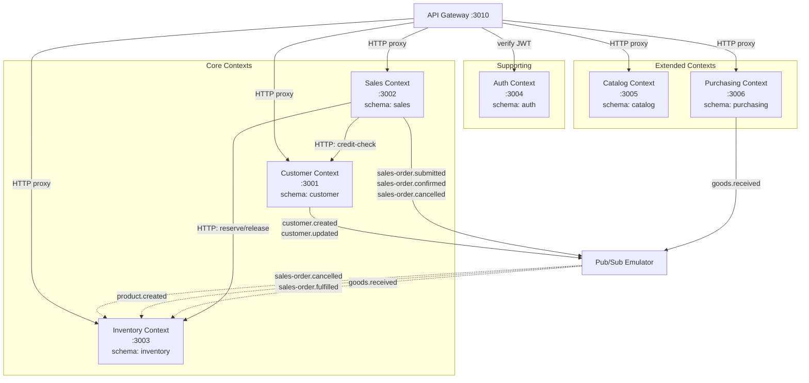
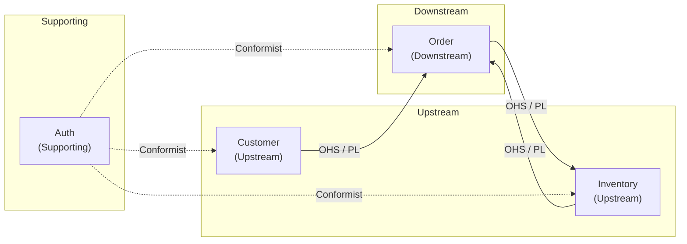
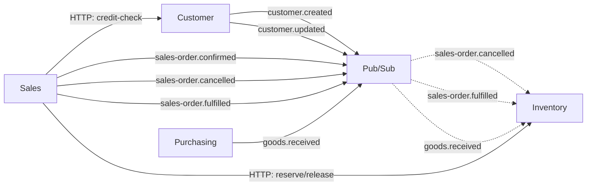

# Bounded Contexts — Ranh giới ngữ cảnh

> ✅ **Trạng thái:** Tất cả 6 bounded contexts đã implement đầy đủ. Xem chi tiết: [Implementation Status](../IMPLEMENTATION-STATUS.md).

> Tài liệu mô tả các Bounded Context trong hệ thống ERP Prototype, quy tắc tương tác giữa chúng, và sự kiện (events) mà mỗi context publish/consume.
> Liên quan: [system-overview](system-overview.md) · [data-model](data-model.md) · [event-flows](event-flows.md) · [design-patterns](design-patterns.md)

---

## 1. Bounded Context là gì?

Trong Domain-Driven Design (DDD), **Bounded Context** là ranh giới logic mà bên trong đó một domain model có ý nghĩa nhất quán. Mỗi context có:

- **Ngôn ngữ riêng** (Ubiquitous Language) — cùng từ "Order" nhưng nghĩa khác trong context khác
- **Data ownership riêng** — sở hữu schema DB riêng, không ai được truy cập trực tiếp
- **Team ownership** — trong tổ chức thực tế, mỗi context có thể do một team phụ trách

**Tại sao cần Bounded Context?**

| Không có BC | Có BC |
|---|---|
| Một database schema khổng lồ | Mỗi service sở hữu schema riêng |
| Coupling chặt giữa các module | Loose coupling, giao tiếp qua API/Events |
| Thay đổi 1 chỗ ảnh hưởng toàn bộ | Thay đổi cục bộ trong context |
| Không thể scale riêng từng phần | Scale độc lập từng service |

---

## 2. Context Map — Sơ đồ tổng quan



**Đọc sơ đồ:**

| Ký hiệu | Ý nghĩa |
|---|---|
| Đường liền (→) | HTTP request đồng bộ |
| Đường đứt (-.→) | Event subscription bất đồng bộ |
| `PS` | Pub/Sub Emulator — message broker trung gian |

---

## 3. Chi tiết từng Bounded Context

### 3.1. Auth Context (Supporting Context)

| Thuộc tính | Chi tiết |
|---|---|
| **Vai trò** | Supporting Context — hỗ trợ xác thực và phân quyền cho toàn hệ thống |
| **Service** | Auth Service `:3004` |
| **Schema** | `auth` |
| **Tables** | `users`, `refresh_tokens` |
| **Events published** | Không có (auth không publish event) |
| **Events consumed** | Không có |

**Responsibilities:**

1. Đăng ký user mới (hash password bằng bcrypt)
2. Đăng nhập — trả về Access Token (JWT) + Refresh Token
3. Refresh Token — cấp lại Access Token khi hết hạn
4. Quản lý user (CRUD) — chỉ admin
5. Cung cấp endpoint verify token cho Gateway

**Tại sao là Supporting Context?**
Auth không chứa business logic cốt lõi của ERP (không liên quan đến khách hàng, đơn hàng, kho). Nó chỉ hỗ trợ các core context bằng cách xác thực danh tính user.

---

### 3.2. Customer Context (Core Context)

| Thuộc tính | Chi tiết |
|---|---|
| **Vai trò** | Core Context — quản lý thông tin khách hàng B2B |
| **Service** | Customer Service `:3001` |
| **Schema** | `customer` |
| **Tables** | `cores`, `outbox` |
| **Events published** | `customer.created`, `customer.updated` |
| **Events consumed** | Không có |

**Responsibilities:**

1. CRUD khách hàng (business_name, tax_code, contact info)
2. Quản lý trạng thái khách hàng: `prospect` → `active` → `suspended` / `archived`
3. Quản lý credit limit (hạn mức tín dụng)
4. Credit check — kiểm tra hạn mức khi Order Service gọi HTTP
5. Validate Value Object: TaxCode (mã số thuế phải đúng format)
6. Publish events khi tạo/cập nhật khách hàng

**Events Published:**

| Event | Trigger | Payload chính |
|---|---|---|
| `customer.created` | Tạo customer mới | `customerId`, `businessName`, `taxCode`, `creditLimit` |
| `customer.updated` | Cập nhật customer | `customerId`, `changes` (fields đã thay đổi) |

---

### 3.3. Sales Context (Core Context)

| Thuộc tính | Chi tiết |
|---|---|
| **Vai trò** | Core Context — quản lý đơn hàng, điều phối submit flow |
| **Service** | Sales Service `:3002` |
| **Schema** | `sales` |
| **Tables** | `headers`, `lines`, `status_history`, `lifecycle_view`, `outbox` |
| **Events published** | `sales-order.submitted`, `sales-order.confirmed`, `sales-order.cancelled` |
| **Events consumed** | Không có (uses HTTP for cross-service calls) |

**Responsibilities:**

1. CRUD đơn hàng (header + lines) — Aggregate Root pattern
2. Quản lý lifecycle: `draft` → `submitted` → `confirmed` / `cancelled` → `fulfilled`
3. Ghi lịch sử thay đổi trạng thái (status_history)
4. **Synchronous Submit**: HTTP reserve stock (Inventory) → HTTP credit-check (Customer) → confirm/cancel
5. CQRS: write model (headers + lines) vs read model (lifecycle_view)
6. Gọi Inventory Service (HTTP) để reserve/release stock
7. Gọi Customer Service (HTTP) để credit-check

**Events Published:**

| Event | Trigger | Payload chính |
|---|---|---|
| `sales-order.submitted` | User submit đơn hàng | `orderId`, `customerId`, `items[]`, `totalAmount` |
| `sales-order.confirmed` | Reserve + credit-check thành công | `orderId` |
| `sales-order.cancelled` | Reserve hoặc credit-check thất bại, hoặc user cancel | `orderId`, `reason`, `lines[]` |

**HTTP Calls (Outbound):**

| Callee | Endpoint | Purpose |
|---|---|---|
| Inventory Service | `POST /v1/inventory/items/batch/reserve` | Reserve stock for order |
| Inventory Service | `POST /v1/inventory/items/batch/release` | Compensate: release on credit fail |
| Customer Service | `GET /v1/customers/:id/credit-check` | Check credit limit |

---

### 3.4. Inventory Context (Core Context)

| Thuộc tính | Chi tiết |
|---|---|
| **Vai trò** | Core Context — quản lý kho hàng, tồn kho |
| **Service** | Inventory Service `:3003` |
| **Schema** | `inventory` |
| **Tables** | `items`, `movements`, `outbox` |
| **HTTP endpoints** | Batch reserve/release (called by Sales Service) |
| **Events consumed** | `sales-order.cancelled`, `sales-order.fulfilled`, `product.created`, `goods.received` |

**Responsibilities:**

1. CRUD items (sản phẩm) và warehouses (kho)
2. Quản lý stock levels: `quantity_available`, `quantity_reserved`
3. Nhập kho (inbound) / xuất kho (outbound)
4. **HTTP reserve/release**: batch endpoints for synchronous stock operations
5. Release stock khi nhận event `sales-order.cancelled` (Pub/Sub compensation)
6. Issue stock khi nhận event `sales-order.fulfilled`
7. **Optimistic Locking**: dùng column `version` để tránh concurrent update

**HTTP Endpoints (Inbound):**

| Endpoint | Caller | Purpose |
|---|---|---|
| `POST /v1/inventory/items/batch/reserve` | Sales Service | Atomic multi-item reserve |
| `POST /v1/inventory/items/batch/release` | Sales Service | Release reserved stock |

**Events Consumed:**

| Event | Source | Hành động |
|---|---|---|
| `sales-order.cancelled` | Sales Service | Release stock đã reserve |
| `sales-order.fulfilled` | Sales Service | Issue stock for shipment |
| `product.created` | Catalog Service | Auto-create stock item |
| `goods.received` | Purchasing Service | Receive stock from PO |

---

### 3.5. Catalog Context (Extended Context)

| Thuộc tính | Chi tiết |
|---|---|
| **Vai trò** | Extended Context — quản lý danh mục sản phẩm |
| **Service** | Catalog Service `:3005` |
| **Schema** | `catalog` |
| **Tables** | `products`, `outbox` |
| **Events published** | `product.created`, `product.deactivated` |
| **Events consumed** | Không có |

**Trách nhiệm:**
1. Product CRUD (tạo, cập nhật, tìm kiếm, xem chi tiết)
2. SKU validation via Value Object (immutable sau tạo)
3. Quản lý taxRate per product (VN rates: 0%, 5%, 8%, 10%)
4. Activate/deactivate products
5. Publish event `product.created` → Inventory auto-create stock item

---

### 3.6. Purchasing Context (Extended Context)

| Thuộc tính | Chi tiết |
|---|---|
| **Vai trò** | Extended Context — quản lý quy trình mua hàng |
| **Service** | Purchasing Service `:3006` |
| **Schema** | `purchasing` |
| **Tables** | `purchase_orders`, `po_lines`, `suppliers`, `outbox` |
| **Events published** | `goods.received` |
| **Events consumed** | Không có |

**Trách nhiệm:**
1. Supplier CRUD (tạo, cập nhật, tìm kiếm, activate/deactivate)
2. Purchase Order lifecycle (draft → placed → received → cancelled)
3. PO Line management (thêm/xóa dòng hàng khi draft)
4. Goods receipt — khi nhận hàng, publish `goods.received` → Inventory tăng stock
5. Auto-generate PO number format `PO-YYYYMMDD-NNN`

---


## 4. Quy tắc tương tác giữa các Context

### 4.1. Quy tắc cốt lõi

```
🚫 KHÔNG BAO GIỜ:
   - Query trực tiếp schema của context khác
   - Tạo Foreign Key cross-schema  
   - Import code/module từ context khác

✅ CHỈ ĐƯỢC PHÉP:
   - Gọi HTTP API (đồng bộ) — khi cần response ngay
   - Gửi/nhận Event qua Pub/Sub (bất đồng bộ) — khi không cần response ngay
```

### 4.2. Khi nào dùng HTTP vs Event?

| Tiêu chí | HTTP (đồng bộ) | Event / Pub/Sub (bất đồng bộ) |
|---|---|---|
| **Cần response ngay** | ✅ Dùng HTTP | ❌ Không phù hợp |
| **Fire-and-forget** | ❌ Overhead không cần thiết | ✅ Dùng Event |
| **Failure tolerance** | Caller bị block nếu callee down (Circuit Breaker giảm thiệu) | Event nằm trong queue, retry sau |
| **Coupling** | Coupling cao hơn (cần biết URL) | Loose coupling (chỉ biết topic name) |
| **Ví dụ trong project** | Sales → Inventory (reserve/release), Sales → Customer (credit-check) | Sales → Pub/Sub → Inventory (cancel release, issue stock) |

### 4.3. Bảng tương tác chi tiết

| Từ | Đến | Phương thức | Mục đích |
|---|---|---|---|
| API Gateway | Auth Service | HTTP | Verify JWT token |
| API Gateway | Customer Service | HTTP Proxy | Forward CRUD requests |
| API Gateway | Sales Service | HTTP Proxy | Forward CRUD requests |
| API Gateway | Inventory Service | HTTP Proxy | Forward CRUD requests |
| Sales Service | Inventory Service | **HTTP** | Reserve/release stock (batch, synchronous) |
| Sales Service | Customer Service | **HTTP** | Credit check (kiểm tra hạn mức) |
| Sales Service | Inventory Service | Pub/Sub event | Release stock (qua `sales-order.cancelled`) |
| Sales Service | Inventory Service | Pub/Sub event | Issue stock (qua `sales-order.fulfilled`) |
| Customer Service | — | Pub/Sub event | Broadcast thay đổi (customer.created/updated) |
| Purchasing Service | Inventory Service | Pub/Sub event | Receive stock (qua `goods.received`) |

---

## 5. Context Map Patterns

Trong DDD, các context quan hệ với nhau theo các pattern chuẩn. Project này sử dụng:



| Pattern | Giải thích | Áp dụng |
|---|---|---|
| **OHS (Open Host Service)** | Context cung cấp API/Event chuẩn cho bên ngoài | Customer cung cấp HTTP credit-check cho Order |
| **PL (Published Language)** | Event payload là "ngôn ngữ chung" giữa 2 context | Event schema (TypeScript interfaces) dùng chung |
| **Conformist** | Context downstream chấp nhận model của upstream nguyên trạng | Tất cả services tuân theo JWT format của Auth |

---

## 6. Tổng hợp Events



| Topic | Publisher | Subscriber(s) | Mục đích |
|---|---|---|---|
| `customer.created` | Customer | (chưa có) | Thông báo customer mới |
| `customer.updated` | Customer | (chưa có) | Thông báo thay đổi customer |
| `sales-order.confirmed` | Sales | (chưa có) | Thông báo đơn hàng đã xác nhận |
| `sales-order.cancelled` | Sales | Inventory | Release stock (compensation) |
| `sales-order.fulfilled` | Sales | Inventory | Issue stock for shipment |
| `goods.received` | Purchasing | Inventory | Receive stock from PO |

> **Lưu ý**: `customer.created` và `customer.updated` hiện chưa có subscriber. Trong tương lai, Sales Service có thể subscribe để cache thông tin customer locally.

---

Liên quan: [system-overview](system-overview.md) · [data-model](data-model.md) · [event-flows](event-flows.md) · [design-patterns](design-patterns.md)
