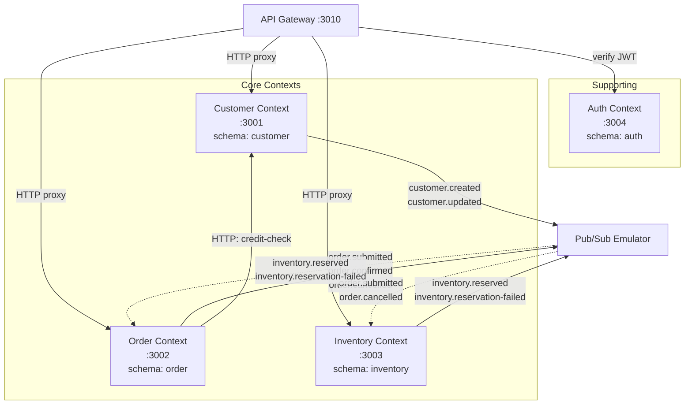
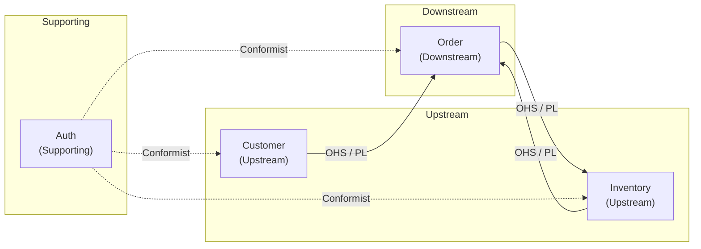
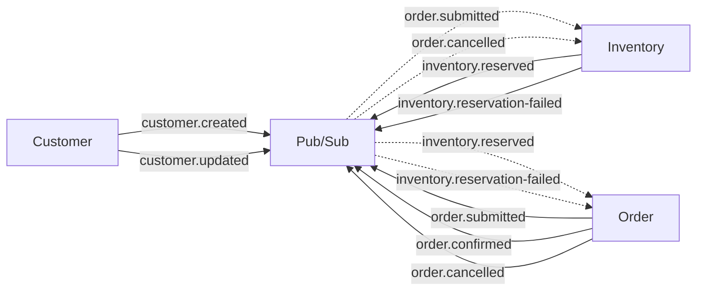

# Bounded Contexts — Ranh giới ngữ cảnh

> ⚠️ **Trạng thái hỗn hợp:** chỉ context `Customer` đã implement; `Order`, `Inventory`, `Auth` mới là blueprint và chưa có subscriber nào tiêu thụ event. Xem [Implementation Status](../IMPLEMENTATION-STATUS.md).

> Tài liệu mô tả các Bounded Context trong hệ thống ERP Prototype, quy tắc tương tác giữa chúng, và sự kiện (events) mà mỗi context publish/consume.
> Liên quan: [system-overview](system-overview.md) · [data-model](data-model.md) · [event-flows](event-flows.md) · [design-patterns](design-patterns.md)

---

## 1. Bounded Context là gì?

Trong Domain-Driven Design (DDD), **Bounded Context** là ranh giới logic mà bên trong đó một domain model có ý nghĩa nhất quán. Mỗi context có:

- **Ngôn ngữ riêng** (Ubiquitous Language) — cùng từ "Order" nhưng nghĩa khác trong context khác
- **Data ownership riêng** — sở hữu schema DB riêng, không ai được truy cập trực tiếp
- **Team ownership** — trong tổ chức thực tế, mỗi context có thể do một team phụ trách

**Tại sao cần Bounded Context?**

| Không có BC | Có BC |
|---|---|
| Một database schema khổng lồ | Mỗi service sở hữu schema riêng |
| Coupling chặt giữa các module | Loose coupling, giao tiếp qua API/Events |
| Thay đổi 1 chỗ ảnh hưởng toàn bộ | Thay đổi cục bộ trong context |
| Không thể scale riêng từng phần | Scale độc lập từng service |

---

## 2. Context Map — Sơ đồ tổng quan



**Đọc sơ đồ:**

| Ký hiệu | Ý nghĩa |
|---|---|
| Đường liền (→) | HTTP request đồng bộ |
| Đường đứt (-.→) | Event subscription bất đồng bộ |
| `PS` | Pub/Sub Emulator — message broker trung gian |

---

## 3. Chi tiết từng Bounded Context

### 3.1. Auth Context (Supporting Context)

| Thuộc tính | Chi tiết |
|---|---|
| **Vai trò** | Supporting Context — hỗ trợ xác thực và phân quyền cho toàn hệ thống |
| **Service** | Auth Service `:3004` |
| **Schema** | `auth` |
| **Tables** | `users`, `refresh_tokens` |
| **Events published** | Không có (auth không publish event) |
| **Events consumed** | Không có |

**Responsibilities:**

1. Đăng ký user mới (hash password bằng bcrypt)
2. Đăng nhập — trả về Access Token (JWT) + Refresh Token
3. Refresh Token — cấp lại Access Token khi hết hạn
4. Quản lý user (CRUD) — chỉ admin
5. Cung cấp endpoint verify token cho Gateway

**Tại sao là Supporting Context?**
Auth không chứa business logic cốt lõi của ERP (không liên quan đến khách hàng, đơn hàng, kho). Nó chỉ hỗ trợ các core context bằng cách xác thực danh tính user.

---

### 3.2. Customer Context (Core Context)

| Thuộc tính | Chi tiết |
|---|---|
| **Vai trò** | Core Context — quản lý thông tin khách hàng B2B |
| **Service** | Customer Service `:3001` |
| **Schema** | `customer` |
| **Tables** | `cores`, `outbox` |
| **Events published** | `customer.created`, `customer.updated` |
| **Events consumed** | Không có |

**Responsibilities:**

1. CRUD khách hàng (business_name, tax_code, contact info)
2. Quản lý trạng thái khách hàng: `prospect` → `active` → `suspended` / `archived`
3. Quản lý credit limit (hạn mức tín dụng)
4. Credit check — kiểm tra hạn mức khi Order Service gọi HTTP
5. Validate Value Object: TaxCode (mã số thuế phải đúng format)
6. Publish events khi tạo/cập nhật khách hàng

**Events Published:**

| Event | Trigger | Payload chính |
|---|---|---|
| `customer.created` | Tạo customer mới | `customerId`, `businessName`, `taxCode`, `creditLimit` |
| `customer.updated` | Cập nhật customer | `customerId`, `changes` (fields đã thay đổi) |

---

### 3.3. Order Context (Core Context)

| Thuộc tính | Chi tiết |
|---|---|
| **Vai trò** | Core Context — quản lý đơn hàng, điều phối Saga |
| **Service** | Order Service `:3002` |
| **Schema** | `order` |
| **Tables** | `headers`, `lines`, `status_history`, `lifecycle_view`, `outbox` |
| **Events published** | `order.submitted`, `order.confirmed`, `order.cancelled` |
| **Events consumed** | `inventory.reserved`, `inventory.reservation-failed` |

**Responsibilities:**

1. CRUD đơn hàng (header + lines) — Aggregate Root pattern
2. Quản lý lifecycle: `draft` → `submitted` → `confirmed` / `cancelled` → `fulfilled`
3. Ghi lịch sử thay đổi trạng thái (status_history)
4. **Saga Orchestrator**: điều phối luồng submit → reserve stock → credit check → confirm/compensate
5. CQRS: write model (headers + lines) vs read model (lifecycle_view)
6. Gọi Customer Service (HTTP) để credit-check

**Events Published:**

| Event | Trigger | Payload chính |
|---|---|---|
| `order.submitted` | User submit đơn hàng | `orderId`, `customerId`, `items[]`, `totalAmount` |
| `order.confirmed` | Saga hoàn thành thành công | `orderId`, `customerId`, `confirmedAt` |
| `order.cancelled` | Saga thất bại hoặc user cancel | `orderId`, `reason`, `cancelledAt` |

**Events Consumed:**

| Event | Source | Hành động |
|---|---|---|
| `inventory.reserved` | Inventory Service | Tiếp tục Saga → credit check → confirm |
| `inventory.reservation-failed` | Inventory Service | Đánh dấu đơn hàng thất bại |

---

### 3.4. Inventory Context (Core Context)

| Thuộc tính | Chi tiết |
|---|---|
| **Vai trò** | Core Context — quản lý kho hàng, tồn kho |
| **Service** | Inventory Service `:3003` |
| **Schema** | `inventory` |
| **Tables** | `items`, `warehouses`, `stock_levels`, `movements`, `outbox` |
| **Events published** | `inventory.reserved`, `inventory.reservation-failed` |
| **Events consumed** | `order.submitted`, `order.cancelled` |

**Responsibilities:**

1. CRUD items (sản phẩm) và warehouses (kho)
2. Quản lý stock levels: `on_hand_quantity`, `reserved_quantity`
3. Nhập kho (inbound) / xuất kho (outbound)
4. Reserve stock khi nhận event `order.submitted`
5. Release stock khi nhận event `order.cancelled` (compensation)
6. **Optimistic Locking**: dùng column `version` để tránh concurrent update

**Events Published:**

| Event | Trigger | Payload chính |
|---|---|---|
| `inventory.reserved` | Reserve stock thành công | `orderId`, `items[]`, `reservedAt` |
| `inventory.reservation-failed` | Không đủ stock | `orderId`, `failedItems[]`, `reason` |

**Events Consumed:**

| Event | Source | Hành động |
|---|---|---|
| `order.submitted` | Order Service | Reserve stock cho tất cả items trong đơn |
| `order.cancelled` | Order Service | Release (giải phóng) stock đã reserve |

---

## 4. Quy tắc tương tác giữa các Context

### 4.1. Quy tắc cốt lõi

```
🚫 KHÔNG BAO GIỜ:
   - Query trực tiếp schema của context khác
   - Tạo Foreign Key cross-schema  
   - Import code/module từ context khác

✅ CHỈ ĐƯỢC PHÉP:
   - Gọi HTTP API (đồng bộ) — khi cần response ngay
   - Gửi/nhận Event qua Pub/Sub (bất đồng bộ) — khi không cần response ngay
```

### 4.2. Khi nào dùng HTTP vs Event?

| Tiêu chí | HTTP (đồng bộ) | Event / Pub/Sub (bất đồng bộ) |
|---|---|---|
| **Cần response ngay** | ✅ Dùng HTTP | ❌ Không phù hợp |
| **Fire-and-forget** | ❌ Overhead không cần thiết | ✅ Dùng Event |
| **Failure tolerance** | Caller bị block nếu callee down | Event nằm trong queue, retry sau |
| **Coupling** | Coupling cao hơn (cần biết URL) | Loose coupling (chỉ biết topic name) |
| **Ví dụ trong project** | Order → Customer (credit-check) | Order → Pub/Sub → Inventory (reserve) |

### 4.3. Bảng tương tác chi tiết

| Từ | Đến | Phương thức | Mục đích |
|---|---|---|---|
| API Gateway | Auth Service | HTTP | Verify JWT token |
| API Gateway | Customer Service | HTTP Proxy | Forward CRUD requests |
| API Gateway | Order Service | HTTP Proxy | Forward CRUD requests |
| API Gateway | Inventory Service | HTTP Proxy | Forward CRUD requests |
| Order Service | Customer Service | HTTP | Credit check (kiểm tra hạn mức) |
| Order Service | Inventory Service | Pub/Sub event | Reserve stock (qua `order.submitted`) |
| Inventory Service | Order Service | Pub/Sub event | Trả kết quả reserve (qua `inventory.reserved` / `inventory.reservation-failed`) |
| Order Service | Inventory Service | Pub/Sub event | Compensation (qua `order.cancelled`) |
| Customer Service | — | Pub/Sub event | Broadcast thay đổi (customer.created/updated) |

---

## 5. Context Map Patterns

Trong DDD, các context quan hệ với nhau theo các pattern chuẩn. Project này sử dụng:



| Pattern | Giải thích | Áp dụng |
|---|---|---|
| **OHS (Open Host Service)** | Context cung cấp API/Event chuẩn cho bên ngoài | Customer cung cấp HTTP credit-check cho Order |
| **PL (Published Language)** | Event payload là "ngôn ngữ chung" giữa 2 context | Event schema (TypeScript interfaces) dùng chung |
| **Conformist** | Context downstream chấp nhận model của upstream nguyên trạng | Tất cả services tuân theo JWT format của Auth |

---

## 6. Tổng hợp Events



| Topic | Publisher | Subscriber(s) | Mục đích |
|---|---|---|---|
| `customer.created` | Customer | (chưa có) | Thông báo customer mới |
| `customer.updated` | Customer | (chưa có) | Thông báo thay đổi customer |
| `order.submitted` | Order | Inventory | Yêu cầu reserve stock |
| `order.confirmed` | Order | (chưa có) | Thông báo đơn hàng đã xác nhận |
| `order.cancelled` | Order | Inventory | Yêu cầu release stock (compensation) |
| `inventory.reserved` | Inventory | Order | Báo reserve thành công → tiếp tục Saga |
| `inventory.reservation-failed` | Inventory | Order | Báo reserve thất bại → fail Saga |

> **Lưu ý**: `customer.created` và `customer.updated` hiện chưa có subscriber. Trong tương lai, Order Service có thể subscribe để cache thông tin customer locally (giảm HTTP calls).

---

Liên quan: [system-overview](system-overview.md) · [data-model](data-model.md) · [event-flows](event-flows.md) · [design-patterns](design-patterns.md)
