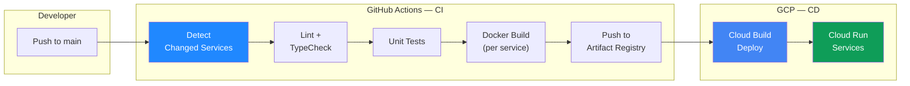
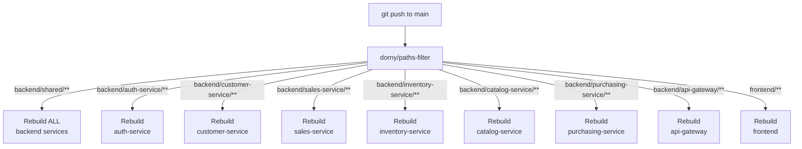
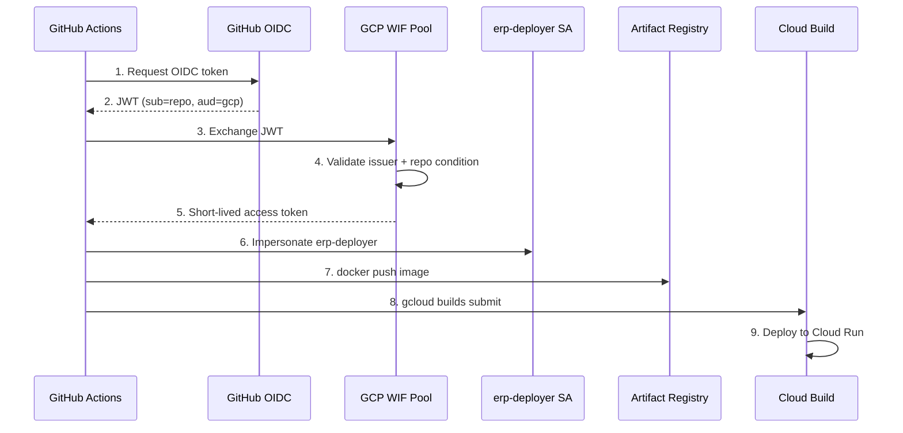
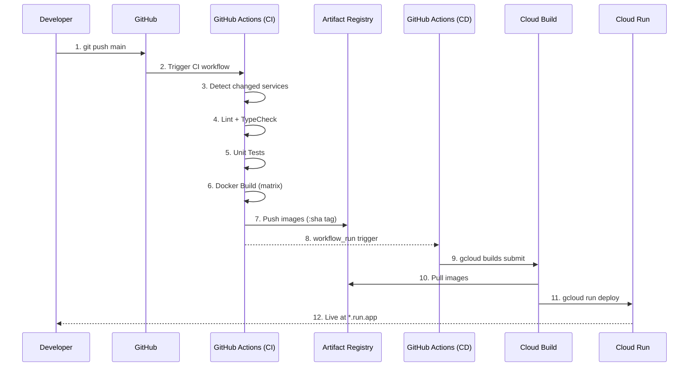

# CI/CD Pipeline

> Pipeline CI/CD cho ERP Prototype: GitHub Actions (CI) build và push Docker images → Cloud Build (CD) deploy lên Cloud Run. Xác thực GH→GCP bằng Workload Identity Federation (keyless).

> Liên quan: [GCP Cloud Architecture](./gcp-cloud-architecture.md) · [System Overview](./system-overview.md) · [Event Flows](./event-flows.md)

---

## 1. Tổng quan Pipeline



| Phase | Tool | Chức năng |
|---|---|---|
| **CI** | GitHub Actions | Detect changes → lint → test → build Docker → push Artifact Registry |
| **CD** | Cloud Build | Pull image từ Artifact Registry → deploy lên Cloud Run |
| **Auth** | Workload Identity Federation | GitHub ↔ GCP xác thực keyless (OIDC) |

---

## 2. Monorepo Path Filters

Repo có 8 services. Mỗi lần push, **chỉ build service thay đổi** — tiết kiệm thời gian + chi phí:



**Trigger rules:**

| Path Changed | Services Rebuilt | Lý do |
|---|---|---|
| `backend/shared/**` | **Tất cả 7 backend** | `@erp/shared` là dependency chung |
| `backend/customer-service/**` | customer-service | Chỉ service đó thay đổi |
| `backend/<any-service>/**` | service tương ứng | Chỉ service đó thay đổi |
| `frontend/**` | frontend | Frontend tách biệt |
| `infra/**` | Không build | Terraform changes không trigger CI |
| `docs/**` | Không build | Docs changes không trigger CI |

---

## 3. GitHub Actions Workflows

### 3.1. CI — Backend (`ci-backend.yml`)

```yaml
name: CI — Backend

on:
  push:
    branches: [main]
    paths: ['backend/**']
  pull_request:
    branches: [main]
    paths: ['backend/**']

jobs:
  detect-changes:
    runs-on: ubuntu-latest
    outputs:
      shared: ${{ steps.filter.outputs.shared }}
      matrix: ${{ steps.build-matrix.outputs.matrix }}
    steps:
      - uses: actions/checkout@v4
      - uses: dorny/paths-filter@v3
        id: filter
        with:
          filters: |
            shared: 'backend/shared/**'
            auth: 'backend/auth-service/**'
            customer: 'backend/customer-service/**'
            sales: 'backend/sales-service/**'
            inventory: 'backend/inventory-service/**'
            catalog: 'backend/catalog-service/**'
            purchasing: 'backend/purchasing-service/**'
            gateway: 'backend/api-gateway/**'
      - id: build-matrix
        # Build matrix based on changed paths
        # If shared changed → all services
        # Otherwise → only changed services

  build-and-push:
    needs: detect-changes
    runs-on: ubuntu-latest
    environment: dev
    permissions:
      id-token: write    # Workload Identity Federation OIDC
      contents: read
    strategy:
      matrix: ${{ fromJson(needs.detect-changes.outputs.matrix) }}
    steps:
      - uses: actions/checkout@v4

      # Authenticate to GCP via WIF (keyless)
      - uses: google-github-actions/auth@v2
        with:
          workload_identity_provider: ${{ vars.WIF_PROVIDER }}
          service_account: ${{ vars.DEPLOYER_SA }}

      - uses: google-github-actions/setup-gcloud@v2
      - run: gcloud auth configure-docker us-central1-docker.pkg.dev

      # Build using existing multi-stage Dockerfile
      - run: |
          docker build \
            --build-arg SERVICE_DIR=${{ matrix.service }} \
            -t us-central1-docker.pkg.dev/${{ vars.GCP_PROJECT }}/erp-services/${{ matrix.service }}:${{ github.sha }} \
            -t us-central1-docker.pkg.dev/${{ vars.GCP_PROJECT }}/erp-services/${{ matrix.service }}:latest \
            -f backend/Dockerfile backend/
      - run: |
          docker push --all-tags \
            us-central1-docker.pkg.dev/${{ vars.GCP_PROJECT }}/erp-services/${{ matrix.service }}
```

### 3.2. CI — Frontend (`ci-frontend.yml`)

```yaml
name: CI — Frontend

on:
  push:
    branches: [main]
    paths: ['frontend/**']
  pull_request:
    branches: [main]
    paths: ['frontend/**']

jobs:
  build-and-push:
    runs-on: ubuntu-latest
    environment: dev
    permissions:
      id-token: write
      contents: read
    steps:
      - uses: actions/checkout@v4
      - uses: google-github-actions/auth@v2
        with:
          workload_identity_provider: ${{ vars.WIF_PROVIDER }}
          service_account: ${{ vars.DEPLOYER_SA }}
      - uses: google-github-actions/setup-gcloud@v2
      - run: gcloud auth configure-docker us-central1-docker.pkg.dev
      - run: |
          docker build \
            -t us-central1-docker.pkg.dev/${{ vars.GCP_PROJECT }}/erp-services/frontend:${{ github.sha }} \
            -t us-central1-docker.pkg.dev/${{ vars.GCP_PROJECT }}/erp-services/frontend:latest \
            frontend/
      - run: |
          docker push --all-tags \
            us-central1-docker.pkg.dev/${{ vars.GCP_PROJECT }}/erp-services/frontend
```

### 3.3. CD — Deploy (`deploy.yml`)

```yaml
name: CD — Deploy via Cloud Build

on:
  workflow_run:
    workflows: ["CI — Backend", "CI — Frontend"]
    types: [completed]
    branches: [main]

jobs:
  deploy:
    if: ${{ github.event.workflow_run.conclusion == 'success' }}
    runs-on: ubuntu-latest
    environment: dev
    permissions:
      id-token: write
      contents: read
    steps:
      - uses: actions/checkout@v4
      - uses: google-github-actions/auth@v2
        with:
          workload_identity_provider: ${{ vars.WIF_PROVIDER }}
          service_account: ${{ vars.DEPLOYER_SA }}
      - uses: google-github-actions/setup-gcloud@v2
      - run: |
          gcloud builds submit \
            --config=cloudbuild.yaml \
            --substitutions=_TAG=${{ github.event.workflow_run.head_sha }} \
            --no-source
```

---

## 4. Cloud Build — CD Config (`cloudbuild.yaml`)

Cloud Build nhận tag từ GitHub Actions, deploy từng service lên Cloud Run:

```yaml
steps:
  - id: deploy-auth
    name: 'gcr.io/google.com/cloudsdktool/cloud-sdk'
    entrypoint: gcloud
    args: ['run', 'deploy', 'auth-service',
           '--image', 'us-central1-docker.pkg.dev/$PROJECT_ID/erp-services/auth-service:${_TAG}',
           '--region', 'us-central1', '--platform', 'managed',
           '--vpc-connector', 'erp-vpc-connector',
           '--vpc-egress', 'private-ranges-only']

  # ... (repeat for each of 7 backend services)

  - id: deploy-frontend
    name: 'gcr.io/google.com/cloudsdktool/cloud-sdk'
    entrypoint: gcloud
    args: ['run', 'deploy', 'frontend',
           '--image', 'us-central1-docker.pkg.dev/$PROJECT_ID/erp-services/frontend:${_TAG}',
           '--region', 'us-central1', '--allow-unauthenticated']

substitutions:
  _TAG: latest
timeout: '1200s'
```

---

## 5. RBAC — GitHub Environments

| Element | Config |
|---|---|
| Environment name | `dev` |
| Deployment branch | `main` only |
| Required reviewers | None (auto deploy — solo project) |
| Environment secrets | _(none — dùng GitHub Variables + WIF)_ |
| Environment variables | `WIF_PROVIDER`, `DEPLOYER_SA`, `GCP_PROJECT` |

**GitHub Variables cần set:**

| Variable | Value | Mô tả |
|---|---|---|
| `GCP_PROJECT` | `erp-prototype-xxx` | GCP Project ID |
| `WIF_PROVIDER` | `projects/.../providers/github-provider` | WIF provider full path |
| `DEPLOYER_SA` | `erp-deployer@erp-prototype-xxx.iam.gserviceaccount.com` | Deployer SA email |

> [!NOTE]
> **Mở rộng RBAC**: Khi cần thêm `staging` hoặc `production` environment, chỉ cần tạo thêm GitHub Environment với required reviewers + branch protection. Workflow YAML dùng `environment:` field để gate deployment.

---

## 6. Authentication Flow — Workload Identity Federation



**Tại sao WIF thay vì SA JSON key?**

| | SA JSON Key | Workload Identity Federation |
|---|---|---|
| Secret management | Phải lưu key trong GitHub Secrets | Không có key → không thể leak |
| Rotation | Manual rotation | Auto (short-lived tokens) |
| Scope | Full SA permissions | Scoped to repo + branch |
| GCP recommendation | ❌ Không recommend | ✅ Best practice |

---

## 7. Docker Build Strategy

### Backend: Shared Dockerfile

Backend sử dụng 1 Dockerfile chung ([Dockerfile](../../backend/Dockerfile)) với multi-stage build:

```
Stage 1: shared-builder    → npm ci + build @erp/shared
Stage 2: service-builder   → npm ci + build target service
Stage 3: runner             → Copy dist + node_modules → CMD node dist/main.js
```

Build command:
```bash
docker build \
  --build-arg SERVICE_DIR=customer-service \
  --build-arg SERVICE_PORT=3001 \
  -t us-central1-docker.pkg.dev/{project}/erp-services/customer-service:{sha} \
  -f backend/Dockerfile backend/
```

### Frontend: Standalone Dockerfile

Frontend sử dụng Next.js `output: 'standalone'` ([Dockerfile](../../frontend/Dockerfile)):

```
Stage 1: builder  → npm ci + next build (standalone output)
Stage 2: runner   → Copy .next/standalone + static → CMD node server.js
```

---

## 8. Deployment Flow — End-to-End



**Thời gian ước tính:**
- CI (build + push): ~3-5 phút (per service)
- CD (deploy): ~2-3 phút (per service)
- **Tổng**: ~5-8 phút từ push → live

---

## 9. Cấu trúc thư mục CI/CD

```
erp-prototype-example/
├── .github/
│   └── workflows/
│       ├── ci-backend.yml          # CI cho 7 backend services
│       ├── ci-frontend.yml         # CI cho frontend
│       └── deploy.yml              # CD trigger Cloud Build
│
├── cloudbuild.yaml                 # Cloud Build deploy config
│
├── backend/
│   └── Dockerfile                  # (existing) Multi-stage, shared across services
│
└── frontend/
    └── Dockerfile                  # [NEW] Next.js standalone build
```

---

## Related Concepts

- [GCP Cloud Architecture](./gcp-cloud-architecture.md) — hạ tầng GCP mà pipeline deploy tới
- [System Overview](./system-overview.md) — kiến trúc tổng thể hệ thống
- [Event Flows](./event-flows.md) — Pub/Sub topics cần verify sau deploy
- [Tech Decisions](../overview/tech-decisions.md) — ADR-005: Pub/Sub emulator → production
