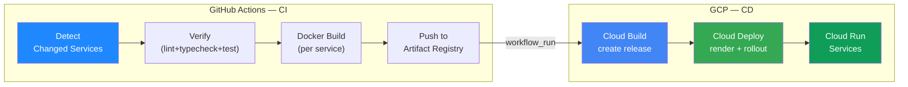
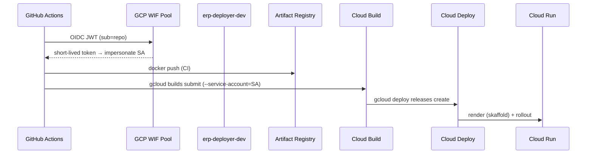

# CI/CD Pipeline

> **CI** (GitHub Actions) verify + build + push Docker image → **CD** (Cloud Build) tạo một **Cloud Deploy** release → **Cloud Deploy** render (Skaffold) + rollout lên **Cloud Run**. Xác thực GitHub→GCP bằng Workload Identity Federation (keyless).

> Liên quan: [GCP Cloud Architecture](./gcp-cloud-architecture.md) · [System Overview](./system-overview.md) · Runbook bàn giao: [deploy/MIGRATION.md](../../deploy/MIGRATION.md)

---

## 1. Tổng quan Pipeline


```mermaid
flowchart LR
    subgraph "GitHub Actions — CI"
        DETECT["Detect\nChanged Services"]
        VERIFY["Verify\n(lint+typecheck+test)"]
        BUILD["Docker Build\n(per service)"]
        PUSH["Push to\nArtifact Registry"]
    end

    subgraph "GCP — CD"
        CB["Cloud Build\ncreate release"]
        CDPL["Cloud Deploy\nrender + rollout"]
        CR["Cloud Run\nServices"]
    end

    DETECT --> VERIFY --> BUILD --> PUSH -->|workflow_run| CB --> CDPL --> CR

    style DETECT fill:#2088FF,color:#fff
    style CB fill:#4285F4,color:#fff
    style CDPL fill:#34A853,color:#fff
    style CR fill:#0F9D58,color:#fff
```

| Phase | Tool | Chức năng |
|---|---|---|
| **CI** | GitHub Actions | Detect changes → verify (lint/typecheck/test) → build Docker → push Artifact Registry |
| **CD (trigger)** | GitHub Actions (`deploy.yml`) | Sau CI: submit Cloud Build (chạy dưới danh tính deployer SA) |
| **CD (release)** | Cloud Build (`cloudbuild.yaml`) | `gcloud deploy releases create` — tạo release trỏ image `:latest` cho 8 service |
| **Delivery** | Google Cloud Deploy | Render manifest (Skaffold) → rollout lên target `dev` → Cloud Run |
| **Auth** | Workload Identity Federation | GitHub ↔ GCP keyless (OIDC), impersonate `erp-deployer-dev` |

> **Vì sao có Cloud Build ở giữa?** Cloud Build là bước "CD" đóng gói release: nó chạy
> `gcloud deploy releases create` với danh tính deployer SA (đã có `clouddeploy.releaser`).
> Cloud Deploy mới là thứ thực sự render + rollout. Đây đúng chuỗi thiết kế ban đầu
> **CI(GH Actions) → CD(Cloud Build) → Cloud Deploy**.

---

## 2. Ai sở hữu cái gì (spec vs nền tảng)

Điểm mấu chốt của kiến trúc này:

| Thành phần | Nguồn sự thật | Ghi chú |
|---|---|---|
| **Spec Cloud Run** (port, env, secret, VPC, probe, scaling) | `deploy/manifests/*.yaml` | Cloud Deploy render + apply. **Không** còn ở Terraform. |
| **Nền tảng** (VPC, Cloud SQL, Secret Manager, Artifact Registry, SA, WIF) | Terraform (`infra/`) | Ổn định, ít đổi. |
| **IAM của service** (allUsers invoker, gateway→backend invoker) | Terraform (`infra/environments/dev/main.tf`) | Trỏ service theo tên literal; gate sau `enable_service_iam`. |
| **Image tag** | Cloud Deploy release (`--images`) | Resolve `:latest`→digest lúc render, ghim lại (rollback đúng digest). |

> Trước đây Terraform sở hữu spec (`module.cloud_run`, `ignore_changes=[image]`) và CI chỉ
> lật image tag; URL gateway inject sau apply bằng `null_resource`. Đã **bàn giao** spec sang
> manifest để Cloud Deploy sở hữu declaratively — xem [deploy/MIGRATION.md](../../deploy/MIGRATION.md).

---

## 3. Monorepo Path Filters (CI)

8 service. Mỗi push chỉ **build service đổi** (tiết kiệm build) — `dorny/paths-filter`:

| Path đổi | Service rebuild | Lý do |
|---|---|---|
| `backend/shared/**` hoặc `backend/Dockerfile` | **Tất cả 7 backend** | `@erp/shared` là dependency chung |
| `backend/<service>/**` | service tương ứng | Chỉ service đó |
| `frontend/**` | frontend | Tách biệt |
| `.github/workflows/ci-*.yml` | verify (KHÔNG build+deploy) | Sửa CI vẫn kiểm tra thật, tránh "green giả" |
| `infra/**`, `docs/**`, `deploy/**` | không CI | Không đổi image |

> Lưu ý: CI build **selective**, nhưng một **release Cloud Deploy deploy cả 8 service** (mỗi
> service trỏ `:latest`). Service không đổi vẫn tạo revision mới cùng digest (~no-op). Chấp nhận
> cho prototype 1 env; cần selective per-service → tách nhiều delivery pipeline.

---

## 4. GitHub Actions Workflows

### 4.1. `ci-backend.yml` / `ci-frontend.yml` — CI (verify + build + push)
- `detect-changes` → `verify` (backend: shared build + lint:check + jest per service; frontend: typecheck + lint) → `build-and-push` (docker build + push `:sha` + `:latest`).
- **KHÔNG deploy** ở đây nữa (đã bỏ `gcloud run deploy`). Deploy do `deploy.yml`.

### 4.2. `deploy.yml` — CD trigger
```yaml
on:
  workflow_run:                       # tự chạy sau CI Backend/Frontend thành công
    workflows: ["CI — Backend", "CI — Frontend"]
    types: [completed]
    branches: [main]
  workflow_dispatch:                  # bấm tay: re-release / release theo tag cụ thể
    inputs: { tag: { default: latest } }
# → gcloud builds submit --config=cloudbuild.yaml
#     --substitutions=_TAG=<tag>,_RELEASE=rel-<sha>-<epoch>
#     --service-account=<deployer SA>   # build chạy dưới danh tính deployer SA
```

### 4.3. `cloudbuild.yaml` — tạo 8 release (1/pipeline, song song)
```yaml
steps:                                              # 8 bước, waitFor ['-'] → song song
  - id: release-<service>
    name: gcr.io/google.com/cloudsdktool/cloud-sdk
    entrypoint: gcloud
    waitFor: ['-']
    args: [deploy, releases, create, '${_RELEASE}',
           --delivery-pipeline=erp-<service>, --region=us-central1,
           --source=deploy/<service>,               # skaffold.yaml + service.yaml
           '--images=<service>=...:${_TAG}']
  # ... lặp cho 8 service
options: { logging: CLOUD_LOGGING_ONLY }            # bắt buộc khi build dùng custom SA
```
`.gcloudignore` chỉ upload `deploy/` + `cloudbuild.yaml` (upload nhẹ).

---

## 5. Cloud Deploy config (`deploy/`)

> ⚠️ **1 pipeline / 1 service** — bắt buộc. Deployer `cloudrun` của Skaffold chỉ nhận
> MỘT Cloud Run service mỗi lần render (gộp 8 → lỗi `expected singular node ... but was 8`).
> Nên có **8 DeliveryPipeline** `erp-<service>` dùng chung **1 Target `dev`**; mỗi service
> một thư mục tự chứa (skaffold + manifest).

```
deploy/
├── clouddeploy.yaml         # 1 Target "dev" + 8 DeliveryPipeline (erp-api-gateway, ...)
├── <service>/               # 8 thư mục, mỗi service tự chứa
│   ├── skaffold.yaml         # deployer: cloudrun; rawYaml: [service.yaml]
│   └── service.yaml          # Cloud Run Service (knative serving.knative.dev/v1)
│                             #   backend: private, VPC, 5 secret, /health/live
│                             #   api-gateway: public, VPC, + URL downstream + CORS, /health
│                             #   frontend: public, no VPC, no secret, /health, port 8080
└── MIGRATION.md             # runbook bàn giao + vận hành
```

- **Target dev**: `run.location = projects/portfolio-497506/locations/us-central1`; `executionConfigs.serviceAccount = erp-deployer-dev`. Dùng chung cho cả 8 pipeline.
- **DeliveryPipeline** (×8): `serialPipeline.stages: [{ targetId: dev }]`. Thêm staging/prod = thêm stage + Target vào mỗi pipeline.
- **Image substitution**: manifest để `image: <service>` (placeholder), release truyền `--images=<service>=<ảnh thật>`.
- **Release**: 1 lần deploy = 8 release (mỗi pipeline 1, CÙNG tên — khác namespace nên hợp lệ). cloudbuild.yaml có 8 bước `releases create` chạy song song.

Bootstrap pipeline (1 lần): `gcloud deploy apply --file=deploy/clouddeploy.yaml --region=us-central1`.

---

## 6. Auth & IAM — Workload Identity Federation


```mermaid
sequenceDiagram
    participant GH as GitHub Actions
    participant WIF as GCP WIF Pool
    participant SA as erp-deployer-dev
    participant AR as Artifact Registry
    participant CB as Cloud Build
    participant CD as Cloud Deploy
    participant CR as Cloud Run

    GH->>WIF: OIDC JWT (sub=repo)
    WIF-->>GH: short-lived token → impersonate SA
    GH->>AR: docker push (CI)
    GH->>CB: gcloud builds submit (--service-account=SA)
    CB->>CD: gcloud deploy releases create
    CD->>CR: render (skaffold) + rollout
```

Toàn bộ chuỗi chạy dưới **một danh tính**: `erp-deployer-dev`. Role cần (Terraform `modules/iam`):

| Role | Dùng cho |
|---|---|
| `roles/artifactregistry.writer` | CI push image |
| `roles/run.admin` | deploy Cloud Run (⊇ run.developer) |
| `roles/iam.serviceAccountUser` (project) | actAs build SA (self) + runtime SA `erp-backend-dev`/`erp-frontend-dev` |
| `roles/cloudbuild.builds.editor` + `roles/storage.admin` | chạy Cloud Build + render bucket |
| `roles/clouddeploy.releaser` | tạo release |
| `roles/clouddeploy.jobRunner` | Cloud Deploy dùng SA này làm execution SA (RENDER+DEPLOY) |

> **Vì sao WIF thay SA JSON key?** Không có key để leak; token ngắn hạn; scope theo repo+branch;
> đúng khuyến nghị GCP. GitHub Variables (env `dev`): `GCP_PROJECT`, `WIF_PROVIDER`, `DEPLOYER_SA`.

---

## 7. Docker Build Strategy

- **Backend**: 1 `backend/Dockerfile` multi-stage chung, `--build-arg SERVICE_DIR=<service>` (shared-builder → service-builder → runner).
- **Frontend**: `frontend/Dockerfile` Next.js `output: 'standalone'`, `--build-arg NEXT_PUBLIC_API_GATEWAY` (inline lúc build, KHÔNG phải env runtime), EXPOSE 8080.

---

## 8. Rollback

Không rebuild. Cloud Deploy giữ lịch sử release (đã ghim digest):
```bash
gcloud deploy targets rollback dev --delivery-pipeline=erp-services --region=us-central1
```
Hoặc UI Cloud Deploy → chọn release/rollout cũ → Rollback.

---

## Related Concepts

- [GCP Cloud Architecture](./gcp-cloud-architecture.md) — hạ tầng GCP pipeline deploy tới
- [System Overview](./system-overview.md) — kiến trúc tổng thể
- [deploy/MIGRATION.md](../../deploy/MIGRATION.md) — runbook bàn giao Terraform → Cloud Deploy
