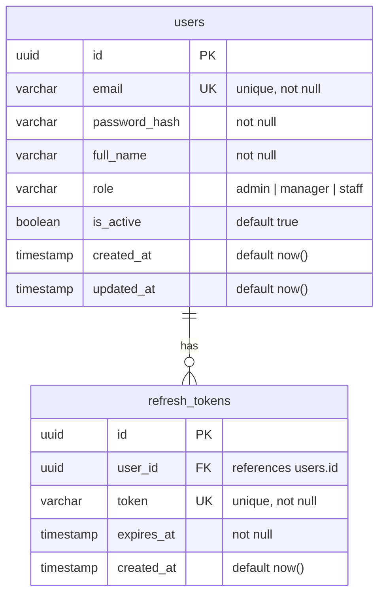
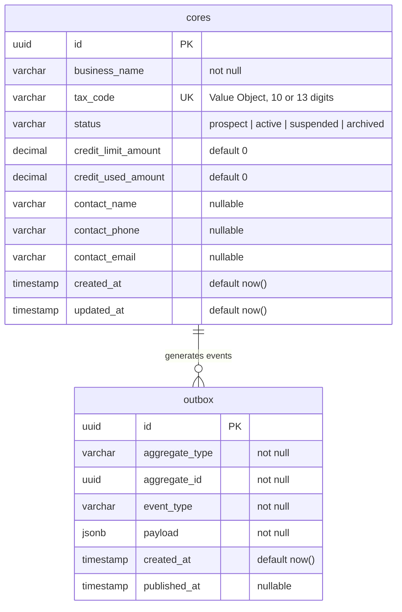
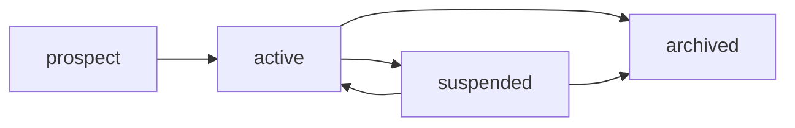
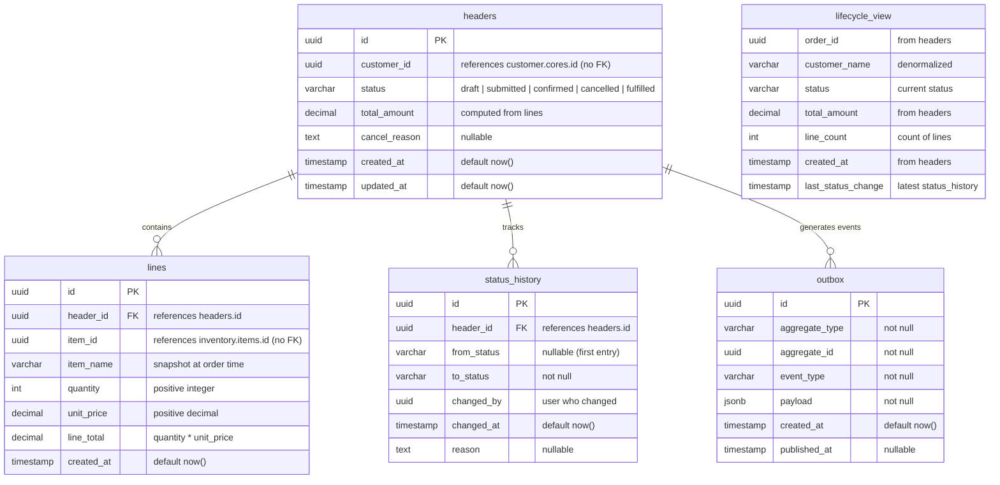
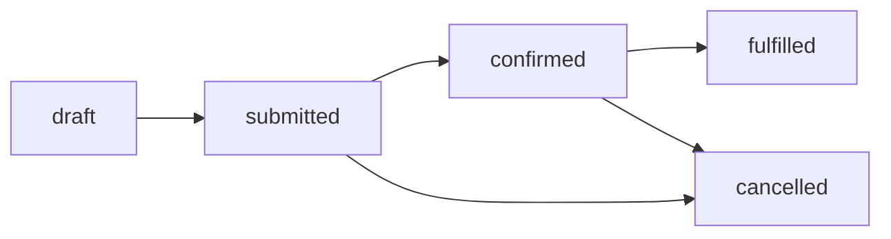
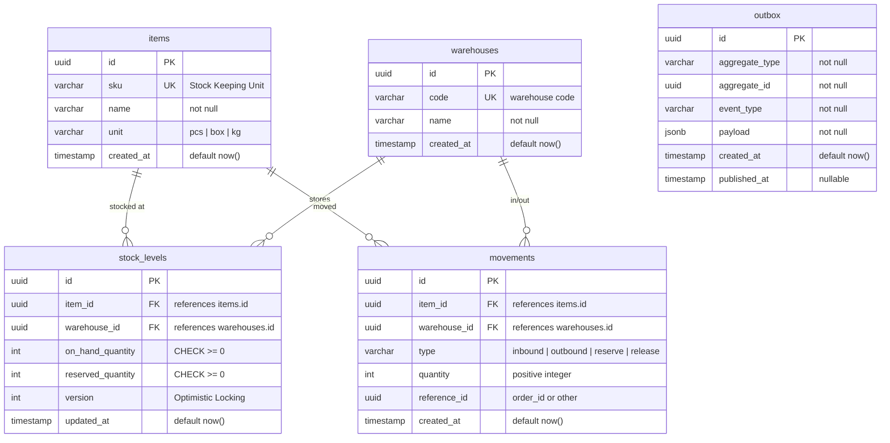
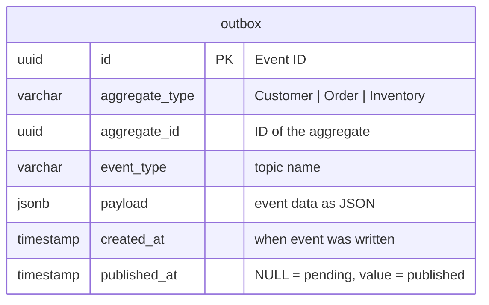

# Data Model — Mô hình dữ liệu

> ✅ **Tất cả schemas đã implement:** `customer`, `sales` (headers, lines, delivery, returns), `inventory`, `catalog`, `purchasing` (PO + suppliers), `app_auth`. Xem [Implementation Status](../IMPLEMENTATION-STATUS.md).

> Tài liệu chi tiết cấu trúc database của ERP Prototype: 4 schemas, tất cả tables, columns, constraints và ER diagrams.
> Liên quan: [system-overview](system-overview.md) · [bounded-contexts](bounded-contexts.md) · [event-flows](event-flows.md) · [design-patterns](design-patterns.md)

---

## 1. Tổng quan Database

Hệ thống sử dụng **một Supabase PostgreSQL instance** nhưng chia thành **4 schemas** riêng biệt. Mỗi service chỉ được phép đọc/ghi schema của mình.

| Schema | Service sở hữu | Tables | Mục đích |
|---|---|---|---|
| `app_auth` | Auth Service `:3004` | `users`, `refresh_tokens` | Xác thực, phân quyền (KHÔNG dùng `auth` — schema của Supabase, xem [ADR-014](../overview/tech-decisions.md)) |
| `customer` | Customer Service `:3001` | `cores`, `outbox` | Quản lý khách hàng B2B |
| `order` | Order Service `:3002` | `headers`, `lines`, `status_history`, `lifecycle_view`, `outbox` | Quản lý đơn hàng |
| `inventory` | Inventory Service `:3003` | `items`, `warehouses`, `stock_levels`, `movements`, `outbox` | Quản lý kho hàng |

### Quy tắc vàng

```
🚫 KHÔNG cross-schema Foreign Key
🚫 KHÔNG cross-schema JOIN / query
✅ Cần data từ context khác → gọi HTTP API hoặc nhận Event
✅ Lưu ID tham chiếu (vd: customer_id trong order) nhưng KHÔNG tạo FK constraint
```

**Tại sao không dùng Foreign Key cross-schema?**

| Có cross-schema FK | Không có cross-schema FK |
|---|---|
| Coupling chặt ở tầng DB | Mỗi schema độc lập |
| Không thể tách thành DB riêng trong tương lai | Sẵn sàng để tách thành microservice databases |
| Cascade delete có thể gây side-effect | Mỗi service tự quản lý lifecycle |
| Migration phức tạp (phải theo thứ tự) | Migration độc lập |

---

## 2. Auth Schema

### 2.1. ER Diagram



### 2.2. Chi tiết Tables

#### `app_auth.users`

| Column | Type | Constraints | Mô tả |
|---|---|---|---|
| `id` | `UUID` | PK, default `gen_random_uuid()` | ID duy nhất của user |
| `email` | `VARCHAR(255)` | UNIQUE, NOT NULL | Email đăng nhập |
| `password_hash` | `VARCHAR(255)` | NOT NULL | Password đã hash bằng bcrypt |
| `full_name` | `VARCHAR(255)` | NOT NULL | Tên đầy đủ |
| `role` | `VARCHAR(50)` | NOT NULL | Enum: `admin`, `manager`, `staff` |
| `is_active` | `BOOLEAN` | DEFAULT `true` | Tài khoản đang hoạt động? |
| `created_at` | `TIMESTAMP` | DEFAULT `now()` | Thời điểm tạo |
| `updated_at` | `TIMESTAMP` | DEFAULT `now()` | Thời điểm cập nhật cuối |

> **Lưu ý**: `role` lưu trực tiếp dạng string trong table users. Đây là thiết kế đơn giản cho prototype — không cần bảng `roles` hay `permissions` riêng. Trong production nên dùng RBAC table riêng.

#### `app_auth.refresh_tokens`

| Column | Type | Constraints | Mô tả |
|---|---|---|---|
| `id` | `UUID` | PK | Token ID |
| `user_id` | `UUID` | FK → `users.id`, NOT NULL | Thuộc user nào |
| `token` | `VARCHAR(500)` | UNIQUE, NOT NULL | Refresh token string |
| `expires_at` | `TIMESTAMP` | NOT NULL | Thời điểm hết hạn |
| `created_at` | `TIMESTAMP` | DEFAULT `now()` | Thời điểm tạo |

---

## 3. Customer Schema

### 3.1. ER Diagram



### 3.2. Chi tiết Tables

#### `customer.cores`

| Column | Type | Constraints | Mô tả |
|---|---|---|---|
| `id` | `UUID` | PK | Customer ID |
| `business_name` | `VARCHAR(255)` | NOT NULL | Tên doanh nghiệp |
| `tax_code` | `TEXT` | NULLABLE, UNIQUE | Mã số thuế — duy nhất TOÀN CỤC (1 pháp nhân = 1 MST), `NULL` cho KH cá nhân. Validate 10 hoặc 13 chữ số (Value Object). Chống trùng ở DB + bắt `P2002` ([ADR-013](../overview/tech-decisions.md)) |
| `status` | `VARCHAR(50)` | NOT NULL, DEFAULT `active` | `prospect` / `active` / `suspended` / `archived` |
| `credit_limit_amount` | `DECIMAL(15,2)` | NULLABLE | Hạn mức tín dụng (số nguyên ĐỒNG; `NULL` = không giới hạn) — [ADR-011](../overview/tech-decisions.md) |
| `credit_used_amount` | `DECIMAL(15,2)` | NOT NULL, DEFAULT `0` | Tín dụng đã sử dụng (số nguyên đồng) |
| `contact_name` | `VARCHAR(255)` | NULLABLE | Tên người liên hệ |
| `contact_phone` | `VARCHAR(20)` | NULLABLE | SĐT liên hệ |
| `contact_email` | `VARCHAR(255)` | NULLABLE | Email liên hệ |
| `created_at` | `TIMESTAMP` | DEFAULT `now()` | Thời điểm tạo |
| `updated_at` | `TIMESTAMP` | DEFAULT `now()` | Thời điểm cập nhật cuối |
| `deleted_at` | `TIMESTAMP` | NULLABLE | Soft delete — `!= NULL` → đã archived (có index) |

**Status transitions:**



**Credit check logic:**

```
available_credit = credit_limit_amount - credit_used_amount
can_place_order  = available_credit >= order.total_amount
```

#### `customer.outbox`

| Column | Type | Constraints | Mô tả |
|---|---|---|---|
| `id` | `UUID` | PK | Event ID |
| `aggregate_type` | `VARCHAR(100)` | NOT NULL | Luôn là `Customer` |
| `aggregate_id` | `UUID` | NOT NULL | ID của customer liên quan |
| `event_type` | `VARCHAR(100)` | NOT NULL | `customer.created` hoặc `customer.updated` |
| `payload` | `JSONB` | NOT NULL | Nội dung event (JSON) |
| `created_at` | `TIMESTAMP` | DEFAULT `now()` | Thời điểm ghi event |
| `published_at` | `TIMESTAMP` | NULLABLE | `NULL` = chưa publish, có giá trị = đã publish |
| `locked_until` | `TIMESTAMP` | NULLABLE | Khoá tạm khi worker CLAIM (SKIP LOCKED) — an toàn đa-instance ([ADR-009](../overview/tech-decisions.md)) |
| `attempts` | `INTEGER` | DEFAULT `0` | Số lần thử publish — retry có giới hạn |
| `last_error` | `TEXT` | NULLABLE | Lỗi publish gần nhất (debug) |
| `dead_lettered_at` | `TIMESTAMP` | NULLABLE | `!= NULL` → poison event đã ngừng retry (cần xử lý tay) |

> Cấu trúc outbox này (claim + retry/DLQ) là bản đã implement ở `customer-service`. Các service `order`/`inventory` (blueprint) nên copy cùng cấu trúc.

---

## 4. Order Schema

### 4.1. ER Diagram



### 4.2. Chi tiết Tables

#### `order.headers` — Aggregate Root

| Column | Type | Constraints | Mô tả |
|---|---|---|---|
| `id` | `UUID` | PK | Order ID |
| `customer_id` | `UUID` | NOT NULL | ID khách hàng (tham chiếu, KHÔNG có FK) |
| `status` | `VARCHAR(50)` | NOT NULL | Trạng thái đơn hàng |
| `total_amount` | `DECIMAL(15,2)` | NOT NULL | Tổng tiền (tính từ lines) |
| `cancel_reason` | `TEXT` | NULLABLE | Lý do hủy (nếu cancelled) |
| `created_at` | `TIMESTAMP` | DEFAULT `now()` | Thời điểm tạo |
| `updated_at` | `TIMESTAMP` | DEFAULT `now()` | Thời điểm cập nhật cuối |

> **Aggregate Root**: `headers` là root entity. Tất cả thao tác trên `lines` phải đi qua `headers`. Không được thêm/sửa/xóa `lines` trực tiếp mà không thông qua aggregate.

**Status transitions:**



#### `order.lines` — Thành phần của Aggregate

| Column | Type | Constraints | Mô tả |
|---|---|---|---|
| `id` | `UUID` | PK | Line ID |
| `header_id` | `UUID` | FK → `headers.id`, NOT NULL | Thuộc đơn hàng nào |
| `item_id` | `UUID` | NOT NULL | ID sản phẩm (tham chiếu inventory, KHÔNG FK) |
| `item_name` | `VARCHAR(255)` | NOT NULL | Tên sản phẩm **snapshot** tại thời điểm đặt hàng |
| `quantity` | `INTEGER` | NOT NULL, CHECK > 0 | Số lượng đặt |
| `unit_price` | `DECIMAL(15,2)` | NOT NULL, CHECK > 0 | Đơn giá |
| `line_total` | `DECIMAL(15,2)` | NOT NULL | `quantity × unit_price` |
| `created_at` | `TIMESTAMP` | DEFAULT `now()` | Thời điểm tạo |

> **Snapshot pattern**: `item_name` được copy tại thời điểm tạo order line. Nếu item đổi tên sau đó, đơn hàng cũ vẫn giữ tên cũ → đảm bảo tính chính xác lịch sử.

#### `order.status_history` — Audit Trail

| Column | Type | Constraints | Mô tả |
|---|---|---|---|
| `id` | `UUID` | PK | History entry ID |
| `header_id` | `UUID` | FK → `headers.id`, NOT NULL | Thuộc đơn hàng nào |
| `from_status` | `VARCHAR(50)` | NULLABLE | Trạng thái trước (NULL cho entry đầu tiên) |
| `to_status` | `VARCHAR(50)` | NOT NULL | Trạng thái sau |
| `changed_by` | `UUID` | NOT NULL | ID user thực hiện thay đổi |
| `changed_at` | `TIMESTAMP` | DEFAULT `now()` | Thời điểm thay đổi |
| `reason` | `TEXT` | NULLABLE | Lý do thay đổi (vd: cancel reason) |

#### `order.lifecycle_view` — CQRS Read Model

| Column | Type | Source | Mô tả |
|---|---|---|---|
| `order_id` | `UUID` | `headers.id` | ID đơn hàng |
| `customer_name` | `VARCHAR` | Denormalized | Tên khách hàng (copy từ Customer) |
| `status` | `VARCHAR` | `headers.status` | Trạng thái hiện tại |
| `total_amount` | `DECIMAL` | `headers.total_amount` | Tổng tiền |
| `line_count` | `INTEGER` | `COUNT(lines)` | Số dòng sản phẩm |
| `created_at` | `TIMESTAMP` | `headers.created_at` | Ngày tạo |
| `last_status_change` | `TIMESTAMP` | `MAX(status_history.changed_at)` | Lần thay đổi status gần nhất |

> **CQRS**: `lifecycle_view` là **read model** — được cập nhật bất đồng bộ khi write model thay đổi. Frontend query view này cho danh sách đơn hàng (nhanh hơn JOIN nhiều bảng).

#### `order.outbox`

Cấu trúc giống `customer.outbox`. Event types: `order.submitted`, `order.confirmed`, `order.cancelled`.

---

## 5. Inventory Schema

### 5.1. ER Diagram



### 5.2. Chi tiết Tables

#### `inventory.items`

| Column | Type | Constraints | Mô tả |
|---|---|---|---|
| `id` | `UUID` | PK | Item ID |
| `sku` | `VARCHAR(50)` | UNIQUE, NOT NULL | Mã sản phẩm (Stock Keeping Unit) |
| `name` | `VARCHAR(255)` | NOT NULL | Tên sản phẩm |
| `unit` | `VARCHAR(20)` | NOT NULL | Đơn vị: `pcs`, `box`, `kg` |
| `created_at` | `TIMESTAMP` | DEFAULT `now()` | Thời điểm tạo |

#### `inventory.warehouses`

| Column | Type | Constraints | Mô tả |
|---|---|---|---|
| `id` | `UUID` | PK | Warehouse ID |
| `code` | `VARCHAR(20)` | UNIQUE, NOT NULL | Mã kho (vd: `WH-HCM-01`) |
| `name` | `VARCHAR(255)` | NOT NULL | Tên kho |
| `created_at` | `TIMESTAMP` | DEFAULT `now()` | Thời điểm tạo |

#### `inventory.stock_levels` — Optimistic Locking

| Column | Type | Constraints | Mô tả |
|---|---|---|---|
| `id` | `UUID` | PK | Stock level ID |
| `item_id` | `UUID` | FK → `items.id`, NOT NULL | Sản phẩm nào |
| `warehouse_id` | `UUID` | FK → `warehouses.id`, NOT NULL | Kho nào |
| `on_hand_quantity` | `INTEGER` | NOT NULL, CHECK ≥ 0 | Số lượng tồn kho thực tế |
| `reserved_quantity` | `INTEGER` | NOT NULL, CHECK ≥ 0 | Số lượng đã reserve (chờ xuất) |
| `version` | `INTEGER` | NOT NULL, DEFAULT `1` | **Optimistic Lock version** |
| `updated_at` | `TIMESTAMP` | DEFAULT `now()` | Thời điểm cập nhật cuối |

> **Optimistic Locking**: Khi update stock, query phải kèm `WHERE version = <expected_version>`. Nếu version đã thay đổi (concurrent update), query trả về 0 rows affected → retry.

**Tính available stock:**

```
available = on_hand_quantity - reserved_quantity
can_reserve = available >= requested_quantity
```

#### `inventory.movements` — Audit Trail

| Column | Type | Constraints | Mô tả |
|---|---|---|---|
| `id` | `UUID` | PK | Movement ID |
| `item_id` | `UUID` | FK → `items.id`, NOT NULL | Sản phẩm nào |
| `warehouse_id` | `UUID` | FK → `warehouses.id`, NOT NULL | Kho nào |
| `type` | `VARCHAR(20)` | NOT NULL | `inbound` / `outbound` / `reserve` / `release` |
| `quantity` | `INTEGER` | NOT NULL, CHECK > 0 | Số lượng di chuyển |
| `reference_id` | `UUID` | NULLABLE | ID tham chiếu (vd: order_id) |
| `created_at` | `TIMESTAMP` | DEFAULT `now()` | Thời điểm tạo |

**Movement types:**

| Type | Ảnh hưởng | Khi nào |
|---|---|---|
| `inbound` | `on_hand_quantity` += quantity | Nhập kho |
| `outbound` | `on_hand_quantity` -= quantity | Xuất kho thực tế |
| `reserve` | `reserved_quantity` += quantity | Order submitted → reserve stock |
| `release` | `reserved_quantity` -= quantity | Order cancelled → release stock |

#### `inventory.outbox`

Cấu trúc giống `customer.outbox`. Event types: `inventory.reserved`, `inventory.reservation-failed`.

---

## 6. Outbox Table — Cấu trúc chung

Tất cả 3 business schemas (customer, order, inventory) đều có bảng `outbox` với cấu trúc giống nhau:



**Cách hoạt động:**

| Bước | Hành động | Chi tiết |
|---|---|---|
| 1 | Business operation | Service thực hiện thao tác business (vd: tạo customer) |
| 2 | Write outbox | **Trong cùng transaction**, ghi row vào outbox với `published_at = NULL` |
| 3 | Commit | Transaction commit → cả data + event đều được persist |
| 4 | Worker CLAIM | `UPDATE ... WHERE id IN (SELECT ... WHERE published_at IS NULL AND dead_lettered_at IS NULL ORDER BY created_at FOR UPDATE SKIP LOCKED)` → đặt `locked_until` (an toàn đa-instance) |
| 5 | Publish | Worker bọc payload trong EventEnvelope (kèm `eventId`) rồi publish lên Pub/Sub |
| 6a | Mark done | Thành công → `published_at = now()`, nhả khoá |
| 6b | Retry/DLQ | Lỗi → `attempts++`, nhả khoá; `attempts >= MAX` → `dead_lettered_at = now()` |

---

## 7. Tổng hợp — Toàn bộ Tables

| # | Schema | Table | Vai trò | Pattern áp dụng |
|---|---|---|---|---|
| 1 | `app_auth` | `users` | Lưu thông tin user | — |
| 2 | `app_auth` | `refresh_tokens` | Lưu refresh tokens (rotation + reuse detection) | — |
| 3 | `customer` | `cores` | Lưu thông tin khách hàng | Value Object (TaxCode) |
| 4 | `customer` | `outbox` | Event queue nội bộ | Outbox Pattern |
| 5 | `order` | `headers` | Đơn hàng (Aggregate Root) | Aggregate Root |
| 6 | `order` | `lines` | Chi tiết đơn hàng | Aggregate (child entity) |
| 7 | `order` | `status_history` | Lịch sử trạng thái | Audit Trail |
| 8 | `order` | `lifecycle_view` | Read model cho listing | CQRS |
| 9 | `order` | `outbox` | Event queue nội bộ | Outbox Pattern |
| 10 | `inventory` | `items` | Master data sản phẩm | — |
| 11 | `inventory` | `warehouses` | Master data kho | — |
| 12 | `inventory` | `stock_levels` | Tồn kho hiện tại | Optimistic Locking |
| 13 | `inventory` | `movements` | Lịch sử xuất nhập kho | Audit Trail |
| 14 | `inventory` | `outbox` | Event queue nội bộ | Outbox Pattern |

---

Liên quan: [system-overview](system-overview.md) · [bounded-contexts](bounded-contexts.md) · [event-flows](event-flows.md) · [design-patterns](design-patterns.md)
