# Design Patterns — Các mẫu thiết kế

> Tài liệu mô tả 14 design patterns được áp dụng trong ERP Prototype. Mỗi pattern: giải thích, vấn đề nó giải quyết, nơi áp dụng, và code/diagram minh họa.
> Liên quan: [system-overview](system-overview.md) · [bounded-contexts](bounded-contexts.md) · [data-model](data-model.md) · [event-flows](event-flows.md)

---

## Tổng quan — 14 Patterns

| # | Pattern | Áp dụng tại | Mục đích chính |
|---|---|---|---|
| 1 | DDD Layers | Customer, Order, Inventory | Tách biệt business logic khỏi infrastructure |
| 2 | Repository | Customer, Order, Inventory | Abstract hóa data access |
| 3 | Value Object | Customer (TaxCode) | Đảm bảo tính hợp lệ của dữ liệu |
| 4 | Aggregate Root | Order (Header → Lines) | Đảm bảo tính nhất quán dữ liệu |
| 5 | Outbox | Customer, Order, Inventory | Transactional event publishing |
| 6 | Event-Driven Architecture | Order ↔ Inventory | Loose coupling giữa services |
| 7 | CQRS | Order (lifecycle_view) | Tối ưu read vs write |
| 8 | Saga | Order → Inventory → Customer | Distributed transaction |
| 9 | Optimistic Locking | Inventory (stock_levels) | Concurrent update safety |
| 10 | API Gateway | Gateway service | Single entry point |
| 11 | RBAC + JWT | Auth + Gateway | Access control |
| 12 | Idempotent Consumer | `@erp/shared` → all subscribers | Dedup message trùng (at-least-once safety) |
| 13 | Cache-Aside | `@erp/shared` → all services | Cache lazy loading + invalidation |
| 14 | Observability Primitives | `@erp/shared` → all services | Truy vết, logging, health check, metrics |

---

## 1. DDD Layers — Phân tầng theo Domain-Driven Design

### Giải thích

**DDD Layers** (Phân tầng DDD) chia code trong mỗi service thành 4 tầng rõ ràng, mỗi tầng có trách nhiệm riêng. Tầng bên trong không phụ thuộc tầng bên ngoài.

### Vấn đề nó giải quyết

| Không có DDD Layers | Có DDD Layers |
|---|---|
| Business logic trộn lẫn với DB queries | Business logic thuần túy, dễ test |
| Đổi ORM → phải sửa cả business code | Đổi ORM → chỉ sửa Infrastructure layer |
| Khó hiểu code thuộc phần nào | Mỗi file nằm đúng tầng, dễ navigate |

### Sơ đồ 4 Layers

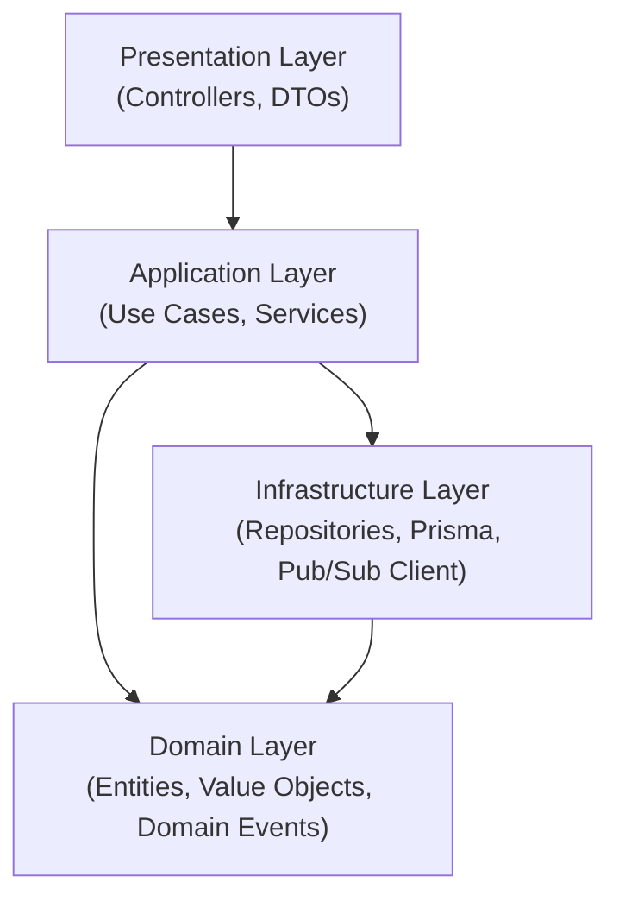

### Áp dụng trong project

| Layer | Thư mục | Chứa gì | Ví dụ |
|---|---|---|---|
| **Presentation** | `src/presentation/` | Controllers, DTOs, validation pipes | `customer.controller.ts`, `create-customer.dto.ts` |
| **Application** | `src/application/` | Use case services, command/query handlers | `customer.service.ts`, `create-customer.command.ts` |
| **Domain** | `src/domain/` | Entities, Value Objects, Domain Events, interfaces | `customer.entity.ts`, `tax-code.vo.ts` |
| **Infrastructure** | `src/infrastructure/` | Repository implementations, Prisma client, Pub/Sub | `customer.repository.ts`, `prisma.service.ts` |

```
customer-service/src/
├── presentation/       # Tầng ngoài cùng — nhận HTTP request
│   ├── controllers/
│   └── dtos/
├── application/        # Tầng điều phối — orchestrate use cases
│   ├── services/
│   └── commands/
├── domain/             # Tầng lõi — business rules, KHÔNG phụ thuộc gì
│   ├── entities/
│   ├── value-objects/
│   └── events/
└── infrastructure/     # Tầng kỹ thuật — DB, external services
    ├── repositories/
    ├── prisma/
    └── pubsub/
```

---

## 2. Repository Pattern — Trừu tượng hóa truy cập dữ liệu

### Giải thích

**Repository Pattern** tạo một lớp trung gian giữa domain logic và data source. Domain layer chỉ biết interface, không biết chi tiết Prisma/SQL.

### Vấn đề nó giải quyết

| Không có Repository | Có Repository |
|---|---|
| `prisma.customer.create()` nằm trong service | Service gọi `repository.save(customer)` |
| Đổi từ Prisma sang TypeORM → sửa toàn bộ | Đổi ORM → chỉ sửa implementation |
| Unit test phải mock Prisma | Unit test mock repository interface |

### Code minh họa

```typescript
// Domain Layer — Interface (what we need)
interface ICustomerRepository {
  findById(id: string): Promise<Customer | null>;
  findAll(filter?: CustomerFilter): Promise<Customer[]>;
  save(customer: Customer): Promise<Customer>;
  delete(id: string): Promise<void>;
}

// Infrastructure Layer — Implementation (how we do it)
class PrismaCustomerRepository implements ICustomerRepository {
  constructor(private prisma: PrismaService) {}

  async findById(id: string): Promise<Customer | null> {
    const data = await this.prisma.customer.findUnique({
      where: { id },
    });
    return data ? CustomerMapper.toDomain(data) : null;
  }

  async save(customer: Customer): Promise<Customer> {
    const data = CustomerMapper.toPersistence(customer);
    const result = await this.prisma.customer.upsert({
      where: { id: customer.id },
      create: data,
      update: data,
    });
    return CustomerMapper.toDomain(result);
  }
}

// Application Layer — Usage (no Prisma dependency)
class CustomerService {
  constructor(private customerRepo: ICustomerRepository) {}

  async getCustomer(id: string): Promise<Customer> {
    const customer = await this.customerRepo.findById(id);
    if (!customer) throw new NotFoundException();
    return customer;
  }
}
```

### Áp dụng trong project

| Service | Repository Interface | Implementation |
|---|---|---|
| Customer | `ICustomerRepository` | `PrismaCustomerRepository` |
| Order | `IOrderRepository` | `PrismaOrderRepository` |
| Inventory | `IInventoryRepository` | `PrismaInventoryRepository` |

---

## 3. Value Object — Đối tượng giá trị

### Giải thích

**Value Object** (Đối tượng giá trị) là object được định danh bởi giá trị, không phải ID. Hai Value Objects bằng nhau nếu tất cả thuộc tính giống nhau. Value Object luôn **immutable** và **self-validating**.

### Vấn đề nó giải quyết

| Dùng string thường | Dùng Value Object |
|---|---|
| `taxCode = "abc"` → hợp lệ (nhưng sai!) | `new TaxCode("abc")` → throw error ngay |
| Validation nằm rải rác nhiều chỗ | Validation nằm trong constructor — 1 chỗ duy nhất |
| Dễ nhầm lẫn kiểu dữ liệu | Type system đảm bảo đúng kiểu |

### Code minh họa — TaxCode Value Object

```typescript
// Domain Layer — Value Object
class TaxCode {
  private readonly value: string;

  constructor(value: string) {
    // Self-validating: validate ngay khi tạo
    if (!TaxCode.isValid(value)) {
      throw new InvalidTaxCodeError(value);
    }
    this.value = value;  // Immutable after creation
  }

  // Vietnamese tax code: 10 digits or 13 digits (10 + "-" + 3)
  static isValid(value: string): boolean {
    return /^\d{10}$/.test(value) || /^\d{10}-\d{3}$/.test(value);
  }

  // Value equality (not reference equality)
  equals(other: TaxCode): boolean {
    return this.value === other.value;
  }

  toString(): string {
    return this.value;
  }
}

// Usage in Entity
class Customer {
  constructor(
    public readonly id: string,
    public readonly businessName: string,
    public readonly taxCode: TaxCode,  // Value Object, not string
  ) {}
}

// ✅ Valid
const customer = new Customer('uuid', 'Công ty ABC', new TaxCode('0123456789'));

// ❌ Throws InvalidTaxCodeError
const bad = new Customer('uuid', 'Công ty XYZ', new TaxCode('invalid'));
```

### Áp dụng trong project

| Service | Value Object | Thuộc tính | Validation |
|---|---|---|---|
| Customer | `TaxCode` | `cores.tax_code` | 10 hoặc 13 chữ số (MST Việt Nam) |

> **Mở rộng tương lai**: Có thể thêm Value Objects cho `Email`, `PhoneNumber`, `Money` (amount + currency).

---

## 4. Aggregate Root — Gốc tổng hợp

### Giải thích

**Aggregate Root** (Gốc tổng hợp) là entity chính quản lý một nhóm entities liên quan. Mọi thao tác trên nhóm entities phải đi qua Aggregate Root — đảm bảo business invariants luôn được giữ.

### Vấn đề nó giải quyết

| Không có Aggregate Root | Có Aggregate Root |
|---|---|
| Thêm order line trực tiếp vào DB | Thêm line qua `order.addLine()` |
| `total_amount` có thể sai với tổng lines | `addLine()` tự tính lại `total_amount` |
| Status không nhất quán | `order.submit()` kiểm tra business rules trước khi đổi status |

### Sơ đồ Aggregate

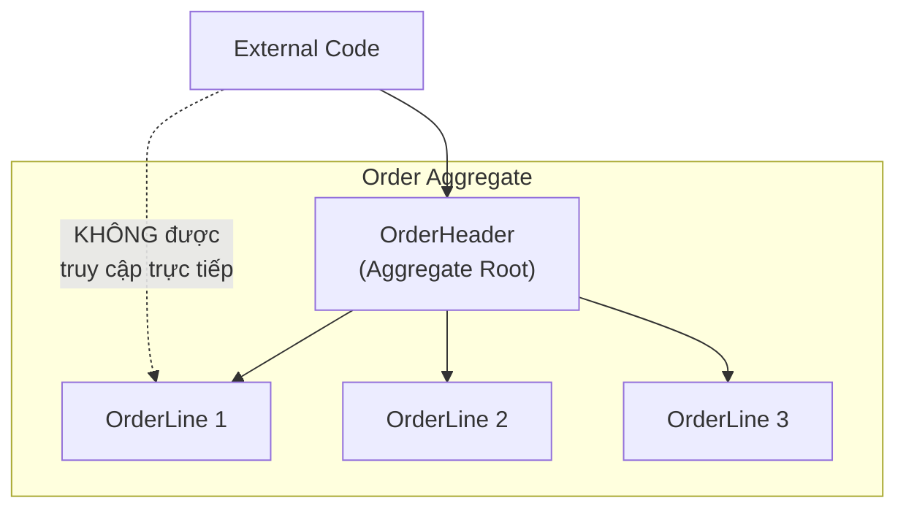

### Code minh họa

```typescript
// Domain Layer — Aggregate Root
class OrderHeader {
  private lines: OrderLine[] = [];
  private _status: OrderStatus = 'draft';
  private _totalAmount: number = 0;

  // Business rule: only add line when draft
  addLine(itemId: string, itemName: string, quantity: number, unitPrice: number): void {
    if (this._status !== 'draft') {
      throw new OrderNotEditableError(this.id, this._status);
    }

    const line = new OrderLine(uuid(), this.id, itemId, itemName, quantity, unitPrice);
    this.lines.push(line);

    // Invariant: total_amount always equals sum of line_totals
    this.recalculateTotal();
  }

  removeLine(lineId: string): void {
    if (this._status !== 'draft') {
      throw new OrderNotEditableError(this.id, this._status);
    }

    this.lines = this.lines.filter(l => l.id !== lineId);
    this.recalculateTotal();
  }

  // Business rule: must have at least 1 line to submit
  submit(userId: string): void {
    if (this._status !== 'draft') {
      throw new InvalidStatusTransitionError('draft', this._status);
    }
    if (this.lines.length === 0) {
      throw new EmptyOrderError(this.id);
    }

    this._status = 'submitted';
    this.addDomainEvent(new OrderSubmittedEvent(this));
  }

  confirm(): void {
    if (this._status !== 'submitted') {
      throw new InvalidStatusTransitionError('submitted', this._status);
    }
    this._status = 'confirmed';
    this.addDomainEvent(new OrderConfirmedEvent(this));
  }

  cancel(reason: string): void {
    if (!['submitted', 'confirmed'].includes(this._status)) {
      throw new InvalidStatusTransitionError('submitted|confirmed', this._status);
    }
    this._status = 'cancelled';
    this._cancelReason = reason;
    this.addDomainEvent(new OrderCancelledEvent(this));
  }

  private recalculateTotal(): void {
    this._totalAmount = this.lines.reduce(
      (sum, line) => sum + line.lineTotal, 0
    );
  }
}
```

### Áp dụng trong project

| Service | Aggregate Root | Child Entities | Invariants |
|---|---|---|---|
| Order | `OrderHeader` | `OrderLine[]` | total = Σ line_totals; chỉ sửa khi draft; ≥1 line để submit |

---

## 5. Outbox Pattern — Transactional Event Publishing

### Giải thích

**Outbox Pattern** giải quyết vấn đề **Dual Write** — khi cần ghi DB và publish event cùng lúc mà đảm bảo cả 2 đều thành công hoặc đều không xảy ra.

### Vấn đề nó giải quyết

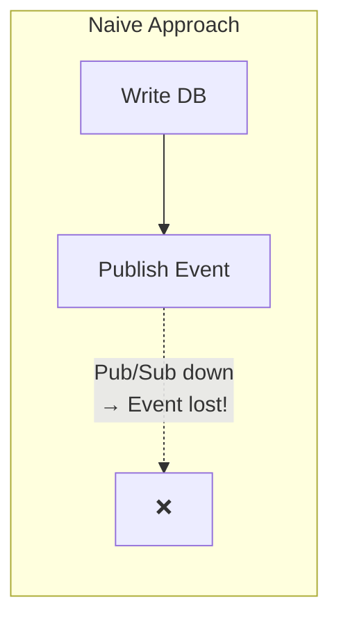

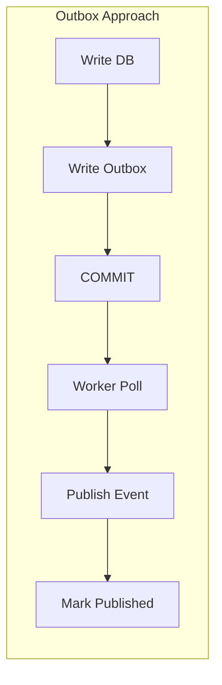

### Code minh họa

```typescript
// Application Layer — Write data + outbox in same transaction
class CustomerService {
  async createCustomer(command: CreateCustomerCommand): Promise<Customer> {
    return this.prisma.$transaction(async (tx) => {
      // 1. Write business data
      const customer = await tx.cores.create({
        data: {
          id: uuid(),
          businessName: command.businessName,
          taxCode: command.taxCode,
          status: 'prospect',
          creditLimitAmount: command.creditLimit,
          creditUsedAmount: 0,
        },
      });

      // 2. Write outbox (same transaction!)
      await tx.outbox.create({
        data: {
          id: uuid(),
          aggregateType: 'Customer',
          aggregateId: customer.id,
          eventType: 'customer.created',
          payload: {
            customerId: customer.id,
            businessName: customer.businessName,
            taxCode: customer.taxCode,
          },
          // published_at = null → pending
        },
      });

      return customer;
    });
    // If transaction fails → BOTH rollback → no ghost events
    // If transaction succeeds → BOTH committed → worker will publish
  }
}
```

### Áp dụng trong project

| Service | Outbox Table | Events |
|---|---|---|
| Customer | `customer.outbox` | `customer.created`, `customer.updated` |
| Order | `order.outbox` | `order.submitted`, `order.confirmed`, `order.cancelled` |
| Inventory | `inventory.outbox` | `inventory.reserved`, `inventory.reservation-failed` |

### Implementation trong `@erp/shared`

Outbox Worker là **generic** — logic poll/publish/mark giống hệt mọi service. Thay vì copy-paste, `@erp/shared` cung cấp:

| Export | Vai trò |
|---|---|
| `OutboxWorkerService` | Worker generic: poll mỗi 2s, batch 10, publish qua `PubSubPublisher`, đánh dấu published |
| `OutboxStore` (interface) | Port trừu tượng — service tự implement adapter Prisma cho schema riêng |
| `OutboxRecord` (interface) | Chuẩn hoá 1 bản ghi outbox (id, eventType, payload, aggregateId, aggregateType) |
| `OUTBOX_STORE` (DI token) | NestJS injection token — service bind implementation vào đây |

```typescript
// Service cung cấp adapter Prisma cho schema riêng
@Module({
  providers: [
    {
      provide: OUTBOX_STORE,
      useFactory: (prisma: PrismaService) => ({
        async fetchUnpublished(limit: number) {
          return prisma.outbox.findMany({
            where: { publishedAt: null },
            orderBy: { createdAt: 'asc' },
            take: limit,
          });
        },
        async markPublished(id: string) {
          await prisma.outbox.update({
            where: { id },
            data: { publishedAt: new Date() },
          });
        },
      }),
      inject: [PrismaService],
    },
    OutboxWorkerService,
  ],
})
export class MessagingModule {}
```

**Dependency Inversion (SOLID "D")**: Worker không biết Prisma. Mỗi service tự cung cấp adapter nhỏ implement `OutboxStore` → worker dùng được với mọi schema.

---

## 6. Event-Driven Architecture — Kiến trúc hướng sự kiện

### Giải thích

**Event-Driven Architecture** (EDA — Kiến trúc hướng sự kiện) là kiến trúc mà các services giao tiếp bằng events (sự kiện) thay vì gọi trực tiếp. Service A publish event, Service B subscribe và xử lý — hai bên không biết nhau.

### Vấn đề nó giải quyết

| Request-Driven | Event-Driven |
|---|---|
| A gọi B, B gọi C → chain of calls | A publish event, B & C subscribe độc lập |
| B down → A cũng fail | B down → event nằm trong queue, xử lý sau |
| Thêm service D vào chain → sửa code A | Thêm service D → chỉ thêm subscription |
| Synchronous (blocking) | Asynchronous (non-blocking) |

### Sơ đồ

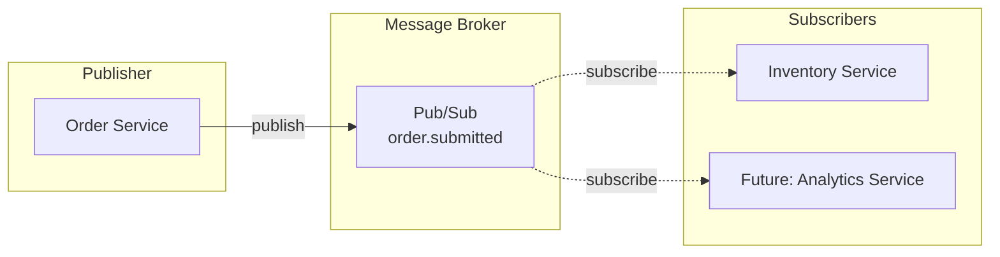

### Áp dụng trong project

| Luồng | Publisher | Event | Subscriber | Hành động |
|---|---|---|---|---|
| Order → Reserve | Order | `order.submitted` | Inventory | Reserve stock |
| Reserve → Confirm | Inventory | `inventory.reserved` | Order | Continue saga → credit check |
| Reserve → Fail | Inventory | `inventory.reservation-failed` | Order | Mark order failed |
| Cancel → Release | Order | `order.cancelled` | Inventory | Release stock |

### PubSubPublisher trong `@erp/shared`

`PubSubPublisher` (injectable) lo kỹ thuật publish, tách khỏi Outbox Worker (Single Responsibility):

| Tính năng | Chi tiết |
|---|---|
| **Topic auto-creation** | Lần đầu gặp topic → `topic.exists()` → nếu chưa có thì `topic.create()` |
| **Topic cache** (`ensuredTopics`) | Sau lần đầu, publish thẳng — không gọi `exists()` lại |
| **Zero-config GCP** | Dev: tự kết nối emulator qua `PUBSUB_EMULATOR_HOST`. Production: bỏ env → kết nối Pub/Sub thật, không đổi code |
| **Serialization** | Payload → `JSON.stringify()` → `Buffer` → Pub/Sub message |

---

## 7. CQRS — Command Query Responsibility Segregation

### Giải thích

**CQRS** (Tách biệt trách nhiệm Command và Query) tách model đọc (read) và model ghi (write) thành 2 cấu trúc riêng. Write model tối ưu cho business operations, Read model tối ưu cho display.

### Vấn đề nó giải quyết

| Chung 1 model | CQRS (2 models) |
|---|---|
| Query listing phải JOIN 3–4 bảng | Read model đã denormalize sẵn |
| Slow query trên data lớn | Read model chỉ SELECT 1 bảng |
| Index cho read ảnh hưởng write performance | Tách index riêng cho mỗi model |

### Sơ đồ

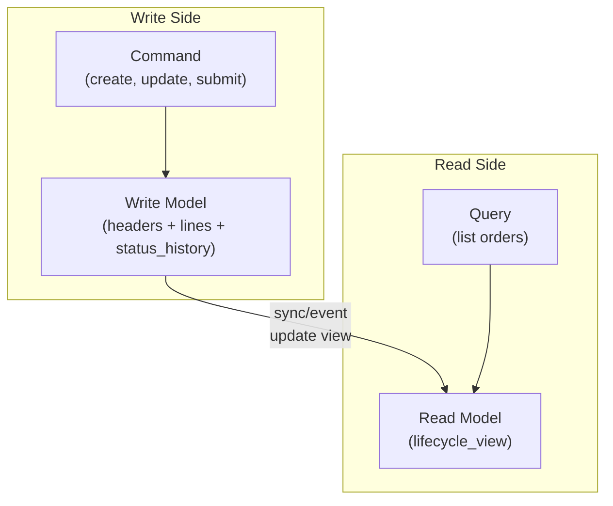

### Code minh họa

```typescript
// Write model — normalized (3 tables)
// headers: id, customer_id, status, total_amount
// lines: id, header_id, item_id, quantity, unit_price
// status_history: id, header_id, from_status, to_status

// Read model — denormalized (1 view/table)
// lifecycle_view: order_id, customer_name, status, total_amount,
//                 line_count, created_at, last_status_change

// Query on Read Model — fast, no JOINs
class OrderQueryService {
  async getOrderList(filter: OrderFilter): Promise<OrderListItem[]> {
    return this.prisma.lifecycleView.findMany({
      where: {
        status: filter.status,
        createdAt: { gte: filter.fromDate },
      },
      orderBy: { createdAt: 'desc' },
      take: filter.pageSize,
      skip: filter.page * filter.pageSize,
    });
  }
}

// Sync Write → Read (after status change)
class OrderService {
  async submitOrder(id: string): Promise<void> {
    await this.prisma.$transaction(async (tx) => {
      // Write model update
      await tx.headers.update({
        where: { id },
        data: { status: 'submitted' },
      });

      // Read model sync
      await tx.lifecycleView.update({
        where: { orderId: id },
        data: {
          status: 'submitted',
          lastStatusChange: new Date(),
        },
      });
    });
  }
}
```

### Áp dụng trong project

| Service | Write Model | Read Model | Sync Mechanism |
|---|---|---|---|
| Order | `headers` + `lines` + `status_history` | `lifecycle_view` | Transaction-based (cùng DB) |

---

## 8. Saga — Điều phối giao dịch phân tán

### Giải thích

**Saga** (Truyện kể — mượn nghĩa "chuỗi sự kiện") là pattern quản lý distributed transaction bằng chuỗi local transactions. Nếu một bước thất bại, Saga thực hiện **compensating transactions** (giao dịch đền bù) để hoàn tác các bước trước.

### Vấn đề nó giải quyết

| 2-Phase Commit | Saga |
|---|---|
| Lock tất cả resources → slow | Mỗi bước commit riêng → fast |
| Tất cả services phải online | Dùng events → async, fault-tolerant |
| ACID guarantee | Eventual consistency (đủ tốt cho hầu hết use cases) |

### Sơ đồ Saga Steps

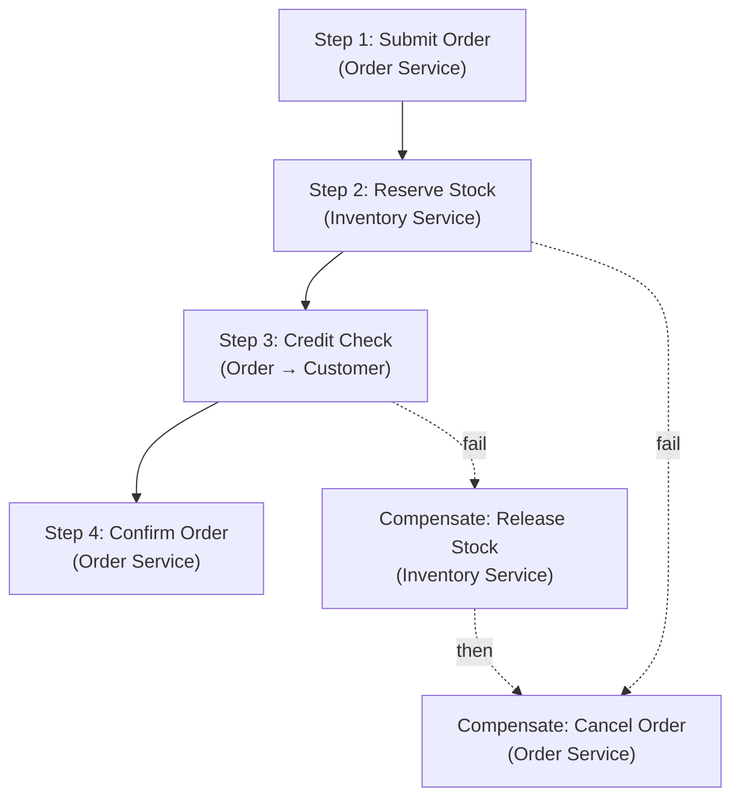

### Áp dụng trong project

| Step | Service | Forward Action | Compensating Action | Trigger |
|---|---|---|---|---|
| 1 | Order | Submit → status=`submitted` | — | User API call |
| 2 | Inventory | Reserve stock | Release stock | Event `order.submitted` |
| 3 | Order→Customer | HTTP credit-check | — (read-only) | Event `inventory.reserved` |
| 4 | Order | Confirm → status=`confirmed` | Cancel order | Credit check result |

**Chi tiết Saga:** Xem [event-flows.md](event-flows.md) để xem sequence diagrams đầy đủ cho happy path và compensation paths.

---

## 9. Optimistic Locking — Khóa lạc quan

### Giải thích

**Optimistic Locking** (Khóa lạc quan) là kỹ thuật xử lý concurrent update bằng cách dùng column `version`. Thay vì lock row (pessimistic), ta kiểm tra version khi update — nếu version đã thay đổi (ai đó update trước), ta retry.

### Vấn đề nó giải quyết

| Pessimistic Lock | Optimistic Lock |
|---|---|
| `SELECT ... FOR UPDATE` — lock row | Không lock, check version khi update |
| Block concurrent readers | Readers không bị block |
| Deadlock risk với nhiều rows | Không deadlock |
| Phù hợp: high contention | Phù hợp: low-medium contention (prototype) |

### Code minh họa

```typescript
// Infrastructure Layer — Optimistic Locking
class InventoryRepository {
  async reserveStock(
    itemId: string,
    warehouseId: string,
    quantity: number,
    expectedVersion: number,
  ): Promise<boolean> {
    // UPDATE with version check
    const result = await this.prisma.$executeRaw`
      UPDATE inventory.stock_levels
      SET
        reserved_quantity = reserved_quantity + ${quantity},
        version = version + 1,
        updated_at = NOW()
      WHERE item_id = ${itemId}
        AND warehouse_id = ${warehouseId}
        AND on_hand_quantity - reserved_quantity >= ${quantity}
        AND version = ${expectedVersion}
    `;

    // result = number of rows affected
    // 0 → version mismatch (someone updated first) or insufficient stock
    // 1 → success
    return result === 1;
  }
}

// Application Layer — Retry on version conflict
class StockService {
  async reserveWithRetry(
    itemId: string,
    warehouseId: string,
    quantity: number,
    maxRetries = 3,
  ): Promise<void> {
    for (let attempt = 1; attempt <= maxRetries; attempt++) {
      // Read current version
      const stock = await this.repo.getStockLevel(itemId, warehouseId);

      // Try update with expected version
      const success = await this.repo.reserveStock(
        itemId, warehouseId, quantity, stock.version,
      );

      if (success) return;

      // Version conflict — retry
      if (attempt === maxRetries) {
        throw new ConcurrentUpdateError(itemId);
      }
    }
  }
}
```

### Áp dụng trong project

| Service | Table | Version Column | Khi nào |
|---|---|---|---|
| Inventory | `stock_levels` | `version` | Reserve stock, release stock, inbound, outbound |

**Luồng hoạt động:**

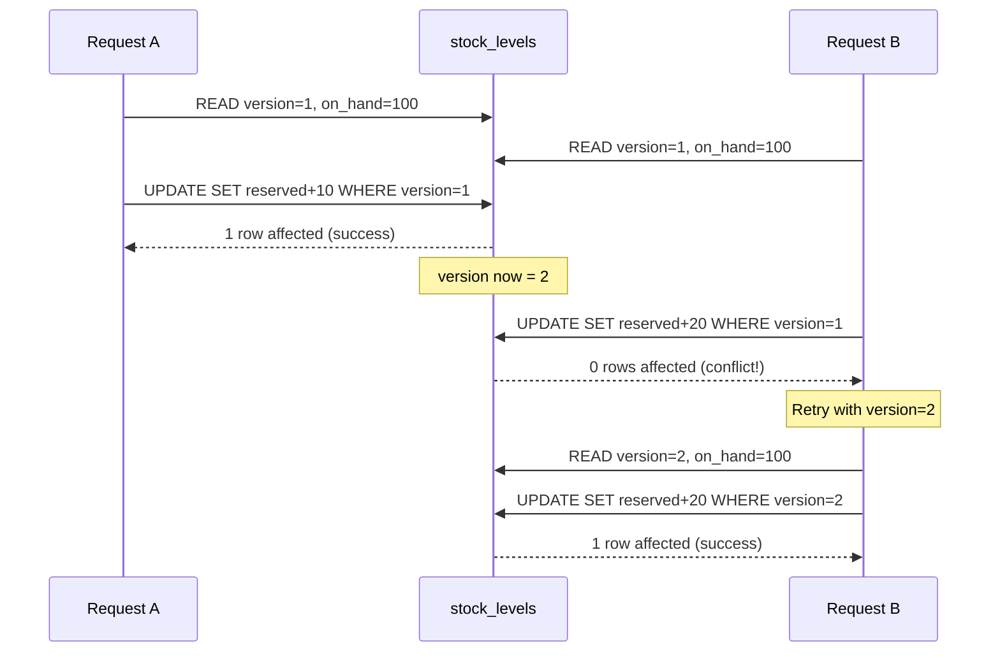

---

## 10. API Gateway — Cổng API duy nhất

### Giải thích

**API Gateway** là service đóng vai trò "cổng duy nhất" cho tất cả requests từ frontend. Thay vì frontend gọi trực tiếp 4 services, frontend chỉ gọi 1 Gateway → Gateway route đến service phù hợp.

### Vấn đề nó giải quyết

| Không có Gateway | Có Gateway |
|---|---|
| Frontend phải biết URL của 4 services | Frontend chỉ biết 1 URL (`:3010`) |
| Auth check lặp lại ở mỗi service | Auth check 1 lần tại Gateway |
| CORS config 4 chỗ | CORS config 1 chỗ |
| Rate limiting 4 chỗ | Rate limiting 1 chỗ |

### Sơ đồ

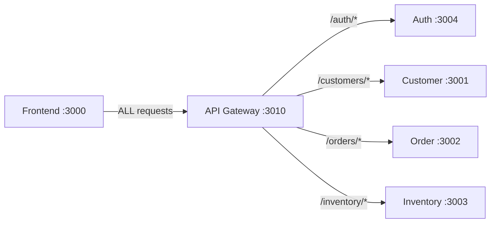

### Trách nhiệm của Gateway

| # | Trách nhiệm | Chi tiết |
|---|---|---|
| 1 | **Routing** | Map URL path → target service |
| 2 | **Authentication** | Verify JWT token |
| 3 | **Authorization** | Check role against route config (RBAC) |
| 4 | **Header injection** | Thêm `x-user-id`, `x-user-role` |
| 5 | **CORS** | Cho phép frontend domain |
| 6 | **Error standardization** | Trả error format thống nhất |

### Áp dụng trong project

| Thuộc tính | Chi tiết |
|---|---|
| Service | `api-gateway` |
| Port | `:3010` |
| Framework | NestJS |
| JWT library | `jsonwebtoken` |
| Proxy | `http-proxy-middleware` hoặc NestJS `HttpService` |

---

## 11. RBAC + JWT — Phân quyền dựa trên vai trò

### Giải thích

**RBAC** (Role-Based Access Control — Kiểm soát truy cập dựa trên vai trò) kết hợp với **JWT** (JSON Web Token) tạo thành hệ thống auth hoàn chỉnh: JWT xác thực danh tính (ai?), RBAC kiểm tra quyền hạn (được làm gì?).

### Vấn đề nó giải quyết

| Session-based Auth | JWT + RBAC |
|---|---|
| Server phải lưu session | Stateless — token chứa thông tin |
| Scale khó (session replication) | Scale dễ (verify token ở bất kỳ instance) |
| Permission check per-user phức tạp | Group permissions bằng role — đơn giản |

### Sơ đồ kết hợp

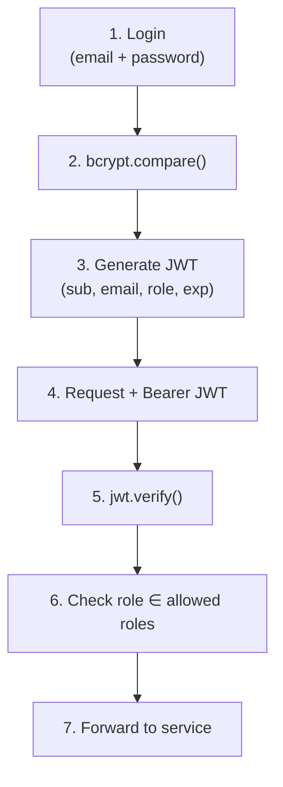

### 3 Roles

| Role | Quyền | Mô tả |
|---|---|---|
| `admin` | Toàn quyền | Quản lý users, toàn bộ nghiệp vụ |
| `manager` | Nghiệp vụ | Submit/cancel/confirm orders, nhập/xuất kho |
| `staff` | Cơ bản | Tạo mới + xem, không sửa/xóa/submit |

### Áp dụng trong project

| Component | Service | Chi tiết |
|---|---|---|
| Password hashing | Auth Service | `bcrypt` với salt rounds = 10 |
| JWT signing | Auth Service | `jsonwebtoken.sign()` với secret |
| JWT verification | API Gateway | `jsonwebtoken.verify()` |
| Role checking | API Gateway | Match role against route config |
| Role storage | Auth Service DB | `auth.users.role` column |

**Chi tiết RBAC:** Xem [rbac.md](rbac.md) để xem permission matrix đầy đủ cho tất cả endpoints.

---

## 12. Idempotent Consumer — Xử lý message trùng lặp

### Giải thích

**Idempotent Consumer** (Consumer lũy đẳng) đảm bảo rằng dù message được gửi đến **nhiều hơn 1 lần**, consumer chỉ **xử lý đúng 1 lần**. Đây là pattern bắt buộc khi dùng message broker vì không có broker nào đảm bảo exactly-once delivery cho side-effects bên ngoài.

### Vấn đề nó giải quyết

| Không có Idempotency | Có Idempotent Consumer |
|---|---|
| Message `order.submitted` đến 2 lần → reserve stock **gấp đôi** | Message đến 2 lần → chỉ reserve **1 lần** |
| Pub/Sub redeliver khi ack timeout → xử lý trùng | Redeliver → phát hiện đã xử lý → bỏ qua |
| Outbox worker crash → publish lại → duplicate | Worker publish lại → consumer dedup → an toàn |

### Cơ chế Dedup bằng Redis

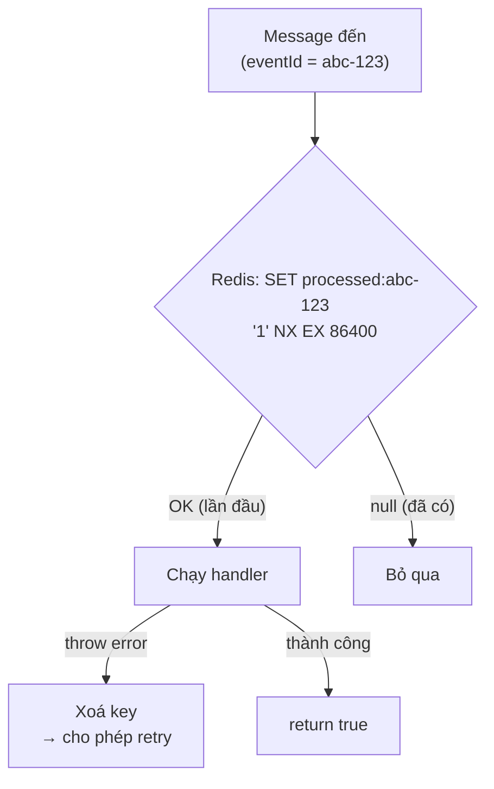

- **`NX`** (Not eXists): chỉ set nếu key chưa tồn tại → atomic race-safe
- **`EX 86400`**: tự expire sau 1 ngày → không phình Redis vô hạn
- **Retry-safe**: nếu handler throw → xoá key → Pub/Sub redeliver → xử lý lại

### Code minh họa

```typescript
import { withIdempotency } from '@erp/shared';

// Trong event subscriber:
async handleOrderSubmitted(message: Message): Promise<void> {
  const payload = JSON.parse(message.data.toString());
  const eventId = payload._meta?.eventId ?? message.id;

  const processed = await withIdempotency(
    this.redis,
    eventId,
    async () => {
      // Business logic — chỉ chạy đúng 1 lần
      await this.reserveStock(payload);
    },
  );

  if (!processed) {
    this.logger.debug(`Event ${eventId} đã xử lý trước đó — bỏ qua`);
  }

  message.ack();
}
```

### Áp dụng trong project

| Service | Dùng khi | eventId lấy từ |
|---|---|---|
| Inventory | Nhận `order.submitted`, `order.cancelled` | `payload._meta.eventId` hoặc `message.id` |
| Order | Nhận `inventory.reserved`, `inventory.reservation-failed` | `payload._meta.eventId` hoặc `message.id` |

> **Liên hệ Outbox**: Outbox đảm bảo event **chắc chắn được gửi** (reliability ở producer). Idempotent Consumer đảm bảo event **chỉ xử lý 1 lần** (safety ở consumer). Hai pattern **bổ trợ nhau**.

---

## 13. Cache-Aside — Cache lazy loading

### Giải thích

**Cache-Aside** (Lazy Loading Cache) là strategy mà application tự quản lý cache: đọc cache trước, nếu miss thì đọc DB rồi ghi vào cache. Khi data thay đổi, application invalidate cache.

### Vấn đề nó giải quyết

| Không có Cache | Có Cache-Aside |
|---|---|
| Mỗi request → query DB | Request lặp lại → trả từ cache (~1ms) |
| DB chịu tải toàn bộ read | DB chỉ chịu cache miss |
| Latency cao cho data ít thay đổi | Latency thấp, TTL tự expire |

### Sơ đồ

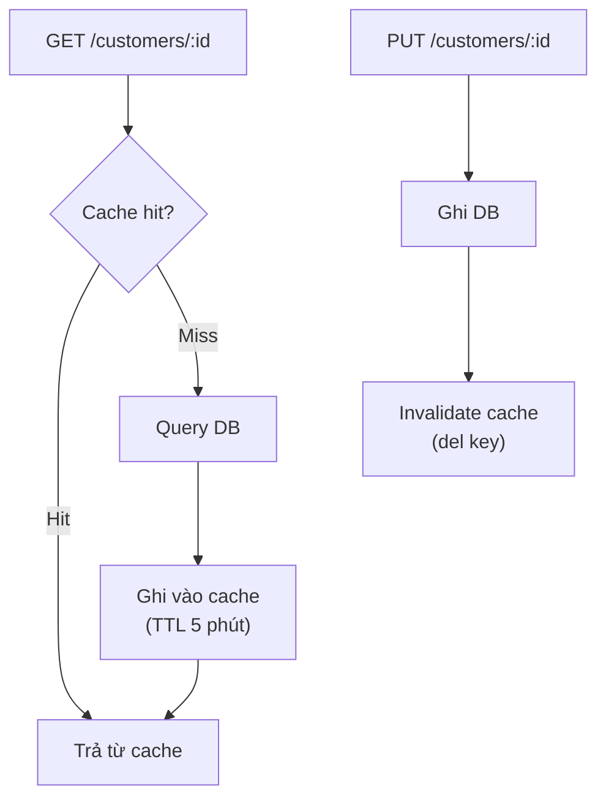

### Code minh họa

```typescript
import { RedisCacheService } from '@erp/shared';

class CustomerQueryService {
  constructor(
    private cache: RedisCacheService,
    private repo: ICustomerRepository,
  ) {}

  // READ — Cache-Aside
  async getCustomer(id: string): Promise<Customer> {
    const cacheKey = `customer:${id}`;

    // 1. Check cache
    const cached = await this.cache.get<Customer>(cacheKey);
    if (cached) return cached;

    // 2. Cache miss → query DB
    const customer = await this.repo.findById(id);
    if (!customer) throw new NotFoundException();

    // 3. Populate cache (TTL 300s)
    await this.cache.set(cacheKey, customer);
    return customer;
  }

  // WRITE — Invalidate
  async updateCustomer(id: string, data: UpdateDto): Promise<Customer> {
    const updated = await this.repo.save(id, data);

    // Invalidate cache cũ
    await this.cache.del(`customer:${id}`);
    // Invalidate search results liên quan
    await this.cache.invalidatePattern('customers:search:*');

    return updated;
  }
}
```

### API Reference — `RedisCacheService`

| Method | Mô tả | Khi nào dùng |
|---|---|---|
| `get<T>(key)` | Đọc cache, trả `T \| null` | Đầu mỗi read operation |
| `set(key, value, ttl?)` | Ghi cache với TTL (mặc định 300s) | Sau khi query DB thành công |
| `del(key)` | Xoá 1 key | Sau write operation (invalidate) |
| `invalidatePattern(pattern)` | Xoá nhiều key theo glob pattern (dùng SCAN) | Invalidate search/list cache |
| `getClient()` | Trả client Redis thô | Dùng cho `withIdempotency()` |
| `ping()` | Health check Redis | Dùng trong `HealthController` |

> **Lưu ý**: Cache lỗi **không crash app** — tất cả method catch error, log warning, và fallback (trả `null` hoặc skip). Cache là tối ưu, không phải yêu cầu.

### Áp dụng trong project

| Service | Cache key pattern | TTL | Invalidate khi |
|---|---|---|---|
| Customer | `customer:{id}`, `customers:search:*` | 300s | Create, update, delete |
| Order | `order:{id}` | 300s | Status change |
| Inventory | `stock:{itemId}:{warehouseId}` | 60s | Reserve, release, inbound, outbound |

---

## 14. Observability Primitives — Truy vết, log, health, metrics

### Giải thích

**Observability** là khả năng hiểu hệ thống đang hoạt động thế nào từ bên ngoài. Trong microservices, 1 request đi qua nhiều services → cần 4 primitives để theo dõi.

### Vấn đề nó giải quyết

| Không có Observability | Có Observability |
|---|---|
| Log text thường, không biết thuộc request nào | JSON log có `correlationId` → grep 1 ID thấy cả saga |
| `console.log()` → không cấu trúc | Structured logger → dễ filter trong ELK/Loki |
| Không biết service health | `/health` → orchestrator tự biết service nào down |
| Không biết throughput/latency | `/metrics` → Prometheus scrape → Grafana dashboard |

### 4 Thành phần

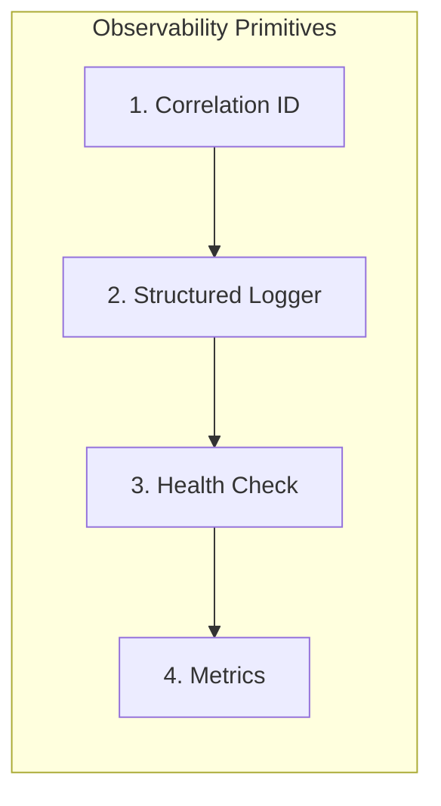

### 14.1. Correlation ID — Truy vết xuyên service

Mỗi request/luồng nghiệp vụ được gắn 1 `correlationId` duy nhất. ID này lan truyền qua HTTP headers và event metadata → grep 1 ID thấy toàn bộ lifecycle xuyên 4 services.

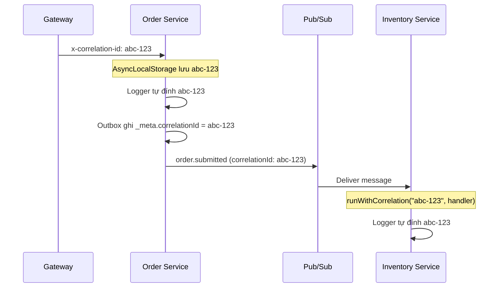

**Cơ chế**: `AsyncLocalStorage` (Node.js) — "biến toàn cục theo ngữ cảnh async". Mỗi request chạy trong store riêng chứa `correlationId`; mọi code async bên trong (kể cả logger) đọc được ID đó mà KHÔNG cần truyền tay qua từng hàm.

| Export | Vai trò |
|---|---|
| `CorrelationMiddleware` | NestJS middleware: đọc `x-correlation-id` từ header (hoặc sinh UUID mới) → chạy request trong ngữ cảnh |
| `getCorrelationId()` | Lấy correlationId hiện tại (gọi ở bất kỳ đâu trong request) |
| `runWithCorrelation(id, fn)` | Chạy `fn` trong ngữ cảnh có correlationId — dùng ở event subscriber |
| `CORRELATION_HEADER` | Tên header: `x-correlation-id` |

### 14.2. Structured Logger — JSON log có correlationId

```typescript
// Output mỗi dòng log:
{"level":"info","time":"2025-01-15T10:30:00Z","context":"OrderService","correlationId":"abc-123","msg":"Order submitted"}
```

| Tính năng | Chi tiết |
|---|---|
| JSON format | Dễ parse bằng ELK, Loki, CloudWatch |
| Auto correlationId | Tự lấy từ `AsyncLocalStorage` — không cần truyền tay |
| NestJS compatible | Implement `LoggerService` → `app.useLogger(new StructuredLogger())` |
| Stream tách biệt | `error`/`warn` → stderr, còn lại → stdout |

### 14.3. Health Check — Endpoint `/health`

```json
// GET /health → 200
{"status":"ok","time":"2025-01-15T10:30:00Z","checks":[{"name":"postgres","ok":true},{"name":"redis","ok":true}]}

// GET /health → 503 (khi dependency down)
{"status":"down","time":"2025-01-15T10:30:00Z","checks":[{"name":"postgres","ok":true},{"name":"redis","ok":false}]}
```

**Dependency Inversion**: `HealthController` KHÔNG biết Prisma/Redis cụ thể. Service đăng ký mảng `HealthIndicator` (mỗi cái 1 hàm `check()`) qua token `HEALTH_INDICATORS`.

```typescript
// Service đăng ký health indicators
@Module({
  providers: [
    {
      provide: HEALTH_INDICATORS,
      useFactory: (prisma: PrismaService, redis: RedisCacheService) => [
        { name: 'postgres', check: () => prisma.$queryRaw`SELECT 1`.then(() => true) },
        { name: 'redis', check: () => redis.ping() },
      ],
      inject: [PrismaService, RedisCacheService],
    },
    HealthController,
  ],
})
export class HealthModule {}
```

### 14.4. Metrics — Counter/Gauge + Prometheus

```
# GET /metrics → text/plain (Prometheus exposition format)
# HELP events_published_total events_published_total
# TYPE events_published_total counter
events_published_total{event="customer.created"} 42

# HELP outbox_pending outbox_pending
# TYPE outbox_pending gauge
outbox_pending 3
```

| Export | Vai trò |
|---|---|
| `MetricsService` | Registry: `inc(name, labels)` cho counter, `setGauge(name, value)` cho gauge |
| `MetricsController` | Endpoint `GET /metrics` trả Prometheus text format |

| Metric quan trọng | Type | Ý nghĩa |
|---|---|---|
| `events_published_total` | counter | Số event đã publish (theo event type) |
| `events_consumed_total` | counter | Số event đã xử lý |
| `events_publish_failed_total` | counter | Số event publish thất bại |
| `outbox_pending` | gauge | Số event tồn đọng trong outbox (chưa publish) |

### Áp dụng trong project

| Primitive | Dùng bởi | Setup |
|---|---|---|
| CorrelationMiddleware | Tất cả services | `app.use(CorrelationMiddleware)` |
| StructuredLogger | Tất cả services | `app.useLogger(new StructuredLogger())` |
| HealthController | Tất cả services | Bind `HEALTH_INDICATORS` trong module |
| MetricsService | Tất cả services | Inject + gọi `inc()`/`setGauge()` tại các điểm quan trọng |

---

## Tổng hợp — Patterns × Services

| Pattern | Auth | Customer | Order | Inventory | Gateway | `@erp/shared` |
|---|:---:|:---:|:---:|:---:|:---:|:---:|
| DDD Layers | — | ✅ | ✅ | ✅ | — | — |
| Repository | — | ✅ | ✅ | ✅ | — | — |
| Value Object | — | ✅ | — | — | — | — |
| Aggregate Root | — | — | ✅ | — | — | — |
| Outbox | — | ✅ | ✅ | ✅ | — | ✅ Worker generic |
| Event-Driven | — | ✅ | ✅ | ✅ | — | ✅ PubSubPublisher |
| CQRS | — | — | ✅ | — | — | — |
| Saga | — | — | ✅ | ✅ | — | — |
| Optimistic Lock | — | — | — | ✅ | — | — |
| API Gateway | — | — | — | — | ✅ | — |
| RBAC + JWT | ✅ | — | — | — | ✅ | — |
| Idempotent Consumer | — | — | ✅ | ✅ | — | ✅ `withIdempotency()` |
| Cache-Aside | — | ✅ | ✅ | ✅ | — | ✅ `RedisCacheService` |
| Observability | ✅ | ✅ | ✅ | ✅ | ✅ | ✅ 4 primitives |

---

Liên quan: [system-overview](system-overview.md) · [bounded-contexts](bounded-contexts.md) · [data-model](data-model.md) · [event-flows](event-flows.md) · [rbac](rbac.md)
