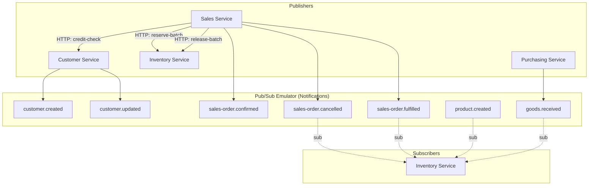
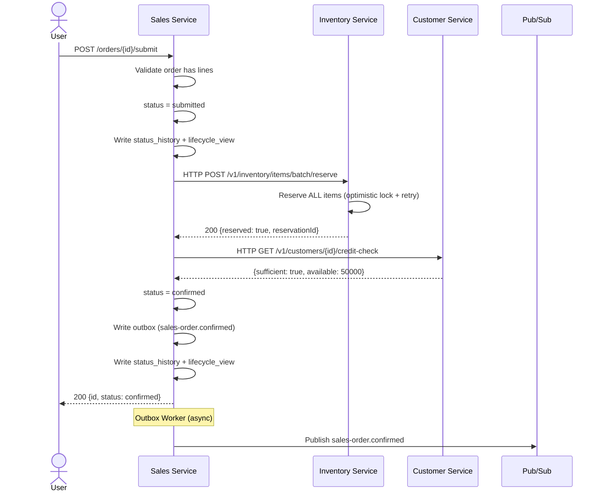
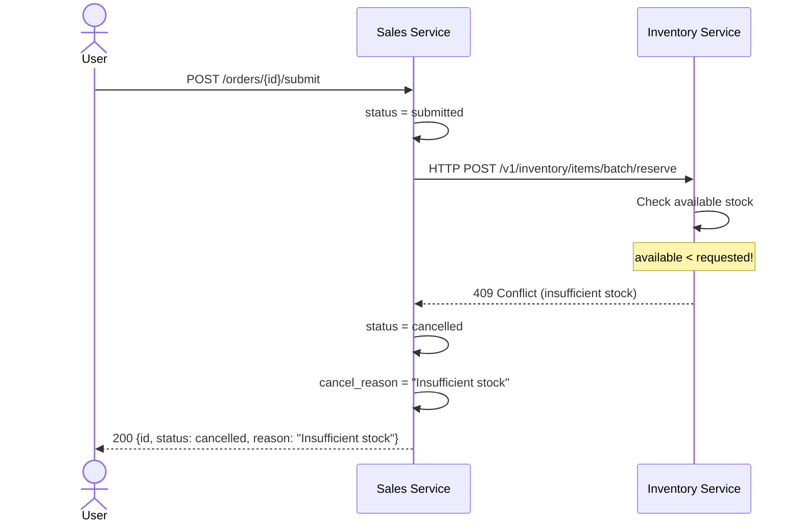
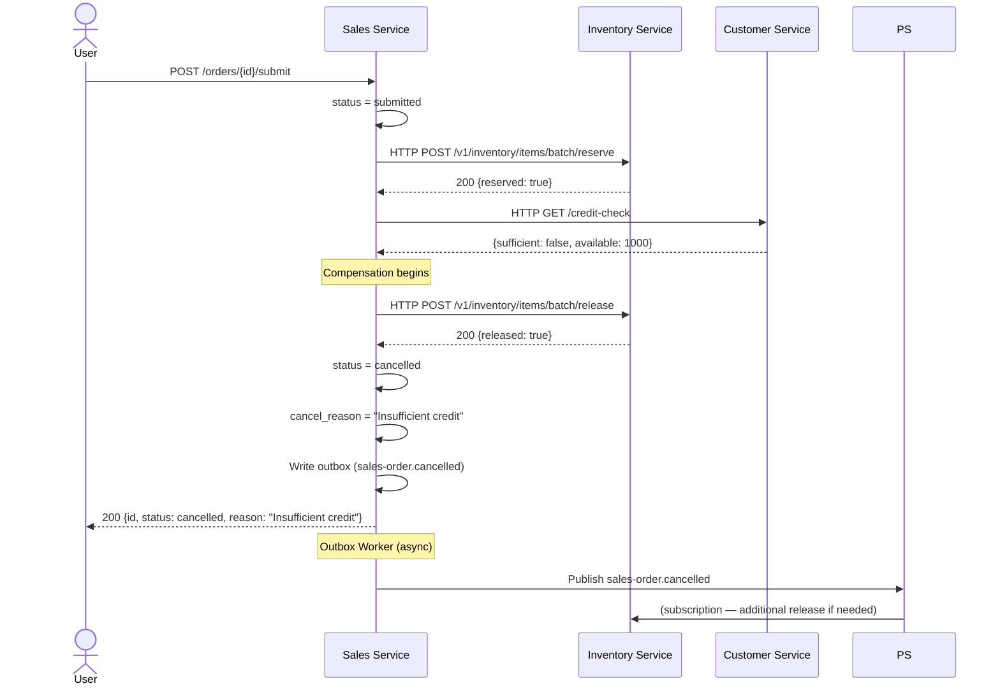
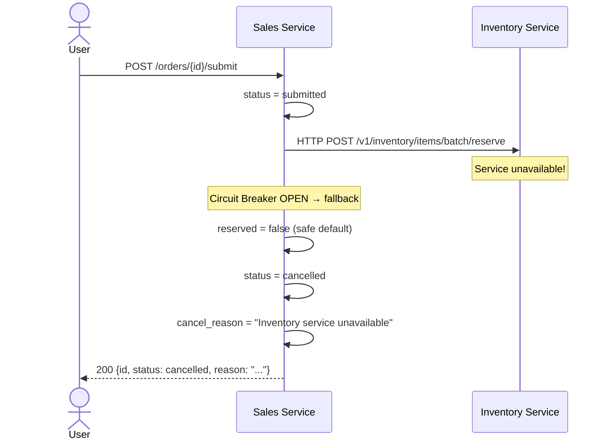

---
type: System Component
title: "Event Flows & Saga"
description: "Event-driven architecture: Pub/Sub topics, event envelope, Outbox worker, Saga choreography, and idempotent consumer"
tags: [system, component, event-driven, saga, outbox]
timestamp: "2026-06-25T00:00:00+07:00"
---

# Event Flows — Luồng sự kiện

> ✅ **Đã implement đầy đủ.** Outbox + Pub/Sub + Saga choreography (sales ↔ inventory ↔ customer) đã chạy ổn định. Xem [Implementation Status](../IMPLEMENTATION-STATUS.md).

> Tài liệu mô tả toàn bộ luồng event trong hệ thống ERP Prototype: Pub/Sub topics, event payload schemas, Saga orchestration, và Outbox pattern.
> Liên quan: [system-overview](system-overview.md) · [bounded-contexts](bounded-contexts.md) · [data-model](data-model.md) · [design-patterns](design-patterns.md)

---

## 0. Event Envelope (CHUẨN — đã implement ở `@erp/shared`)

Mọi message publish lên Pub/Sub được bọc trong **envelope versioned** (xem `EventEnvelope` trong `@erp/shared/contracts/events.ts`):

```jsonc
{
  "eventId": "uuid-cua-dong-outbox",   // KHOÁ DEDUP ổn định cho consumer
  "eventType": "customer.created",      // = tên topic
  "eventVersion": 1,                    // tiến hoá schema không phá consumer cũ
  "occurredAt": "2026-06-19T07:00:00.000Z",
  "correlationId": "uuid-truy-vet",     // grep cả vòng đời xuyên service
  "payload": { /* dữ liệu nghiệp vụ — xem từng event bên dưới */ }
}
```

- `eventId` (= id dòng `outbox`) cũng được gắn vào **Pub/Sub message attributes** → consumer dedup/route mà không cần parse body.
- **Idempotent Consumer:** consumer BẮT BUỘC gọi `withIdempotency(redis, envelope.eventId, handler)` — Pub/Sub là at-least-once và outbox có thể publish lại cùng `eventId`.
- **Retry/DLQ:** outbox worker tăng `attempts` khi publish lỗi, chuyển dead-letter sau `MAX_ATTEMPTS` (xem [ADR-009](../overview/tech-decisions.md)).

> Các "payload contract" mô tả ở các mục dưới là phần **`payload`** bên trong envelope này.

---

## 1. Tổng quan Event-Driven Architecture

Hệ thống sử dụng **GCP Pub/Sub Emulator** (chạy trong Docker, port `:8085`) làm message broker. Các service giao tiếp bất đồng bộ qua events thay vì gọi HTTP trực tiếp.

### Tại sao Event-Driven?

| Vấn đề với HTTP trực tiếp | Giải pháp Event-Driven |
|---|---|
| Service B down → Service A cũng fail | Event nằm trong queue, xử lý khi B sẵn sàng |
| Coupling chặt: A phải biết URL của B | Loose coupling: A chỉ biết topic name |
| Khó scale: mỗi request = 1 HTTP call | Pub/Sub tự scale theo throughput |
| Khó thêm subscriber mới | Thêm subscription mà không sửa publisher |

### Kiến trúc Event



> [!IMPORTANT]
> **Hybrid Communication (v2):** Stock reservation and release use **synchronous HTTP** calls
> (Sales → Inventory) for immediate user feedback. Pub/Sub is used only for
> **notifications and side-effects** (e.g., cancel → release, fulfilled → issue stock).
> The old `inventory.reserved` / `inventory.reservation-failed` topics are no longer used.

---

## 2. Pub/Sub Topics & Subscriptions

### 2.1. Bảng tổng hợp Topics

| # | Topic | Publisher | Subscriber(s) | Mục đích |
|---|---|---|---|---|
| 1 | `customer.created` | Customer Service | (chưa có) | Thông báo tạo customer mới |
| 2 | `customer.updated` | Customer Service | (chưa có) | Thông báo cập nhật customer |
| 3 | `sales-order.submitted` | Sales Service | (notification only) | Audit trail — đơn hàng đã submit |
| 4 | `sales-order.confirmed` | Sales Service | (chưa có) | Thông báo đơn hàng xác nhận |
| 5 | `sales-order.cancelled` | Sales Service | Inventory Service | Release stock (compensation) |
| 6 | `sales-order.fulfilled` | Sales Service | Inventory Service | Issue stock for shipment |
| 7 | `product.created` | Catalog Service | Inventory Service | Auto-create stock item |
| 8 | `goods.received` | Purchasing Service | Inventory Service | Receive stock from PO |

> [!NOTE]
> **Removed topics:** `inventory.reserved` and `inventory.reservation-failed` are no longer used.
> Stock reservation is now handled synchronously via HTTP POST `/v1/inventory/items/batch/reserve`.

### 2.2. HTTP Endpoints (Synchronous Cross-Service)

| Caller | Callee | Endpoint | Purpose |
|---|---|---|---|
| Sales Service | Inventory Service | `POST /v1/inventory/items/batch/reserve` | Reserve stock for order |
| Sales Service | Inventory Service | `POST /v1/inventory/items/batch/release` | Compensate: release on credit fail |
| Sales Service | Customer Service | `GET /v1/customers/:id/credit-check` | Check credit limit |

### 2.3. Subscriptions (Pub/Sub)

| Subscription | Topic | Service | Cơ chế |
|---|---|---|---|
| `inventory-service.sales-order.cancelled` | `sales-order.cancelled` | Inventory Service | Pull subscription |
| `inventory-service.sales-order.fulfilled` | `sales-order.fulfilled` | Inventory Service | Pull subscription |
| `inventory-service.product.created` | `product.created` | Inventory Service | Pull subscription |
| `inventory-service.goods.received` | `goods.received` | Inventory Service | Pull subscription |

**Naming convention**: `<subscriber-service>.<topic-name>`

---

## 3. Event Payload Schemas

> **Typed Contracts**: Tất cả event names và payload interfaces được định nghĩa trong `@erp/shared/contracts/events.ts` — **single source of truth**. Xem [system-overview → section 11](system-overview.md) để hiểu cấu trúc `@erp/shared`.
>
> ```typescript
> import { EVENT, OrderSubmittedPayload, EventMetadata } from '@erp/shared';
>
> // EVENT.ORDER_SUBMITTED = 'order.submitted' (literal type, không phải string)
> // Payload có interface rõ ràng → gõ sai field = compile error
> ```

### 3.1. Base Event Interface

```typescript
// All events extend this base
interface BaseEvent {
  eventId: string;        // UUID — unique per event
  eventType: string;      // Topic name (e.g., "order.submitted")
  aggregateType: string;  // Entity type (e.g., "Order")
  aggregateId: string;    // Entity ID (e.g., order UUID)
  occurredAt: string;     // ISO 8601 timestamp
  version: number;        // Event schema version (for evolution)
}
```

### 3.2. Customer Events

```typescript
interface CustomerCreatedEvent extends BaseEvent {
  eventType: 'customer.created';
  aggregateType: 'Customer';
  payload: {
    customerId: string;
    businessName: string;
    taxCode: string;
    status: 'prospect';
    creditLimitAmount: number;
    contactName: string | null;
    contactPhone: string | null;
    contactEmail: string | null;
  };
}

interface CustomerUpdatedEvent extends BaseEvent {
  eventType: 'customer.updated';
  aggregateType: 'Customer';
  payload: {
    customerId: string;
    changes: {
      field: string;        // Field name that changed
      oldValue: unknown;    // Previous value
      newValue: unknown;    // New value
    }[];
  };
}
```

### 3.3. Order Events

```typescript
interface OrderSubmittedEvent extends BaseEvent {
  eventType: 'order.submitted';
  aggregateType: 'Order';
  payload: {
    orderId: string;
    customerId: string;
    totalAmount: number;
    items: {
      itemId: string;
      itemName: string;
      quantity: number;
      unitPrice: number;
    }[];
    submittedBy: string;    // User ID who submitted
    submittedAt: string;    // ISO 8601
  };
}

interface OrderConfirmedEvent extends BaseEvent {
  eventType: 'order.confirmed';
  aggregateType: 'Order';
  payload: {
    orderId: string;
    customerId: string;
    totalAmount: number;
    confirmedAt: string;    // ISO 8601
  };
}

interface OrderCancelledEvent extends BaseEvent {
  eventType: 'order.cancelled';
  aggregateType: 'Order';
  payload: {
    orderId: string;
    customerId: string;
    reason: string;
    cancelledBy: string;    // "system" (saga) or user ID
    cancelledAt: string;    // ISO 8601
    items: {
      itemId: string;
      quantity: number;
    }[];                    // Items to release stock
  };
}
```

### 3.4. Inventory Events

```typescript
interface InventoryReservedEvent extends BaseEvent {
  eventType: 'inventory.reserved';
  aggregateType: 'StockLevel';
  payload: {
    orderId: string;
    reservedItems: {
      itemId: string;
      warehouseId: string;
      quantity: number;
    }[];
    reservedAt: string;     // ISO 8601
  };
}

interface InventoryReservationFailedEvent extends BaseEvent {
  eventType: 'inventory.reservation-failed';
  aggregateType: 'StockLevel';
  payload: {
    orderId: string;
    reason: string;
    failedItems: {
      itemId: string;
      requestedQuantity: number;
      availableQuantity: number;
    }[];
    failedAt: string;       // ISO 8601
  };
}
```

---

## 4. Order Submit Flow — Synchronous HTTP (v2)

> [!IMPORTANT]
> **Architecture change (v2):** The original Saga choreography (4-step async via Pub/Sub) has been
> replaced with synchronous HTTP calls. The user now gets an immediate confirmed/cancelled
> response (~100-500ms instead of 4-8s).

### 4.1. Why HTTP over Saga for Submit?

| Saga (v1 — removed) | HTTP Direct (v2 — current) |
|---|---|
| 4-8s latency (user sees "Processing...") | ~100-500ms (immediate result) |
| Order stuck in `submitted` if consumer dies | No stuck state — fail = cancel immediately |
| Non-atomic reserve (item-by-item) | Atomic batch reserve with rollback |
| Outbox event outside transaction (C1 bug) | No outbox for reserve — HTTP response |
| Complex: 4 steps + 2 events + 2 subscriptions | Simple: 1 request with try/catch |

### 4.2. Current Flow — Happy Path



### 4.3. Compensation — Insufficient Stock



### 4.4. Compensation — Credit Check Failed



### 4.5. Circuit Breaker — Inventory Service Down



### 4.6. Pub/Sub Flows Still Active

The following event-driven flows remain unchanged:

| Event | Publisher | Subscriber | Action |
|---|---|---|---|
| `sales-order.cancelled` | Sales Service | Inventory Service | Release reserved stock |
| `sales-order.fulfilled` | Sales Service | Inventory Service | Issue stock (outbound) |
| `product.created` | Catalog Service | Inventory Service | Auto-create stock item |
| `goods.received` | Purchasing Service | Inventory Service | Receive stock (inbound) |

---


## 5. Outbox Pattern

> Chi tiết cơ chế Outbox (Dual Write Problem, worker polling, idempotent consumer) xem tại [design-patterns.md §5](design-patterns.md).
>
> Tóm tắt: Business data + outbox row ghi trong **cùng 1 DB transaction** → Outbox Worker poll mỗi 2s → publish lên Pub/Sub → mark `published_at`. Consumer bắt buộc dùng `withIdempotency()` để dedup (at-least-once delivery).

---

## 6. Event Flow Timeline — Toàn bộ luồng

Tổng hợp timeline khi user submit một đơn hàng:

| Thời điểm | Service | Hành động | Event |
|---|---|---|---|
| T+0ms | Order | User gọi POST /orders/{id}/submit | — |
| T+1ms | Order | Validate → status = submitted | — |
| T+2ms | Order | Write outbox trong cùng transaction | — |
| T+3ms | Order | Response 200 OK cho user | — |
| T+2000ms | Order Worker | Poll outbox → publish | `order.submitted` → Pub/Sub |
| T+2100ms | Inventory | Nhận event từ Pub/Sub | — |
| T+2150ms | Inventory | Check stock → reserve (optimistic lock) | — |
| T+2200ms | Inventory | Write outbox | — |
| T+4000ms | Inventory Worker | Poll outbox → publish | `inventory.reserved` → Pub/Sub |
| T+4100ms | Order | Nhận event từ Pub/Sub | — |
| T+4150ms | Order | HTTP credit-check → Customer | — |
| T+4200ms | Customer | Kiểm tra credit limit | — |
| T+4250ms | Order | Credit OK → status = confirmed | — |
| T+4300ms | Order | Write outbox + status_history | — |
| T+6000ms | Order Worker | Poll outbox → publish | `order.confirmed` → Pub/Sub |

> **Lưu ý**: Timeline ở trên là ước tính. Outbox worker poll mỗi 2 giây, nên latency thực tế từ lúc user submit đến khi order confirmed khoảng **4–8 giây**. Đây là trade-off của eventual consistency.

---

## 7. Monitoring & Debugging Events

### 7.1. Kiểm tra Outbox

```sql
-- Xem events chưa publish (pending)
SELECT * FROM customer.outbox WHERE published_at IS NULL;
SELECT * FROM order.outbox WHERE published_at IS NULL;
SELECT * FROM inventory.outbox WHERE published_at IS NULL;

-- Xem events đã publish
SELECT * FROM order.outbox
  WHERE published_at IS NOT NULL
  ORDER BY published_at DESC
  LIMIT 10;
```

### 7.2. Kiểm tra Pub/Sub Emulator

```bash
# List all topics
curl http://localhost:8085/v1/projects/erp-prototype/topics

# List subscriptions for a topic
curl http://localhost:8085/v1/projects/erp-prototype/topics/order.submitted/subscriptions
```

---

Liên quan: [system-overview](system-overview.md) · [bounded-contexts](bounded-contexts.md) · [data-model](data-model.md) · [design-patterns](design-patterns.md)
