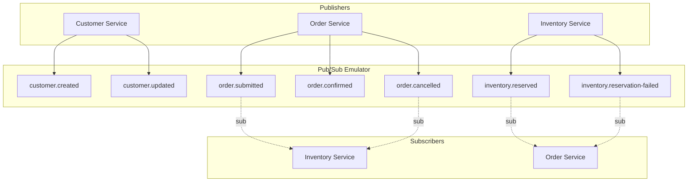
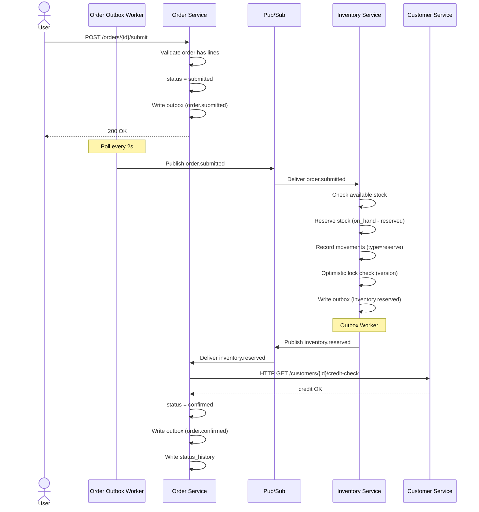
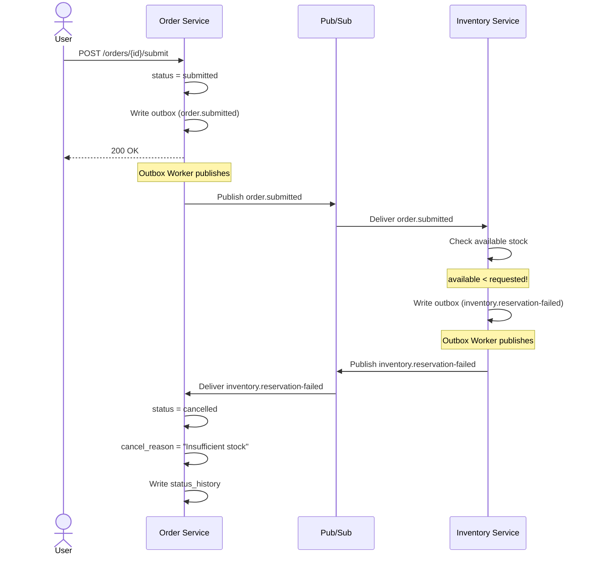
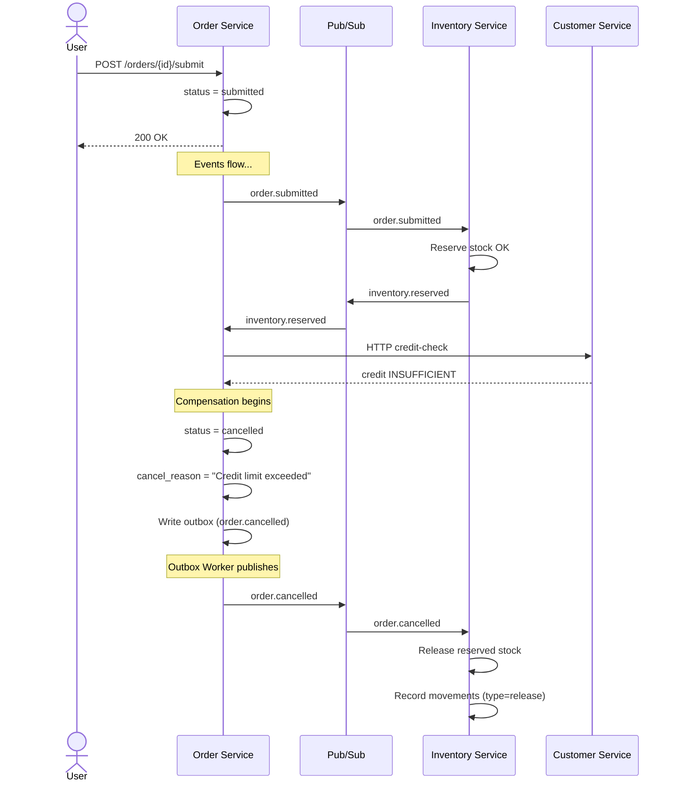
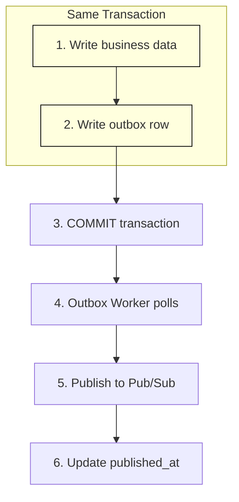

# Event Flows — Luồng sự kiện

> Tài liệu mô tả toàn bộ luồng event trong hệ thống ERP Prototype: Pub/Sub topics, event payload schemas, Saga orchestration, và Outbox pattern.
> Liên quan: [system-overview](system-overview.md) · [bounded-contexts](bounded-contexts.md) · [data-model](data-model.md) · [design-patterns](design-patterns.md)

---

## 1. Tổng quan Event-Driven Architecture

Hệ thống sử dụng **GCP Pub/Sub Emulator** (chạy trong Docker, port `:8085`) làm message broker. Các service giao tiếp bất đồng bộ qua events thay vì gọi HTTP trực tiếp.

### Tại sao Event-Driven?

| Vấn đề với HTTP trực tiếp | Giải pháp Event-Driven |
|---|---|
| Service B down → Service A cũng fail | Event nằm trong queue, xử lý khi B sẵn sàng |
| Coupling chặt: A phải biết URL của B | Loose coupling: A chỉ biết topic name |
| Khó scale: mỗi request = 1 HTTP call | Pub/Sub tự scale theo throughput |
| Khó thêm subscriber mới | Thêm subscription mà không sửa publisher |

### Kiến trúc Event



---

## 2. Pub/Sub Topics & Subscriptions

### 2.1. Bảng tổng hợp Topics

| # | Topic | Publisher | Subscriber(s) | Mục đích |
|---|---|---|---|---|
| 1 | `customer.created` | Customer Service | (chưa có) | Thông báo tạo customer mới |
| 2 | `customer.updated` | Customer Service | (chưa có) | Thông báo cập nhật customer |
| 3 | `order.submitted` | Order Service | Inventory Service | Yêu cầu reserve stock |
| 4 | `order.confirmed` | Order Service | (chưa có) | Thông báo đơn hàng xác nhận |
| 5 | `order.cancelled` | Order Service | Inventory Service | Yêu cầu release stock |
| 6 | `inventory.reserved` | Inventory Service | Order Service | Báo reserve thành công |
| 7 | `inventory.reservation-failed` | Inventory Service | Order Service | Báo reserve thất bại |

### 2.2. Subscriptions

| Subscription | Topic | Service | Cơ chế |
|---|---|---|---|
| `order-service.inventory.reserved` | `inventory.reserved` | Order Service | Pull subscription |
| `order-service.inventory.reservation-failed` | `inventory.reservation-failed` | Order Service | Pull subscription |
| `inventory-service.order.submitted` | `order.submitted` | Inventory Service | Pull subscription |
| `inventory-service.order.cancelled` | `order.cancelled` | Inventory Service | Pull subscription |

**Naming convention**: `<subscriber-service>.<topic-name>`

---

## 3. Event Payload Schemas

> **Typed Contracts**: Tất cả event names và payload interfaces được định nghĩa trong `@erp/shared/contracts/events.ts` — **single source of truth**. Xem [system-overview → section 11](system-overview.md) để hiểu cấu trúc `@erp/shared`.
>
> ```typescript
> import { EVENT, OrderSubmittedPayload, EventMetadata } from '@erp/shared';
>
> // EVENT.ORDER_SUBMITTED = 'order.submitted' (literal type, không phải string)
> // Payload có interface rõ ràng → gõ sai field = compile error
> ```

### 3.1. Base Event Interface

```typescript
// All events extend this base
interface BaseEvent {
  eventId: string;        // UUID — unique per event
  eventType: string;      // Topic name (e.g., "order.submitted")
  aggregateType: string;  // Entity type (e.g., "Order")
  aggregateId: string;    // Entity ID (e.g., order UUID)
  occurredAt: string;     // ISO 8601 timestamp
  version: number;        // Event schema version (for evolution)
}
```

### 3.2. Customer Events

```typescript
interface CustomerCreatedEvent extends BaseEvent {
  eventType: 'customer.created';
  aggregateType: 'Customer';
  payload: {
    customerId: string;
    businessName: string;
    taxCode: string;
    status: 'prospect';
    creditLimitAmount: number;
    contactName: string | null;
    contactPhone: string | null;
    contactEmail: string | null;
  };
}

interface CustomerUpdatedEvent extends BaseEvent {
  eventType: 'customer.updated';
  aggregateType: 'Customer';
  payload: {
    customerId: string;
    changes: {
      field: string;        // Field name that changed
      oldValue: unknown;    // Previous value
      newValue: unknown;    // New value
    }[];
  };
}
```

### 3.3. Order Events

```typescript
interface OrderSubmittedEvent extends BaseEvent {
  eventType: 'order.submitted';
  aggregateType: 'Order';
  payload: {
    orderId: string;
    customerId: string;
    totalAmount: number;
    items: {
      itemId: string;
      itemName: string;
      quantity: number;
      unitPrice: number;
    }[];
    submittedBy: string;    // User ID who submitted
    submittedAt: string;    // ISO 8601
  };
}

interface OrderConfirmedEvent extends BaseEvent {
  eventType: 'order.confirmed';
  aggregateType: 'Order';
  payload: {
    orderId: string;
    customerId: string;
    totalAmount: number;
    confirmedAt: string;    // ISO 8601
  };
}

interface OrderCancelledEvent extends BaseEvent {
  eventType: 'order.cancelled';
  aggregateType: 'Order';
  payload: {
    orderId: string;
    customerId: string;
    reason: string;
    cancelledBy: string;    // "system" (saga) or user ID
    cancelledAt: string;    // ISO 8601
    items: {
      itemId: string;
      quantity: number;
    }[];                    // Items to release stock
  };
}
```

### 3.4. Inventory Events

```typescript
interface InventoryReservedEvent extends BaseEvent {
  eventType: 'inventory.reserved';
  aggregateType: 'StockLevel';
  payload: {
    orderId: string;
    reservedItems: {
      itemId: string;
      warehouseId: string;
      quantity: number;
    }[];
    reservedAt: string;     // ISO 8601
  };
}

interface InventoryReservationFailedEvent extends BaseEvent {
  eventType: 'inventory.reservation-failed';
  aggregateType: 'StockLevel';
  payload: {
    orderId: string;
    reason: string;
    failedItems: {
      itemId: string;
      requestedQuantity: number;
      availableQuantity: number;
    }[];
    failedAt: string;       // ISO 8601
  };
}
```

---

## 4. Saga Flow — Order Submit Orchestration

### 4.1. Saga là gì?

**Saga** là pattern quản lý distributed transaction. Thay vì dùng 2-Phase Commit (2PC) — phức tạp và chậm — Saga chia transaction thành chuỗi local transactions. Nếu một bước thất bại, Saga thực hiện **compensation** (hoàn tác) các bước đã thành công.

| 2-Phase Commit | Saga |
|---|---|
| Lock tất cả resources cùng lúc | Mỗi bước lock riêng, release ngay |
| Cần coordinator trung tâm | Dùng events để phối hợp |
| Blocking: tất cả services phải online | Non-blocking: event nằm trong queue |
| Đảm bảo ACID cross-service | Đảm bảo Eventual Consistency |

### 4.2. Các bước trong Saga

| Bước | Service | Hành động | Compensation |
|---|---|---|---|
| 1 | Order | Submit đơn hàng, status = `submitted` | — (bước đầu, không cần compensation) |
| 2 | Inventory | Reserve stock cho tất cả items | Release stock (giải phóng reserved) |
| 3 | Order → Customer | Credit check (HTTP) | — (chỉ đọc, không cần compensation) |
| 4 | Order | Confirm đơn hàng, status = `confirmed` | Cancel order + release stock |

### 4.3. Happy Path — Tất cả thành công



### 4.4. Compensation Path — Stock thiếu



### 4.5. Compensation Path — Credit check thất bại



---

## 5. Outbox Pattern — Chi tiết hoạt động

### 5.1. Vấn đề: Dual Write Problem

Khi service cần vừa ghi DB vừa publish event, có 2 cách "naive" — cả 2 đều lỗi:

**Cách 1: Publish trước, ghi DB sau**

```
1. Publish event → Pub/Sub     ✅ Event sent
2. Write to DB                 ❌ DB fails → rollback
→ Event đã gửi nhưng data không tồn tại! (Ghost event)
```

**Cách 2: Ghi DB trước, publish sau**

```
1. Write to DB                 ✅ Data saved
2. Publish event → Pub/Sub     ❌ Pub/Sub down
→ Data đã lưu nhưng event không bao giờ gửi! (Lost event)
```

### 5.2. Giải pháp: Outbox Pattern



**Key insight**: Bước 1 + 2 nằm trong **cùng một DB transaction**. Nếu business data commit thì outbox row cũng commit. Nếu rollback thì cả 2 đều rollback. → **Zero inconsistency**.

### 5.3. Outbox Worker — Cơ chế hoạt động

```typescript
// Pseudocode — Outbox Worker
class OutboxWorker {
  // Poll every 2 seconds
  @Cron('*/2 * * * * *')
  async pollAndPublish(): Promise<void> {
    // 1. Query unpublished events
    const events = await this.db.outbox.findMany({
      where: { published_at: null },
      orderBy: { created_at: 'asc' },
      take: 10,  // batch size
    });

    for (const event of events) {
      // 2. Publish to Pub/Sub
      await this.pubsub
        .topic(event.event_type)
        .publishMessage({
          json: {
            eventId: event.id,
            eventType: event.event_type,
            aggregateType: event.aggregate_type,
            aggregateId: event.aggregate_id,
            payload: event.payload,
            occurredAt: event.created_at,
          },
        });

      // 3. Mark as published
      await this.db.outbox.update({
        where: { id: event.id },
        data: { published_at: new Date() },
      });
    }
  }
}
```

### 5.4. Xử lý lỗi và Idempotency

| Tình huống | Xử lý |
|---|---|
| Publish thành công nhưng mark failed | Worker sẽ publish lại → **at-least-once delivery** |
| Subscriber nhận duplicate event | Subscriber check `eventId` → **idempotent processing** |
| Worker crash giữa chừng | Restart → tiếp tục poll unpublished → **no event loss** |
| DB down | Worker không poll được → retry tự nhiên khi DB recovery |

> **At-least-once delivery**: Outbox pattern đảm bảo event được gửi **ít nhất 1 lần**. Subscriber phải xử lý idempotent (cùng eventId chỉ xử lý 1 lần).

### 5.5. Idempotent Consumer

> **Implementation chi tiết**: Xem [design-patterns.md → 12. Idempotent Consumer](design-patterns.md) để hiểu cơ chế Redis SET NX, retry-safe, và code sử dụng `withIdempotency()` từ `@erp/shared`.

```typescript
// Pseudocode — Idempotent event handler
async handleEvent(event: BaseEvent): Promise<void> {
  // Check if already processed
  const existing = await this.db.processedEvents.findUnique({
    where: { eventId: event.eventId },
  });

  if (existing) {
    // Already processed — skip (idempotent)
    return;
  }

  // Process event
  await this.db.$transaction([
    // 1. Business logic
    this.processBusinessLogic(event),
    // 2. Record processed event
    this.db.processedEvents.create({
      data: { eventId: event.eventId, processedAt: new Date() },
    }),
  ]);
}
```

---

## 6. Event Flow Timeline — Toàn bộ luồng

Tổng hợp timeline khi user submit một đơn hàng:

| Thời điểm | Service | Hành động | Event |
|---|---|---|---|
| T+0ms | Order | User gọi POST /orders/{id}/submit | — |
| T+1ms | Order | Validate → status = submitted | — |
| T+2ms | Order | Write outbox trong cùng transaction | — |
| T+3ms | Order | Response 200 OK cho user | — |
| T+2000ms | Order Worker | Poll outbox → publish | `order.submitted` → Pub/Sub |
| T+2100ms | Inventory | Nhận event từ Pub/Sub | — |
| T+2150ms | Inventory | Check stock → reserve (optimistic lock) | — |
| T+2200ms | Inventory | Write outbox | — |
| T+4000ms | Inventory Worker | Poll outbox → publish | `inventory.reserved` → Pub/Sub |
| T+4100ms | Order | Nhận event từ Pub/Sub | — |
| T+4150ms | Order | HTTP credit-check → Customer | — |
| T+4200ms | Customer | Kiểm tra credit limit | — |
| T+4250ms | Order | Credit OK → status = confirmed | — |
| T+4300ms | Order | Write outbox + status_history | — |
| T+6000ms | Order Worker | Poll outbox → publish | `order.confirmed` → Pub/Sub |

> **Lưu ý**: Timeline ở trên là ước tính. Outbox worker poll mỗi 2 giây, nên latency thực tế từ lúc user submit đến khi order confirmed khoảng **4–8 giây**. Đây là trade-off của eventual consistency.

---

## 7. Monitoring & Debugging Events

### 7.1. Kiểm tra Outbox

```sql
-- Xem events chưa publish (pending)
SELECT * FROM customer.outbox WHERE published_at IS NULL;
SELECT * FROM order.outbox WHERE published_at IS NULL;
SELECT * FROM inventory.outbox WHERE published_at IS NULL;

-- Xem events đã publish
SELECT * FROM order.outbox
  WHERE published_at IS NOT NULL
  ORDER BY published_at DESC
  LIMIT 10;
```

### 7.2. Kiểm tra Pub/Sub Emulator

```bash
# List all topics
curl http://localhost:8085/v1/projects/erp-prototype/topics

# List subscriptions for a topic
curl http://localhost:8085/v1/projects/erp-prototype/topics/order.submitted/subscriptions
```

---

Liên quan: [system-overview](system-overview.md) · [bounded-contexts](bounded-contexts.md) · [data-model](data-model.md) · [design-patterns](design-patterns.md)
