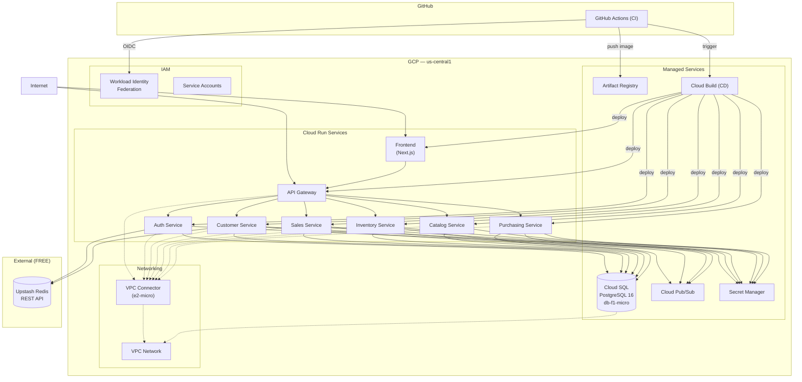
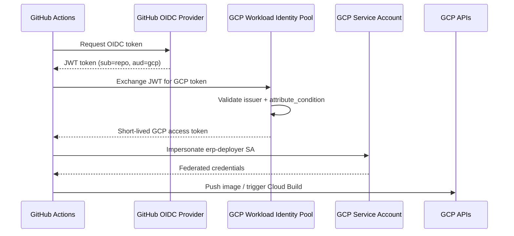

# GCP Cloud Architecture

> Kiến trúc hạ tầng mục tiêu trên Google Cloud Platform cho dự án ERP Prototype. Toàn bộ infrastructure được quản lý bằng Terraform (IaC).

> Liên quan: [System Overview](./system-overview.md) · [CI/CD Pipeline](./cicd-pipeline.md) · [Event Flows](./event-flows.md) · [Tech Decisions](../overview/tech-decisions.md)

---

## 1. Tổng quan — Local → GCP

| Component | Local (Dev) | GCP (Production) |
|---|---|---|
| 6 NestJS backend + API Gateway | `localhost:3001-3006, 3010` | **Cloud Run** (serverless containers) |
| Next.js 15 frontend | `localhost:3000` | **Cloud Run** (SSR container) |
| PostgreSQL | Supabase free tier (Tokyo) | **Cloud SQL** `db-f1-micro` (`us-central1`) |
| Redis | Upstash REST API | **Giữ Upstash** (FREE, zero code change) |
| Pub/Sub | Emulator Docker `:8085` | **Cloud Pub/Sub** (managed) |
| Secrets | `.env` file (plaintext) | **Secret Manager** |
| Container Registry | Không có | **Artifact Registry** |
| CI/CD | Không có | **GitHub Actions** (CI) + **Cloud Build** (CD) |
| Auth GH→GCP | Không có | **Workload Identity Federation** (keyless) |

---

## 2. Architecture Diagram



**Đọc sơ đồ:**

| Ký hiệu | Ý nghĩa |
|---|---|
| Đường liền (→) | HTTP request hoặc direct connection |
| Đường đứt (-.→) | VPC internal network |
| Hình trụ | Persistent data store |

---

## 3. Decisions tổng hợp

| # | Decision | Chọn | Lý do |
|---|---|---|---|
| 1 | Region | `us-central1` (Iowa) | Tier 1 — rẻ nhất, chấp nhận latency ~200ms từ VN |
| 2 | Database | Cloud SQL `db-f1-micro` | ~$7-10/month, same region → latency ~1ms |
| 3 | Cache | Giữ Upstash Redis REST API | FREE, zero code change, qua HTTPS không cần VPC |
| 4 | Compute | Cloud Run (serverless) | Scale-to-zero, pay-per-use, container-based |
| 5 | Messaging | Cloud Pub/Sub (managed) | ADR-005: zero code change từ emulator → real |
| 6 | Secrets | Secret Manager | Thay thế `.env` plaintext |
| 7 | Registry | Artifact Registry | Docker images, same region |
| 8 | Networking | VPC + VPC Connector | Cloud SQL dùng private IP, cần connector |
| 9 | Auth GH→GCP | Workload Identity Federation | Keyless, GCP best practice |
| 10 | IaC | Terraform | Declarative, reproducible |

---

## 4. Chi tiết từng component

### 4.1. Cloud Run Services

8 services chạy trên Cloud Run (fully managed):

| Service | Image | Ingress | Memory | VPC Connector |
|---|---|---|---|---|
| Frontend | `erp-services/frontend` | `all` (public) | 256Mi | ❌ |
| API Gateway | `erp-services/api-gateway` | `all` (public) | 512Mi | ✅ |
| Auth Service | `erp-services/auth-service` | `internal` | 512Mi | ✅ |
| Customer Service | `erp-services/customer-service` | `internal` | 512Mi | ✅ |
| Sales Service | `erp-services/sales-service` | `internal` | 512Mi | ✅ |
| Inventory Service | `erp-services/inventory-service` | `internal` | 512Mi | ✅ |
| Catalog Service | `erp-services/catalog-service` | `internal` | 512Mi | ✅ |
| Purchasing Service | `erp-services/purchasing-service` | `internal` | 512Mi | ✅ |

**Config chung:**
- CPU: 1 vCPU
- Min instances: 0 (scale-to-zero)
- Max instances: 3
- Concurrency: 80
- VPC Egress: `private-ranges-only`

**Service-to-service communication:**
- Frontend + API Gateway: public (`ingress = all`)
- Internal services: chỉ nhận traffic từ trong cùng GCP project (`ingress = internal`)
- Gateway gọi internal services qua Cloud Run URLs thay vì `localhost:300x`

### 4.2. Cloud SQL PostgreSQL

| Config | Value |
|---|---|
| Engine | PostgreSQL 16 |
| Tier | `db-f1-micro` (0.6GB RAM, shared CPU) |
| Disk | 10GB SSD, fixed size |
| Availability | ZONAL (no HA — tiết kiệm) |
| Network | Private IP only (qua VPC) |
| Backup | Daily at 03:00 UTC, 7-day retention |
| Deletion protection | `false` (dev environment) |

**Database schemas** (tạo bằng Prisma migrate, không bằng Terraform):
- `app_auth`, `customer`, `sales`, `inventory`, `catalog`, `purchasing`

### 4.3. Cloud Pub/Sub

Topics + Subscriptions (mapped từ [Event Flows](./event-flows.md)):

| Topic | Subscription | Subscriber |
|---|---|---|
| `customer.created` | _(none yet)_ | — |
| `customer.updated` | _(none yet)_ | — |
| `sales-order.submitted` | _(notification only)_ | — |
| `sales-order.confirmed` | _(none yet)_ | — |
| `sales-order.cancelled` | `inventory-service.sales-order.cancelled` | Inventory |
| `sales-order.fulfilled` | `inventory-service.sales-order.fulfilled` | Inventory |
| `product.created` | `inventory-service.product.created` | Inventory |
| `goods.received` | `inventory-service.goods.received` | Inventory |
| `dead-letter` | `dead-letter-sub` | DLQ |

Config:
- Ack deadline: 60s
- Message retention: 7 days
- Dead-letter: max 5 delivery attempts

> [!NOTE]
> Code hiện tại (PubSubPublisher) tự auto-create topics khi publish lần đầu. Terraform pre-creates chúng để đảm bảo IAM permissions đúng từ đầu.

### 4.4. VPC & Networking

| Resource | Purpose |
|---|---|
| `erp-vpc` (custom VPC) | Mạng riêng cho managed services |
| Private IP range `/20` | Dải IP cho Cloud SQL private networking |
| Private Service Access | Kết nối VPC ↔ Cloud SQL qua private IP |
| `erp-vpc-connector` (VPC Connector) | Cloud Run → VPC (`e2-micro`, 2-3 instances) |

**Tại sao cần VPC Connector?**
- Cloud Run mặc định chạy ngoài VPC
- Cloud SQL dùng private IP (không expose public) → cần VPC Connector
- Upstash Redis qua HTTPS (external) → **không cần** VPC Connector

### 4.5. Secret Manager

| Secret Name | Mapping | Source |
|---|---|---|
| `database-url` | `DATABASE_URL` | Cloud SQL connection string |
| `database-direct-url` | `DIRECT_URL` | Cloud SQL direct (Prisma migrate) |
| `jwt-secret` | `JWT_SECRET` | From Terraform variable |
| `upstash-redis-url` | `UPSTASH_REDIS_REST_URL` | From Terraform variable |
| `upstash-redis-token` | `UPSTASH_REDIS_REST_TOKEN` | From Terraform variable |

### 4.6. Artifact Registry

| Config | Value |
|---|---|
| Repository | `erp-services` |
| Format | Docker |
| Location | `us-central1` |
| URL pattern | `us-central1-docker.pkg.dev/{project}/erp-services/{service}:{tag}` |

### 4.7. IAM — Service Accounts

| Service Account | Roles | Used By |
|---|---|---|
| `erp-backend` | `cloudsql.client`, `pubsub.publisher`, `pubsub.subscriber`, `secretmanager.secretAccessor`, `run.invoker` | Backend Cloud Run services |
| `erp-frontend` | _(none)_ | Frontend Cloud Run |
| `erp-deployer` | `run.admin`, `artifactregistry.writer`, `iam.serviceAccountUser`, `cloudbuild.builds.editor` | Cloud Build CD + GitHub Actions |

### 4.8. Workload Identity Federation (WIF)

GitHub Actions xác thực với GCP mà **không cần** lưu Service Account JSON key:



Config:
- Pool: `github-pool`
- Provider: `github-provider`
- OIDC issuer: `https://token.actions.githubusercontent.com`
- Attribute condition: `assertion.repository == 'your-org/erp-prototype-example'`

---

## 5. Chi phí ước tính

| Service | Cost/month | Note |
|---|---|---|
| Cloud SQL `db-f1-micro` | **~$7-10** | 10GB SSD, no HA |
| Cloud Run (8 services) | **~$0-5** | Scale-to-zero, free tier |
| Cloud Pub/Sub | **~$0** | First 10GB free |
| Secret Manager | **~$0** | First 10K access/month free |
| Artifact Registry | **~$0-1** | Pay per GB stored |
| VPC Connector | **~$7** | `e2-micro`, always-on |
| Upstash Redis | **$0** | Free tier (external) |
| **Tổng** | **~$15-20/month** | |

> [!TIP]
> Với $300 GCP free credit → chạy được **~15-20 tháng** miễn phí.

---

## 6. Terraform Module Structure

```
infra/
├── environments/
│   └── dev/                        # Dev environment config
│       ├── main.tf                 # Module orchestrator
│       ├── variables.tf
│       ├── outputs.tf
│       ├── providers.tf
│       ├── backend.tf              # GCS remote state
│       └── terraform.tfvars.example
│
└── modules/                        # Reusable modules
    ├── networking/                  # VPC, VPC Connector
    ├── database/                   # Cloud SQL PostgreSQL
    ├── pubsub/                     # Topics + Subscriptions
    ├── secrets/                    # Secret Manager
    ├── registry/                   # Artifact Registry
    ├── cloud-run/                  # Cloud Run (per service)
    ├── iam/                        # Service Accounts
    └── workload-identity/          # GitHub ↔ GCP OIDC
```

> Chi tiết Terraform code: xem [implementation plan](../../implementation_plan.md) hoặc source code trong `infra/`.

---

## 7. Environment Variables — Local vs Production

| Env Var | Local | Production |
|---|---|---|
| `NODE_ENV` | `development` | `production` |
| `DATABASE_URL` | Supabase pooler URL | Cloud SQL via VPC Connector |
| `DIRECT_URL` | Supabase direct URL | Cloud SQL direct |
| `UPSTASH_REDIS_REST_URL` | Upstash URL | Upstash URL (same) |
| `UPSTASH_REDIS_REST_TOKEN` | Upstash token | Secret Manager ref |
| `PUBSUB_EMULATOR_HOST` | `localhost:8085` | **NOT SET** → SDK kết nối real Pub/Sub |
| `PUBSUB_PROJECT_ID` | `erp-prototype` | GCP project ID |
| `JWT_SECRET` | `.env` plaintext | Secret Manager ref |
| `AUTH_SERVICE_URL` | `http://localhost:3004` | `https://auth-service-xxx.run.app` |
| `*_SERVICE_URL` | `http://localhost:300x` | Cloud Run internal URLs |

> [!IMPORTANT]
> **Zero code change cho Pub/Sub** (ADR-005): chỉ cần bỏ `PUBSUB_EMULATOR_HOST` → `@google-cloud/pubsub` SDK tự kết nối Pub/Sub thật.

---

## Related Concepts

- [System Overview](./system-overview.md) — kiến trúc local hiện tại
- [CI/CD Pipeline](./cicd-pipeline.md) — GitHub Actions CI + Cloud Build CD
- [Event Flows](./event-flows.md) — Pub/Sub topics và Saga choreography
- [Tech Decisions](../overview/tech-decisions.md) — ADR-005: Pub/Sub Emulator → zero code change
- [Bounded Contexts](./bounded-contexts.md) — 6 services và data ownership
