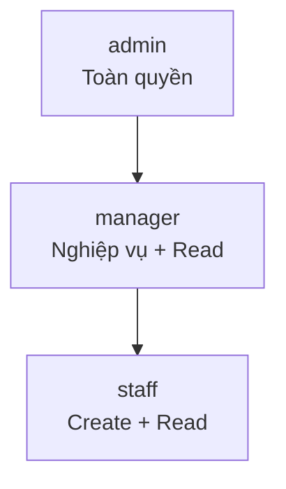
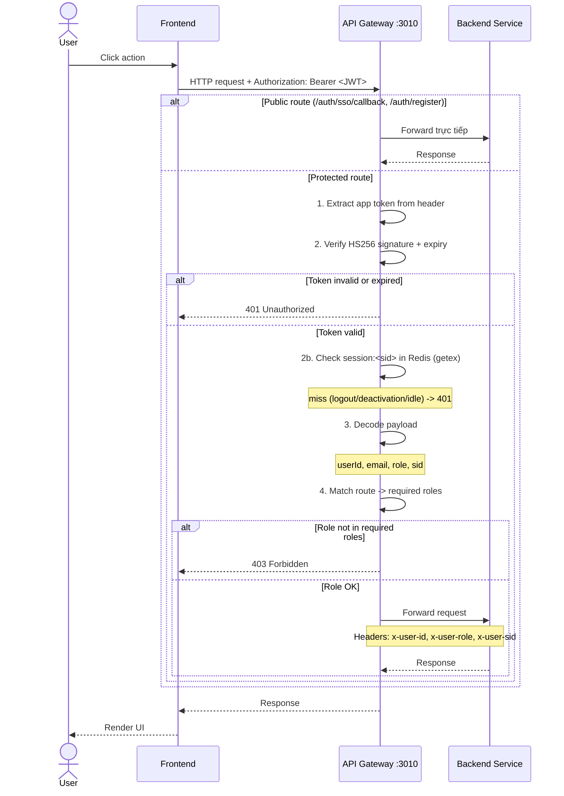
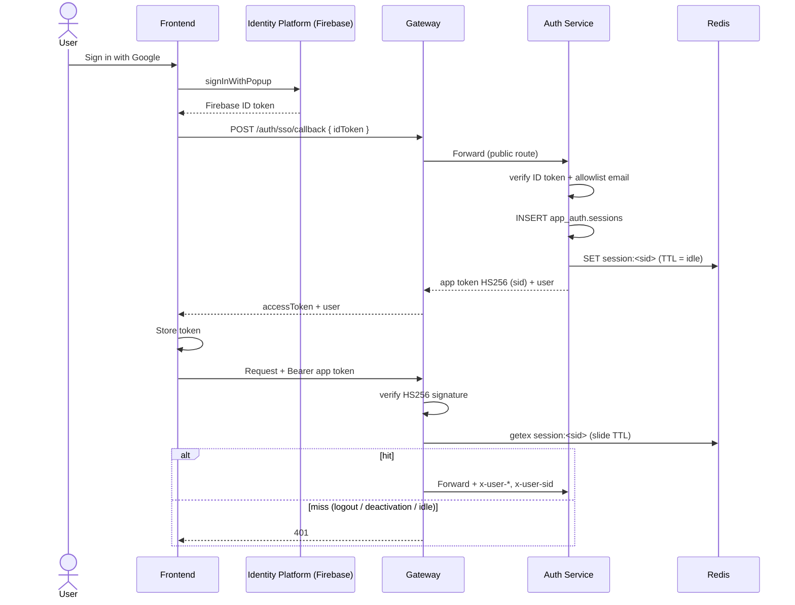

# RBAC — Phân quyền theo vai trò

> ✅ **Đã implement.** Sau **B1 (2026-07-08)**: xác thực qua **Identity Platform (Google sign-in)**; gateway verify app token HS256 **+ session whitelist** (`session:<sid>` ở Redis) và inject `x-user-sid`. **Mô hình RBAC 3-role (admin/manager/staff) KHÔNG đổi.** Xem [Auth Endpoints](../api/auth-endpoints.md), [Implementation Status](../operations/implementation-status.md).

> Tài liệu mô tả hệ thống phân quyền Role-Based Access Control trong ERP Prototype: 3 roles, permission matrix, JWT guard flow.
> Liên quan: [system-overview](system-overview.md) · [bounded-contexts](bounded-contexts.md) · [data-model](data-model.md) · [design-patterns](design-patterns.md)

---

## 1. Tổng quan RBAC

**RBAC (Role-Based Access Control)** là mô hình phân quyền dựa trên vai trò. Thay vì gán permission trực tiếp cho từng user, ta gán role cho user → role chứa tập hợp permissions.

### Thiết kế trong Prototype

| Quyết định | Lựa chọn | Lý do |
|---|---|---|
| Lưu role ở đâu? | Column `role` trong `auth.users` | Đơn giản, đủ cho prototype |
| Bảng `roles` riêng? | Không | Chỉ có 3 roles cố định, không cần dynamic |
| Bảng `permissions` riêng? | Không | Permission hardcode trong config, dễ đọc |
| Permission check ở đâu? | API Gateway | Centralized — 1 chỗ check cho tất cả services |

> **Production Note**: Trong production, nên tách bảng `roles` và `permissions` riêng để support dynamic role management, audit trail, và multi-tenant.

---

## 2. Ba vai trò (Roles)

| Role | Mô tả | Số lượng dự kiến |
|---|---|---|
| `admin` | Quản trị viên toàn quyền. Quản lý users, cấu hình hệ thống. | 1–2 người |
| `manager` | Quản lý nghiệp vụ. Có quyền approve, submit, cancel. | 3–5 người |
| `staff` | Nhân viên thao tác. Chỉ tạo mới và xem, không sửa/xóa. | 10+ người |

### Phân cấp quyền


```mermaid
flowchart TB
    Admin["admin\nToàn quyền"]
    Manager["manager\nNghiệp vụ + Read"]
    Staff["staff\nCreate + Read"]

    Admin --> Manager
    Manager --> Staff
```

> **Lưu ý**: Phân cấp trên mang tính mô tả. Trong code, mỗi endpoint define rõ ràng roles nào được phép — không có "thừa kế" ngầm.

---

## 3. JWT Guard Flow — Luồng xác thực tại Gateway

### 3.1. Sequence Diagram


```mermaid
sequenceDiagram
    actor User
    participant FE as Frontend
    participant GW as API Gateway :3010
    participant Svc as Backend Service

    User->>FE: Click action
    FE->>GW: HTTP request + Authorization: Bearer <JWT>

    alt Public route (/auth/sso/callback, /auth/register)
        GW->>Svc: Forward trực tiếp
        Svc-->>GW: Response
    else Protected route
        GW->>GW: 1. Extract app token from header
        GW->>GW: 2. Verify HS256 signature + expiry
        alt Token invalid or expired
            GW-->>FE: 401 Unauthorized
        else Token valid
            GW->>GW: 2b. Check session:<sid> in Redis (getex)
            Note over GW: miss (logout/deactivation/idle) -> 401
            GW->>GW: 3. Decode payload
            Note over GW: userId, email, role, sid
            GW->>GW: 4. Match route -> required roles
            alt Role not in required roles
                GW-->>FE: 403 Forbidden
            else Role OK
                GW->>Svc: Forward request
                Note over GW,Svc: Headers: x-user-id, x-user-role, x-user-sid
                Svc-->>GW: Response
            end
        end
    end

    GW-->>FE: Response
    FE-->>User: Render UI
```

### 3.2. Chi tiết từng bước

| Bước | Hành động | Chi tiết |
|---|---|---|
| 1 | Extract token | Lấy app token từ header `Authorization: Bearer <token>` |
| 2 | Verify signature | Verify chữ ký HS256 của app token bằng secret dùng chung với auth-service |
| 3 | Check expiry | Payload chứa `exp` (expiration timestamp) |
| 4 | **Session whitelist** | Tra `session:<sid>` ở Redis (`getex`, slide TTL); miss → **401** (logout / deactivation / idle) |
| 5 | Decode payload | Lấy `userId`, `email`, `role`, `sid` từ payload |
| 6 | Route matching | So sánh `method + path` với route config |
| 7 | Role check | Kiểm tra `role` có nằm trong allowed roles của route |
| 8 | Forward | Thêm headers `x-user-id`, `x-user-role`, `x-user-sid` rồi proxy đến service |

### 3.3. App Token Payload Structure

Sau B1, token per-request là **app token HS256** do auth-service phát (không phải Firebase ID token). Payload mang thêm `sid` (session id) làm khoá whitelist:

```typescript
interface AppTokenPayload {
  sub: string;     // user ID (UUID)
  email: string;   // user email
  role: string;    // "admin" | "manager" | "staff"
  sid: string;     // session id — khoá whitelist (Redis session:<sid>)
  iat: number;     // issued at (Unix timestamp)
  exp: number;     // expires at (Unix timestamp)
}
```

### 3.4. Forward Headers

Khi app token hợp lệ **và session còn trong whitelist**, Gateway thêm headers sau vào request trước khi forward đến backend service:

| Header | Giá trị | Mục đích |
|---|---|---|
| `x-user-id` | User UUID từ token `sub` | Service biết ai đang request |
| `x-user-role` | Role từ token `role` | Service có thể filter data theo role |
| `x-user-sid` | Session id từ token `sid` | Service/logout xác định session để revoke |

> Backend services **KHÔNG tự verify token**. Chúng tin tưởng Gateway đã verify — vì services chỉ expose internal port, không public.

> **B1 — Session whitelist:** ngoài verify chữ ký, gateway còn tra `session:<sid>` ở Redis (`getex`, slide TTL) mỗi request. Session miss (logout / deactivation / idle timeout) → **401 ngay** dù chữ ký còn tốt. Đây là lớp revoke tức thì (**FR-A13**) + idle timeout theo role (**FR-A9**). Login/token gốc do **Identity Platform (Google sign-in)** cấp; app token HS256 mang `sid`.

---

## 4. Permission Matrix — Theo Endpoint

### 4.1. Auth Endpoints

| Method | Path | Mô tả | `admin` | `manager` | `staff` | Public? |
|---|---|---|:---:|:---:|:---:|:---:|
| POST | `/auth/register` | Tạo user mới (password-less) | — | — | — | ✅ |
| POST | `/auth/sso/callback` | Đổi Firebase ID token → app token | — | — | — | ✅ |
| POST | `/auth/logout` | Đăng xuất (revoke session) | ✅ | ✅ | ✅ | ❌ |
| GET | `/auth/profile` | Xem profile bản thân | ✅ | ✅ | ✅ | ❌ |
| GET | `/auth/users` | Danh sách users | ✅ | ❌ | ❌ | ❌ |
| PATCH | `/auth/users/:id` | Cập nhật user | ✅ | ❌ | ❌ | ❌ |
| DELETE | `/auth/users/:id` | Xóa user | ✅ | ❌ | ❌ | ❌ |

### 4.2. Customer Endpoints

| Method | Path | Mô tả | `admin` | `manager` | `staff` |
|---|---|---|:---:|:---:|:---:|
| POST | `/customers` | Tạo customer mới | ✅ | ✅ | ✅ |
| GET | `/customers` | Danh sách customers | ✅ | ✅ | ✅ |
| GET | `/customers/:id` | Chi tiết customer | ✅ | ✅ | ✅ |
| PATCH | `/customers/:id` | Cập nhật customer | ✅ | ✅ | ❌ |
| DELETE | `/customers/:id` | Xóa customer | ✅ | ✅ | ❌ |
| GET | `/customers/:id/credit-check` | Kiểm tra credit | ✅ | ✅ | ✅ |

### 4.3. Order Endpoints

| Method | Path | Mô tả | `admin` | `manager` | `staff` |
|---|---|---|:---:|:---:|:---:|
| POST | `/orders` | Tạo đơn hàng (draft) | ✅ | ✅ | ✅ |
| GET | `/orders` | Danh sách đơn hàng | ✅ | ✅ | ✅ |
| GET | `/orders/:id` | Chi tiết đơn hàng | ✅ | ✅ | ✅ |
| PATCH | `/orders/:id` | Cập nhật đơn hàng (draft) | ✅ | ✅ | ✅ |
| POST | `/orders/:id/lines` | Thêm order line | ✅ | ✅ | ✅ |
| DELETE | `/orders/:id/lines/:lineId` | Xóa order line | ✅ | ✅ | ✅ |
| POST | `/orders/:id/submit` | Submit đơn hàng | ✅ | ✅ | ❌ |
| POST | `/orders/:id/confirm` | Confirm đơn hàng | ✅ | ✅ | ❌ |
| POST | `/orders/:id/cancel` | Cancel đơn hàng | ✅ | ✅ | ❌ |
| GET | `/orders/lifecycle` | CQRS read model | ✅ | ✅ | ✅ |

### 4.4. Inventory Endpoints

| Method | Path | Mô tả | `admin` | `manager` | `staff` |
|---|---|---|:---:|:---:|:---:|
| POST | `/inventory/items` | Tạo item | ✅ | ✅ | ✅ |
| GET | `/inventory/items` | Danh sách items | ✅ | ✅ | ✅ |
| GET | `/inventory/items/:id` | Chi tiết item | ✅ | ✅ | ✅ |
| PATCH | `/inventory/items/:id` | Cập nhật item | ✅ | ✅ | ❌ |
| POST | `/inventory/warehouses` | Tạo warehouse | ✅ | ✅ | ❌ |
| GET | `/inventory/warehouses` | Danh sách warehouses | ✅ | ✅ | ✅ |
| POST | `/inventory/stock/inbound` | Nhập kho | ✅ | ✅ | ❌ |
| POST | `/inventory/stock/outbound` | Xuất kho | ✅ | ✅ | ❌ |
| GET | `/inventory/stock-levels` | Xem tồn kho | ✅ | ✅ | ✅ |
| GET | `/inventory/movements` | Lịch sử xuất nhập | ✅ | ✅ | ✅ |

---

## 5. Route Configuration — Code

### 5.1. Route Config Structure

```typescript
// Gateway route configuration
interface RouteConfig {
  method: 'GET' | 'POST' | 'PATCH' | 'DELETE';
  path: string;           // Express-style path
  targetService: string;  // Service URL
  roles?: string[];       // Allowed roles (empty = public)
}

const routes: RouteConfig[] = [
  // --- Auth (public) ---
  { method: 'POST', path: '/auth/sso/callback', targetService: AUTH_URL },
  { method: 'POST', path: '/auth/register',     targetService: AUTH_URL },

  // --- Auth (protected) ---
  { method: 'GET', path: '/auth/profile',
    targetService: AUTH_URL, roles: ['admin', 'manager', 'staff'] },
  { method: 'GET', path: '/auth/users',
    targetService: AUTH_URL, roles: ['admin'] },

  // --- Customer ---
  { method: 'POST', path: '/customers',
    targetService: CUSTOMER_URL, roles: ['admin', 'manager', 'staff'] },
  { method: 'PATCH', path: '/customers/:id',
    targetService: CUSTOMER_URL, roles: ['admin', 'manager'] },
  { method: 'DELETE', path: '/customers/:id',
    targetService: CUSTOMER_URL, roles: ['admin', 'manager'] },

  // --- Order ---
  { method: 'POST', path: '/orders/:id/submit',
    targetService: ORDER_URL, roles: ['admin', 'manager'] },
  { method: 'POST', path: '/orders/:id/cancel',
    targetService: ORDER_URL, roles: ['admin', 'manager'] },

  // --- Inventory ---
  { method: 'POST', path: '/inventory/stock/inbound',
    targetService: INVENTORY_URL, roles: ['admin', 'manager'] },
  { method: 'POST', path: '/inventory/stock/outbound',
    targetService: INVENTORY_URL, roles: ['admin', 'manager'] },
];
```

### 5.2. Guard Pseudocode

```typescript
// Simplified App-token + Session-whitelist + RBAC Guard (B1)
async function authGuard(req: Request, res: Response, next: NextFunction) {
  const route = matchRoute(req.method, req.path);

  // 1. Public route — skip auth
  if (!route.roles || route.roles.length === 0) {
    return next();
  }

  // 2. Extract token
  const token = req.headers.authorization?.replace('Bearer ', '');
  if (!token) {
    return res.status(401).json({ message: 'Missing token' });
  }

  // 3. Verify app token (HS256) + session whitelist
  try {
    const payload = jwt.verify(token, APP_TOKEN_SECRET) as AppTokenPayload;

    // 3b. Session whitelist — miss = logout / deactivation / idle timeout
    const session = await redis.getex(`session:${payload.sid}`, { ex: IDLE_TTL });
    if (!session) {
      return res.status(401).json({ message: 'Session revoked or expired' });
    }

    // 4. Check role
    if (!route.roles.includes(payload.role)) {
      return res.status(403).json({ message: 'Insufficient permissions' });
    }

    // 5. Forward with user info
    req.headers['x-user-id'] = payload.sub;
    req.headers['x-user-role'] = payload.role;
    req.headers['x-user-sid'] = payload.sid;
    return next();

  } catch (error) {
    return res.status(401).json({ message: 'Invalid or expired token' });
  }
}
```

---

## 6. Tổng hợp Permission

### Theo Role

| Role | Tổng endpoints | Quyền chính |
|---|---|---|
| `admin` | Tất cả | Quản lý users + toàn bộ nghiệp vụ |
| `manager` | Tất cả trừ user management | Submit/cancel/confirm orders, nhập/xuất kho |
| `staff` | Chỉ CRUD cơ bản | Tạo customer, tạo order draft, tạo item, xem data |

### Theo Nhóm thao tác

| Nhóm thao tác | Roles |
|---|---|
| **Xem (Read)** | `admin`, `manager`, `staff` |
| **Tạo mới (Create)** | `admin`, `manager`, `staff` |
| **Sửa / Xóa (Update/Delete)** | `admin`, `manager` |
| **Workflow actions (Submit/Cancel/Confirm)** | `admin`, `manager` |
| **User management** | `admin` only |

---

## 7. Token Lifecycle (sau B1)


```mermaid
sequenceDiagram
    actor User
    participant FE as Frontend
    participant IdP as Identity Platform (Firebase)
    participant GW as Gateway
    participant Auth as Auth Service
    participant Redis

    User->>FE: Sign in with Google
    FE->>IdP: signInWithPopup
    IdP-->>FE: Firebase ID token
    FE->>GW: POST /auth/sso/callback { idToken }
    GW->>Auth: Forward (public route)
    Auth->>Auth: verify ID token + allowlist email
    Auth->>Auth: INSERT app_auth.sessions
    Auth->>Redis: SET session:<sid> (TTL = idle)
    Auth-->>GW: app token HS256 (sid) + user
    GW-->>FE: accessToken + user
    FE->>FE: Store token

    FE->>GW: Request + Bearer app token
    GW->>GW: verify HS256 signature
    GW->>Redis: getex session:<sid> (slide TTL)
    alt hit
        GW->>Auth: Forward + x-user-*, x-user-sid
    else miss (logout / deactivation / idle)
        GW-->>FE: 401
    end
```

| Token / Phiên | Thời hạn | Lưu trữ | Mục đích |
|---|---|---|---|
| Firebase ID token | ~1h (Firebase) | Frontend (Firebase SDK) | Chứng minh Google identity ở `/auth/sso/callback` |
| App access token (HS256) | `APP_TOKEN_TTL` (mặc định 1h) | Frontend | Xác thực mỗi request; mang `sid` |
| Session (`app_auth.sessions` + Redis `session:<sid>`) | idle timeout theo role (mặc định 30m, slide) | Postgres + Redis | Whitelist revoke tức thì (FR-A13) + idle (FR-A9) |

---

Liên quan: [system-overview](system-overview.md) · [bounded-contexts](bounded-contexts.md) · [data-model](data-model.md) · [design-patterns](design-patterns.md)
