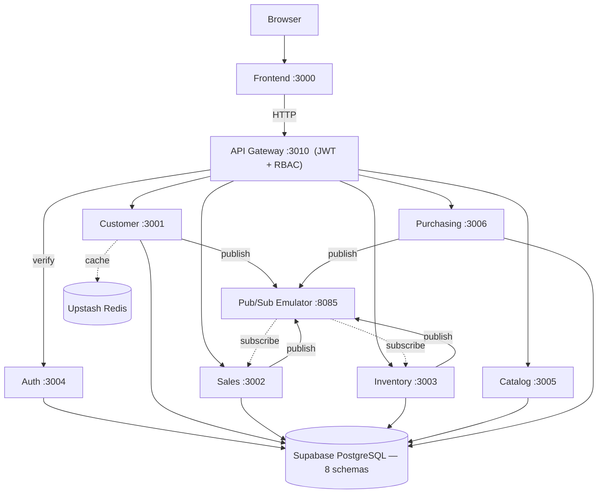
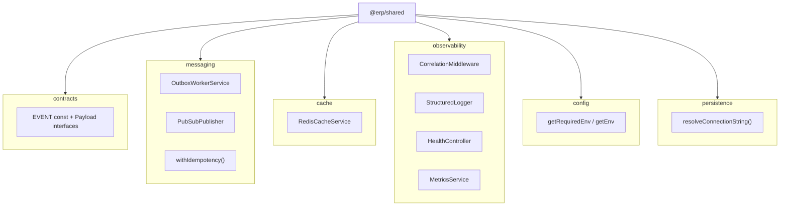
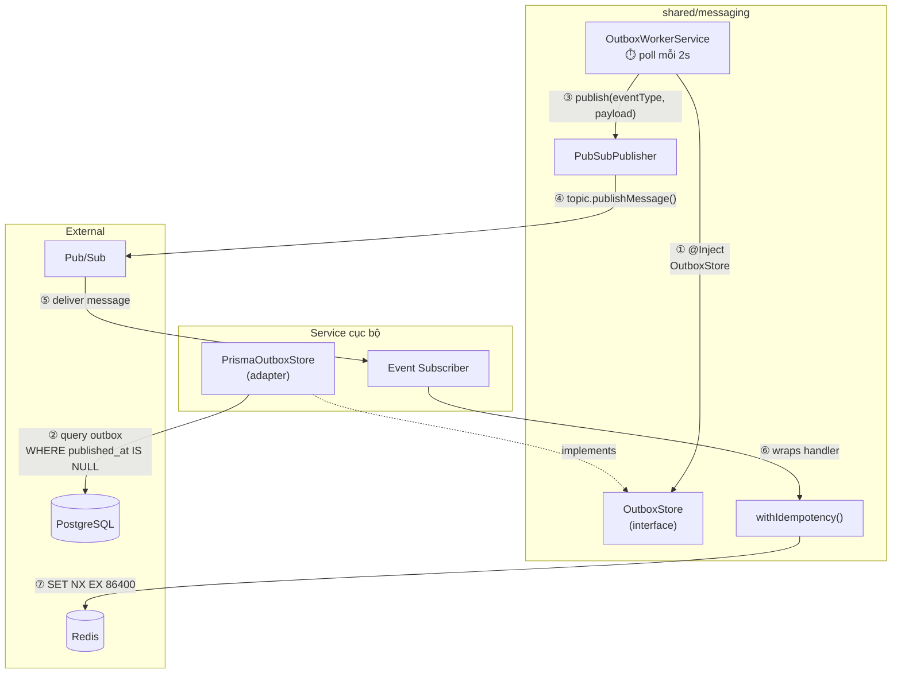
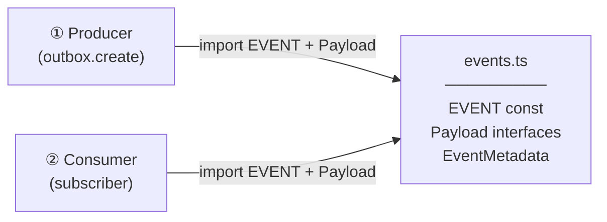
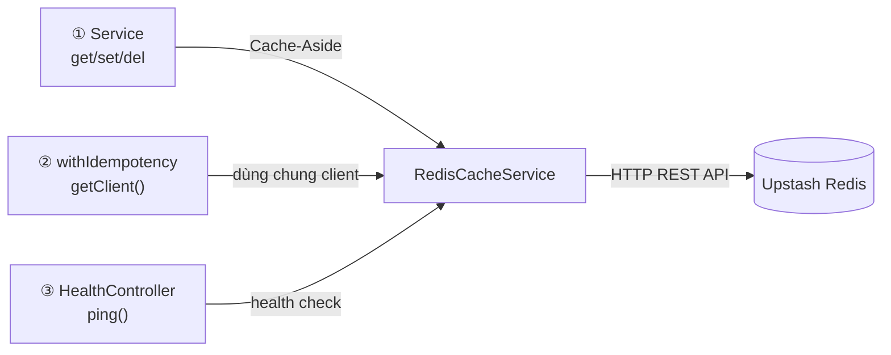
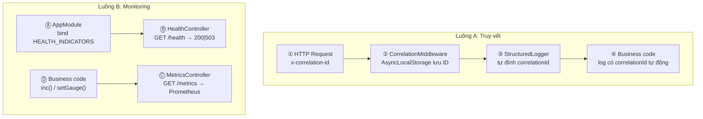
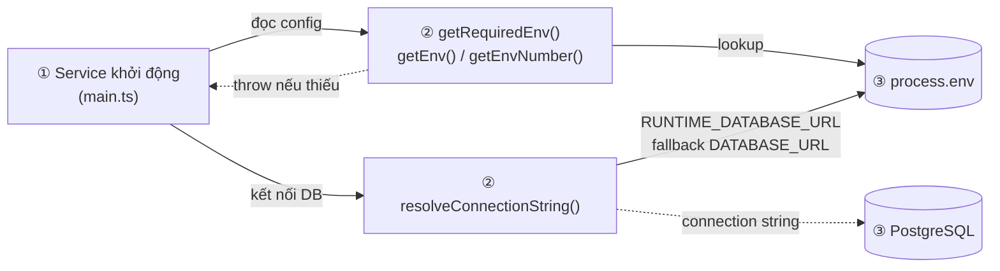

# System Overview — Kiến trúc tổng quan

> ✅ **Trạng thái:** Tất cả 7 backend services + API Gateway + Frontend đã implement đầy đủ. Xem [Implementation Status](../IMPLEMENTATION-STATUS.md).

> Tài liệu mô tả kiến trúc tổng thể của ERP Prototype.
> Liên quan: [bounded-contexts](bounded-contexts.md) · [data-model](data-model.md) · [event-flows](event-flows.md) · [design-patterns](design-patterns.md)

---

## 1. Sơ đồ kiến trúc tổng thể



**Đọc sơ đồ:**
- **Đường liền** (→) = HTTP request
- **Đường đứt** (-.→) = event subscribe / cache
- Tất cả services nối thẳng xuống DB — mỗi service chỉ truy cập schema của mình
- Pub/Sub: 4 services publish events, Sales + Inventory subscribe lẫn nhau (Saga)

---

## 2. Tech Stack

| Layer | Công nghệ | Vai trò |
|---|---|---|
| **Frontend** | Next.js 15, React 19 | SPA với App Router, SSR-ready |
| **UI Library** | Ant Design 5 | Complex components (Table, Form, Steps, Timeline) |
| **CSS** | Tailwind CSS | Utility spacing, layout, responsive |
| **Charts** | Recharts | Dashboard biểu đồ |
| **Animation** | Framer Motion | Micro-animations, page transitions |
| **Form** | React Hook Form + Zod | Form validation |
| **Data Fetching** | TanStack React Query | Cache, refetch, mutations |
| **Backend** | NestJS (TypeScript) | Framework có cấu trúc DDD (modules, DI, guards) |
| **ORM** | Prisma (code-first) | Schema → Migration → DB tables |
| **Auth** | bcrypt + jsonwebtoken | Hash password, sign/verify JWT |
| **Database** | Supabase PostgreSQL | Cloud PostgreSQL (free tier, 500MB) |
| **Cache** | Upstash Redis | Cloud Redis (free tier, REST API) |
| **Message Queue** | GCP Pub/Sub Emulator | Event-driven communication (Docker container) |
| **Container** | Docker | Chỉ chạy Pub/Sub Emulator |

---

## 3. Service Map — 5 services

| **API Gateway** | 3010 | — | JWT Guard, RBAC, Reverse Proxy |
| **Auth Service** | 3004 | `app_auth` | bcrypt, JWT, Refresh Token |
| **Customer Service** | 3001 | `customer` | DDD layers, Repository, Value Object, Outbox |
| **Sales Service** | 3002 | `sales` | Aggregate Root, Saga, CQRS, Outbox |
| **Inventory Service** | 3003 | `inventory` | Optimistic Locking, CHECK constraint, Outbox |
| **Catalog Service** | 3005 | `catalog` | Product CRUD, SKU VO, taxRate, Outbox |
| **Purchasing Service** | 3006 | `purchasing` | PO lifecycle, Supplier, Outbox |

---

## 4. Cross-Reference — Chi tiết chuyên sâu

Các nội dung chi tiết nằm ở docs chuyên biệt:

| Chủ đề | Xem tại |
|--------|--------|
| **JWT Authentication Flow** | [rbac.md](rbac.md) §3 — JWT Guard Flow |
| **Saga / Submit Flow** | [event-flows.md](event-flows.md) §4 — Order Submit Flow |
| **Database Schemas** | [data-model.md](data-model.md) — ER diagrams, table definitions |
| **Outbox Pattern** | [design-patterns.md](design-patterns.md) §5 — Transactional event publishing |
| **RBAC Matrix** | [rbac.md](rbac.md) §4 — Permission matrix |
| **Deployment / Startup** | [getting-started.md](../development/getting-started.md) |
| **Patterns × Services** | [design-patterns.md](design-patterns.md) §0 — Tổng quan 14 patterns |
| **Per-service details** | [services/](../services/index.md) — Quick reference per service |

---

## 11. `@erp/shared` — Cross-cutting Infrastructure Package

5 services (Customer, Order, Inventory, Auth, Gateway) cần các primitives giống hệt: outbox worker, idempotency, cache, logger, health check, metrics, event contracts. Thay vì copy-paste → tất cả nằm trong **1 package dùng chung**: `@erp/shared`.

### Sơ đồ 6 Modules



### Bảng tổng hợp modules

| Module | Files chính | Mục đích | Dùng bởi |
|---|---|---|---|
| **contracts** | `events.ts` | `EVENT` const (topic names), typed payload interfaces, `EventMetadata` | Tất cả services publish/subscribe |
| **messaging** | `outbox-worker.service.ts`, `pubsub-publisher.ts`, `idempotency.ts` | Outbox worker generic, Pub/Sub publisher với topic cache, idempotent consumer helper | Customer, Order, Inventory |
| **cache** | `redis-cache.service.ts` | Cache-Aside qua Upstash Redis REST API: `get/set/del/invalidatePattern` | Tất cả services cần cache |
| **observability** | `correlation.ts`, `logger.ts`, `health.ts`, `metrics.ts` | CorrelationId (AsyncLocalStorage), JSON logger, health check endpoint, Prometheus metrics | Tất cả services |
| **config** | `env.ts` | Đọc biến môi trường an toàn (fail-fast khi thiếu) | Tất cả services |
| **persistence** | `prisma-connection.ts` | Lấy connection string: ưu tiên pooled URL, fallback direct | Customer, Order, Inventory |

### Quan hệ giữa các files trong mỗi module

> **Cách đọc**: Theo số thứ tự trên mũi tên (①→②→③...). Đường liền = gọi trực tiếp. Đường đứt = implement/gián tiếp. Hình trụ = database/store.

#### messaging — Outbox → Publish → Dedup



| Bước | Chức năng |
|:---:|---|
| ① | Worker inject `OutboxStore` qua DI token → nhận adapter Prisma do service bind |
| ② | Adapter query bảng `outbox` trong PostgreSQL → lấy events chưa publish (`published_at IS NULL`) |
| ③ | Worker gọi `PubSubPublisher.publish()` với eventType + payload |
| ④ | Publisher gửi message lên Pub/Sub topic (auto-create topic nếu lần đầu) |
| ⑤ | Pub/Sub deliver message cho subscriber ở service khác |
| ⑥ | Subscriber bọc handler bằng `withIdempotency()` trước khi chạy business logic |
| ⑦ | Idempotency check Redis: `SET processed:{eventId} NX EX 86400` — nếu key đã tồn tại → bỏ qua (dedup) |

#### contracts — Event naming + typed payloads



| Bước | Chức năng |
|:---:|---|
| ① | Producer (vd: order-service) import `EVENT.ORDER_SUBMITTED` + `OrderSubmittedPayload` để ghi outbox đúng schema |
| ② | Consumer (vd: inventory-service) import cùng tên event + cùng payload type để parse message đúng kiểu |

> Cả 2 phía import từ **cùng 1 file** → sai tên/field = compile error.

#### cache — Cache-Aside + shared Redis client



| Bước | Chức năng |
|:---:|---|
| ① | Service (query/command) gọi `get/set/del/invalidatePattern` — đọc cache trước, miss thì query DB rồi ghi cache |
| ② | `withIdempotency()` gọi `getClient()` để lấy raw Redis client — dùng cho `SET NX` (dedup message) |
| ③ | `HealthController` gọi `ping()` — kiểm tra Redis còn phản hồi không, trả kết quả trong `GET /health` |

> 3 consumer hội tụ vào 1 instance `RedisCacheService` → dùng chung 1 connection.

#### observability — 2 luồng độc lập



**Luồng A — Truy vết** (đọc ①→④):

| Bước | Chức năng |
|:---:|---|
| ① | HTTP request đến, mang header `x-correlation-id` (hoặc middleware sinh UUID mới nếu thiếu) |
| ② | `CorrelationMiddleware` lưu ID vào `AsyncLocalStorage` — mọi code async trong request đọc được ID này |
| ③ | `StructuredLogger` tự lấy ID từ AsyncLocalStorage, đính vào mỗi dòng log JSON (`"correlationId":"abc-123"`) |
| ④ | Business code gọi `logger.log()` bình thường — correlationId tự có, không cần truyền tay |

**Luồng B — Monitoring** (đọc Ⓐ→Ⓓ):

| Bước | Chức năng |
|:---:|---|
| Ⓐ | `AppModule` bind mảng `HealthIndicator[]` vào token `HEALTH_INDICATORS` (vd: check Postgres + Redis) |
| Ⓑ | `HealthController` expose `GET /health` — chạy tất cả indicators, trả `200 ok` hoặc `503 down` |
| Ⓒ | `MetricsController` expose `GET /metrics` — xuất tất cả counter/gauge dạng Prometheus text |
| Ⓓ | Business code gọi `metrics.inc('events_published_total')` hoặc `metrics.setGauge('outbox_pending', n)` tại các điểm quan trọng |

#### config + persistence — Bootstrap helpers



| Bước | Chức năng |
|:---:|---|
| ① | Service khởi động (`main.ts` / `PrismaService` constructor) — cần config + DB connection |
| ② | `getRequiredEnv()` đọc biến bắt buộc (throw ngay nếu thiếu). `resolveConnectionString()` ưu tiên `RUNTIME_DATABASE_URL` (pooled), fallback `DATABASE_URL` (direct) |
| ③ | Giá trị lấy từ `process.env` → dùng để kết nối PostgreSQL |

### Barrel Export

Mọi service chỉ cần 1 import duy nhất:

```typescript
import {
  EVENT, CustomerCreatedPayload,       // contracts
  OutboxWorkerService, withIdempotency, // messaging
  RedisCacheService,                    // cache
  StructuredLogger, HealthController,   // observability
  getRequiredEnv,                       // config
  resolveConnectionString,              // persistence
} from '@erp/shared';
```

Xem chi tiết API và cách dùng: [design-patterns](design-patterns.md) (patterns 5, 6, 12–14) · [coding-standards](../development/coding-standards.md) (sections 8–9)

