# System Overview — Kiến trúc tổng quan

> Tài liệu mô tả kiến trúc tổng thể của ERP Prototype.
> Liên quan: [bounded-contexts](bounded-contexts.md) · [data-model](data-model.md) · [event-flows](event-flows.md) · [design-patterns](design-patterns.md)

---

## 1. Sơ đồ kiến trúc tổng thể

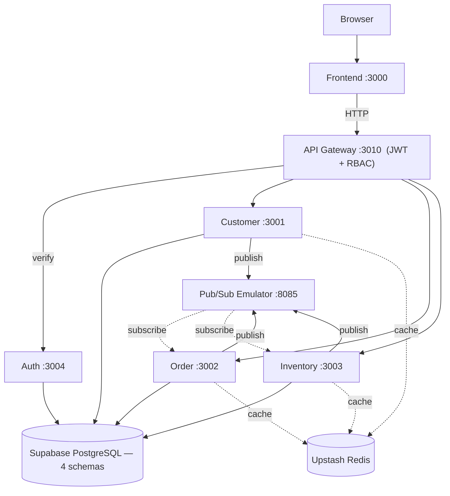

**Đọc sơ đồ:**
- **Đường liền** (→) = HTTP request
- **Đường đứt** (-.→) = event subscribe / cache
- Tất cả services nối thẳng xuống DB — mỗi service chỉ truy cập schema của mình
- Pub/Sub: 3 services publish events, Order + Inventory subscribe lẫn nhau (Saga)

---

## 2. Tech Stack

| Layer | Công nghệ | Vai trò |
|---|---|---|
| **Frontend** | Next.js 15, React 19 | SPA với App Router, SSR-ready |
| **UI Library** | Ant Design 5 | Complex components (Table, Form, Steps, Timeline) |
| **CSS** | Tailwind CSS | Utility spacing, layout, responsive |
| **Charts** | Recharts | Dashboard biểu đồ |
| **Animation** | Framer Motion | Micro-animations, page transitions |
| **Form** | React Hook Form + Zod | Form validation |
| **Data Fetching** | TanStack React Query | Cache, refetch, mutations |
| **Backend** | NestJS (TypeScript) | Framework có cấu trúc DDD (modules, DI, guards) |
| **ORM** | Prisma (code-first) | Schema → Migration → DB tables |
| **Auth** | bcrypt + jsonwebtoken | Hash password, sign/verify JWT |
| **Database** | Supabase PostgreSQL | Cloud PostgreSQL (free tier, 500MB) |
| **Cache** | Upstash Redis | Cloud Redis (free tier, REST API) |
| **Message Queue** | GCP Pub/Sub Emulator | Event-driven communication (Docker container) |
| **Container** | Docker | Chỉ chạy Pub/Sub Emulator |

---

## 3. Service Map — 5 services

| Service | Port | Schema | Patterns chính |
|---|---|---|---|
| **API Gateway** | 3010 | — | JWT Guard, RBAC, Reverse Proxy |
| **Auth Service** | 3004 | `auth` | bcrypt, JWT, Refresh Token |
| **Customer Service** | 3001 | `customer` | DDD layers, Repository, Value Object, Outbox |
| **Order Service** | 3002 | `order` | Aggregate Root, Saga, CQRS, Outbox |
| **Inventory Service** | 3003 | `inventory` | Optimistic Locking, CHECK constraint, Outbox |

---

## 4. Luồng Request chi tiết — JWT Authentication

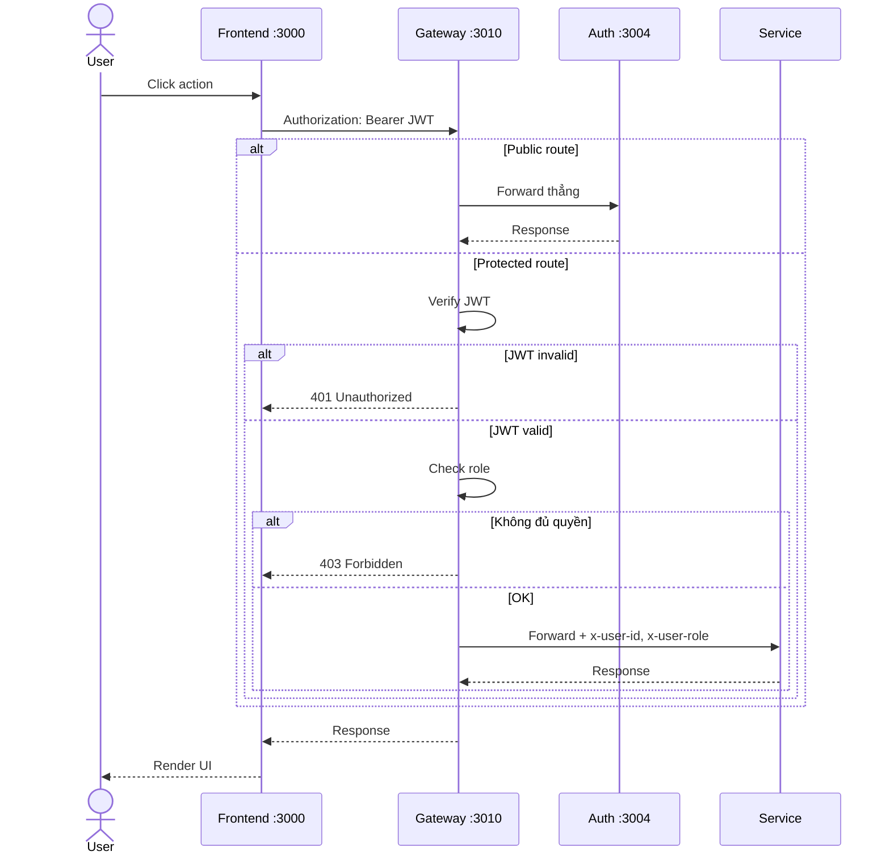

---

## 5. Luồng Event — Saga (Order Submit)

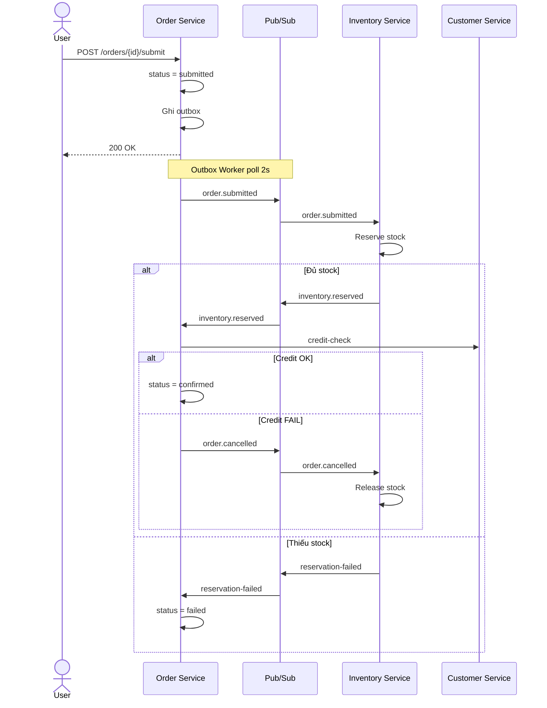

---

## 6. Database — 4 Schemas

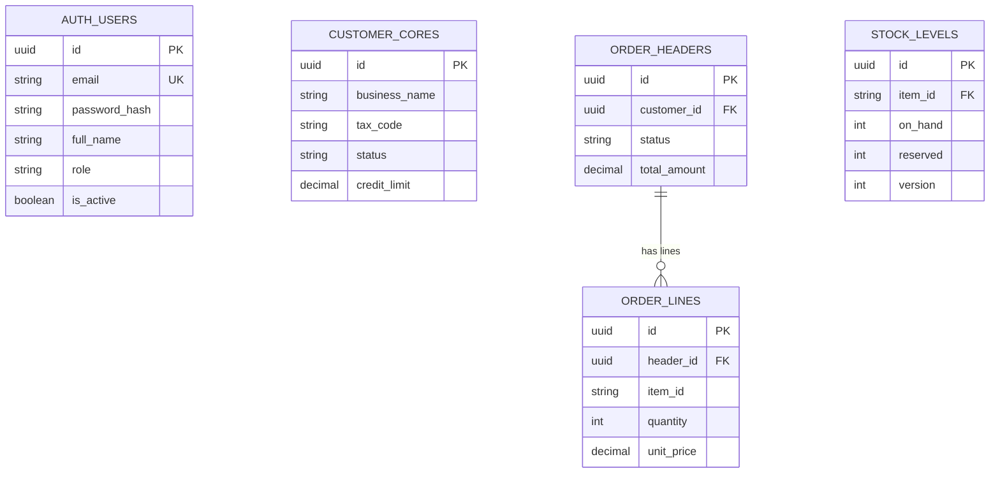

| Schema | Service sở hữu | Tables chính |
|---|---|---|
| `auth` | Auth Service | users, refresh_tokens |
| `customer` | Customer Service | cores, outbox |
| `order` | Order Service | headers, lines, status_history, lifecycle_view, outbox |
| `inventory` | Inventory Service | items, warehouses, stock_levels, movements, reservations, outbox |

**Quy tắc**: Mỗi service CHỈ đọc/ghi schema của mình. Cần data từ context khác → HTTP API hoặc event.

---

## 7. Outbox Pattern

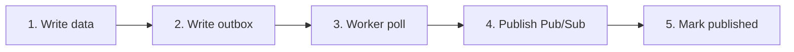

**Tại sao Outbox?**: Ghi event vào DB **cùng transaction** với business data → worker poll và publish sau → **zero event loss**.

Nếu publish trực tiếp (ngoài transaction):
- Data saved nhưng event lost (Pub/Sub down)
- Event published nhưng data rollback (transaction fail)

---

## 8. RBAC — 3 Roles

| Thao tác | `admin` | `manager` | `staff` |
|---|:---:|:---:|:---:|
| **Quản lý users** | ✅ | ❌ | ❌ |
| **Tạo customer** | ✅ | ✅ | ✅ |
| **Sửa/xóa customer** | ✅ | ✅ | ❌ |
| **Tạo order** | ✅ | ✅ | ✅ |
| **Submit/cancel order** | ✅ | ✅ | ❌ |
| **Confirm order** | ✅ | ✅ | ❌ |
| **Tạo item** | ✅ | ✅ | ✅ |
| **Nhập/xuất stock** | ✅ | ✅ | ❌ |
| **Xem dashboard** | ✅ | ✅ | ✅ |
| **Xem reports** | ✅ | ✅ | 👁️ |

---

## 9. Deployment — Local Development

```
Developer Machine
├── npm run dev
│   ├── Auth Service         :3004
│   ├── Customer Service     :3001
│   ├── Order Service        :3002
│   ├── Inventory Service    :3003
│   ├── API Gateway          :3010
│   └── Frontend (Next.js)   :3000
│
├── Docker
│   └── Pub/Sub Emulator     :8085
│
└── Cloud (Free Tier)
    ├── Supabase PostgreSQL   (Singapore)
    └── Upstash Redis         (Singapore)
```

**Startup:**
```bash
# 1. Pub/Sub Emulator
cd backend; docker compose up -d

# 2. Services (mỗi terminal riêng)
cd backend/auth-service; npm run dev        # :3004
cd backend/customer-service; npm run dev    # :3001
cd backend/order-service; npm run dev       # :3002
cd backend/inventory-service; npm run dev   # :3003
cd backend/api-gateway; npm run dev         # :3010

# 3. Frontend
cd frontend; npm run dev                    # :3000
```

---

## 10. Patterns × Services

| Pattern | Auth | Customer | Order | Inventory | Gateway |
|---|:---:|:---:|:---:|:---:|:---:|
| DDD Layers | — | ✅ | ✅ | ✅ | — |
| Repository | — | ✅ | ✅ | ✅ | — |
| Value Object | — | ✅ | — | — | — |
| Aggregate Root | — | — | ✅ | — | — |
| Outbox | — | ✅ | ✅ | ✅ | — |
| Event-Driven | — | ✅ | ✅ | ✅ | — |
| CQRS | — | — | ✅ | — | — |
| Saga | — | — | ✅ | ✅ | — |
| Optimistic Lock | — | — | — | ✅ | — |
| JWT + RBAC | ✅ | — | — | — | ✅ |

---

## 11. `@erp/shared` — Cross-cutting Infrastructure Package

5 services (Customer, Order, Inventory, Auth, Gateway) cần các primitives giống hệt: outbox worker, idempotency, cache, logger, health check, metrics, event contracts. Thay vì copy-paste → tất cả nằm trong **1 package dùng chung**: `@erp/shared`.

### Sơ đồ 6 Modules

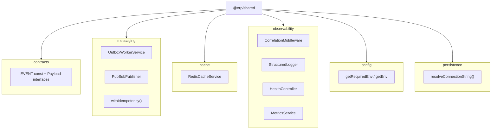

### Bảng tổng hợp modules

| Module | Files chính | Mục đích | Dùng bởi |
|---|---|---|---|
| **contracts** | `events.ts` | `EVENT` const (topic names), typed payload interfaces, `EventMetadata` | Tất cả services publish/subscribe |
| **messaging** | `outbox-worker.service.ts`, `pubsub-publisher.ts`, `idempotency.ts` | Outbox worker generic, Pub/Sub publisher với topic cache, idempotent consumer helper | Customer, Order, Inventory |
| **cache** | `redis-cache.service.ts` | Cache-Aside qua Upstash Redis REST API: `get/set/del/invalidatePattern` | Tất cả services cần cache |
| **observability** | `correlation.ts`, `logger.ts`, `health.ts`, `metrics.ts` | CorrelationId (AsyncLocalStorage), JSON logger, health check endpoint, Prometheus metrics | Tất cả services |
| **config** | `env.ts` | Đọc biến môi trường an toàn (fail-fast khi thiếu) | Tất cả services |
| **persistence** | `prisma-connection.ts` | Lấy connection string: ưu tiên pooled URL, fallback direct | Customer, Order, Inventory |

### Quan hệ giữa các files trong mỗi module

> **Cách đọc**: Theo số thứ tự trên mũi tên (①→②→③...). Đường liền = gọi trực tiếp. Đường đứt = implement/gián tiếp. Hình trụ = database/store.

#### messaging — Outbox → Publish → Dedup

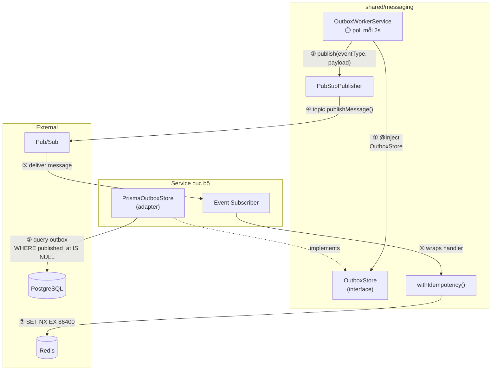

#### contracts — Event naming + typed payloads

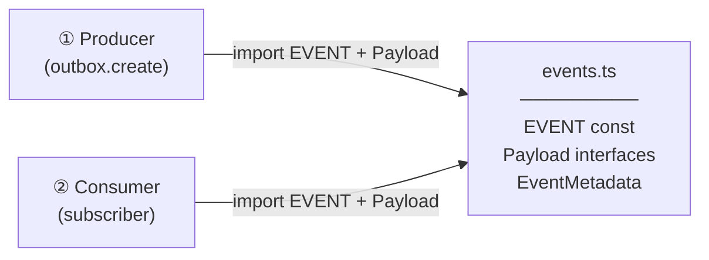

> Cả 2 phía import từ **cùng 1 file** → sai tên/field = compile error.

#### cache — Cache-Aside + shared Redis client

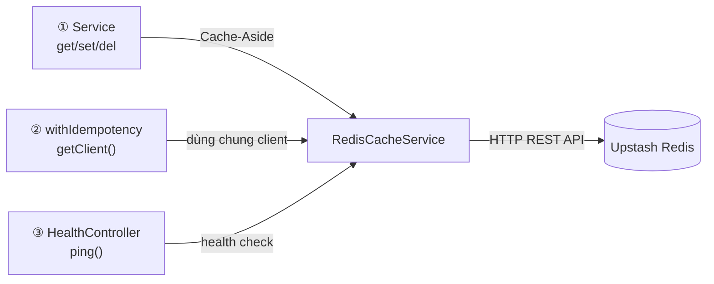

> 3 consumer hội tụ vào 1 instance `RedisCacheService` → dùng chung 1 connection.

#### observability — 2 luồng độc lập

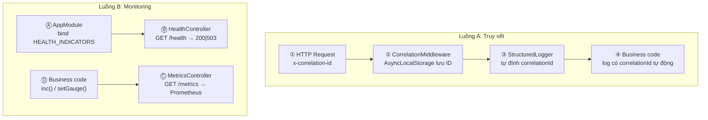

> **Luồng A** đọc từ ①→④: Request → Middleware lưu ID → Logger đính ID → Business code log bình thường.
> **Luồng B** đọc từ Ⓐ→Ⓓ: AppModule bind indicators → Health/Metrics endpoints → Business code ghi metrics.

#### config + persistence — Bootstrap helpers

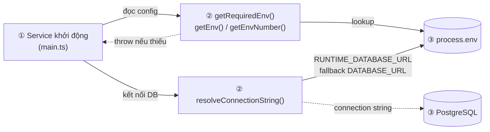

> Config + persistence gộp chung vì cùng chạy lúc bootstrap: ① service khởi động → ② đọc env/connection string → ③ kết nối external.

### Barrel Export

Mọi service chỉ cần 1 import duy nhất:

```typescript
import {
  EVENT, CustomerCreatedPayload,       // contracts
  OutboxWorkerService, withIdempotency, // messaging
  RedisCacheService,                    // cache
  StructuredLogger, HealthController,   // observability
  getRequiredEnv,                       // config
  resolveConnectionString,              // persistence
} from '@erp/shared';
```

Xem chi tiết API và cách dùng: [design-patterns](design-patterns.md) (patterns 5, 6, 12–14) · [coding-standards](../development/coding-standards.md) (sections 8–9)

