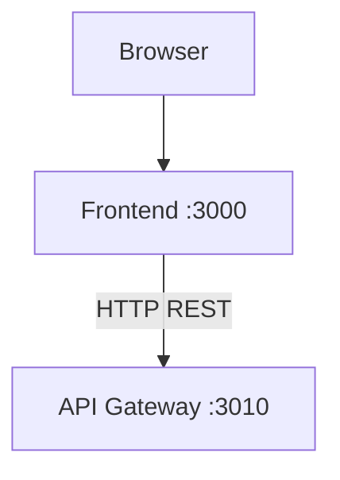
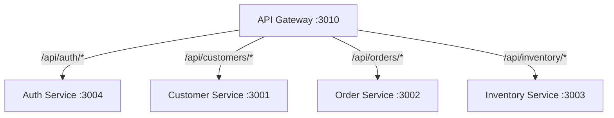
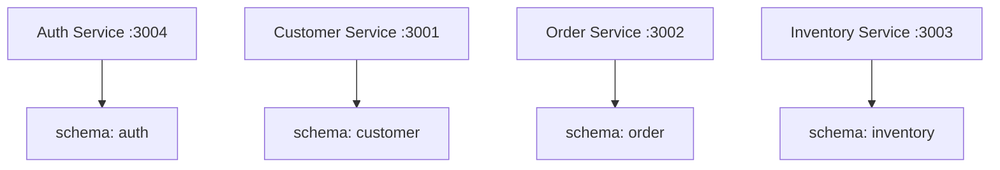
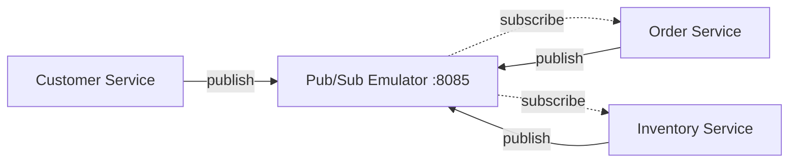
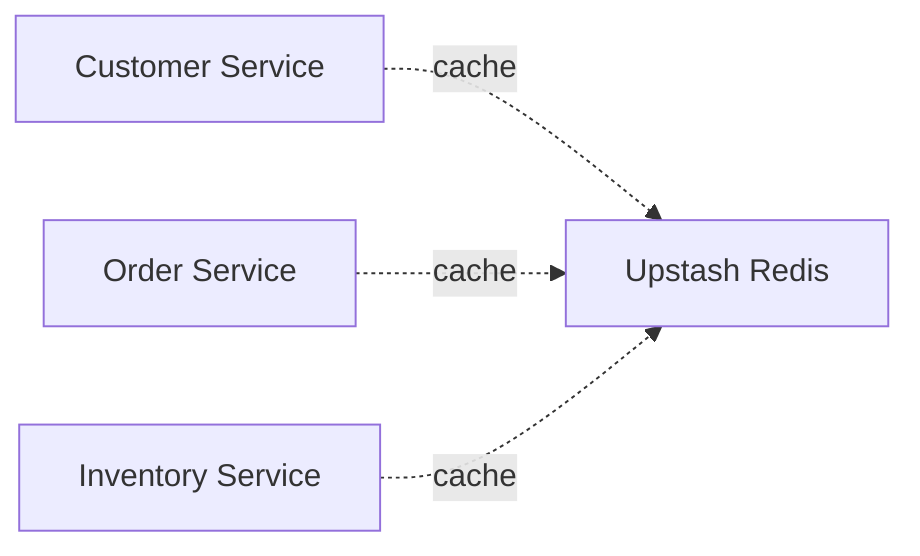
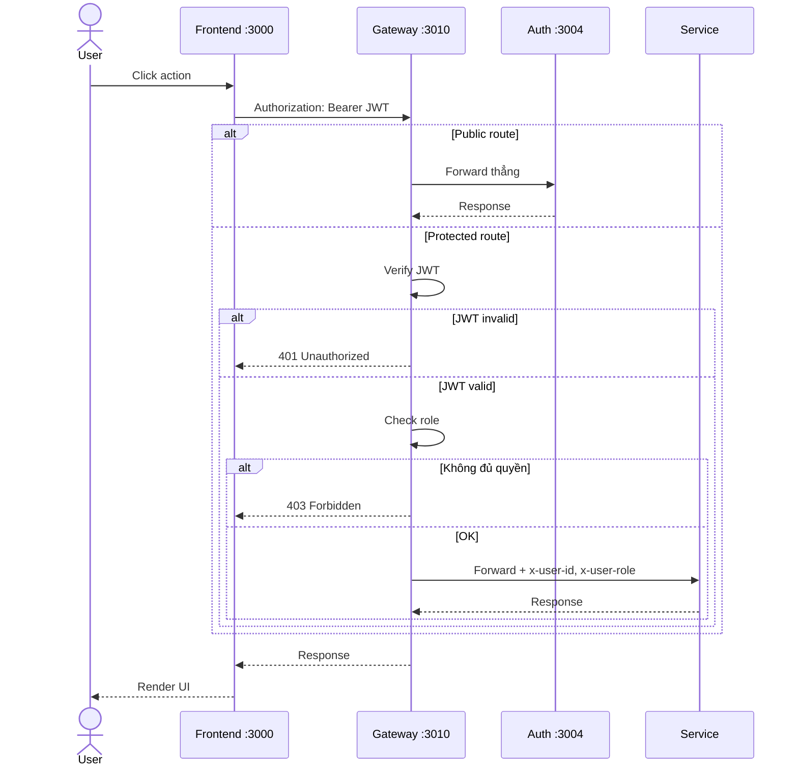
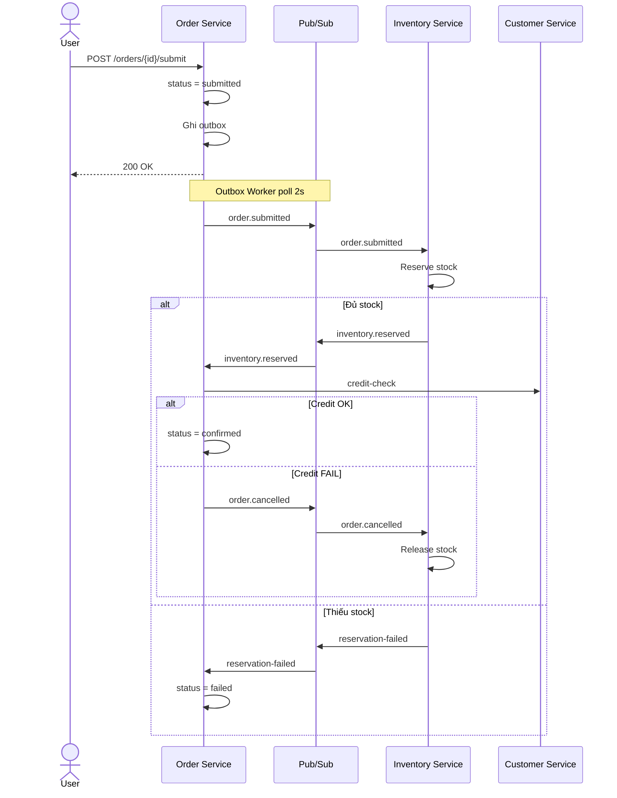
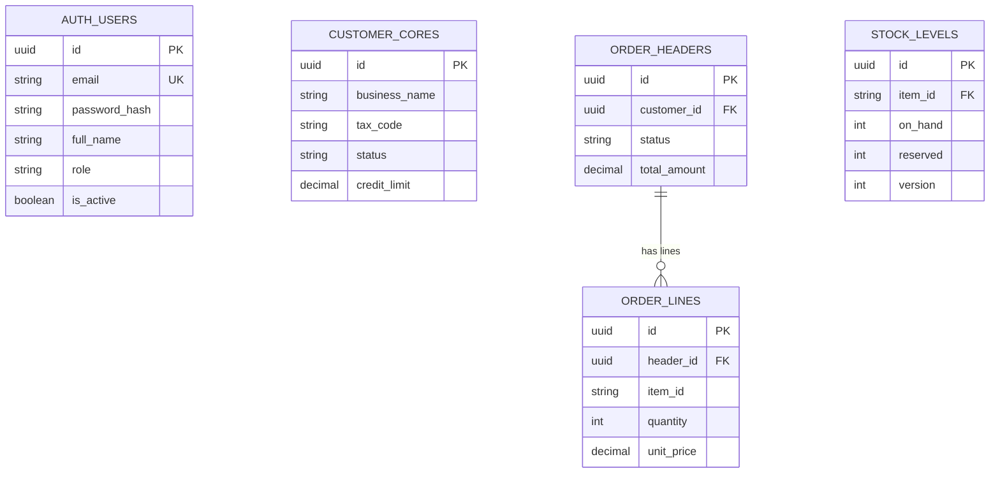
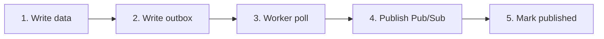

# System Overview — Kiến trúc tổng quan

> Tài liệu mô tả kiến trúc tổng thể của ERP Prototype.
> Liên quan: [bounded-contexts](bounded-contexts.md) · [data-model](data-model.md) · [event-flows](event-flows.md) · [design-patterns](design-patterns.md)

---

## 1. Luồng Request — Frontend đến Backend



---

## 2. API Gateway — Routing

Gateway nhận request từ frontend → verify JWT → check role → forward đến service đúng.



---

## 3. Services → Database

Mỗi service có schema riêng trong cùng 1 Supabase PostgreSQL instance. Không cross-schema query.



---

## 4. Services → Pub/Sub (Event-driven)

3 business services publish events qua outbox → Pub/Sub Emulator. Order và Inventory subscribe lẫn nhau (Saga).



---

## 5. Services → Redis (Cache)



---

## 6. Tech Stack

| Layer | Công nghệ | Vai trò |
|---|---|---|
| **Frontend** | Next.js 15, React 19 | SPA với App Router, SSR-ready |
| **UI Library** | Ant Design 5 | Complex components (Table, Form, Steps, Timeline) |
| **CSS** | Tailwind CSS | Utility spacing, layout, responsive |
| **Charts** | Recharts | Dashboard biểu đồ |
| **Animation** | Framer Motion | Micro-animations, page transitions |
| **Form** | React Hook Form + Zod | Form validation |
| **Data Fetching** | TanStack React Query | Cache, refetch, mutations |
| **Backend** | NestJS (TypeScript) | Framework có cấu trúc DDD (modules, DI, guards) |
| **ORM** | Prisma (code-first) | Schema → Migration → DB tables |
| **Auth** | bcrypt + jsonwebtoken | Hash password, sign/verify JWT |
| **Database** | Supabase PostgreSQL | Cloud PostgreSQL (free tier, 500MB) |
| **Cache** | Upstash Redis | Cloud Redis (free tier, REST API) |
| **Message Queue** | GCP Pub/Sub Emulator | Event-driven communication (Docker container) |
| **Container** | Docker | Chỉ chạy Pub/Sub Emulator |

---

## 7. Service Map — 5 services

| Service | Port | Schema | Patterns chính |
|---|---|---|---|
| **API Gateway** | 3010 | — | JWT Guard, RBAC, Reverse Proxy |
| **Auth Service** | 3004 | `auth` | bcrypt, JWT, Refresh Token |
| **Customer Service** | 3001 | `customer` | DDD layers, Repository, Value Object, Outbox |
| **Order Service** | 3002 | `order` | Aggregate Root, Saga, CQRS, Outbox |
| **Inventory Service** | 3003 | `inventory` | Optimistic Locking, CHECK constraint, Outbox |

---

## 8. Luồng Request chi tiết — JWT Authentication



---

## 9. Luồng Event — Saga (Order Submit)



---

## 10. Database — 4 Schemas



| Schema | Service sở hữu | Tables chính |
|---|---|---|
| `auth` | Auth Service | users, refresh_tokens |
| `customer` | Customer Service | cores, outbox |
| `order` | Order Service | headers, lines, status_history, lifecycle_view, outbox |
| `inventory` | Inventory Service | items, warehouses, stock_levels, movements, reservations, outbox |

**Quy tắc**: Mỗi service CHỈ đọc/ghi schema của mình. Cần data từ context khác → HTTP API hoặc event.

---

## 11. Outbox Pattern



**Tại sao Outbox?**: Ghi event vào DB **cùng transaction** với business data → worker poll và publish sau → **zero event loss**.

Nếu publish trực tiếp (ngoài transaction):
- Data saved nhưng event lost (Pub/Sub down)
- Event published nhưng data rollback (transaction fail)

---

## 12. RBAC — 3 Roles

| Thao tác | `admin` | `manager` | `staff` |
|---|:---:|:---:|:---:|
| **Quản lý users** | ✅ | ❌ | ❌ |
| **Tạo customer** | ✅ | ✅ | ✅ |
| **Sửa/xóa customer** | ✅ | ✅ | ❌ |
| **Tạo order** | ✅ | ✅ | ✅ |
| **Submit/cancel order** | ✅ | ✅ | ❌ |
| **Confirm order** | ✅ | ✅ | ❌ |
| **Tạo item** | ✅ | ✅ | ✅ |
| **Nhập/xuất stock** | ✅ | ✅ | ❌ |
| **Xem dashboard** | ✅ | ✅ | ✅ |
| **Xem reports** | ✅ | ✅ | 👁️ |

---

## 13. Deployment — Local Development

```
Developer Machine
├── npm run dev
│   ├── Auth Service         :3004
│   ├── Customer Service     :3001
│   ├── Order Service        :3002
│   ├── Inventory Service    :3003
│   ├── API Gateway          :3010
│   └── Frontend (Next.js)   :3000
│
├── Docker
│   └── Pub/Sub Emulator     :8085
│
└── Cloud (Free Tier)
    ├── Supabase PostgreSQL   (Singapore)
    └── Upstash Redis         (Singapore)
```

**Startup:**
```bash
# 1. Pub/Sub Emulator
cd backend; docker compose up -d

# 2. Services (mỗi terminal riêng)
cd backend/auth-service; npm run dev        # :3004
cd backend/customer-service; npm run dev    # :3001
cd backend/order-service; npm run dev       # :3002
cd backend/inventory-service; npm run dev   # :3003
cd backend/api-gateway; npm run dev         # :3010

# 3. Frontend
cd frontend; npm run dev                    # :3000
```

---

## 14. Patterns × Services

| Pattern | Auth | Customer | Order | Inventory | Gateway |
|---|:---:|:---:|:---:|:---:|:---:|
| DDD Layers | — | ✅ | ✅ | ✅ | — |
| Repository | — | ✅ | ✅ | ✅ | — |
| Value Object | — | ✅ | — | — | — |
| Aggregate Root | — | — | ✅ | — | — |
| Outbox | — | ✅ | ✅ | ✅ | — |
| Event-Driven | — | ✅ | ✅ | ✅ | — |
| CQRS | — | — | ✅ | — | — |
| Saga | — | — | ✅ | ✅ | — |
| Optimistic Lock | — | — | — | ✅ | — |
| JWT + RBAC | ✅ | — | — | — | ✅ |
