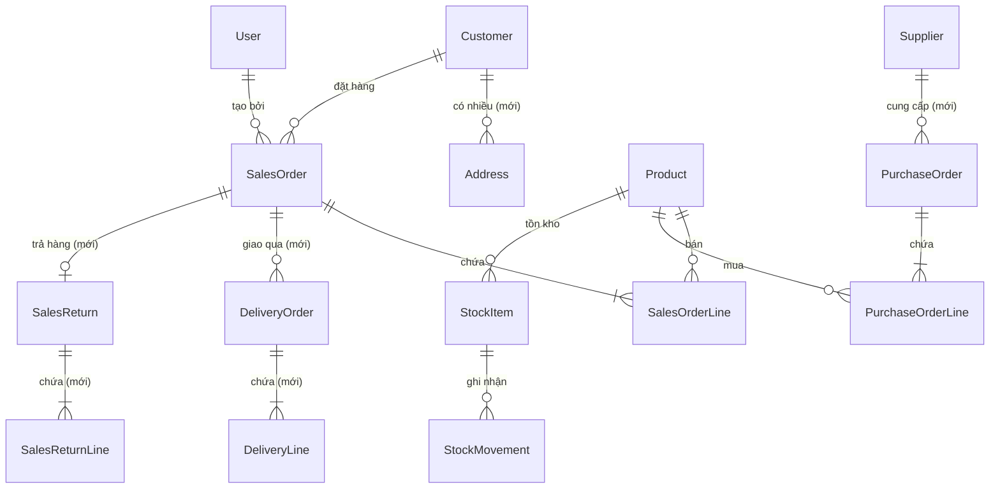

# 🎓 ERP Domain Gap Analysis — Learning Project Edition

> **Dự án**: ERP Prototype Example — B2B Trading/Distribution  
> **Mục đích**: Validate architectural patterns (DDD, CQRS, Saga, Outbox, Optimistic Locking)  
> **Phiên bản**: Filtered cho learning project — bỏ phần production-grade  
> **Cập nhật**: 2026-06-26 — Phase 0-4 đã implement xong ✅  

---

## 1. Context — Hệ thống hiện tại đã có gì?

### 6 Bounded Contexts đã implement

| Service | Nghiệp vụ | Patterns đã validate |
|---|---|---|
| **customer-service** | CRUD khách hàng B2B, credit check, lifecycle (prospect→active→suspended→archived) | DDD, Repository, Outbox, Cache-Aside, Value Object |
| **sales-service** | Đơn hàng bán: draft→submitted→confirmed→partially_delivered→fully_delivered→cancelled, Delivery Order 6-state, Sales Return | **Aggregate Root**, **Saga Choreography**, CQRS, Circuit Breaker, **VAT/Tax**, **Partial Delivery**, **Return** |
| **inventory-service** | Tồn kho: reserve/release/receive/issue | **Optimistic Locking**, Event subscriber |
| **catalog-service** | Product CRUD, activate/deactivate | DDD, Domain Events |
| **purchasing-service** | Đơn mua hàng: draft→placed→partially_received→received→cancelled | Aggregate Root, partial receive |
| **auth-service** | JWT login/refresh/logout, RBAC (admin/manager/staff) | JWT, bcrypt, RBAC |

### Patterns đã validate ✅

DDD 4 layers · Repository · Outbox · Outbox Worker (`FOR UPDATE SKIP LOCKED`) · Cache-Aside (Redis + Zod) · Observability (correlationId, structured log) · Event Envelope (versioned) · Idempotent Consumer · CQRS (read model) · Aggregate Root · Saga Choreography · Circuit Breaker (opossum) · Optimistic Locking · JWT + RBAC · API Versioning · Rate Limiting

> **Note**: Kiến trúc kỹ thuật rất solid. Phần thiếu chủ yếu là **nghiệp vụ bổ sung** giúp học thêm patterns mới.

---

## 2. 🐛 Bugs nghiệp vụ cần sửa (Quick Wins)

3 lỗi logic trong code hiện tại — sửa nhanh, effort nhỏ, nhưng quan trọng:

### Bug 1: Hàng tặng / khuyến mãi không tạo được

- **File**: `sales-service/src/domain/entities/sales-order-line.entity.ts` (L51-53)
- **Vấn đề**: `unitPrice <= 0` throw error → "Mua 10 tặng 1" không implement được
- **Thực tế B2B**: Hàng tặng = SO line với `unitPrice = 0`, vẫn xuất kho, chỉ không tính tiền
- **Sửa**: Cho phép `unitPrice >= 0` (thay `<= 0` thành `< 0`)

### Bug 2: Không bán được hàng cân/đo/đong

- **File**: `inventory-service/src/domain/entities/stock-item.entity.ts` (L127-130) + `sales-service/src/domain/entities/sales-order-line.entity.ts` (L48-49)
- **Vấn đề**: `Number.isInteger(quantity)` → chỉ cho số nguyên
- **Thực tế**: Bán 2.5 kg gạo, 1.5 mét vải, 0.75 lít dầu — đều hợp lệ
- **Sửa**: Cho phép `quantity > 0` (bỏ `Number.isInteger`), dùng `Decimal(18,4)` ở DB

### Bug 3: Credit check bị bypass khi nhiều đơn cùng lúc

- **File**: `customer-service/src/application/queries/check-credit.query.ts`
- **Vấn đề**: Chỉ check `creditUsedAmount` vs `creditLimitAmount`. Không tính SO đang `submitted` (chưa confirmed)
- **Thực tế**: 5 đơn $100 submit cùng lúc, credit limit $200 → tất cả pass → over-extend $300
- **Sửa**: Credit check = `creditUsed + SUM(pendingSalesOrders.totalAmount) + newOrderAmount ≤ creditLimit`
- **Pattern học được**: **Cross-aggregate query** — query phải span 2 contexts (Customer + Sales)

---

## 3. 🆕 Nghiệp vụ đã implement ✅ (Phase 0-4)

> Tất cả các nghiệp vụ dưới đây đã được implement trong Phase 0-4 (2026-06-25).

### 3.1. Supplier Entity — Hoàn thiện Purchasing Context

| **Trạng thái** | ✅ **DONE** — Supplier entity đã implement trong purchasing-service |
| **Vấn đề đã giải quyết** | PurchaseOrder có `supplierId` reference đến Supplier entity thực |
| **Đã làm** | Entity Supplier (tên, contact, payment terms) + CRUD API + FE page |
| **Effort thực tế** | ~2 giờ |
| **Pattern đã validate** | Hoàn thiện bounded context, cross-service reference |

**Entity Supplier đơn giản:**
```
Supplier {
  id: UUID
  name: string
  taxCode: string | null
  contactName: string | null
  contactPhone: string | null
  contactEmail: string | null
  paymentTermDays: number (30/45/60)  // Hạn thanh toán
  isActive: boolean
  createdAt, updatedAt
}
```

---

### 3.2. Delivery Order — Partial Delivery + State Machine

| | |
|---|---|
| **Trạng thái** | ✅ **DONE** — Delivery Order 6-state + Partial Delivery đã implement |
| **Đã giải quyết** | 1 SalesOrder → N DeliveryOrders, mỗi DO có state machine riêng |
| **Đã làm** | Entity DeliveryOrder + DeliveryLine, state machine, partial delivery tracking, FE DeliveryTab |
| **Effort thực tế** | ~6 giờ |
| **Pattern đã validate** | ⭐ **1:N cross-aggregate relationship**, **secondary state machine**, **domain event chaining** |

**State machine:**
```
DeliveryOrder: draft → picking → packed → shipped → delivered
                                                   → failed (giao thất bại)
SalesOrder mới: confirmed → partially_delivered → fully_delivered
```

**Tại sao hay cho learning?**
- Học cách 1 aggregate (SO) delegate công việc cho aggregate khác (DO)
- Học cách SO "tổng hợp" trạng thái từ nhiều DO (tất cả delivered → SO fully_delivered)
- Học thêm event: `delivery.completed` → SO check "còn DO nào chưa xong không?"
- Inventory `issue()` gắn vào DO thay vì SO trực tiếp

---

### 3.3. VAT / Tax per Line — Domain Calculation Rule

| | |
|---|---|
| **Trạng thái** | ✅ **DONE** — VAT/Tax per line đã implement |
| **Đã giải quyết** | Tax calculation: lineSubtotal × taxRate = taxAmount, aggregate totals |
| **Đã làm** | `taxRate` on Product, `taxRate`/`taxAmount` on SalesOrderLine, `subtotalAmount`/`totalTaxAmount`/`totalAmount` on SalesOrder |
| **Effort thực tế** | ~3 giờ |
| **Pattern đã validate** | ⭐ **Domain calculation rule**, **rounding strategy** |

**Calculation:**
```
lineSubtotal = quantity × unitPrice
lineTaxAmount = lineSubtotal × taxRate
lineTotal = lineSubtotal + lineTaxAmount

orderSubtotal = Σ(lineSubtotal)
orderTaxTotal = Σ(lineTaxAmount)
orderGrandTotal = orderSubtotal + orderTaxTotal
```

**Tại sao hay cho learning?**
- Floating point: `0.1 + 0.2 = 0.30000000000000004` → cần rounding strategy
- 1 đơn hàng MIX nhiều tax rates (sản phẩm A: 10%, sản phẩm B: 5%) → aggregate phải tổng hợp đúng
- Cơ hội tạo **Value Object `Money`** — encapsulate amount + currency + rounding

---

### 3.4. Sales Return — Reverse Workflow

| | |
|---|---|
| **Trạng thái** | ✅ **DONE** — Sales Return lifecycle đã implement |
| **Đã giải quyết** | KH trả hàng sau khi giao → flow ngược: nhận hàng lại, hoàn tiền |
| **Đã làm** | Entity SalesReturn + SalesReturnLine, flow create→approve→receive→complete, FE ReturnTab |
| **Effort thực tế** | ~4 giờ |
| **Pattern đã validate** | ⭐ **Compensating transaction business-level**, **reverse event flow** |

**Flow:**
```
KH báo trả hàng → Tạo SalesReturn (reference SO) → Duyệt
→ Thủ kho nhận hàng → inventory.receive() (nhập lại)
→ Giảm creditUsedAmount trên Customer
→ Publish event "sales-return.completed"
```

**Tại sao hay cho learning?**
- **Compensation khác Saga compensation**: Saga compensation = undo kỹ thuật (rollback). Sales Return = business action mới (có chứng từ, có approve, có thời gian)
- Tham chiếu ngược: Return reference → SO → SO lines → check "return qty ≤ delivered qty"
- Event flow ngược: bình thường SO → reserve stock. Return → receive stock (ngược lại)

---

### 3.5. Multi-address Customer (Optional)

| | |
|---|---|
| **Vấn đề hiện tại** | Customer chỉ có contact info, không có địa chỉ giao hàng |
| **Cần làm** | Value Object `Address` + Customer có collection `addresses[]` (billing, shipping) |
| **Effort** | 🟢 **Nhỏ** |
| **Pattern học được** | **Value Object collection trong Aggregate** — 1:N nhưng VO không có identity riêng |

---

## 4. 📦 Nghiệp vụ có thể GIẢN LƯỢC

Nếu muốn thêm chiều sâu nhưng không muốn quá phức tạp:

### 4.1. Basic AR (Accounts Receivable) — Simplified

| Full version | Simplified cho learning |
|---|---|
| Invoice entity, aging report, partial payment, reconciliation, write-off | → Thêm field `totalOwed` trên Customer, tăng khi fulfill SO, giảm khi nhận payment |

**GIẢ ĐỊNH**: Mỗi SO fulfilled = phát sinh công nợ = `totalAmount`. KH thanh toán = giảm `totalOwed`. Không cần Invoice entity riêng.

**Pattern**: Đơn giản, nhưng dạy concept **derived state** — `totalOwed` phải consistent với tổng SO fulfilled - tổng payments.

---

### 4.2. Approval Workflow — Simplified

| Full version | Simplified cho learning |
|---|---|
| Multi-level approval, threshold matrix, delegation, SLA | → SO có field `requiresApproval: boolean` (true nếu `totalAmount > threshold`). Manager approve → status chuyển tiếp |

**Pattern**: **Guard clause trong state machine** — submit() check nếu cần approval thì chuyển sang `pending_approval` thay vì `submitted`.

---

### 4.3. Multi-warehouse — Simplified

| Full version | Simplified cho learning |
|---|---|
| N warehouses, transfer between warehouses, in-transit stock | → Thêm `warehouseId` vào StockItem. Tạo 2 warehouses hardcode. Reserve chỉ định warehouse |

**Pattern**: **Composite key** — stock lookup = (productId, warehouseId) thay vì chỉ productId.

---

## 5. ❌ Nghiệp vụ BỎ QUA — Không phù hợp learning project

| Nghiệp vụ | Lý do bỏ |
|---|---|
| Kế toán / Sổ cái / COGS | Module riêng, cần kiến thức kế toán chuyên sâu, không dạy thêm code pattern |
| Hóa đơn điện tử + tích hợp thuế | Cần API bên thứ 3 (VNPT, Viettel...), tốn tiền, production concern |
| Compliance / Regulatory VN | Domain knowledge, không phải code pattern |
| Multi-currency | Phức tạp hóa không cần thiết cho VND-only prototype |
| Commission / Hoa hồng NVKD | Nice-to-have, không core |
| CRM / B2B Portal | Scope hoàn toàn khác |
| Barcode / QR Scanner | Hardware integration |
| Contract / Hợp đồng | Scope lớn, ít pattern mới |
| Lot/Batch / Expiry Date | Quá chi tiết cho prototype |
| Price List (full version) | `defaultSalePrice` trên Product đã đủ cho learning |
| 14+ báo cáo kế toán/quản lý | Query thuần, không dạy thêm DDD pattern |
| Data classification / Encryption | Infrastructure concern, không phải domain |

---

## 6. 🗺️ Entity Relationship Map — Learning Project

Chỉ bao gồm entities hiện có + entities NÊN thêm:



**Chú thích**: Tất cả entities đã implement trong hệ thống.

---

## 7. 🛤️ Recommended Learning Roadmap

Thứ tự implement tối ưu — mỗi bước build trên bước trước:

### Phase 0: Quick Fixes ✅ DONE (2026-06-25)
- [x] Sửa Bug 1: `unitPrice >= 0` trong SalesOrderLine
- [x] Sửa Bug 2: Bỏ `Number.isInteger` check cho quantity
- [x] Sửa Bug 3: Credit check tính thêm pending SOs

### Phase 1: Supplier Entity ✅ DONE (2026-06-25)
- [x] Tạo Supplier entity trong purchasing-service
- [x] CRUD + validate + activate/deactivate
- [x] PurchaseOrder reference Supplier entity
- [x] FE: Supplier CRUD page + PO list hiển thị supplier name

**Cái học được**: Hoàn thiện bounded context, cross-service reference

---

### Phase 2: VAT / Tax per Line ✅ DONE (2026-06-25)
- [x] Thêm `taxRate` vào Product entity
- [x] Thêm `taxRate`, `taxAmount` vào SalesOrderLine
- [x] Sửa `recalculateTotals()` → subtotal + tax = grandTotal
- [x] FE: hiển thị tax fields

**Cái học được**: Domain calculation rule, Value Object Money, rounding strategy

---

### Phase 3: Delivery Order + Partial Delivery ✅ DONE (2026-06-25)
- [x] Tạo entity DeliveryOrder + DeliveryLine
- [x] State machine: draft → picking → packed → shipped → delivered / failed
- [x] Sửa SalesOrder state machine: confirmed → partially_delivered → fully_delivered
- [x] Event: `delivery.completed` → SO aggregate check tổng hợp
- [x] FE: DeliveryTab component

**Pattern đã validate**: 1:N cross-aggregate, secondary state machine, event chaining, aggregate tổng hợp trạng thái từ children

---

### Phase 4: Sales Return ✅ DONE (2026-06-25)
- [x] Tạo entity SalesReturn + SalesReturnLine
- [x] Flow: create → approve → receive → complete
- [x] Reference SO + validate
- [x] FE: ReturnTab component

**Pattern đã validate**: Reverse workflow, compensating transaction business-level, back-reference validation

---

### Phase 5 (Optional): Multi-address + Simplified extras
- [ ] Value Object Address + Customer.addresses[]
- [ ] `warehouseId` trên StockItem
- [ ] `requiresApproval` field trên SalesOrder

**Cái học được**: VO collection, composite key, guard clause in state machine

---

## 📊 Tổng kết

| Metric | Giá trị |
|---|---|
| Bugs đã sửa | 3/3 ✅ |
| Entities đã tạo | 5/5 ✅ (Supplier, DeliveryOrder, DeliveryLine, SalesReturn, SalesReturnLine) |
| Entities đã sửa | 4/4 ✅ (SalesOrder, SalesOrderLine, Product, Customer) |
| Patterns đã validate | 6+ (cross-aggregate 1:N, secondary state machine, domain calculation, reverse workflow, event chaining, compensating transaction) |
| Actual effort | Phase 0-4: ~15 giờ |
| FE đã hoàn thiện | 9 pages, 4 new components, 50+ API methods ✅ |
| Nghiệp vụ bỏ qua | 12+ modules (kế toán, compliance, integration...) |
