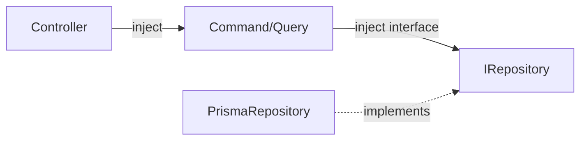
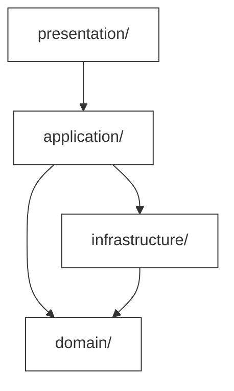

# Coding Standards — Quy chuẩn viết code

> Tài liệu quy định các chuẩn mực viết code trong dự án ERP prototype.
> Mục tiêu: **đồng nhất** (consistency), **dễ đọc** (readability), và **dễ bảo trì** (maintainability) — đặc biệt quan trọng trong dự án microservices với nhiều services.

> Liên quan: [Getting Started](./getting-started.md)

---

## 0. Nguyên tắc nền tảng — Clean Code & SOLID

> Toàn bộ code trong dự án phải tuân thủ 2 bộ nguyên tắc này. Đây là yêu cầu **bắt buộc**, không phải khuyến nghị.

### Clean Code

| Nguyên tắc | Ví dụ Sai ❌ | Ví dụ Đúng ✅ |
|---|---|---|
| **Tên rõ nghĩa** | `const d = getD()` | `const customer = getCustomerById(id)` |
| **Hàm làm 1 việc** | `createAndSendEmail()` | `create()` rồi `sendEmail()` riêng |
| **Hàm ngắn (≤ 30 dòng)** | 1 hàm 80 dòng | Tách thành 3-4 hàm nhỏ |
| **Không magic number** | `if (role === 3)` | `if (role === ROLE.STAFF)` |
| **Early return** | `if (ok) { ...100 dòng... } else { throw }` | `if (!ok) throw ...; ...tiếp tục...` |
| **DRY** | Copy-paste validation 3 chỗ | Tách thành `validateTaxCode()` dùng chung |

### SOLID

| Nguyên tắc | Áp dụng trong dự án |
|---|---|
| **S** — Single Responsibility | `CreateCustomerCommand` chỉ tạo customer. Không validate JWT hay gửi email. |
| **O** — Open/Closed | Thêm status mới → thêm handler, không sửa code cũ. |
| **L** — Liskov Substitution | `PrismaCustomerRepository` thay thế được `ICustomerRepository` ở mọi nơi. |
| **I** — Interface Segregation | `ICustomerRepository` tách khỏi `IOutboxRepository` — không gộp chung. |
| **D** — Dependency Inversion | Command inject `ICustomerRepository` (interface), không inject `PrismaCustomerRepository` (implementation). |

### Áp dụng theo DDD layer



- **Domain**: Entity thuần TypeScript, không import NestJS/Prisma → **S**, **D**
- **Application**: Mỗi Command/Query = 1 use case → **S**, **I**
- **Infrastructure**: Implement domain interfaces → **D**, **L**
- **Presentation**: Controller chỉ nhận request, delegate cho Application → **S**

---

## 1. DDD Folder Structure — Cấu trúc thư mục theo Domain-Driven Design

Mỗi service tuân theo cấu trúc 4 tầng DDD. Đây là quy ước **bắt buộc** — tất cả code mới phải đặt đúng vị trí.

```
src/
├── domain/              # Business logic thuần — KHÔNG phụ thuộc framework
│   ├── entities/        # Aggregate Roots & Entities
│   ├── value-objects/   # Value Objects (immutable)
│   ├── events/          # Domain Events
│   ├── repositories/    # Repository interfaces (contracts)
│   └── exceptions/      # Domain-specific exceptions
│
├── application/         # Use cases — điều phối logic, gọi domain
│   ├── commands/        # Write operations (CQRS Command side)
│   ├── queries/         # Read operations (CQRS Query side)
│   ├── dtos/            # Data Transfer Objects
│   ├── sagas/           # Saga orchestrators
│   └── services/        # Application services
│
├── infrastructure/      # Chi tiết kỹ thuật — database, messaging, cache
│   ├── persistence/     # Prisma repositories (implements domain interfaces)
│   ├── messaging/       # Pub/Sub publishers & subscribers
│   ├── cache/           # Redis cache implementation
│   └── config/          # Module configuration
│
└── presentation/        # HTTP layer — controllers, guards, pipes
    ├── controllers/     # NestJS controllers
    ├── guards/          # Auth & RBAC guards
    ├── pipes/           # Validation pipes
    └── decorators/      # Custom decorators
```

### Nguyên tắc phụ thuộc (Dependency Rule)



| Tầng               | Phụ thuộc vào              | KHÔNG được phụ thuộc vào        |
| ------------------- | -------------------------- | ------------------------------- |
| `domain/`           | Không gì cả (độc lập)     | application, infrastructure, presentation |
| `application/`      | domain                     | infrastructure (qua interface), presentation |
| `infrastructure/`   | domain (implement interfaces) | presentation                 |
| `presentation/`     | application                | domain trực tiếp, infrastructure trực tiếp |

> **Quy tắc vàng**: `domain/` KHÔNG BAO GIỜ import từ NestJS, Prisma, hay bất kỳ framework nào. Nó chỉ chứa pure TypeScript — business logic thuần túy.

### Ví dụ: Customer Service

```
backend/customer-service/src/
├── domain/
│   ├── entities/
│   │   └── customer.entity.ts          # Aggregate Root
│   ├── value-objects/
│   │   ├── tax-code.vo.ts              # Mã số thuế
│   │   ├── contact-info.vo.ts          # Thông tin liên hệ
│   │   └── money.vo.ts                 # Tiền tệ
│   ├── events/
│   │   └── customer-created.event.ts
│   ├── repositories/
│   │   └── customer.repository.ts      # Interface (abstract class)
│   └── exceptions/
│       └── customer-not-found.exception.ts
│
├── application/
│   ├── commands/
│   │   ├── create-customer.command.ts
│   │   └── create-customer.handler.ts
│   ├── queries/
│   │   ├── get-customer.query.ts
│   │   └── get-customer.handler.ts
│   └── dtos/
│       ├── create-customer.dto.ts
│       └── customer-response.dto.ts
│
├── infrastructure/
│   └── persistence/
│       └── prisma-customer.repository.ts  # Implements interface
│
└── presentation/
    └── controllers/
        └── customer.controller.ts
```

---

## 2. Naming Conventions — Quy tắc đặt tên

### File Naming

Tất cả files sử dụng **kebab-case** với suffix mô tả vai trò:

| Loại              | Pattern                        | Ví dụ                             |
| ----------------- | ------------------------------ | --------------------------------- |
| Entity            | `<name>.entity.ts`             | `customer.entity.ts`              |
| Value Object      | `<name>.vo.ts`                 | `tax-code.vo.ts`                  |
| Domain Event      | `<name>.event.ts`              | `customer-created.event.ts`       |
| Repository (interface) | `<name>.repository.ts`    | `customer.repository.ts`          |
| Repository (impl) | `prisma-<name>.repository.ts`  | `prisma-customer.repository.ts`   |
| Command           | `<action>-<name>.command.ts`   | `create-customer.command.ts`      |
| Command Handler   | `<action>-<name>.handler.ts`   | `create-customer.handler.ts`      |
| Query             | `<action>-<name>.query.ts`     | `get-customer.query.ts`           |
| DTO               | `<name>.dto.ts`                | `create-customer.dto.ts`          |
| Controller        | `<name>.controller.ts`         | `customer.controller.ts`          |
| Guard             | `<name>.guard.ts`              | `jwt-auth.guard.ts`               |
| Module            | `<name>.module.ts`             | `customer.module.ts`              |
| Service           | `<name>.service.ts`            | `customer.service.ts`             |

### Class & Variable Naming

| Loại          | Convention      | Ví dụ                                      |
| ------------- | --------------- | ------------------------------------------ |
| Class         | `PascalCase`    | `CustomerEntity`, `TaxCode`, `CreateCustomerCommand` |
| Interface     | `PascalCase`    | `CustomerRepository` (không prefix `I`)    |
| Variable      | `camelCase`     | `customerName`, `creditLimit`              |
| Constant      | `UPPER_SNAKE`   | `MAX_RETRY_COUNT`, `JWT_SECRET`            |
| Enum          | `PascalCase`    | `OrderStatus`, `UserRole`                  |
| Enum Value    | `UPPER_SNAKE`   | `OrderStatus.DRAFT`, `UserRole.ADMIN`      |
| Method        | `camelCase`     | `calculateTotal()`, `validateTaxCode()`    |

### Ví dụ đặt tên đúng vs sai

```typescript
// ✅ ĐÚNG
class CreateCustomerCommand { }
const creditLimitAmount = 50_000_000;
enum OrderStatus { DRAFT = 'draft', SUBMITTED = 'submitted' }

// ❌ SAI
class createCustomerCommand { }     // Class phải PascalCase
const CreditLimitAmount = 50000000; // Variable phải camelCase
enum orderStatus { draft, submitted } // Enum phải PascalCase
```

---

## 3. Prisma Conventions — Quy chuẩn Prisma

### Vị trí file

```
backend/<service-name>/
├── prisma/
│   ├── schema.prisma       # Schema definition
│   ├── seed.ts             # Seed data (optional)
│   └── migrations/         # Migration files (auto-generated)
```

### Model Naming

| Trong Prisma          | Trong Database        | Quy tắc                   |
| --------------------- | --------------------- | -------------------------- |
| Model name            | —                     | **PascalCase**             |
| Field name            | —                     | **camelCase**              |
| Table name (`@@map`)  | `snake_case`          | Luôn dùng `@@map`         |
| Column name (`@map`)  | `snake_case`          | Luôn dùng `@map`          |

### Ví dụ Schema

```prisma
// prisma/schema.prisma

generator client {
  provider = "prisma-client-js"
}

datasource db {
  provider = "postgresql"
  url      = env("DATABASE_URL")
  schemas  = ["customer"]
}

model Customer {
  id                String   @id @default(uuid()) @map("id")
  businessName      String   @map("business_name")
  taxCode           String   @unique @map("tax_code")
  contactName       String   @map("contact_name")
  contactPhone      String   @map("contact_phone")
  contactEmail      String   @map("contact_email")
  creditLimitAmount Decimal  @map("credit_limit_amount") @db.Decimal(15, 2)
  status            String   @default("active") @map("status")
  createdAt         DateTime @default(now()) @map("created_at")
  updatedAt         DateTime @updatedAt @map("updated_at")

  @@map("customers")
  @@schema("customer")
}
```

### Prisma Best Practices

| Quy tắc                               | Lý do                                     |
| -------------------------------------- | ------------------------------------------ |
| Luôn dùng `@@map` / `@map`            | Giữ code TypeScript camelCase, DB snake_case|
| Dùng `@db.Decimal(15, 2)` cho tiền    | Tránh lỗi floating point với money         |
| Dùng `@default(uuid())` cho primary key| UUID tốt hơn auto-increment trong microservices |
| Khai báo `@@schema("...")` rõ ràng     | Mỗi service dùng schema riêng              |
| Dùng `@updatedAt` cho timestamp        | Prisma tự động cập nhật                    |

---

## 4. Code Comments — Quy tắc viết comment

### Ngôn ngữ

**Tất cả comments phải viết bằng tiếng Anh** — đảm bảo consistency và khả năng đọc cho team đa quốc gia.

### Khi nào VIẾT comment

| Tình huống                              | Ví dụ                                    |
| --------------------------------------- | ---------------------------------------- |
| Business logic phức tạp                 | Giải thích công thức tính credit          |
| Quyết định thiết kế không rõ ràng       | Tại sao dùng soft delete thay vì hard delete |
| Workaround / hack tạm thời             | `// HACK: Prisma doesn't support...`     |
| API contract quan trọng                 | Interface của repository                  |
| Regex phức tạp                          | Giải thích pattern matching               |

### Khi nào KHÔNG viết comment

| Tình huống                              | Ví dụ                                    |
| --------------------------------------- | ---------------------------------------- |
| Code tự giải thích                      | `const total = price * quantity`          |
| Lặp lại tên function / variable         | `// Get customer` trước `getCustomer()`  |
| Comment TODO không có owner / deadline  | `// TODO: fix later`                     |

### Ví dụ comment đúng chuẩn

```typescript
// ✅ GOOD: Explains WHY, not WHAT
// Reserve stock before confirming order to prevent overselling.
// Uses optimistic locking to handle concurrent reservations.
async reserveStock(itemId: string, quantity: number): Promise<void> {
  // ...
}

// ✅ GOOD: Documents business rule
// Credit limit must be checked BEFORE order submission.
// available = creditLimit - sum(pending_orders)
async checkCreditLimit(customerId: string, orderAmount: number): Promise<boolean> {
  // ...
}

// ❌ BAD: States the obvious
// This function creates a customer
async createCustomer(dto: CreateCustomerDto): Promise<Customer> {
  // ...
}
```

---

## 5. Git Commit Format — Quy chuẩn commit message

Sử dụng **Conventional Commits** format:

```
type(scope): description
```

### Commit Types

| Type       | Mục đích                                  | Ví dụ                                           |
| ---------- | ----------------------------------------- | ------------------------------------------------ |
| `feat`     | Tính năng mới                             | `feat(order): add order submission endpoint`     |
| `fix`      | Sửa bug                                   | `fix(auth): handle expired refresh token`        |
| `chore`    | Cấu hình, dependency, tooling             | `chore(deps): update prisma to v6.0`             |
| `docs`     | Cập nhật tài liệu                         | `docs(api): add inventory endpoint reference`    |
| `refactor` | Refactor code (không thay đổi behavior)   | `refactor(customer): extract tax-code value object` |

### Scope (optional nhưng khuyến nghị)

| Scope       | Áp dụng cho              |
| ----------- | ------------------------ |
| `auth`      | Auth Service             |
| `customer`  | Customer Service         |
| `order`     | Order Service            |
| `inventory` | Inventory Service        |
| `gateway`   | API Gateway              |
| `frontend`  | Frontend Next.js         |
| `deps`      | Dependencies             |
| `api`       | API documentation        |

### Quy tắc description

| Quy tắc                      | Ví dụ đúng                                | Ví dụ sai                       |
| ----------------------------- | ---------------------------------------- | -------------------------------- |
| Lowercase, không dấu chấm    | `add order cancellation with reason`      | `Add order cancellation.`        |
| Imperative mood (mệnh lệnh)  | `add validation for tax code`             | `added validation for tax code`  |
| Ngắn gọn, < 72 ký tự         | `fix credit check race condition`         | `fix the bug where credit check sometimes fails when two orders are submitted at the same time` |

### Ví dụ commit messages

```bash
git commit -m "feat(order): add order lifecycle CQRS read model"
git commit -m "fix(customer): prevent duplicate tax code on creation"
git commit -m "chore(auth): configure bcrypt salt rounds"
git commit -m "docs(api): document inventory stock endpoints"
git commit -m "refactor(order): extract order status to value object"
```

---

## 6. Error Handling — Xử lý lỗi

### Nguyên tắc

| Quy tắc                                | Mô tả                                    |
| --------------------------------------- | ----------------------------------------- |
| Dùng `HttpException` của NestJS         | Chuẩn hóa error response format           |
| **KHÔNG** trả stack trace trong response | Tránh lộ thông tin nội bộ                  |
| Log stack trace phía server (internal)  | Dùng NestJS Logger                        |
| Dùng custom exception classes           | Mỗi domain có exception riêng             |
| HTTP status codes phải chính xác        | 400 ≠ 404 ≠ 409                           |

### Error Response Format

Tất cả error responses tuân theo format thống nhất:

```json
{
  "statusCode": 400,
  "error": "VALIDATION_ERROR",
  "message": "Tax code must be 10 or 13 digits"
}
```

| Field        | Type     | Mô tả                              |
| ------------ | -------- | ----------------------------------- |
| `statusCode` | `number` | HTTP status code                    |
| `error`      | `string` | Error code (UPPER_SNAKE_CASE)       |
| `message`    | `string` | Mô tả dễ hiểu cho developer/client |

### Domain Exception → HttpException

```typescript
// domain/exceptions/customer-not-found.exception.ts
export class CustomerNotFoundException extends Error {
  constructor(id: string) {
    super(`Customer with id ${id} not found`);
  }
}

// presentation/controllers/customer.controller.ts
@Get(':id')
async getCustomer(@Param('id') id: string) {
  try {
    return await this.getCustomerQuery.execute(id);
  } catch (error) {
    if (error instanceof CustomerNotFoundException) {
      throw new HttpException(
        { statusCode: 404, error: 'CUSTOMER_NOT_FOUND', message: error.message },
        HttpStatus.NOT_FOUND,
      );
    }
    throw error; // Let NestJS global exception filter handle unknown errors
  }
}
```

### HTTP Status Codes sử dụng trong dự án

| Code  | Ý nghĩa            | Khi nào dùng                               |
| ----- | ------------------- | ------------------------------------------ |
| `200` | OK                  | GET thành công, UPDATE thành công           |
| `201` | Created             | POST tạo resource mới thành công            |
| `400` | Bad Request         | Validation lỗi, business rule vi phạm      |
| `401` | Unauthorized        | Token không hợp lệ hoặc thiếu              |
| `403` | Forbidden           | Token hợp lệ nhưng role không đủ quyền     |
| `404` | Not Found           | Resource không tồn tại                      |
| `409` | Conflict            | Duplicate (email, taxCode), version mismatch|
| `500` | Internal Error      | Lỗi không mong muốn (luôn log stack trace) |

---

## 7. Import Order — Thứ tự import

Các import statements trong mỗi file TypeScript phải tuân theo thứ tự sau, ngăn cách bởi dòng trống:

```typescript
// 1. External packages (node_modules)
import { Controller, Get, Post, Body } from '@nestjs/common';
import { ApiTags, ApiOperation } from '@nestjs/swagger';

// 2. Internal packages (absolute paths within project)
import { CreateCustomerCommand } from '@application/commands/create-customer.command';
import { CustomerRepository } from '@domain/repositories/customer.repository';

// 3. Relative imports (same module)
import { CreateCustomerDto } from '../dtos/create-customer.dto';
import { CustomerResponseDto } from '../dtos/customer-response.dto';
```

| Thứ tự | Loại                | Ví dụ prefix                     |
| ------ | ------------------- | -------------------------------- |
| 1      | External packages   | `@nestjs/`, `bcrypt`, `prisma`   |
| 2      | Internal (absolute) | `@domain/`, `@application/`      |
| 3      | Relative            | `./`, `../`                      |

> **Mẹo**: Cấu hình path aliases trong `tsconfig.json` để dùng absolute imports (`@domain/`, `@application/`, ...) thay vì relative paths dài.

---

## Tổng hợp Checklist

Trước khi push code, tự kiểm tra theo checklist sau:

| #  | Kiểm tra                                  | ✅ |
| -- | ----------------------------------------- | -- |
| 1  | File đặt đúng thư mục DDD?               |    |
| 2  | File name kebab-case với đúng suffix?     |    |
| 3  | Class PascalCase, variable camelCase?     |    |
| 4  | Prisma model có `@@map` và `@map`?        |    |
| 5  | Comments viết bằng tiếng Anh?            |    |
| 6  | Commit message đúng format?              |    |
| 7  | Error dùng HttpException, không leak stack trace? |    |
| 8  | Import theo thứ tự: external → internal → relative? |    |
| 9  | Domain layer không import framework?      |    |

---

Liên quan: [Getting Started](./getting-started.md) · [Auth Endpoints](../api/auth-endpoints.md) · [Customer Endpoints](../api/customer-endpoints.md) · [Order Endpoints](../api/order-endpoints.md) · [Inventory Endpoints](../api/inventory-endpoints.md)
