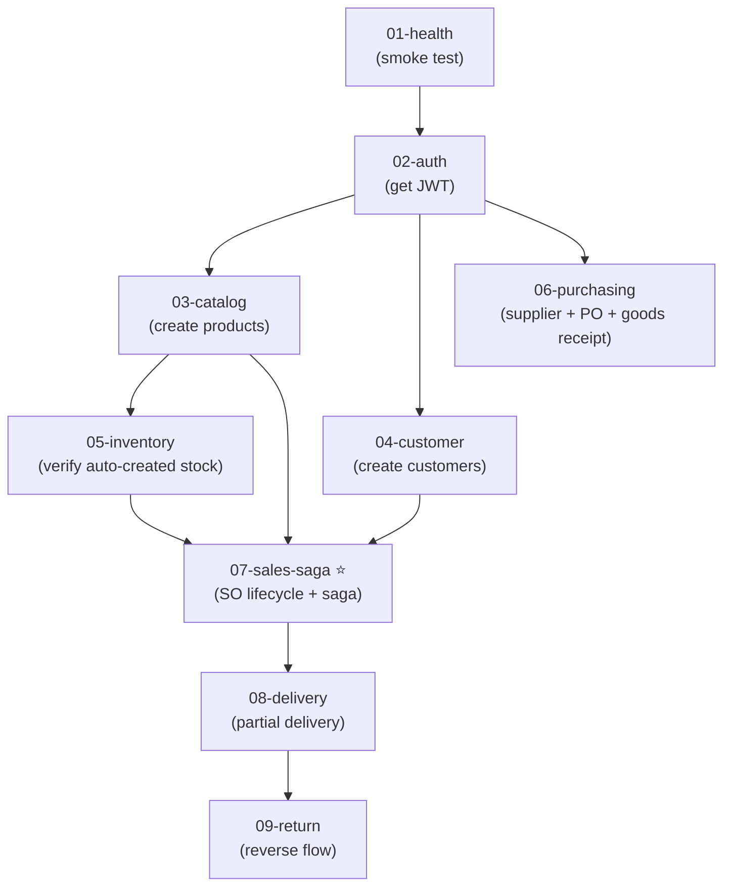

# E2E Test Plan — ERP Prototype Example

> **Cập nhật:** 2026-06-25 | **Total test cases:** ~80+
> Bộ E2E test coverage toàn bộ 9 business flows chính, chạy qua API Gateway (`localhost:3010`) trên Docker Compose dev environment.

---

## 1. Lưu ý quan trọng

### Data & Environment

- **Test chạy trên data thật (Supabase PostgreSQL).** E2E test sẽ tạo/sửa/xóa data thực trên Supabase.
- Dùng **cleanup per test** — tạo data đầu suite, dọn cuối suite.
- Đây là learning project nên chạy trực tiếp trên schema chính.

### Rate Limiting

- API Gateway có rate limit **100 req/15 min** global và **5/15 min** cho login.
- Test suite cần lưu ý throttle hoặc disable rate limit khi test.

### Decisions

| Quyết định | Lựa chọn |
|---|---|
| Test framework | **Jest + axios** (tận dụng helpers đã có) |
| Auth seed | Cần tạo seed script tạo admin user |
| Dev workflow | Chạy infra qua `docker compose up -d` + services native qua `npm run dev:all` |

---

## 2. File Structure

```
backend/test/e2e/
├── helpers/
│   ├── api.ts              ✅ (đã có) — axios client + JWT management
│   ├── wait-for.ts         ✅ (đã có) — polling helper cho async saga
│   ├── seed.ts             [NEW] — tạo test data (admin user, products, customers)
│   └── cleanup.ts          [NEW] — dọn test data sau mỗi suite
├── suites/
│   ├── 01-health.e2e.ts    [NEW] — Health check tất cả services
│   ├── 02-auth.e2e.ts      [NEW] — Login, refresh, me, logout
│   ├── 03-catalog.e2e.ts   [NEW] — Product CRUD + activate/deactivate
│   ├── 04-customer.e2e.ts  [NEW] — Customer CRUD + credit check
│   ├── 05-inventory.e2e.ts [NEW] — Stock item CRUD + receive/reserve/release/issue
│   ├── 06-purchasing.e2e.ts [NEW] — Supplier + PO lifecycle + goods receipt → inventory
│   ├── 07-sales-saga.e2e.ts [NEW] — ⭐ Core: SO draft→submit→confirm + compensation
│   ├── 08-delivery.e2e.ts  [NEW] — DO lifecycle + partial delivery → SO status
│   └── 09-return.e2e.ts    [NEW] — Sales return lifecycle
├── jest.e2e.config.ts      [NEW] — Jest config cho E2E
└── README.md               [NEW] — Hướng dẫn chạy E2E
```

---

## 3. Helpers

### seed.ts — Test Data Seeding

Seed data cần cho mọi test suite:
- Login bằng admin account → get JWT
- Tạo 1 test customer (credit limit $10,000)
- Tạo 2 test products qua Catalog (SKU: `TEST-PROD-A`, `TEST-PROD-B`)
- Chờ inventory auto-creates stock items (via `product.created` event)
- Receive stock cho cả 2 products (qty: 100)
- Tạo 1 test supplier

Export: `seedTestData()` → trả về IDs + references cho test suites.

### cleanup.ts — Test Data Cleanup

Cleanup logic: soft-delete hoặc cancel entities đã tạo. Không hard-delete (respect DB constraints).

### api.ts — HTTP Client (đã có)

Thêm `put()` method (nếu cần) và export `BASE_URL` constant.

---

## 4. Test Suites — Chi tiết

### Suite 01: Health Check (`01-health.e2e.ts`)

| # | Test Case | Endpoint | Expected |
|---|-----------|----------|----------|
| 1 | Gateway health | `GET /health` (gateway) | 200 |
| 2 | Customer health | `GET /api/customers` (auth required) | 401 (no token) |

**Mục đích:** Smoke test — đảm bảo tất cả services đều running và gateway proxy hoạt động.

---

### Suite 02: Auth Flow (`02-auth.e2e.ts`)

| # | Test Case | Expected |
|---|-----------|----------|
| 1 | Login success (admin) | 200 + accessToken + refreshToken |
| 2 | Login wrong password | 401 |
| 3 | Login wrong email | 401 |
| 4 | Access protected route without token | 401 |
| 5 | Access protected route with valid token | 200 |
| 6 | Refresh token | 200 + new token pair |
| 7 | GET /auth/me | 200 + user info |
| 8 | Logout | 204 |
| 9 | Refresh with revoked token after logout | 401 |

**Pattern tested:** JWT, refresh token rotation, RBAC.

---

### Suite 03: Catalog (`03-catalog.e2e.ts`)

| # | Test Case | Expected |
|---|-----------|----------|
| 1 | Create product (sku, name, unitPrice, taxRate=10%) | 201 |
| 2 | Get product by ID | 200 + full details |
| 3 | Search products (pagination) | 200 + paginated list |
| 4 | Update product (change name, price) | 200 |
| 5 | Deactivate product | 200, isActive=false |
| 6 | Activate product | 200, isActive=true |
| 7 | Create product → verify stock item auto-created in inventory | Inventory has matching SKU |

**Pattern tested:** CRUD, domain events cross-context (product.created → inventory auto-create).

---

### Suite 04: Customer (`04-customer.e2e.ts`)

| # | Test Case | Expected |
|---|-----------|----------|
| 1 | Create customer (businessName, creditLimit) | 201 |
| 2 | Get customer by ID | 200 |
| 3 | Search customers (q, pagination) | 200 |
| 4 | Update customer (contactName, contactPhone) | 200 |
| 5 | Credit check — within limit | canOrder=true |
| 6 | Credit check — exceeds limit | canOrder=false |
| 7 | Delete customer (soft delete) | 204, status=archived |

**Pattern tested:** CRUD, value objects, credit check query, Cache-Aside.

---

### Suite 05: Inventory (`05-inventory.e2e.ts`)

| # | Test Case | Expected |
|---|-----------|----------|
| 1 | Create stock item | 201 |
| 2 | Get item by SKU | 200 |
| 3 | Search items (pagination) | 200 |
| 4 | Receive stock (qty: 50) | available += 50 |
| 5 | Reserve stock (qty: 10) | available -= 10, reserved += 10 |
| 6 | Release stock (qty: 10) | available += 10, reserved -= 10 |
| 7 | Issue stock (qty: 5) | reserved -= 5 |
| 8 | Reserve more than available → error | 400 |
| 9 | Check availability (sufficient) | 200 + available=true |
| 10 | Check availability (insufficient) | 200 + available=false |

**Pattern tested:** Optimistic Locking, decimal quantities, domain operations.

---

### Suite 06: Purchasing (`06-purchasing.e2e.ts`)

| # | Test Case | Expected |
|---|-----------|----------|
| 1 | Create supplier | 201 |
| 2 | Get supplier | 200 |
| 3 | Update supplier | 200 |
| 4 | Search suppliers | 200 |
| 5 | Create PO (draft) with supplierId | 201 |
| 6 | Add line to PO | 201 |
| 7 | Add second line | 201 |
| 8 | Remove line from PO | 204 |
| 9 | Place PO (draft → placed) | 200 |
| 10 | Receive goods (partial) → PO = partially_received | 200 |
| 11 | Receive goods (remaining) → PO = received | 200 |
| 12 | Verify inventory received stock via event (goods.received) | Stock qty increased |
| 13 | Cancel a draft PO | 200 |

**Pattern tested:** PO lifecycle, partial receive, cross-service events (goods.received → inventory.receive).

---

### Suite 07: Sales Order Saga ⭐ (`07-sales-saga.e2e.ts`)

**⭐ Đây là suite quan trọng nhất — validate Saga Choreography end-to-end.**

| # | Test Case | Expected |
|---|-----------|----------|
| **Happy Path** | | |
| 1 | Create SO (draft) | 201, status=draft |
| 2 | Add line (Product A: qty=5, price=1000) | 201, totalAmount recalculated |
| 3 | Add line (Product B: qty=3, price=500) | 201, totalAmount recalculated |
| 4 | Submit SO → triggers saga | 200, status=submitted |
| 5 | Wait for inventory.reserved event | status → confirmed (poll) |
| 6 | Verify inventory: reserved qty increased | reserve OK |
| 7 | Verify credit check passed | confirmed ✅ |
| **Compensation: Insufficient Stock** | | |
| 8 | Create SO with qty > available stock | 201 |
| 9 | Submit → inventory cannot reserve | waitFor status=cancelled |
| 10 | Verify cancellation reason | "insufficient stock" |
| **Compensation: Insufficient Credit** | | |
| 11 | Create customer with low credit limit ($100) | 201 |
| 12 | Create SO with totalAmount > credit limit | 201 |
| 13 | Submit → stock reserved → credit check fails | waitFor status=cancelled |
| 14 | Verify inventory released (compensation) | reserved qty back to 0 |
| **Edge Cases** | | |
| 15 | Submit SO with no lines → error | 400 |
| 16 | Cancel a draft SO | 200, status=cancelled |
| 17 | Cancel a confirmed SO → stock released | 200 + inventory released |
| 18 | Get lifecycle (CQRS read model) | 200 + timeline events |

**Pattern tested:** Saga Choreography, Outbox, Pub/Sub, Idempotent Consumer, Circuit Breaker, CQRS read model.

**waitFor strategy:** Poll `GET /api/orders/:id` every 500ms (max 15s) until `status !== 'submitted'`.

---

### Suite 08: Delivery Order (`08-delivery.e2e.ts`)

**Prerequisite:** 1 confirmed SO (via saga) with Product A: qty=10, Product B: qty=5.

| # | Test Case | Expected |
|---|-----------|----------|
| 1 | Create DO#1 (A:6, B:5) — partial | 201, status=draft |
| 2 | Start picking DO#1 | status=picking |
| 3 | Pack DO#1 | status=packed |
| 4 | Ship DO#1 | status=shipped |
| 5 | Deliver DO#1 → SO = partially_delivered | DO=delivered, SO=partially_delivered |
| 6 | Create DO#2 (A:4) — remaining | 201 |
| 7 | Fast-track DO#2 (pick→pack→ship→deliver) | DO=delivered |
| 8 | SO = fully_delivered | SO status = fully_delivered |
| 9 | List all DOs for SO | 2 delivery orders |
| 10 | Create DO for non-confirmed SO → error | 400 |
| 11 | Fail a DO (shipped → failed) | status=failed, SO unchanged |

**Pattern tested:** 1:N cross-aggregate, secondary state machine, event chaining, partial delivery aggregation.

---

### Suite 09: Sales Return (`09-return.e2e.ts`)

**Prerequisite:** 1 fully_delivered SO.

| # | Test Case | Expected |
|---|-----------|----------|
| 1 | Create return (reason, lines with qty) | 201, status=draft |
| 2 | Approve return | status=approved |
| 3 | Receive goods | status=goods_received |
| 4 | Complete return | status=completed |
| 5 | List returns for SO | 1 return |
| 6 | Create return for non-delivered SO → error | 400 |
| 7 | Reject a return | status=rejected |

**Pattern tested:** Reverse workflow, compensating transaction (business level), back-reference validation.

---

## 5. Jest Config

```typescript
// jest.e2e.config.ts
{
  testTimeout: 60000,        // 60s per test (saga cần thời gian)
  maxWorkers: 1,             // Sequential — order matters
  testMatch: ['**/suites/*.e2e.ts'],
  setupFilesAfterSetup: ['./helpers/seed.ts'],
}
```

**package.json script:**
```json
"test:e2e": "jest --config test/e2e/jest.e2e.config.ts --runInBand --forceExit"
```

---

## 6. Execution Order & Dependencies



**Sequential execution (`--runInBand`):** Tests phải chạy theo thứ tự vì suite sau phụ thuộc data từ suite trước.

---

## 7. Cách chạy

```bash
# 1. Start tất cả services
# Start infra (Pub/Sub emulator)
cd backend && docker compose up -d
# Start all services (native)
npm run dev:all

# 2. Wait for health
curl -sf http://localhost:3010/health || echo "Gateway not ready"

# 3. Run E2E
npm run test:e2e
```

---

## 8. Coverage Matrix

| Flow | Suite | Happy Path | Error Path | Compensation |
|------|-------|:---:|:---:|:---:|
| Auth | 02 | ✅ | ✅ | — |
| Catalog CRUD | 03 | ✅ | — | — |
| Customer CRUD | 04 | ✅ | ✅ | — |
| Inventory | 05 | ✅ | ✅ | — |
| Purchasing + GR | 06 | ✅ | ✅ | — |
| Sales Saga | 07 | ✅ | ✅ | ✅ |
| Delivery | 08 | ✅ | ✅ | — |
| Return | 09 | ✅ | ✅ | — |
| Cross-service events | 03,06,07 | ✅ | ✅ | ✅ |

**Total test cases: ~80+**
