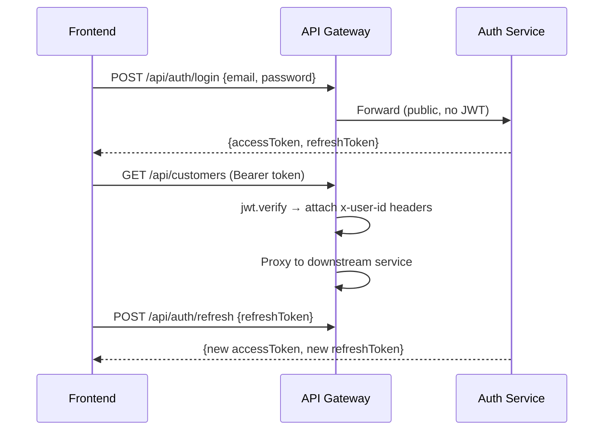
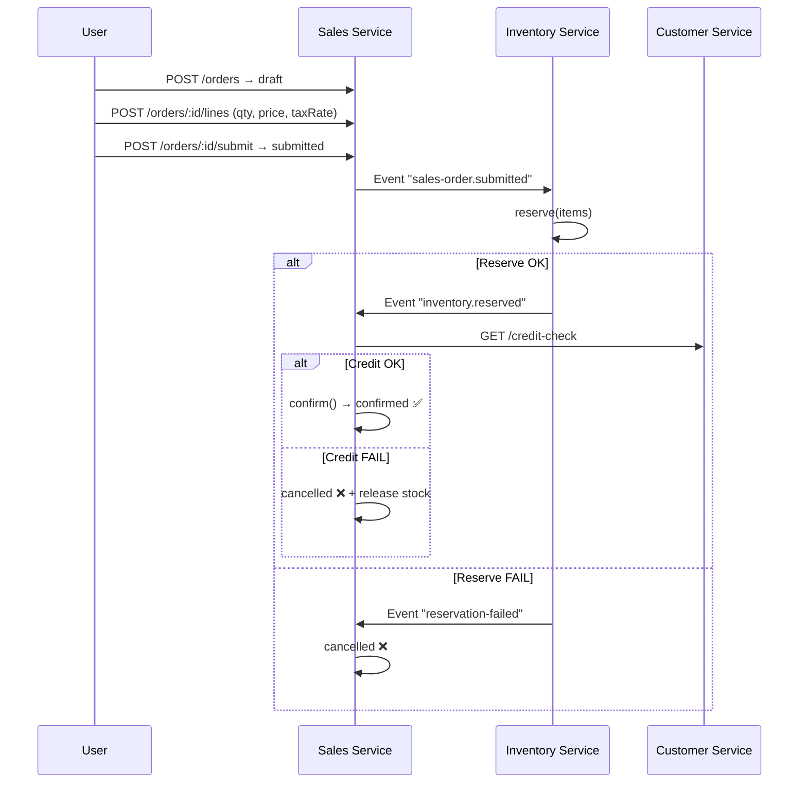
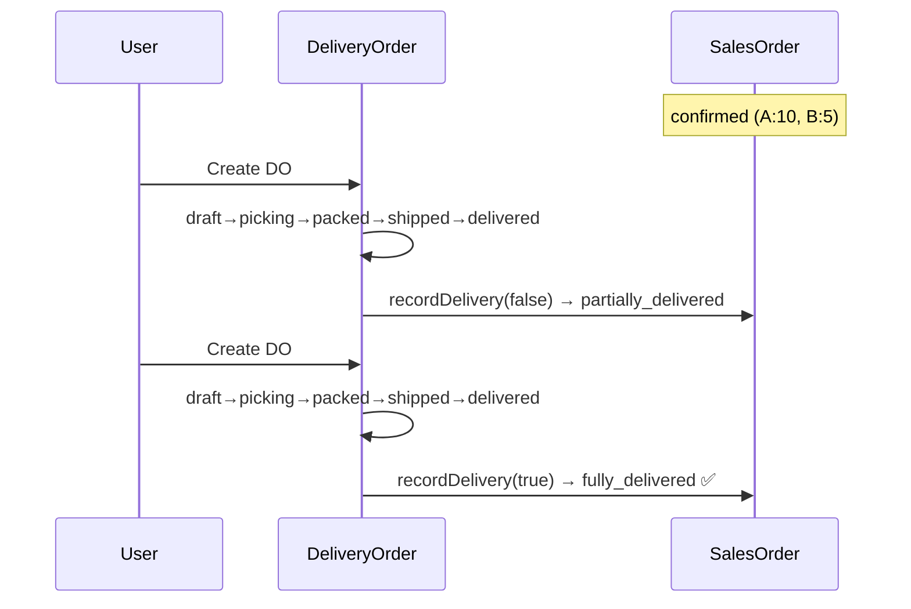
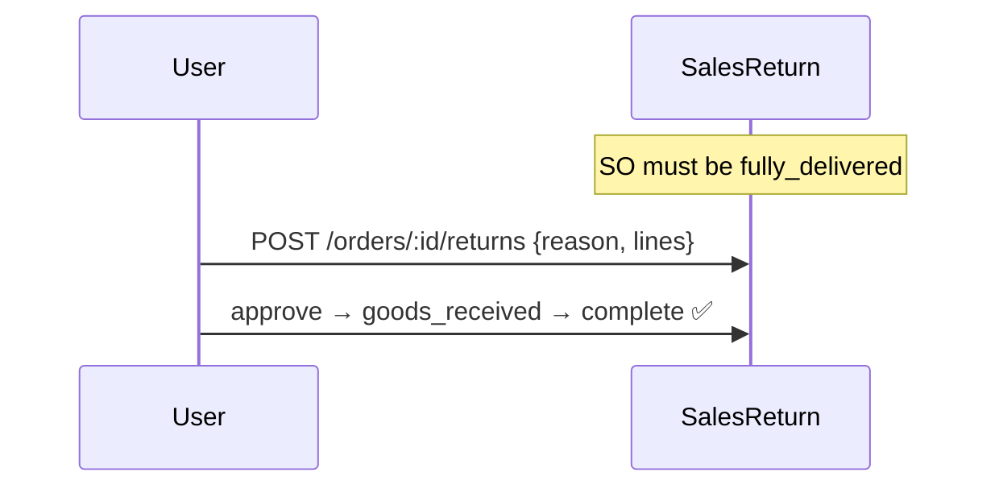
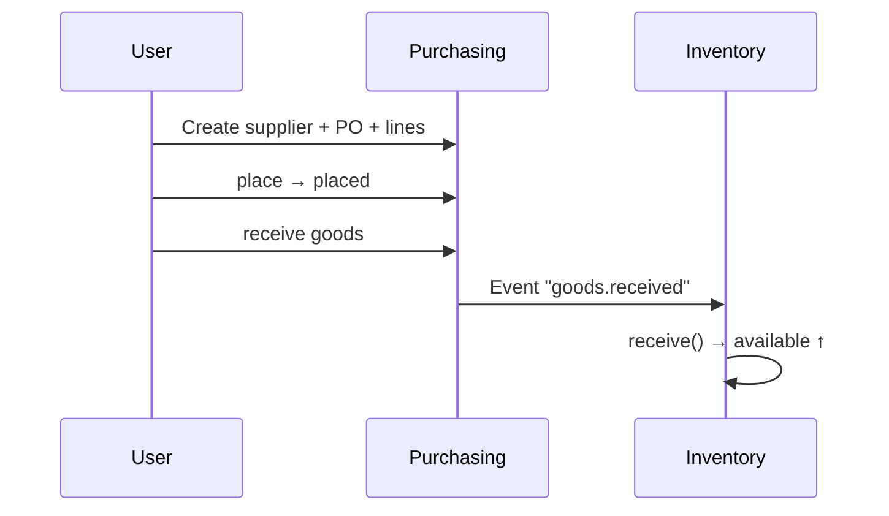
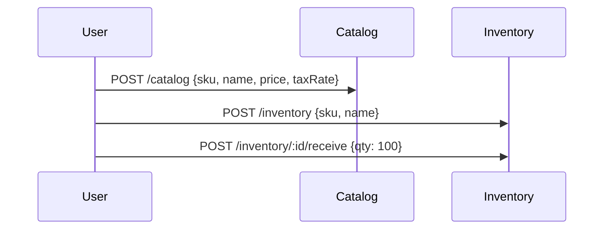

# 🔄 ERP System Flows

> Cập nhật: **2026-06-25** | **6 luồng chính** + **3 luồng compensation**

---

## Flow 1: Authentication

---

## Flow 2: Sales Order Saga ⭐

**SO States:** `draft → submitted → confirmed → partially_delivered → fully_delivered | cancelled`

---

## Flow 3: Delivery + Partial Delivery

**DO States:** `draft → picking → packed → shipped → delivered | failed`

---

## Flow 4: Sales Return

**Return States:** `draft → approved → goods_received → completed | rejected`

---

## Flow 5: Purchasing + Goods Receipt

**PO States:** `draft → placed → partially_received → received | cancelled`

---

## Flow 6: Catalog + Inventory Setup

---

## Flow 7-9: Compensation & Errors

| # | Scenario | Trigger | Result |
|---|----------|---------|--------|
| 7 | Insufficient stock | reserve() fails | SO → cancelled, reason "tồn kho" |
| 8 | Insufficient credit | credit-check returns canOrder=false | SO → cancelled + stock released |
| 9 | Delivery failed | markFailed(reason) from shipped | DO → failed, SO unchanged |

---

## API Route Map

| Gateway Route | Service | Description |
|--------------|---------|-------------|
| `POST /api/auth/login` | Auth :3004 | Login |
| `POST /api/auth/refresh` | Auth :3004 | Refresh JWT |
| `GET/POST /api/customers` | Customer :3001 | Customer CRUD |
| `GET /api/customers/:id/credit-check` | Customer :3001 | Credit check |
| `POST /api/orders` | Sales :3002 | Create SO |
| `POST /api/orders/:id/lines` | Sales :3002 | Add line |
| `POST /api/orders/:id/submit` | Sales :3002 | Submit SO |
| `POST /api/orders/:id/cancel` | Sales :3002 | Cancel SO |
| `POST /api/orders/:id/deliveries` | Sales :3002 | Create DO |
| `POST .../deliveries/:doId/start-picking\|pack\|ship\|deliver\|fail` | Sales | DO transitions |
| `POST /api/orders/:id/returns` | Sales :3002 | Create return |
| `POST .../returns/:retId/approve\|reject\|receive-goods\|complete` | Sales | Return transitions |
| `GET/POST /api/inventory` | Inventory :3003 | Stock CRUD |
| `POST /api/inventory/:id/receive` | Inventory :3003 | Receive stock |
| `GET/POST /api/catalog` | Catalog :3005 | Product CRUD |
| `GET/POST /api/purchasing` | Purchasing :3006 | PO CRUD |
| `GET/POST /api/suppliers` | Purchasing :3006 | Supplier CRUD |
