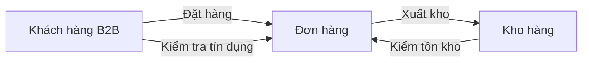
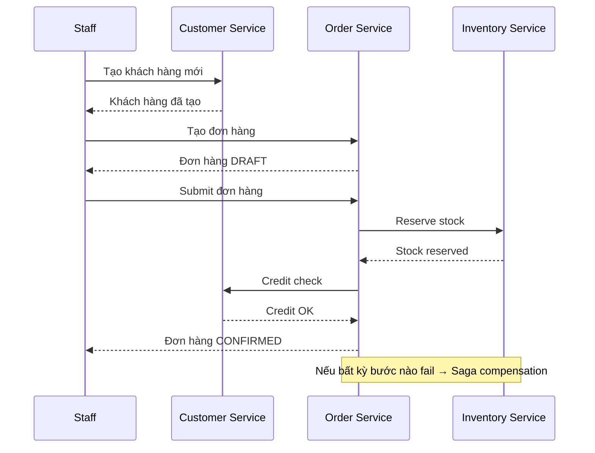
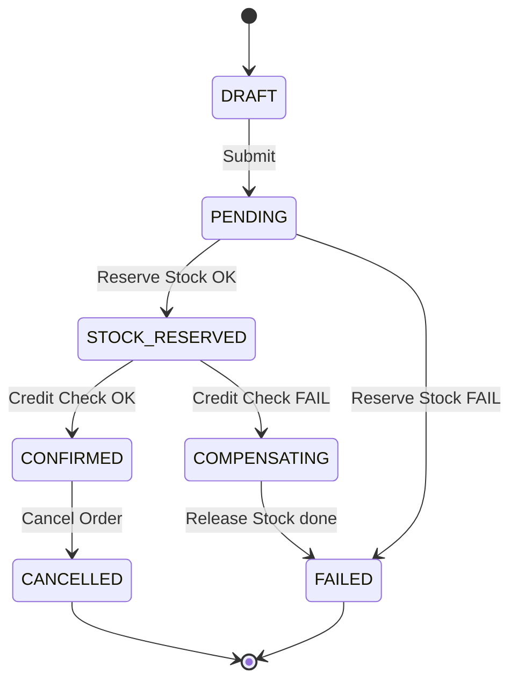

# Business Requirements

> Tài liệu mô tả bối cảnh nghiệp vụ, đối tượng người dùng, và các user stories cho hệ thống ERP Prototype. Tất cả requirements được thiết kế để phục vụ mục tiêu chính: **validate architectural patterns** qua các use case thực tế.

> Liên quan: [Project Goals](./project-goals.md) · [Tech Decisions](./tech-decisions.md) · [Glossary](./glossary.md)

---

## 1. Business Context

### 1.1. Bối cảnh

Hệ thống ERP prototype này mô phỏng một doanh nghiệp **B2B** (Business-to-Business) với 3 nghiệp vụ cốt lõi:

| Nghiệp vụ | Mô tả | Ví dụ thực tế |
|-----------|--------|---------------|
| **Quản lý khách hàng** | Lưu thông tin khách hàng B2B, theo dõi hạn mức tín dụng, mã số thuế | Công ty A có credit limit 500 triệu, tax code 0312345678 |
| **Quản lý đơn hàng** | Tạo đơn hàng với nhiều dòng sản phẩm, xử lý quy trình duyệt qua saga | Đơn hàng #001 gồm 100 cái bàn + 200 cái ghế, tổng 150 triệu |
| **Quản lý kho** | Theo dõi tồn kho theo warehouse, nhập/xuất/reserve stock | Kho HCM còn 500 cái bàn, đang reserve 100 cho đơn #001 |

### 1.2. Quy trình nghiệp vụ tổng quan

---

## 2. User Personas

Hệ thống có **3 roles** với quyền hạn khác nhau:

| Persona | Role | Mô tả | Quyền hạn chính |
|---------|------|--------|-----------------|
| **Quản trị viên** | `admin` | Người quản lý toàn bộ hệ thống, có quyền cao nhất | Full CRUD tất cả resources, quản lý users, xem audit logs |
| **Quản lý** | `manager` | Trưởng bộ phận, phụ trách phê duyệt và giám sát | CRUD + approve đơn hàng, xem reports, quản lý stock |
| **Nhân viên** | `staff` | Người thực hiện nghiệp vụ hàng ngày | Xem danh sách, tạo mới khách hàng/đơn hàng, nhập stock |

### Ma trận phân quyền chi tiết

| Hành động | `admin` | `manager` | `staff` |
|-----------|---------|-----------|---------|
| Xem danh sách (list) | ✅ | ✅ | ✅ |
| Xem chi tiết (detail) | ✅ | ✅ | ✅ |
| Tạo mới (create) | ✅ | ✅ | ✅ |
| Cập nhật (update) | ✅ | ✅ | ❌ |
| Xóa (delete) | ✅ | ❌ | ❌ |
| Submit đơn hàng | ✅ | ✅ | ✅ |
| Cancel đơn hàng | ✅ | ✅ | ❌ |
| Quản lý users | ✅ | ❌ | ❌ |
| Xem audit logs | ✅ | ✅ | ❌ |

---

## 3. User Stories

### 3.1. Customer Context — Quản lý khách hàng

| ID | Story | Acceptance Criteria | Pattern liên quan |
|----|-------|--------------------|--------------------|
| **CUS-01** | Là staff, tôi muốn **tạo khách hàng mới** với thông tin cơ bản (tên, email, phone, address) để lưu vào hệ thống | - Validate email format (Value Object)   - Không trùng email   - Trả về customer ID | Value Object, Aggregate Root |
| **CUS-02** | Là manager, tôi muốn **cập nhật thông tin khách hàng** để dữ liệu luôn chính xác | - Chỉ update fields được gửi   - Validate lại email/phone   - Ghi nhận thời gian update | Repository |
| **CUS-03** | Là admin, tôi muốn **xóa khách hàng** không còn hoạt động | - Soft delete (đánh dấu inactive)   - Không xóa nếu có đơn hàng pending | Aggregate Root |
| **CUS-04** | Là hệ thống (Order Service), tôi muốn **kiểm tra tín dụng** (credit check) của khách hàng trước khi confirm đơn | - So sánh tổng đơn hàng với `creditLimit`   - Trả về OK/FAIL qua event | Event-driven |
| **CUS-05** | Là staff, tôi muốn **quản lý mã số thuế** (tax code) của khách hàng B2B | - Validate format tax code VN (10 hoặc 13 số)   - Tax code là Value Object immutable | Value Object |

### 3.2. Order Context — Quản lý đơn hàng

| ID | Story | Acceptance Criteria | Pattern liên quan |
|----|-------|--------------------|--------------------|
| **ORD-01** | Là staff, tôi muốn **tạo đơn hàng mới** với header (customer, date) và nhiều order lines (item, qty, price) | - Order ở trạng thái DRAFT   - Tự tính totalAmount từ lines   - Order là Aggregate Root, lines là child entities | Aggregate Root, CQRS (Command) |
| **ORD-02** | Là staff, tôi muốn **thêm/sửa/xóa order lines** trong đơn hàng DRAFT | - Chỉ sửa được khi status = DRAFT   - Tự recalculate totalAmount   - Access lines qua Order (Aggregate Root) | Aggregate Root |
| **ORD-03** | Là staff, tôi muốn **submit đơn hàng** để bắt đầu quy trình xử lý | - Chuyển status DRAFT → PENDING   - Publish event `OrderSubmitted` qua Outbox   - Trigger Saga flow | Outbox, Saga, Event-driven |
| **ORD-04** | Là hệ thống, khi nhận event `OrderSubmitted`, tôi muốn **chạy Saga**: reserve stock → credit check → confirm | - Step 1: Gửi `ReserveStock` → Inventory   - Step 2: Gửi `CreditCheck` → Customer   - Step 3: Nếu cả 2 OK → status = CONFIRMED   - Nếu fail → compensation | Saga, Event-driven, Outbox |
| **ORD-05** | Là manager, tôi muốn **cancel đơn hàng** đã confirmed | - Chuyển status → CANCELLED   - Trigger compensation: release stock, restore credit   - Ghi nhận reason | Saga (Compensation) |
| **ORD-06** | Là staff, tôi muốn **xem danh sách đơn hàng** với filter và pagination | - Filter theo status, customer, date range   - Phân trang, sắp xếp   - Dùng Query handler riêng | CQRS (Query) |

#### Saga Flow — Chi tiết

### 3.3. Inventory Context — Quản lý kho

| ID | Story | Acceptance Criteria | Pattern liên quan |
|----|-------|--------------------|--------------------|
| **INV-01** | Là manager, tôi muốn **tạo warehouse** (kho hàng) mới | - Mỗi warehouse có name, code, address   - Code không trùng | Repository |
| **INV-02** | Là manager, tôi muốn **tạo item** (mặt hàng) mới trong hệ thống | - Mỗi item có SKU, name, unit   - SKU là unique | Aggregate Root |
| **INV-03** | Là staff, tôi muốn **nhập stock** (stock in) cho một item tại warehouse | - Tăng `quantityOnHand`   - Ghi movement log (type: IN)   - Dùng Optimistic Locking để tránh race condition | Optimistic Locking |
| **INV-04** | Là staff, tôi muốn **xuất stock** (stock out) khi giao hàng | - Giảm `quantityOnHand`   - Không cho xuất nếu không đủ stock   - Ghi movement log (type: OUT) | Optimistic Locking |
| **INV-05** | Là hệ thống (Saga), tôi muốn **reserve stock** khi đơn hàng được submit | - Tăng `quantityReserved`   - Kiểm tra `quantityOnHand - quantityReserved >= 0`   - Publish event `StockReserved` hoặc `StockReserveFailed` | Event-driven, Optimistic Locking |
| **INV-06** | Là hệ thống (Saga Compensation), tôi muốn **release stock** khi đơn hàng fail hoặc bị cancel | - Giảm `quantityReserved`   - Publish event `StockReleased` | Event-driven, Saga (Compensation) |
| **INV-07** | Là manager, tôi muốn **xem movement log** để theo dõi lịch sử nhập/xuất/reserve | - Log gồm: item, warehouse, type, quantity, timestamp   - Filter theo item, warehouse, date range | Repository |

### 3.4. Auth — Xác thực & Phân quyền

| ID | Story | Acceptance Criteria | Pattern liên quan |
|----|-------|--------------------|--------------------|
| **AUTH-01** | Là user, tôi muốn **đăng nhập** bằng email + password | - Verify password bằng bcrypt   - Trả về access token (JWT, 15 phút) + refresh token (7 ngày) | JWT, bcrypt |
| **AUTH-02** | Là hệ thống, tôi muốn **phân quyền** dựa trên role trong JWT | - Mỗi endpoint có decorator chỉ định roles được phép   - API Gateway validate JWT trước khi forward | RBAC |
| **AUTH-03** | Là user, tôi muốn **refresh token** khi access token hết hạn | - Gửi refresh token → nhận access token mới   - Refresh token cũ bị invalidate (rotation) | JWT |
| **AUTH-04** | Là admin, tôi muốn **quản lý users** (tạo, đổi role, deactivate) | - Chỉ admin mới có quyền   - Không thể deactivate chính mình | RBAC |

### 3.5. Catalog Context — User Stories

| ID | User Story | Acceptance Criteria | Pattern |
|---|---|---|---|
| **CAT-01** | Là manager, tôi muốn **tạo product** mới vào catalog | - Nhập SKU, name, unit, price, taxRate   - SKU validated via Value Object, immutable sau tạo   - Event `product.created` → Inventory auto-create stock | Outbox, Event-driven |
| **CAT-02** | Là manager, tôi muốn **cập nhật** thông tin product | - Đổi name, price, taxRate, unit   - SKU không đổi được   - taxRate chỉ chấp nhận 0/5/8/10% | DDD |
| **CAT-03** | Là manager, tôi muốn **deactivate** product không còn bán | - Product bị deactivate không xuất hiện trong active list   - Event `product.deactivated` được publish | Outbox |
| **CAT-04** | Là staff, tôi muốn **tìm kiếm** products | - Search by name hoặc SKU   - Pagination + filter by isActive | — |

### 3.6. Purchasing Context — User Stories

| ID | User Story | Acceptance Criteria | Pattern |
|---|---|---|---|
| **PUR-01** | Là manager, tôi muốn **tạo supplier** mới | - Nhập tên, contact info   - Supplier mặc định isActive = true | DDD |
| **PUR-02** | Là staff, tôi muốn **tạo Purchase Order** | - Chọn supplier → PO draft được tạo   - PO number auto-generated: PO-YYYYMMDD-NNN | DDD |
| **PUR-03** | Là staff, tôi muốn **thêm/xóa lines** vào PO draft | - Chỉ thêm/xóa khi PO ở trạng thái `draft`   - Mỗi line: itemId, quantity, unitPrice | DDD |
| **PUR-04** | Là manager, tôi muốn **place PO** (đặt hàng nhà cung cấp) | - PO phải có ≥ 1 line   - Chuyển status: draft → placed | DDD |
| **PUR-05** | Là manager, tôi muốn **receive goods** (nhận hàng) | - PO phải ở status `placed`   - Chuyển status: placed → received   - Event `goods.received` → Inventory tăng stock | Outbox, Event-driven |
| **PUR-06** | Là manager, tôi muốn **cancel PO** | - PO ở draft hoặc placed mới cancel được   - Kèm lý do cancel | DDD |

---

## 4. Non-functional Requirements

| Yêu cầu | Mô tả | Ghi chú |
|----------|--------|---------|
| **Response time** | API response < 500ms cho CRUD operations | Không bắt buộc strict, đây là prototype |
| **Concurrent users** | Hỗ trợ tối thiểu 1-5 users đồng thời | Enough cho testing |
| **Data consistency** | Eventual consistency giữa các services qua events | Outbox pattern đảm bảo at-least-once delivery |
| **Availability** | Không yêu cầu HA, chạy local | Tất cả services chạy trên 1 máy |
| **Security** | JWT + RBAC, password hashing | Không cần OAuth2, MFA cho prototype |

---

Liên quan: [Project Goals](./project-goals.md) · [Tech Decisions](./tech-decisions.md) · [Glossary](./glossary.md)
