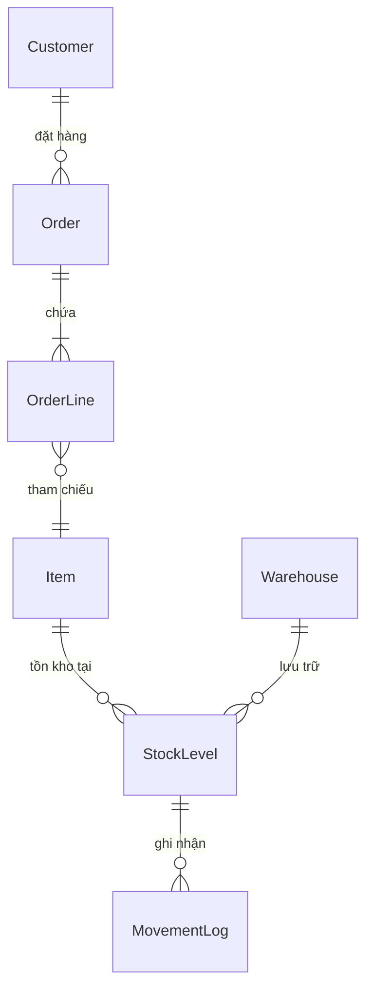
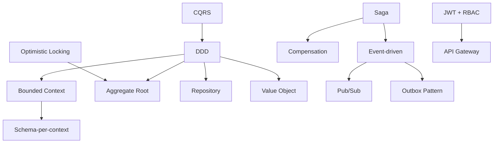

# Glossary — Bảng thuật ngữ

> Bảng thuật ngữ tổng hợp các khái niệm nghiệp vụ (domain) và kiến trúc (architecture) được sử dụng trong dự án ERP Prototype. Mỗi thuật ngữ được giải thích bằng tiếng Việt, kèm theo thuật ngữ tiếng Anh gốc trong ngoặc đơn.

> Liên quan: [Project Goals](./project-goals.md) · [Business Requirements](./business-requirements.md) · [Tech Decisions](./tech-decisions.md)

---

## 1. Thuật ngữ nghiệp vụ (Domain Terms)

| Thuật ngữ | Tiếng Anh | Giải thích |
|-----------|-----------|------------|
| **Khách hàng** | Customer | Đối tác B2B mua hàng từ doanh nghiệp. Mỗi khách hàng có thông tin liên hệ, hạn mức tín dụng, và mã số thuế. Trong hệ thống, Customer là một **Aggregate Root** — mọi thay đổi liên quan đến khách hàng đều đi qua entity này. |
| **Đơn hàng** | Order | Yêu cầu mua hàng từ khách hàng, bao gồm thông tin header (khách hàng, ngày, trạng thái) và nhiều dòng chi tiết (order lines). Order là **Aggregate Root** của Order Context — quản lý toàn bộ lifecycle từ DRAFT → PENDING → CONFIRMED → CANCELLED. |
| **Dòng đơn hàng** | Order Line | Một dòng chi tiết trong đơn hàng, chứa thông tin: mặt hàng nào, số lượng bao nhiêu, đơn giá bao nhiêu. Order Line là **child entity** của Order — không thể tồn tại độc lập, chỉ truy cập được thông qua Order (Aggregate Root). |
| **Kho hàng** | Inventory | Hệ thống quản lý tồn kho, bao gồm warehouses (nhà kho), items (mặt hàng), và stock levels (mức tồn kho). Inventory Context chịu trách nhiệm theo dõi số lượng hàng hóa có sẵn, đã reserve, và lịch sử nhập/xuất. |
| **Mức tồn kho** | Stock Level | Số lượng hàng hóa hiện có của một item tại một warehouse cụ thể. Gồm 2 giá trị quan trọng: `quantityOnHand` (tổng số lượng thực tế trong kho) và `quantityReserved` (số lượng đã đặt trước cho đơn hàng đang xử lý). Số lượng khả dụng = `quantityOnHand - quantityReserved`. |
| **Nhà kho** | Warehouse | Địa điểm vật lý lưu trữ hàng hóa. Mỗi warehouse có mã code duy nhất, tên, và địa chỉ. Hệ thống hỗ trợ nhiều warehouses để theo dõi tồn kho phân tán. |
| **Mặt hàng** | Item | Một loại sản phẩm/hàng hóa trong hệ thống. Mỗi item có mã SKU (Stock Keeping Unit) duy nhất, tên, và đơn vị tính (cái, hộp, kg...). Item là **Aggregate Root** trong Inventory Context. |
| **Kiểm tra tín dụng** | Credit Check | Quy trình xác minh xem khách hàng còn đủ hạn mức tín dụng (credit limit) để thực hiện đơn hàng hay không. Ví dụ: khách hàng có credit limit 500 triệu, đã dùng 400 triệu → đơn hàng mới 150 triệu sẽ FAIL. Đây là một bước trong **Saga** khi xử lý đơn hàng. |
| **Mã số thuế** | Tax Code | Mã số thuế doanh nghiệp theo quy định Việt Nam, có 10 hoặc 13 chữ số. Trong hệ thống, Tax Code được implement dưới dạng **Value Object** — immutable, có validation logic riêng, và được so sánh bằng giá trị (không phải identity). |

### Sơ đồ quan hệ các khái niệm nghiệp vụ

---

## 2. Thuật ngữ kiến trúc (Architecture Terms)

| Thuật ngữ | Tiếng Anh | Giải thích |
|-----------|-----------|------------|
| **Thiết kế hướng miền** | Domain-Driven Design (DDD) | Phương pháp thiết kế phần mềm tập trung vào **domain** (lĩnh vực nghiệp vụ) thay vì công nghệ. Code được tổ chức theo nghiệp vụ: domain layer chứa business logic, tách biệt khỏi infrastructure (DB, HTTP). Trong project này, mỗi NestJS service đại diện cho một domain riêng. |
| **Ngữ cảnh giới hạn** | Bounded Context | Ranh giới logic chia hệ thống thành các phần độc lập, mỗi phần có model và ngôn ngữ riêng. Trong project này có 3 bounded contexts chính: **Customer**, **Order**, **Inventory**. Mỗi context có schema riêng trong PostgreSQL, không share tables lẫn nhau. |
| **Gốc tổng hợp** | Aggregate Root | Entity chính trong một nhóm objects liên quan (aggregate). Mọi thay đổi đối với aggregate phải đi qua root. Ví dụ: `Order` là Aggregate Root — muốn thêm `OrderLine` phải gọi method trên `Order`, không được tạo `OrderLine` trực tiếp. Điều này đảm bảo **invariants** (quy tắc nghiệp vụ) luôn được kiểm tra. |
| **Kho lưu trữ** | Repository Pattern | Abstraction layer giữa domain logic và data access. Repository cung cấp interface để lưu/đọc entities mà domain không cần biết dữ liệu lưu ở đâu (PostgreSQL, MongoDB, hay memory). Trong project: `CustomerRepository`, `OrderRepository`, `InventoryRepository` wrap Prisma Client. |
| **Đối tượng giá trị** | Value Object | Object được định danh bằng **giá trị** (value) thay vì ID. Hai Value Objects bằng nhau nếu tất cả properties bằng nhau. Value Objects là **immutable** — muốn thay đổi thì tạo instance mới. Ví dụ: `Email("a@b.com")`, `TaxCode("0312345678")`, `Money(150000000, "VND")`. |
| **Kiến trúc hướng sự kiện** | Event-driven Architecture | Kiến trúc trong đó các services giao tiếp bằng cách phát ra (publish) và lắng nghe (subscribe) **events** thay vì gọi trực tiếp (sync HTTP calls). Ví dụ: Order Service publish `OrderSubmitted` → Inventory Service subscribe và xử lý reserve stock. Giúp services **loose coupling** — không cần biết nhau. |
| **Hộp thư đi** | Outbox Pattern | Pattern đảm bảo **consistency** giữa database write và event publish. Thay vì ghi DB rồi publish event (có thể fail giữa chừng), ta ghi cả business data VÀ event vào DB trong cùng **một transaction**. Sau đó, một background process đọc outbox table và publish events. Đảm bảo **at-least-once delivery**. |
| **Tách lệnh và truy vấn** | CQRS (Command Query Responsibility Segregation) | Pattern tách biệt **Command** (thay đổi dữ liệu: tạo, sửa, xóa) và **Query** (đọc dữ liệu) thành các handler riêng biệt. Trong Order Context: `CreateOrderCommand`, `SubmitOrderCommand` (commands) và `GetOrdersQuery`, `GetOrderByIdQuery` (queries) có logic xử lý khác nhau. |
| **Chuỗi giao dịch phân tán** | Saga Pattern | Pattern quản lý **distributed transactions** — khi một business operation span qua nhiều services. Saga chia transaction thành các bước nhỏ, mỗi bước là một local transaction. Nếu một bước fail → thực hiện **compensation** (hoàn tác) các bước trước đó. Trong project: Order Submit Saga gồm Reserve Stock → Credit Check → Confirm. |
| **Hoàn tác bù trừ** | Compensation | Hành động **hoàn tác** (undo) một bước trong Saga khi bước sau fail. Khác với rollback của DB transaction, compensation là một action nghiệp vụ mới. Ví dụ: nếu Credit Check fail sau khi đã Reserve Stock → compensation là Release Stock (trả lại stock đã reserve). |
| **Khóa lạc quan** | Optimistic Locking | Kỹ thuật xử lý **concurrent updates** mà không cần lock record trong DB. Mỗi record có cột `version`. Khi update, kiểm tra version hiện tại có khớp không — nếu khớp thì update và tăng version, nếu không khớp (ai đó đã sửa trước) thì **reject và retry**. Dùng cho Stock Level trong Inventory Context. |
| **Mã thông báo web JSON** | JWT (JSON Web Token) | Chuẩn mở để trao đổi thông tin xác thực giữa client và server dưới dạng **token**. Token chứa payload (user ID, role, expiry) được ký bằng secret key. Server không cần lưu session — chỉ cần verify chữ ký. Trong project: access token (15 phút) + refresh token (7 ngày). |
| **Kiểm soát truy cập theo vai trò** | RBAC (Role-Based Access Control) | Mô hình phân quyền dựa trên **role** (vai trò) của user. Mỗi role có tập permissions riêng. Trong project có 3 roles: `admin` (full quyền), `manager` (CRUD + approve), `staff` (xem + tạo). Permissions được enforce qua NestJS Guards ở backend và route protection ở frontend. |
| **Cổng API** | API Gateway | Service trung gian đứng giữa client (frontend) và backend services. Chịu trách nhiệm: routing requests đến đúng service, validate JWT, rate limiting, và aggregation. Trong project: API Gateway chạy port `:3010`, forward requests đến các services (`:3001` → `:3004`). |
| **Xuất bản / Đăng ký** | Pub/Sub (Publish/Subscribe) | Mô hình messaging trong đó **publisher** phát event vào **topic**, và **subscriber** đăng ký lắng nghe topic đó. Publisher không biết subscriber là ai (loose coupling). Trong project: dùng GCP Pub/Sub Emulator — Order Service publish vào topic `order-events`, Inventory Service subscribe để nhận events. |
| **Schema theo ngữ cảnh** | Schema-per-context | Chiến lược database trong đó mỗi bounded context có **schema riêng** trong cùng một PostgreSQL instance, thay vì dùng separate databases. Trong project: 4 schemas (`auth`, `customer`, `order`, `inventory`) trong cùng 1 Supabase PostgreSQL database. Đảm bảo data isolation mà không cần quản lý nhiều DB connections. |

### Sơ đồ quan hệ các patterns

---

## 3. Quick Reference — Viết tắt

| Viết tắt | Đầy đủ | Nghĩa tiếng Việt |
|----------|--------|-------------------|
| **DDD** | Domain-Driven Design | Thiết kế hướng miền |
| **CQRS** | Command Query Responsibility Segregation | Tách lệnh và truy vấn |
| **RBAC** | Role-Based Access Control | Kiểm soát truy cập theo vai trò |
| **JWT** | JSON Web Token | Mã thông báo web JSON |
| **API** | Application Programming Interface | Giao diện lập trình ứng dụng |
| **ORM** | Object-Relational Mapping | Ánh xạ đối tượng - quan hệ |
| **CRUD** | Create, Read, Update, Delete | Tạo, Đọc, Cập nhật, Xóa |
| **SSR** | Server-Side Rendering | Render phía server |
| **DI** | Dependency Injection | Tiêm phụ thuộc |
| **SKU** | Stock Keeping Unit | Mã đơn vị lưu kho |
| **B2B** | Business-to-Business | Doanh nghiệp với doanh nghiệp |
| **HA** | High Availability | Tính sẵn sàng cao |

---

Liên quan: [Project Goals](./project-goals.md) · [Business Requirements](./business-requirements.md) · [Tech Decisions](./tech-decisions.md)
