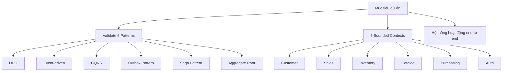

# Project Goals

> Tài liệu mô tả mục tiêu, phạm vi, và tiêu chí thành công của dự án ERP Prototype. Đây là dự án **học tập**, không phải production — mục đích chính là validate các architectural patterns qua một hệ thống microservices thực tế.

> Liên quan: [Business Requirements](./business-requirements.md) · [Tech Decisions](./tech-decisions.md) · [Glossary](./glossary.md)

---

## 1. Mục tiêu chính

Validate **6 architectural patterns cốt lõi** thông qua **6 bounded contexts** (Auth, Customer, Sales, Inventory, Catalog, Purchasing) trong một hệ thống ERP microservices hoàn chỉnh:

Mục tiêu **không phải** xây dựng một ERP hoàn chỉnh, mà là:

| # | Mục tiêu cụ thể | Mô tả |
|---|-----------------|--------|
| 1 | **Pattern Validation** | Mỗi pattern phải được implement đúng cách và chứng minh hoạt động qua test hoặc demo flow |
| 2 | **Hiểu sâu kiến trúc** | Nắm vững lý do tại sao chọn pattern này, trade-off là gì, khi nào nên/không nên dùng |
| 3 | **End-to-end flow** | Một request từ frontend đi qua API Gateway → Service → DB → Event → Saga phải hoạt động trơn tru |
| 4 | **Codebase tham khảo** | Source code đủ rõ ràng để dùng làm reference cho các dự án thực tế sau này |

---

## 2. Phạm vi dự án

### 2.1. Scope IN ✅

| Bounded Context | Chức năng | Patterns áp dụng |
|----------------|-----------|-------------------|
| **Auth** | Đăng nhập, đăng ký, JWT access/refresh token, RBAC 3 roles (admin/manager/staff) | JWT, RBAC, bcrypt |
| **Customer** | CRUD khách hàng, credit check, quản lý tax code | DDD, Repository, Value Object, Aggregate Root |
| **Sales** | Tạo đơn hàng (header + lines), submit → saga flow, cancel, Delivery Order 6-state, Sales Return | DDD, CQRS, Saga, Outbox, Event-driven, Aggregate Root |
| **Inventory** | Tạo items/warehouses, nhập/xuất stock, reserve/release, movement log | DDD, Repository, Optimistic Locking, Aggregate Root |
| **Catalog** | Product CRUD, taxRate per product (VN rates: 0/5/8/10%), activate/deactivate | DDD, Outbox, Event-driven |
| **Purchasing** | Purchase Order lifecycle (draft→placed→received), Supplier CRUD, goods receipt | DDD, Outbox, Event-driven |
| **API Gateway** | Routing, JWT validation, rate limiting, Helmet security headers | API Gateway pattern |
| **Frontend** | Dashboard, Customer/Sales/Inventory/Catalog/Purchasing/Supplier pages, Delivery + Return tabs | Next.js 15, Ant Design 5, Tailwind CSS |

### 2.2. Scope OUT ❌

Các module/tính năng sau **không nằm trong phạm vi** dự án này:

| Module | Lý do loại trừ |
|--------|----------------|
| **Reporting / Analytics** | Cần BI tools, không liên quan đến patterns đang học |
| **Notification** (email, SMS) | Thêm complexity không cần thiết cho mục tiêu học |
| **Payment / Billing** | Liên quan đến payment gateway bên thứ 3, risk cao |
| **Multi-tenant** | Kiến trúc multi-tenant là một chủ đề riêng biệt, quá phức tạp cho prototype |
| **CI/CD Pipeline** | Focus vào code và patterns, không phải DevOps |
| **Production Deployment** | Dự án chạy local + emulator, không deploy lên cloud |

---

## 3. Success Criteria — Pattern Checklist

Dự án được coi là **thành công** khi tất cả 11 patterns trong bảng dưới đây được validate và hoạt động đúng:

| # | Pattern | Context áp dụng | Tiêu chí validate | Status |
|---|---------|-----------------|-------------------|--------|
| 1 | **DDD (Domain-Driven Design)** | Tất cả | Mỗi service có domain layer tách biệt khỏi infra | ✅ |
| 2 | **Bounded Context** | Tất cả | Mỗi context có DB schema riêng, không share tables | ✅ |
| 3 | **Aggregate Root** | Customer, Sales, Inventory | Entity gốc kiểm soát invariants, child entities chỉ access qua root | ✅ |
| 4 | **Repository Pattern** | Tất cả | Data access abstracted qua repository interface | ✅ |
| 5 | **Value Object** | Customer, Sales | Immutable objects (Email, TaxCode, Money) với validation logic | ✅ |
| 6 | **Event-driven Architecture** | Sales ↔ Inventory ↔ Catalog ↔ Purchasing | Services giao tiếp qua events thay vì sync calls | ✅ |
| 7 | **Outbox Pattern** | Customer, Sales, Inventory, Catalog, Purchasing | Events lưu vào outbox table trước, sau đó publish → đảm bảo at-least-once | ✅ |
| 8 | **CQRS** | Sales | Command (tạo/sửa) và Query (đọc) tách riêng handler | ✅ |
| 9 | **Saga Pattern** | Sales | Order submit → Reserve Stock → Credit Check → Confirm, có compensation khi fail | ✅ |
| 10 | **Optimistic Locking** | Inventory | Concurrent stock updates dùng version column, conflict → retry | ✅ |
| 11 | **RBAC** | Auth + API Gateway | 3 roles với permissions khác nhau, enforce ở cả backend và frontend | ✅ |

> **Lưu ý:** Cột Status sẽ được cập nhật thành ✅ khi pattern đã được implement và validate xong.

---

## 4. Lưu ý quan trọng

> [!IMPORTANT]
> Đây là **dự án học tập** (learning project), KHÔNG phải production system.

Điều này có nghĩa:

| Khía cạnh | Trong dự án này | Trong production |
|-----------|-----------------|-----------------|
| **Error handling** | Basic, đủ để demo flow | Comprehensive, với retry, circuit breaker |
| **Security** | JWT + RBAC cơ bản | OAuth2, rate limiting nâng cao, WAF |
| **Scalability** | Single instance mỗi service | Horizontal scaling, load balancer |
| **Monitoring** | Console logs | Structured logging, APM, alerting |
| **Data volume** | Seed data nhỏ | Millions of records, partitioning |
| **Testing** | Manual + unit tests cơ bản | Unit + Integration + E2E + Load tests |

---

Liên quan: [Business Requirements](./business-requirements.md) · [Tech Decisions](./tech-decisions.md) · [Glossary](./glossary.md)
