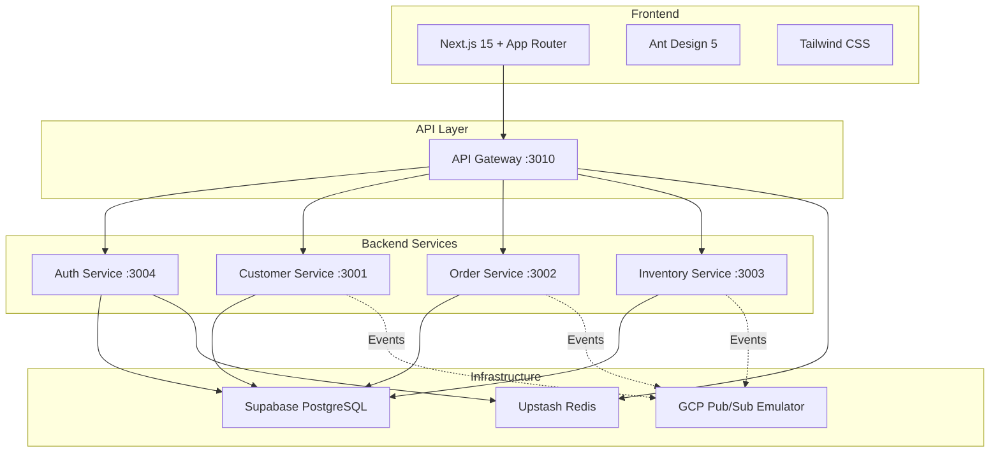

# Tech Decisions

> Tài liệu ghi lại các quyết định công nghệ (Architecture Decision Records — ADR) cho dự án ERP Prototype. Mỗi quyết định được trình bày theo format: **Context → Decision → Alternatives → Consequences**, giúp hiểu rõ _tại sao_ chọn công nghệ này thay vì công nghệ khác.

> Liên quan: [Project Goals](./project-goals.md) · [Business Requirements](./business-requirements.md) · [Glossary](./glossary.md)

---

## Tổng quan Tech Stack

---

## ADR-001: NestJS làm Backend Framework

| Mục | Nội dung |
|-----|----------|
| **Status** | ✅ Accepted |
| **Date** | 2025 |

### Context

Cần chọn Node.js framework cho 5 backend services. Framework phải hỗ trợ tốt cho kiến trúc DDD với dependency injection, module system, và các cross-cutting concerns (guards, interceptors, pipes).

### Decision

Chọn **NestJS** làm backend framework cho tất cả services.

### Alternatives Considered

| Tiêu chí | NestJS | Express.js | Fastify |
|----------|--------|------------|---------|
| **Dependency Injection** | ✅ Built-in, decorator-based | ❌ Không có, cần thêm lib (InversifyJS) | ❌ Không có native DI |
| **Module System** | ✅ `@Module()` tổ chức code theo bounded context | ❌ Tự organize bằng folder | ❌ Plugin system, không phù hợp DDD |
| **Guards & Interceptors** | ✅ `@UseGuards()`, `@UseInterceptors()` | ❌ Middleware thủ công | ⚠️ Có hooks nhưng khác paradigm |
| **Learning Curve** | ⚠️ Cao hơn (decorators, DI concepts) | ✅ Thấp | ✅ Thấp |
| **DDD Compatibility** | ✅ Excellent — modules = bounded contexts | ⚠️ Phải tự thiết kế | ⚠️ Phải tự thiết kế |
| **TypeScript Support** | ✅ First-class | ⚠️ Cần config thêm | ✅ Tốt |

### Consequences

- **Tích cực:** Module system map 1:1 với bounded contexts, DI giúp dễ dàng inject repositories, guards xử lý RBAC sạch sẽ
- **Tiêu cực:** Learning curve cao hơn, nhiều decorators và concepts cần nắm
- **Trade-off:** Chấp nhận complexity của NestJS để đổi lấy cấu trúc code phù hợp DDD

---

## ADR-002: Prisma làm ORM (Code-first)

| Mục | Nội dung |
|-----|----------|
| **Status** | ✅ Accepted |
| **Date** | 2025 |

### Context

Cần ORM để tương tác với PostgreSQL. ORM phải type-safe, hỗ trợ migration tốt, và cho phép define schema rõ ràng cho từng bounded context.

### Decision

Chọn **Prisma** với approach **code-first** (schema-first trong terminology của Prisma).

### Alternatives Considered

| Tiêu chí | Prisma | TypeORM | Sequelize |
|----------|--------|---------|-----------|
| **Type Safety** | ✅ Auto-generated types từ schema | ⚠️ Decorators, types manual | ❌ Weak typing |
| **Schema Definition** | ✅ `schema.prisma` file rõ ràng | ⚠️ Entity decorators phân tán | ⚠️ Model definitions verbose |
| **Migration** | ✅ `prisma migrate dev` tự động | ⚠️ Manual hoặc auto-sync (risky) | ⚠️ Manual migration files |
| **Multi-schema** | ✅ Hỗ trợ `@@schema("order")` | ⚠️ Cần config phức tạp | ❌ Khó |
| **Query API** | ✅ Fluent, intuitive | ✅ Tốt | ⚠️ Builder pattern verbose |
| **Learning Curve** | ✅ Thấp | ⚠️ Trung bình | ⚠️ Trung bình |

### Consequences

- **Tích cực:** `schema.prisma` là single source of truth, generated types đảm bảo type-safe queries, migration đơn giản
- **Tiêu cực:** Prisma Client không hỗ trợ raw aggregate queries phức tạp tốt bằng TypeORM
- **Trade-off:** Schema file tập trung là ưu điểm cho prototype, nhưng trong monorepo lớn có thể trở thành bottleneck

---

## ADR-003: Supabase PostgreSQL làm Database

| Mục | Nội dung |
|-----|----------|
| **Status** | ✅ Accepted |
| **Date** | 2025 |

### Context

Cần PostgreSQL database. Có 2 lựa chọn chính: chạy Docker local hoặc dùng managed service.

### Decision

Chọn **Supabase PostgreSQL** (free tier) với **4 schemas** riêng biệt: `auth`, `customer`, `order`, `inventory`.

### Alternatives Considered

| Tiêu chí | Supabase PostgreSQL | Local Docker PostgreSQL |
|----------|---------------------|------------------------|
| **Setup** | ✅ Không cần Docker, connection string có sẵn | ⚠️ Cần Docker + docker-compose |
| **Dashboard** | ✅ Supabase Studio — xem data, run SQL trực tiếp | ❌ Cần cài pgAdmin riêng |
| **Free Tier** | ✅ 500MB storage, 2 projects | ✅ Free (local) |
| **Network** | ⚠️ Phụ thuộc internet | ✅ Chạy offline |
| **Production Parity** | ✅ Managed PG = gần giống production | ✅ PG version tùy chọn |
| **Multi-schema** | ✅ Hỗ trợ native | ✅ Hỗ trợ native |

### Consequences

- **Tích cực:** Zero Docker dependency cho DB, có dashboard để debug data, free tier đủ cho prototype
- **Tiêu cực:** Cần internet, latency cao hơn local, phụ thuộc vào Supabase uptime
- **Trade-off:** Đổi offline capability lấy convenience và zero-setup

---

## ADR-004: Upstash Redis làm Cache Layer

| Mục | Nội dung |
|-----|----------|
| **Status** | ✅ Accepted |
| **Date** | 2025 |

### Context

Cần Redis cho caching (JWT blacklist, session data, rate limiting). Tương tự DB, lựa chọn giữa local Docker và managed service.

### Decision

Chọn **Upstash Redis** (free tier) với REST API.

### Alternatives Considered

| Tiêu chí | Upstash Redis | Local Docker Redis |
|----------|---------------|-------------------|
| **Setup** | ✅ Không cần Docker | ⚠️ Cần Docker container |
| **Protocol** | REST API (HTTP) | TCP (native Redis protocol) |
| **Free Tier** | ✅ 10,000 commands/day | ✅ Free (local) |
| **Persistence** | ✅ Durable by default | ⚠️ Cần config AOF/RDB |
| **Network** | ⚠️ Phụ thuộc internet | ✅ Local, fast |

### Consequences

- **Tích cực:** Không thêm Docker container, REST API đơn giản, persistent by default
- **Tiêu cực:** Latency cao hơn local Redis, giới hạn 10K commands/day trên free tier
- **Trade-off:** Chấp nhận latency cao hơn vì prototype không cần high-throughput caching

---

## ADR-005: GCP Pub/Sub Emulator làm Message Queue

| Mục | Nội dung |
|-----|----------|
| **Status** | ✅ Accepted |
| **Date** | 2025 |

### Context

Cần message broker cho event-driven communication giữa các services (Outbox → publish, Saga → subscribe). Yêu cầu: khi deploy lên GCP production, code không cần thay đổi.

### Decision

Chọn **GCP Pub/Sub Emulator** chạy trong Docker.

### Alternatives Considered

| Tiêu chí | GCP Pub/Sub Emulator | RabbitMQ | Apache Kafka |
|----------|---------------------|----------|--------------|
| **Production Parity** | ✅ Exact same API với GCP Pub/Sub | ❌ Khác API hoàn toàn | ❌ Khác API hoàn toàn |
| **Code Change khi Deploy** | ✅ Zero — chỉ đổi connection config | ❌ Cần rewrite message handling | ❌ Cần rewrite |
| **Setup** | ⚠️ Docker + config topics/subs | ⚠️ Docker + management UI | ❌ Docker + Zookeeper + complex config |
| **Learning Value** | ✅ Học GCP ecosystem | ✅ Học AMQP protocol | ✅ Học event streaming |
| **Complexity** | ⚠️ Trung bình | ✅ Thấp | ❌ Cao |

### Consequences

- **Tích cực:** Zero code change khi deploy lên GCP, học GCP Pub/Sub API chuẩn, topic/subscription model linh hoạt
- **Tiêu cực:** Cần Docker cho emulator (là dependency Docker duy nhất trong project), ít tài liệu hơn RabbitMQ
- **Trade-off:** Chấp nhận Docker dependency cho Pub/Sub để đảm bảo production parity

---

## ADR-006: Tự code Auth (JWT + bcrypt + RBAC)

| Mục | Nội dung |
|-----|----------|
| **Status** | ✅ Accepted |
| **Date** | 2025 |

### Context

Cần authentication & authorization. Có thể dùng Supabase Auth (built-in), NextAuth, hoặc tự code.

### Decision

**Tự code** toàn bộ auth flow: bcrypt hash password, JWT sign/verify, RBAC guards.

### Alternatives Considered

| Tiêu chí | Tự code | Supabase Auth | NextAuth |
|----------|---------|---------------|---------|
| **Mục đích học** | ✅ Hiểu sâu JWT, bcrypt, token rotation | ❌ Black-box, không học được | ⚠️ Học OAuth flow |
| **Control** | ✅ Full control mọi logic | ⚠️ Giới hạn bởi Supabase API | ⚠️ Giới hạn bởi providers |
| **RBAC Custom** | ✅ Tự design role/permission | ⚠️ Cần custom claims | ⚠️ Cần adapter phức tạp |
| **Security** | ⚠️ Rủi ro nếu implement sai | ✅ Battle-tested | ✅ Battle-tested |
| **Setup Time** | ⚠️ Mất nhiều thời gian hơn | ✅ Nhanh | ✅ Nhanh |

### Consequences

- **Tích cực:** Hiểu sâu từng bước của auth flow, full control RBAC logic, code có thể tái sử dụng
- **Tiêu cực:** Rủi ro security nếu implement sai (nhưng acceptable vì đây là prototype, không phải production)
- **Trade-off:** Đổi convenience lấy deep learning

---

## ADR-007: Next.js 15 + Ant Design 5 + Tailwind CSS làm Frontend

| Mục | Nội dung |
|-----|----------|
| **Status** | ✅ Accepted |
| **Date** | 2025 |

### Context

Cần frontend framework với UI components phù hợp cho ERP: tables phức tạp, forms nhiều fields, multi-step wizards.

### Decision

Chọn **Next.js 15** (App Router) + **Ant Design 5** + **Tailwind CSS**.

### Alternatives Considered

| Tiêu chí | Next.js + Ant Design | React + MUI | React + Shadcn/ui |
|----------|---------------------|-------------|-------------------|
| **SSR Support** | ✅ App Router, Server Components | ❌ Cần setup SSR riêng | ❌ Client-side only |
| **ERP Components** | ✅ Table, Form, Steps, Descriptions built-in | ✅ DataGrid, Forms | ⚠️ Cần build nhiều |
| **Table Component** | ✅ Ant Design Table: sort, filter, pagination, editable | ✅ MUI DataGrid mạnh | ⚠️ Basic table |
| **Form Component** | ✅ Form + Form.Item + validation rules | ✅ React Hook Form integration | ⚠️ Cần compose |
| **Design System** | ✅ Enterprise-grade, consistent | ✅ Material Design | ⚠️ Utility-based |
| **Bundle Size** | ⚠️ Ant Design khá nặng | ⚠️ MUI cũng nặng | ✅ Nhẹ |

### Consequences

- **Tích cực:** Ant Design cung cấp sẵn Table/Form/Steps phức tạp phù hợp ERP, App Router cho SSR-ready, Tailwind bổ sung custom styling linh hoạt
- **Tiêu cực:** Ant Design bundle size lớn, learning curve cho App Router patterns
- **Trade-off:** Bundle size lớn không quan trọng cho prototype, ưu tiên tốc độ phát triển

---

## ADR-008: npm làm Package Manager

| Mục | Nội dung |
|-----|----------|
| **Status** | ✅ Accepted |
| **Date** | 2025 |

### Context

Cần chọn package manager cho monorepo-like structure (nhiều services cùng repo).

### Decision

Dùng **npm** (bundled with Node.js).

### Alternatives Considered

| Tiêu chí | npm | pnpm | yarn |
|----------|-----|------|------|
| **Setup** | ✅ Zero setup, bundled với Node.js | ⚠️ Cần install riêng | ⚠️ Cần install riêng |
| **Disk Space** | ⚠️ Duplicate dependencies | ✅ Content-addressable store, tiết kiệm | ⚠️ Trung bình |
| **Speed** | ⚠️ Chậm hơn | ✅ Nhanh nhất | ✅ Nhanh |
| **Monorepo Support** | ⚠️ Workspaces cơ bản | ✅ Workspaces mạnh | ✅ Workspaces tốt |
| **Familiarity** | ✅ Mọi người đều biết | ⚠️ Ít phổ biến hơn | ✅ Phổ biến |

### Consequences

- **Tích cực:** Zero setup, familiar, không cần explain cho người mới
- **Tiêu cực:** Chậm hơn và tốn disk hơn pnpm, đặc biệt với nhiều services
- **Trade-off:** Ưu tiên simplicity cho learning project, performance không phải concern chính

---

## Tổng kết

| Quyết định | Lựa chọn | Lý do chính |
|-----------|----------|-------------|
| Backend Framework | **NestJS** | Built-in DI + Modules phù hợp DDD |
| ORM | **Prisma** | Type-safe, schema rõ ràng, migration tự động |
| Database | **Supabase PostgreSQL** | Free, có dashboard, zero Docker |
| Cache | **Upstash Redis** | Free, REST API, zero Docker |
| Message Queue | **GCP Pub/Sub Emulator** | Production parity, zero code change khi deploy |
| Auth | **Tự code** | Deep learning JWT, bcrypt, RBAC |
| Frontend | **Next.js + Ant Design** | SSR-ready, ERP components sẵn |
| Package Manager | **npm** | Simple, bundled, universal |

---

Liên quan: [Project Goals](./project-goals.md) · [Business Requirements](./business-requirements.md) · [Glossary](./glossary.md)
