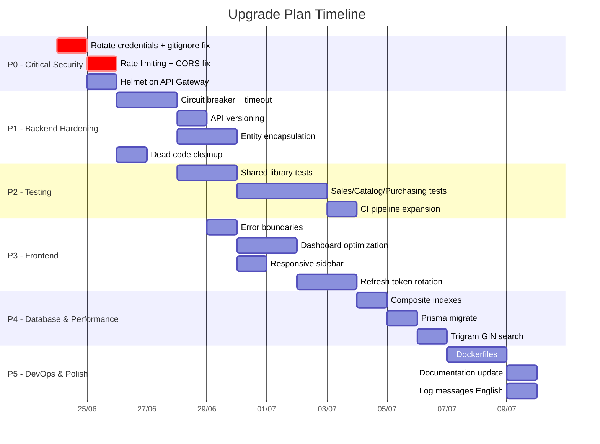

# 🚀 ERP Prototype — Upgrade Plan

> **Source:** [Technical Review Board Report](file:///C:/Users/minht/.gemini/antigravity-ide/brain/9fdf6233-7e70-4e96-83dd-465e715576d8/technical_review.md)  
> **Mục tiêu:** Nâng Production Readiness Score từ **62/100 → ~85/100**  
> **Phạm vi loại trừ:** Database-per-service migration (thiết kế hiện tại phù hợp cho dự án)

---

## Tổng quan các Phase



| Phase | Tên | Items | Est. Effort | Score Impact |
|:---:|---|:---:|:---:|---|
| **P0** | 🔴 Critical Security | 5 | ~1 ngày | Security 3→6 |
| **P1** | 🟠 Backend Hardening | 7 | ~3 ngày | Backend 7→8, Code 8→9 |
| **P2** | 🟡 Testing Coverage | 5 | ~4 ngày | Testing 5→8 |
| **P3** | 🟡 Frontend Improvements | 7 | ~3 ngày | Frontend 6→8, Security +1 |
| **P4** | 🟡 Database & Performance | 4 | ~2 ngày | Database 7→8, Perf 6→7 |
| **P5** | 🟢 DevOps & Polish | 5 | ~2 ngày | DevOps 4→6, Doc 7→8 |

---

## P0 — 🔴 Critical Security Fixes

> **Ưu tiên:** Làm NGAY TRƯỚC tất cả phase khác  
> **Effort:** ~1 ngày  
> **Score impact:** Security 3 → 6

### P0.1 — Thêm `.env` vào `.gitignore`

**Review ref:** SEC-01

- [ ] Xóa `.env` khỏi git tracking và thêm vào `.gitignore`

```bash
git rm --cached backend/.env
echo ".env" >> backend/.gitignore
git commit -m "sec: remove .env from git tracking"
```

---

### P0.2 — Rate Limiting trên API Gateway

**Review ref:** SEC-03

- **File sửa:** [api-gateway/src/main.ts](file:///d:/Private_Space/Wecare/New-ERP-GG-Cloud/erp-prototype-example/backend/api-gateway/src/main.ts)
- **Thêm dependency:** `express-rate-limit`

```typescript
// Cần thêm vào main.ts sau khi tạo app
import rateLimit from 'express-rate-limit';

// Global rate limit: 100 requests / 15 phút per IP
app.use(rateLimit({
  windowMs: 15 * 60 * 1000,
  max: 100,
  standardHeaders: true,
  legacyHeaders: false,
}));

// Strict rate limit cho auth endpoints: 5 requests / 15 phút
app.use('/api/auth/login', rateLimit({
  windowMs: 15 * 60 * 1000,
  max: 5,
  message: { statusCode: 429, error: 'Too Many Requests', message: 'Too many login attempts' },
}));
```

---


---


### P0.4 — Thêm Helmet vào API Gateway

**Review ref:** SEC-10

- **File sửa:** [api-gateway/src/main.ts](file:///d:/Private_Space/Wecare/New-ERP-GG-Cloud/erp-prototype-example/backend/api-gateway/src/main.ts)
- **Thêm dependency:** `helmet`

```typescript
import helmet from 'helmet';
// ... sau NestFactory.create
app.use(helmet());
```

---

### P0.5 — Thêm `CORS_ORIGINS` vào `.env.example` và docker-compose

- **File sửa:** [backend/.env.example](file:///d:/Private_Space/Wecare/New-ERP-GG-Cloud/erp-prototype-example/backend/.env.example)
- **File sửa:** [docker-compose.dev.yml](file:///d:/Private_Space/Wecare/New-ERP-GG-Cloud/erp-prototype-example/backend/docker-compose.dev.yml) — thêm `CORS_ORIGINS=http://localhost:3000` vào `api-gateway.environment`

---

## P1 — 🟠 Backend Hardening

> **Dependency:** P0 hoàn thành  
> **Effort:** ~3 ngày  
> **Score impact:** Backend 7→8, Code Quality 8→9

### P1.1 — Circuit Breaker cho inter-service HTTP calls

**Review ref:** Architecture Review (No Circuit Breaker)

- **File chính:** [sales-service/src/infrastructure/http/customer-client.ts](file:///d:/Private_Space/Wecare/New-ERP-GG-Cloud/erp-prototype-example/backend/sales-service/src/infrastructure/http/customer-client.ts)
- **Thêm dependency:** `opossum` (circuit breaker library cho Node.js)

**Thiết kế:**
```typescript
import CircuitBreaker from 'opossum';

const circuitBreakerOptions = {
  timeout: 5000,        // 5s timeout per request
  errorThresholdPercentage: 50,  // Open circuit after 50% failures
  resetTimeout: 30000,   // Try again after 30s
};

// Wrap HTTP call trong circuit breaker
const breaker = new CircuitBreaker(creditCheckFn, circuitBreakerOptions);

// Fallback khi circuit open
breaker.fallback(() => ({
  canOrder: false,
  reason: 'Credit check service unavailable',
}));
```

- **Cũng áp dụng cho:** Mọi inter-service HTTP call khác nếu có (purchasing → catalog, etc.)

### P1.2 — Request Timeout cho HTTP calls

**Review ref:** Backend Review (No request timeout)

- **Approach:** Thêm `AbortController` + timeout wrapper vào shared hoặc trực tiếp trong service

```typescript
// Thêm vào @erp/shared hoặc inline
async function fetchWithTimeout(url: string, options: RequestInit, timeoutMs = 5000) {
  const controller = new AbortController();
  const timer = setTimeout(() => controller.abort(), timeoutMs);
  try {
    return await fetch(url, { ...options, signal: controller.signal });
  } finally {
    clearTimeout(timer);
  }
}
```

### P1.3 — API Versioning

**Review ref:** Backend Review (No API versioning)

- **Files sửa:** Tất cả controllers + API Gateway routing
- **Strategy:** Thêm global prefix `/v1` cho mọi service

#### Backend: Mỗi service thêm global prefix
```typescript
// Trong main.ts của mỗi service
app.setGlobalPrefix('v1');
```

**Danh sách files:**

| Service | File |
|---|---|
| customer-service | [main.ts](file:///d:/Private_Space/Wecare/New-ERP-GG-Cloud/erp-prototype-example/backend/customer-service/src/main.ts) |
| inventory-service | [main.ts](file:///d:/Private_Space/Wecare/New-ERP-GG-Cloud/erp-prototype-example/backend/inventory-service/src/main.ts) |
| sales-service | [main.ts](file:///d:/Private_Space/Wecare/New-ERP-GG-Cloud/erp-prototype-example/backend/sales-service/src/main.ts) |
| catalog-service | [main.ts](file:///d:/Private_Space/Wecare/New-ERP-GG-Cloud/erp-prototype-example/backend/catalog-service/src/main.ts) |
| purchasing-service | [main.ts](file:///d:/Private_Space/Wecare/New-ERP-GG-Cloud/erp-prototype-example/backend/purchasing-service/src/main.ts) |
| auth-service | [main.ts](file:///d:/Private_Space/Wecare/New-ERP-GG-Cloud/erp-prototype-example/backend/auth-service/src/main.ts) |

#### API Gateway: Cập nhật proxy pathRewrite
- **File sửa:** [api-gateway/src/main.ts:L108-120](file:///d:/Private_Space/Wecare/New-ERP-GG-Cloud/erp-prototype-example/backend/api-gateway/src/main.ts#L108-L120)

```typescript
// Đổi pathRewrite để forward tới /v1/customers thay vì /customers
app.use('/api/customers', createProxy(serviceUrls.customer, '/v1/customers'));
app.use('/api/orders', createProxy(serviceUrls.order, '/v1/orders'));
// ... tương tự cho các service khác
```

#### Frontend: Cập nhật API paths
- **Files sửa:** Tất cả files trong [frontend/src/lib/api/](file:///d:/Private_Space/Wecare/New-ERP-GG-Cloud/erp-prototype-example/frontend/src/lib/api)
- Gateway đã handle rewrite nên FE paths (`/api/customers/...`) **KHÔNG cần đổi** — chỉ gateway pathRewrite cần update

### P1.4 — Encapsulate Entity Properties

**Review ref:** Code Quality (Entity Properties Not Encapsulated + applyChanges mutates directly)

#### Customer Entity
- **File sửa:** [customer.entity.ts](file:///d:/Private_Space/Wecare/New-ERP-GG-Cloud/erp-prototype-example/backend/customer-service/src/domain/entities/customer.entity.ts)

**Thay đổi:**
1. Đổi `businessName`, `taxCode`, `status`, `creditLimitAmount`, `creditUsedAmount`, `contactName`, `contactPhone`, `contactEmail`, `updatedAt`, `deletedAt` thành `private`
2. Thêm public readonly getters
3. Thêm `update(changes)` method với business validation
4. Xoá `applyChanges()` ở [update-customer.command.ts](file:///d:/Private_Space/Wecare/New-ERP-GG-Cloud/erp-prototype-example/backend/customer-service/src/application/commands/update-customer.command.ts) → gọi `customer.update(validatedData)` thay thế

```typescript
// Entity method mới
update(changes: Partial<Omit<CustomerProps, 'id' | 'createdAt'>>): void {
  if (changes.businessName !== undefined) this._businessName = changes.businessName;
  if (changes.taxCode !== undefined) this._taxCode = changes.taxCode;
  // ... tương tự các field khác
  this._updatedAt = new Date();
}

// Getters
get businessName(): string { return this._businessName; }
```

> [!IMPORTANT]
> Thay đổi này ảnh hưởng nhiều file: repository impl (toDomain, toPrismaData), commands, queries, tests, cache serialization. Cần cập nhật đồng bộ.

**Files bị ảnh hưởng (customer-service):**
- [customer.repository.impl.ts](file:///d:/Private_Space/Wecare/New-ERP-GG-Cloud/erp-prototype-example/backend/customer-service/src/infrastructure/persistence/customer.repository.impl.ts) — `toPrismaData()` dùng getter thay vì property
- [update-customer.command.ts](file:///d:/Private_Space/Wecare/New-ERP-GG-Cloud/erp-prototype-example/backend/customer-service/src/application/commands/update-customer.command.ts) — xoá `applyChanges()`, gọi `customer.update()`
- [get-customer.query.ts](file:///d:/Private_Space/Wecare/New-ERP-GG-Cloud/erp-prototype-example/backend/customer-service/src/application/queries/get-customer.query.ts) — `serializeForCache()` dùng getter
- [customer.entity.spec.ts](file:///d:/Private_Space/Wecare/New-ERP-GG-Cloud/erp-prototype-example/backend/customer-service/src/domain/entities/customer.entity.spec.ts) — update test assertions

#### Áp dụng tương tự cho các entity khác
- Inventory `StockItem` entity
- Sales `SalesOrder` entity
- Catalog `Product` entity
- Purchasing `PurchaseOrder` entity

### P1.5 — Xóa Dead Code

**Review ref:** Code Quality (Dead scaffold files)

- [ ] Xoá [auth-service/src/app.controller.ts](file:///d:/Private_Space/Wecare/New-ERP-GG-Cloud/erp-prototype-example/backend/auth-service/src/app.controller.ts)
- [ ] Xoá [auth-service/src/app.service.ts](file:///d:/Private_Space/Wecare/New-ERP-GG-Cloud/erp-prototype-example/backend/auth-service/src/app.service.ts)
- [ ] Xoá [auth-service/src/app.controller.spec.ts](file:///d:/Private_Space/Wecare/New-ERP-GG-Cloud/erp-prototype-example/backend/auth-service/src/app.controller.spec.ts) (nếu scaffold)
- [ ] Xoá [sales-service/src/app.controller.ts](file:///d:/Private_Space/Wecare/New-ERP-GG-Cloud/erp-prototype-example/backend/sales-service/src/app.controller.ts)
- [ ] Xoá [sales-service/src/app.service.ts](file:///d:/Private_Space/Wecare/New-ERP-GG-Cloud/erp-prototype-example/backend/sales-service/src/app.service.ts)
- [ ] Xoá [sales-service/src/app.controller.spec.ts](file:///d:/Private_Space/Wecare/New-ERP-GG-Cloud/erp-prototype-example/backend/sales-service/src/app.controller.spec.ts)
- [ ] Kiểm tra và xoá tương tự ở **catalog-service**, **purchasing-service** nếu có

> [!NOTE]
> Đảm bảo file bị xoá KHÔNG được import trong `app.module.ts`. Nếu có, xoá import tương ứng.

### P1.6 — Safe Cache Deserialization (Zod parse)

**Review ref:** Code Quality (Cache unsafe type casting)

- **File sửa:** [get-customer.query.ts](file:///d:/Private_Space/Wecare/New-ERP-GG-Cloud/erp-prototype-example/backend/customer-service/src/application/queries/get-customer.query.ts)

**Thay đổi:** Thay `reconstructFromCache()` bằng Zod parse

```typescript
import { z } from 'zod';

const CachedCustomerSchema = z.object({
  id: z.string(),
  businessName: z.string(),
  taxCode: z.string().nullable(),
  status: z.string(),
  creditLimitAmount: z.number().nullable(),
  creditUsedAmount: z.number(),
  contactName: z.string().nullable(),
  contactPhone: z.string().nullable(),
  contactEmail: z.string().nullable(),
  createdAt: z.string(),  // ISO string
  updatedAt: z.string(),
  deletedAt: z.string().nullable(),
});

private reconstructFromCache(data: unknown): Customer | null {
  const result = CachedCustomerSchema.safeParse(data);
  if (!result.success) {
    // Cache corrupted — invalidate and return null → fallback to DB
    return null;
  }
  return new Customer({
    ...result.data,
    createdAt: new Date(result.data.createdAt),
    updatedAt: new Date(result.data.updatedAt),
    deletedAt: result.data.deletedAt ? new Date(result.data.deletedAt) : null,
    status: result.data.status as CustomerStatus,
  });
}
```

### P1.7 — Graceful Startup khi thiếu JWT_SECRET

**Review ref:** SEC-08

- **File sửa:** [api-gateway/src/main.ts:L54-58](file:///d:/Private_Space/Wecare/New-ERP-GG-Cloud/erp-prototype-example/backend/api-gateway/src/main.ts#L54-L58)

**Hiện tại:**
```typescript
if (!jwtSecret) {
  logger.error('JWT_SECRET is not configured.');
  process.exit(1); // Hard crash
}
```

**Sửa thành:**
```typescript
if (!jwtSecret) {
  throw new Error(
    'FATAL: JWT_SECRET environment variable is required. Gateway cannot start without it.',
  );
}
```

> NestJS sẽ catch error từ bootstrap và log gracefully trước khi exit.

---

## P2 — 🟡 Testing Coverage

> **Dependency:** P1.4 (entity encapsulation) nên xong trước để test đúng API mới  
> **Effort:** ~4 ngày  
> **Score impact:** Testing 5 → 8

### P2.1 — Unit Tests cho `@erp/shared`

**Review ref:** Testing Review (Zero tests cho shared library)

- **Folder tạo mới:** `backend/shared/src/__tests__/`

| File test cần tạo | Test target | Priority |
|---|---|:---:|
| `idempotency.spec.ts` | `withIdempotency()` — claim/done/fail/retry flows | 🟠 HIGH |
| `outbox-worker.spec.ts` | `OutboxWorkerService` — batch processing, DLQ, guard overlapping | 🟠 HIGH |
| `redis-cache.spec.ts` | `RedisCacheService` — get/set/del/invalidatePattern, error graceful | 🟡 MEDIUM |
| `pubsub-publisher.spec.ts` | `PubSubPublisher` — ensure topic, envelope format | 🟡 MEDIUM |
| `correlation.spec.ts` | `CorrelationMiddleware` — read header, generate new, propagate | 🟡 MEDIUM |
| `health.spec.ts` | `HealthController` — all OK, partial fail, timeout | 🟡 MEDIUM |
| `metrics.spec.ts` | `MetricsService` — inc counter, set gauge, render Prometheus | 🟢 LOW |

**Mock strategy:**
- `@upstash/redis` → mock `Redis` class (set/get/del/scan/ping)
- `@google-cloud/pubsub` → mock `PubSub`, `Topic`
- `OutboxStore` → in-memory implementation

**Setup:**
```bash
cd backend/shared
npm install --save-dev jest @types/jest ts-jest
```

Thêm `jest.config.ts` + scripts vào `backend/shared/package.json`.

### P2.2 — Unit Tests cho sales-service domain

- **Folder:** `backend/sales-service/src/domain/entities/`
- Tests cho: `SalesOrder` entity methods (submit, confirm, cancel, fulfil, addLine)
- Tests cho: Value Objects nếu có
- Tests cho: Commands (create, submit, cancel, handle-inventory-reserved, handle-reservation-failed)

### P2.3 — Unit Tests cho catalog-service domain

- Tests cho: `Product` entity (create, update, deactivate, activate)
- Tests cho: Commands + Queries

### P2.4 — Unit Tests cho purchasing-service domain

- Tests cho: `PurchaseOrder` entity lifecycle
- Tests cho: Goods received flow

### P2.5 — Mở rộng CI Pipeline

**Review ref:** DevOps Review (CI chỉ test customer + inventory)

- **File sửa:** [.github/workflows/ci.yml](file:///d:/Private_Space/Wecare/New-ERP-GG-Cloud/erp-prototype-example/.github/workflows/ci.yml)

**Thêm jobs:**
```yaml
# Thêm vào job `backend`:

# --- @erp/shared tests ---
- name: Test @erp/shared
  run: npm test --prefix shared

# --- sales-service ---
- name: Install sales-service
  run: npm install --prefix sales-service
- name: Lint sales-service (strict)
  run: npm run lint:check --prefix sales-service
- name: Build sales-service
  run: npm run build --prefix sales-service
- name: Unit test sales-service
  run: npm run test:cov --prefix sales-service

# Tương tự cho catalog-service, purchasing-service, auth-service
```

---

## P3 — 🟡 Frontend Improvements

> **Dependency:** P1.3 (API versioning) nếu thay đổi API paths  
> **Effort:** ~3 ngày  
> **Score impact:** Frontend 6 → 8, Security +1 (refresh token)

### P3.1 — Error Boundary

**Review ref:** Frontend Review (No error boundary)

- **File tạo mới:** `frontend/src/components/ErrorBoundary.tsx`

```typescript
'use client';
import { Component, type ReactNode } from 'react';
import { Result, Button } from 'antd';

interface Props { children: ReactNode; }
interface State { hasError: boolean; error?: Error; }

export class ErrorBoundary extends Component<Props, State> {
  state: State = { hasError: false };

  static getDerivedStateFromError(error: Error): State {
    return { hasError: true, error };
  }

  render() {
    if (this.state.hasError) {
      return (
        <Result
          status="error"
          title="Đã xảy ra lỗi"
          subTitle={this.state.error?.message}
          extra={
            <Button type="primary" onClick={() => this.setState({ hasError: false })}>
              Thử lại
            </Button>
          }
        />
      );
    }
    return this.props.children;
  }
}
```

- **File sửa:** [layout.tsx](file:///d:/Private_Space/Wecare/New-ERP-GG-Cloud/erp-prototype-example/frontend/src/app/layout.tsx) — wrap `{children}` trong `<ErrorBoundary>`

### P3.2 — Dashboard Optimization (Tách component + Backend aggregation)

**Review ref:** Performance Review (salesApi.list limit 200), Frontend Review (447-line monolith)

#### A) Tách Dashboard thành sub-components
- **File sửa:** [page.tsx](file:///d:/Private_Space/Wecare/New-ERP-GG-Cloud/erp-prototype-example/frontend/src/app/page.tsx)
- **Files tạo mới:**
  - `frontend/src/components/dashboard/KPICards.tsx` — 4 stat cards
  - `frontend/src/components/dashboard/RevenueBarChart.tsx` — bar chart
  - `frontend/src/components/dashboard/OrderDonutChart.tsx` — donut chart  
  - `frontend/src/components/dashboard/RecentOrdersTable.tsx` — orders table
  - `frontend/src/components/dashboard/LowStockTable.tsx` — low stock table

#### B) Backend Dashboard Aggregation API (tùy chọn)

Thêm endpoint mới vào API Gateway hoặc tạo BFF (Backend-for-Frontend) nhẹ:

```typescript
// Option 1: Thêm vào api-gateway (nhanh)
// GET /api/dashboard/stats → gọi song song 3 services, aggregate, return 1 response

// Response shape:
interface DashboardStats {
  totalCustomers: number;
  totalOrders: number;
  revenueThisMonth: number;
  lowStockCount: number;
  recentOrders: OrderSummary[];
  ordersByStatus: Record<string, number>;
  lowStockItems: StockItemSummary[];
}
```

> [!NOTE]
> Option 1 (gateway aggregation) đơn giản hơn nhưng đặt business logic vào gateway (vi phạm SRP). Nếu muốn clean hơn, cân nhắc tạo 1 `dashboard-service` hoặc đơn giản là giảm `limit` xuống 50 và accept approximate data trên dashboard.

**Quick win thay thế:** Đổi `salesApi.list({ limit: 200 })` → `salesApi.list({ limit: 50 })` + thêm note "Hiển thị 50 đơn gần nhất"

### P3.3 — Responsive Sidebar

**Review ref:** UI/UX Review (Fixed 240px, no collapse)

- **File sửa:** [AppShell.tsx](file:///d:/Private_Space/Wecare/New-ERP-GG-Cloud/erp-prototype-example/frontend/src/components/AppShell.tsx)

**Thay đổi:**
1. Thêm state `collapsed` + breakpoint detection (`window.innerWidth < 768`)
2. Trên mobile: dùng Ant Design `Drawer` thay vì fixed `Sider`
3. Thêm hamburger button ở `Header` khi mobile

```typescript
import { Drawer } from 'antd';
import { MenuOutlined } from '@ant-design/icons';
import { useState, useEffect } from 'react';

const [mobileOpen, setMobileOpen] = useState(false);
const [isMobile, setIsMobile] = useState(false);

useEffect(() => {
  const check = () => setIsMobile(window.innerWidth < 768);
  check();
  window.addEventListener('resize', check);
  return () => window.removeEventListener('resize', check);
}, []);

// Mobile: Drawer, Desktop: Fixed Sider
```

### P3.4 — Refresh Token Rotation (Silent Refresh)

**Review ref:** SEC-06, Frontend Review

- **Files sửa:**
  - [AuthProvider.tsx](file:///d:/Private_Space/Wecare/New-ERP-GG-Cloud/erp-prototype-example/frontend/src/lib/auth/AuthProvider.tsx)
  - [client.ts](file:///d:/Private_Space/Wecare/New-ERP-GG-Cloud/erp-prototype-example/frontend/src/lib/api/client.ts)

**Thiết kế:**
1. **Interceptor trong `client.ts`:** Khi nhận 401, tự động gọi `/api/auth/refresh` với refresh token
2. **Token rotation:** Backend trả refresh token MỚI mỗi lần refresh → invalidate token cũ
3. **Queue concurrent requests:** Nếu nhiều requests cùng nhận 401, chỉ 1 refresh call, queue các request khác

```typescript
// Thêm vào client.ts
let refreshPromise: Promise<void> | null = null;

async function refreshAccessToken(): Promise<void> {
  if (refreshPromise) return refreshPromise; // Dedup concurrent refreshes
  
  refreshPromise = (async () => {
    const refreshToken = getRefreshToken();
    if (!refreshToken) throw new Error('No refresh token');
    
    const res = await fetch(`${API.auth}/api/auth/refresh`, {
      method: 'POST',
      headers: { 'Content-Type': 'application/json' },
      body: JSON.stringify({ refreshToken }),
    });
    
    if (!res.ok) throw new Error('Refresh failed');
    
    const data = await res.json();
    setAuthToken(data.accessToken);
    setRefreshToken(data.refreshToken); // Rotation: new refresh token
  })();
  
  try { await refreshPromise; } finally { refreshPromise = null; }
}
```

### P3.5 — Fix Logo và Notification Badge

- **File sửa:** [AppShell.tsx:L117](file:///d:/Private_Space/Wecare/New-ERP-GG-Cloud/erp-prototype-example/frontend/src/components/AppShell.tsx#L117) — thay external URL bằng local asset hoặc SVG inline
- **File sửa:** [AppShell.tsx:L166](file:///d:/Private_Space/Wecare/New-ERP-GG-Cloud/erp-prototype-example/frontend/src/components/AppShell.tsx#L166) — ẩn badge hoặc kết nối real data (nếu có notification API)

### P3.6 — Cải thiện Dashboard Revenue Label

**Review ref:** Product Review (Revenue misleading)

- **File sửa:** [page.tsx](file:///d:/Private_Space/Wecare/New-ERP-GG-Cloud/erp-prototype-example/frontend/src/app/page.tsx)
- Đổi label `"Doanh thu tháng"` → `"Doanh thu (trang hiện tại)"` hoặc `"Doanh thu gần đây"` cho chính xác

### P3.7 — Thêm Empty State cho tables

- Khi `recentOrders` hoặc `lowStockItems` trống → hiển thị Ant Design `<Empty>` component thay vì bảng trống

---

## P4 — 🟡 Database & Performance

> **Dependency:** P0 xong (credentials rotated)  
> **Effort:** ~2 ngày  
> **Score impact:** Database 7 → 8, Performance 6 → 7

### P4.1 — Thêm Composite Index

**Review ref:** Database Review (Missing composite index)

- **File sửa:** [customer-service/prisma/schema.prisma](file:///d:/Private_Space/Wecare/New-ERP-GG-Cloud/erp-prototype-example/backend/customer-service/prisma/schema.prisma)

```prisma
model CustomerCore {
  // ... existing fields ...

  // Index cho search query: WHERE deletedAt IS NULL ORDER BY createdAt DESC
  @@index([deletedAt, createdAt], map: "idx_cores_deleted_created")
  
  // Existing indexes giữ nguyên
  @@index([deletedAt], map: "idx_cores_deleted_at")
  @@index([createdAt], map: "idx_cores_created_at")
}
```

- [ ] Áp dụng tương tự cho `inventory-service`, `sales-service`, `catalog-service`, `purchasing-service` nếu có query pattern `WHERE deletedAt IS NULL ORDER BY createdAt DESC`

### P4.2 — Chuyển từ `prisma db push` sang `prisma migrate`

**Review ref:** DevOps Review + Database Review

**Thay đổi process:**
```bash
# Thay vì: npx prisma db push
# Dùng: npx prisma migrate dev --name <description>

# Cho CI/CD:
# Thay vì: npx prisma db push
# Dùng: npx prisma migrate deploy
```

- **File sửa:** [ci.yml:L128-134](file:///d:/Private_Space/Wecare/New-ERP-GG-Cloud/erp-prototype-example/.github/workflows/ci.yml#L128-L134)

```yaml
# Thay đổi
- name: Push Prisma schema — customer
  working-directory: backend/customer-service
  run: npx prisma migrate deploy  # Thay vì db push
```

- [ ] Generate initial migration cho mỗi service: `npx prisma migrate dev --name init`
- [ ] Cập nhật `docker-compose.dev.yml` command: đổi bất kỳ `prisma db push` → `prisma migrate deploy`
- [ ] Cập nhật README Quick Start

### P4.3 — Trigram GIN Index cho Full-Text Search

**Review ref:** Performance Review (ILIKE leading wildcard)

- **File tạo mới:** `backend/customer-service/prisma/sql/search-index.sql` (hoặc update nếu đã có)

```sql
-- Enable pg_trgm extension (one-time per database)
CREATE EXTENSION IF NOT EXISTS pg_trgm;

-- GIN index cho ILIKE '%query%' trên businessName
CREATE INDEX CONCURRENTLY IF NOT EXISTS idx_cores_business_name_trgm
ON customer.cores
USING gin (business_name gin_trgm_ops);
```

- [ ] Tạo Prisma migration chạy raw SQL này
- [ ] Áp dụng tương tự cho các service khác nếu có text search (catalog `product.name`, etc.)

### P4.4 — Connection Limit Configuration

- **Files sửa:** Mỗi service's `prisma.config.ts` hoặc `schema.prisma`

```
datasource db {
  provider = "postgresql"
  // Thêm connection_limit cho mỗi service
  // Supabase free: ~20 connections total → ~3 per service
}
```

Hoặc set via `DATABASE_URL` query param: `?connection_limit=3`

---

## P5 — 🟢 DevOps & Polish

> **Dependency:** P2 (tests) nên xong trước để Dockerfiles include test step  
> **Effort:** ~2 ngày  
> **Score impact:** DevOps 4 → 6, Documentation 7 → 8

### P5.1 — Multi-stage Dockerfiles cho mỗi service

**Review ref:** DevOps Review (No Dockerfiles)

- **Files tạo mới:** `Dockerfile` trong mỗi service directory

**Template:**
```dockerfile
# Stage 1: Build
FROM node:22-alpine AS builder
WORKDIR /app

# Copy shared lib first (dependency)
COPY shared/ ./shared/
RUN cd shared && npm ci && npm run build

# Copy service
COPY <service-name>/ ./<service-name>/
RUN cd <service-name> && npm ci && npx prisma generate && npm run build

# Stage 2: Production
FROM node:22-alpine AS runner
WORKDIR /app
ENV NODE_ENV=production

COPY --from=builder /app/shared/dist ./shared/dist
COPY --from=builder /app/shared/package.json ./shared/
COPY --from=builder /app/<service-name>/dist ./<service-name>/dist
COPY --from=builder /app/<service-name>/node_modules ./<service-name>/node_modules
COPY --from=builder /app/<service-name>/package.json ./<service-name>/

EXPOSE <port>
CMD ["node", "<service-name>/dist/main.js"]
```

**Services cần Dockerfile:**

| Service | Port |
|---|:---:|
| customer-service | 3001 |
| inventory-service | 3003 |
| sales-service | 3002 |
| catalog-service | 3005 |
| purchasing-service | 3006 |
| auth-service | 3004 |
| api-gateway | 3010 |

### P5.2 — Cập nhật Documentation

**Review ref:** Documentation Review

- [ ] **Cập nhật [README.md](file:///d:/Private_Space/Wecare/New-ERP-GG-Cloud/erp-prototype-example/README.md):** phản ánh trạng thái mới (tất cả services đã implement, không còn "scaffold")
- [ ] **Cập nhật [IMPLEMENTATION-STATUS.md](file:///d:/Private_Space/Wecare/New-ERP-GG-Cloud/erp-prototype-example/docs/IMPLEMENTATION-STATUS.md):** cập nhật trạng thái mới nhất
- [ ] **Tạo mới:** `docs/deployment/README.md` — hướng dẫn deploy cơ bản (Docker Compose production)
- [ ] **Review & update** API docs trong `docs/api/` — xoá hoặc đánh dấu rõ docs cho features chưa implement

### P5.3 — Chuyển Log Messages sang English

**Review ref:** Code Quality (Vietnamese log messages)

- **Files sửa (grep `'Outbox\|Lỗi\|Cache\|đang\|bắt đầu\|đã dừng'`):**

| File | Thay đổi |
|---|---|
| [outbox-worker.service.ts](file:///d:/Private_Space/Wecare/New-ERP-GG-Cloud/erp-prototype-example/backend/shared/src/messaging/outbox-worker.service.ts) | Vietnamese → English cho tất cả `this.logger.*` |
| [redis-cache.service.ts](file:///d:/Private_Space/Wecare/New-ERP-GG-Cloud/erp-prototype-example/backend/shared/src/cache/redis-cache.service.ts) | Vietnamese → English cho tất cả `this.logger.*` |
| [pubsub-publisher.ts](file:///d:/Private_Space/Wecare/New-ERP-GG-Cloud/erp-prototype-example/backend/shared/src/messaging/pubsub-publisher.ts) | Vietnamese → English |
| [customer.repository.impl.ts](file:///d:/Private_Space/Wecare/New-ERP-GG-Cloud/erp-prototype-example/backend/customer-service/src/infrastructure/persistence/customer.repository.impl.ts) | Vietnamese → English |
| Các service khác | Scan và đổi tương tự |

**Quy tắc:**
- Log messages (structured, for monitoring/grep) → **English**
- Error messages trả về cho user (API response) → **Vietnamese** (giữ nguyên)
- Code comments → **English** (per global rules, đã tuân thủ)

### P5.4 — CODEOWNERS file

- **File tạo mới:** `.github/CODEOWNERS`

```
# Default owner for everything
* @<github-username>

# Shared library requires extra review
/backend/shared/ @<github-username>

# Infrastructure changes
/backend/docker-compose*.yml @<github-username>
/.github/ @<github-username>
```

### P5.5 — Git Branch Strategy documentation

- **File tạo mới:** `docs/development/branching.md`
- Nội dung: document branch naming convention (`feature/`, `fix/`, `chore/`), PR process, merge strategy

---

## Verification Plan

### Automated Tests
```bash
# Sau mỗi phase, chạy:
cd backend

# Shared library tests (P2.1)
npm test --prefix shared

# All services tests
npm run test:customer
npm run test:inventory
# + sales, catalog, purchasing, auth khi có test

# Full CI simulation
# Push to branch, verify GitHub Actions pass
```

### Manual Verification

| Phase | Verification |
|---|---|
| P0 | Verify old credentials no longer work; Test rate limiting with `curl` loop; Check CORS header in browser DevTools |
| P1 | Trigger circuit breaker by stopping customer-service → verify fallback response; Test API versioning paths |
| P2 | Verify CI pipeline passes with all new tests; Check coverage report |
| P3 | Test on mobile viewport (Chrome DevTools); Test token expiry → silent refresh; Test error boundary by throwing in component |
| P4 | Run `EXPLAIN ANALYZE` on search queries to verify index usage; Run migration in clean DB |
| P5 | Build Docker images: `docker build -t customer-service .`; Verify docs accuracy |

---

## Open Questions

> [!IMPORTANT]
> **Q1: JWT Storage — httpOnly cookie hay giữ localStorage?**  
> Chuyển sang httpOnly cookie (review SEC-02) đòi hỏi thay đổi cả backend (auth-service set cookie) và frontend (không cần manual header). Có muốn đưa vào plan không, hay chấp nhận localStorage cho prototype?

> [!IMPORTANT]
> **Q2: Dashboard Aggregation — Gateway BFF hay đơn giản giảm limit?**  
> Option A: Tạo endpoint `/api/dashboard/stats` ở gateway (effort ~1 ngày, clean hơn)  
> Option B: Đơn giản đổi `limit: 200` → `limit: 50` (effort 5 phút, quick fix)  
> Chọn option nào?

> [!IMPORTANT]
> **Q3: Entity Encapsulation — Áp dụng tất cả entities hay chỉ customer-service trước?**  
> Full refactor (all entities) mất ~2 ngày. Chỉ customer-service trước mất ~0.5 ngày. Khuyến nghị: làm customer-service trước làm template, sau đó áp dụng dần.

> [!IMPORTANT]
> **Q4: Thứ tự ưu tiên — Có phase nào muốn bỏ qua hoặc đổi thứ tự?**  
> Plan hiện tại đi theo: Security → Backend → Testing → Frontend → Database → DevOps. Có muốn điều chỉnh?
